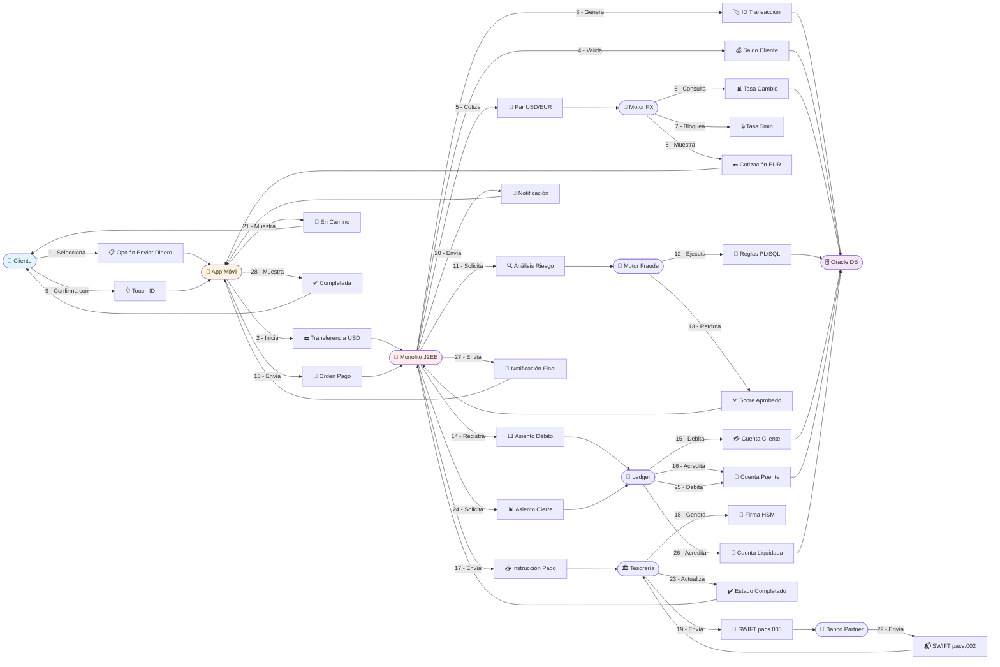
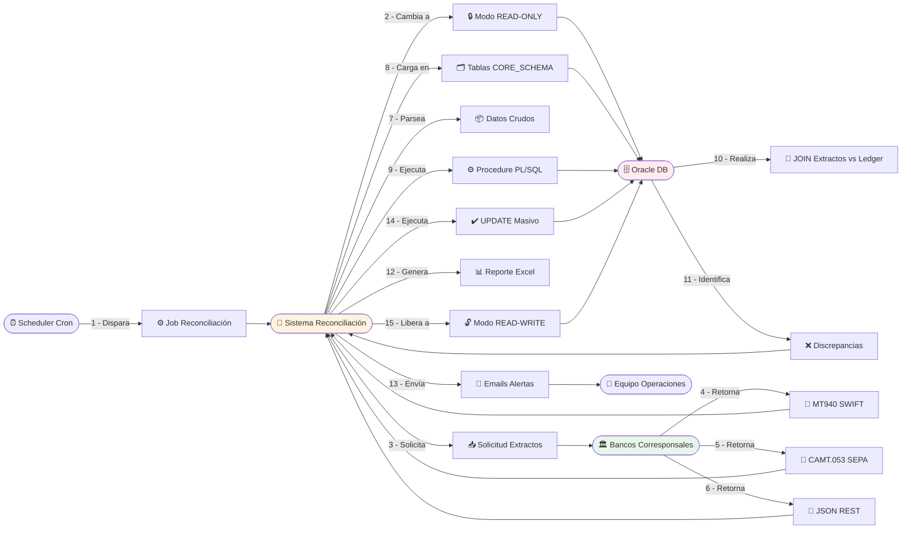
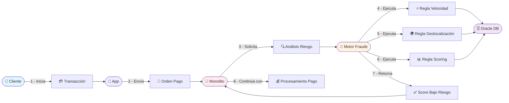

# 1.1 Domain Storytelling - Procesos de Negocio Críticos

> **Objetivo**: Visualizar los flujos actuales del negocio identificando actores, interacciones y puntos de dolor.  
> **Técnica**: Domain Storytelling (WhyDD)  
> **Herramienta sugerida**: Extension Mermaid Preview para VSCode o directo en https://mermaid.live/

---

## 📖 Proceso 1: Transferencia Internacional P2P

### Narrativa del Proceso

**Historia del Usuario:**  
_"Un cliente quiere enviar dinero internacional a través de FinScale. El sistema debe procesar la transferencia manteniendo consistencia estricta en saldos y cumpliendo el SLA de fraude (< 100ms)."_

### Diagrama Domain Storytelling

> **Título**: Transferencia Internacional P2P USD→EUR - Camino Feliz  
> **Contexto**: Cliente envía dinero internacional, sistema mantiene consistencia estricta y cumple SLA fraude < 100ms



**Actores Identificados:**
- 👤 Cliente | 📱 App Móvil | 🏦 Monolito Core Bancario (Java 8 J2EE)
- 💱 Motor FX | 🚨 Motor de Fraude (Stored Procedures PL/SQL) | 📒 Ledger (Contabilidad)
- 🏛️ Tesorería (SWIFT) | 🏦 Banco Partner | 🗄️ Oracle DB (Centralizada)

### Pasos del Proceso

**Los 8 pasos del "Camino Feliz" con contexto técnico del sistema legacy:**

```
1. Cliente inicia transferencia desde la App (USD a EUR)
   - App Móvil consulta disponibilidad al Monolito J2EE
   - DOLOR: Sticky Sessions (HttpSession en RAM) impide escalado horizontal
   - Monolito genera ID único usando secuencia Oracle centralizada
   - DOLOR: Secuencias globales son cuello de botella en sistema distribuido
   - Monolito valida saldo en Oracle DB

2. Sistema cotiza la tasa de cambio (FX) y la bloquea por 5 minutos
   - Motor FX (dentro del Monolito) consulta Oracle
   - Genera cotización y la retorna a la App

3. Cliente confirma con biometría
   - App envía orden de pago al Monolito
   - DOLOR: God Class TransactionManager.java (15K líneas) con acoplamiento cíclico
   - Imposible desplegar módulos independientes

4. Motor de Fraude analiza en < 100ms. Si es verde → continúa
   - Monolito invoca stored procedure PL/SQL
   - Analiza: Velocidad transaccional, Geolocalización, Scoring
   - DOLOR: 40% de lógica en PL/SQL, imposible migrar módulo

5. Ledger debita saldo del cliente (USD) y acredita cuenta puente interna (USD)
   - Ejecuta doble entrada contable
   - DOLOR: Locks de escritura en BD bloquean otras transacciones

6. Tesorería instruye al Banco Partner en Europa para pagar al destinatario final (EUR)
   - DOLOR: API síncrona bloqueante (frontend espera respuesta inmediata)
   - Firma mensaje con HSM físico on-premise
   - DOLOR: HSM físico dificulta migración a Cloud
   - Genera mensaje SWIFT (ISO 20022 pacs.008)
   - DOLOR: Conexión TCP/IP stateful dificulta escalado

7. Sistema notifica al cliente "Envío en proceso"

8. Al recibir confirmación del Banco Partner, Ledger mueve fondos de cuenta puente a cuenta liquidada
   - Banco responde con SWIFT pacs.002
   - Tesorería actualiza estado
   - Ledger cierra asiento contable
   - Sistema notifica "Completado"
```

### Puntos de Dolor Identificados

| # | Punto de Dolor | Impacto en Negocio | Causa Técnica |
|---|---------------|---------------------|---------------|
| 1 | **Sticky Sessions** | Imposible escalado horizontal dinámico. Si un servidor muere, se desconectan todos sus usuarios. | HttpSession en memoria RAM del servidor (Paso 1) |
| 2 | **Secuencias Globales IDs** | Cuello de botella para generar IDs únicos. Punto único de fallo. | Secuencias Oracle centralizadas para IDs de transacción (Paso 1) |
| 3 | **God Classes** | Imposible compilar/desplegar módulos aislados. Despliegues requieren 6h ventana. | TransactionManager.java (15K líneas) con acoplamiento cíclico (Paso 3) |
| 4 | **Lógica atrapada en PL/SQL (40%)** | Time-to-market de 4 meses. Cambios requieren DBA, no DevOps. | Reglas de fraude en stored procedures imposibilita extraer módulo independiente (Paso 4) |
| 5 | **Bloqueos en Base de Datos** | Imposibilidad de escalar módulos individualmente. El módulo de fraude tumba el de pagos. | Locks de escritura en BD durante doble entrada contable bloquean otras transacciones (Paso 5) |
| 6 | **APIs Síncronas Bloqueantes** | Frontend espera respuesta inmediata. Incompatible con arquitectura event-driven. | Clientes legacy esperan HTTP 200 OK síncrono tras enviar transacción (Paso 6) |
| 7 | **HSM Físico On-Premise** | Dificulta migración a Cloud. Requiere acceso remoto con latencia mínima. | Llaves criptográficas residen en HSM físico en datacenter (Paso 6) |
| 8 | **Conexión SWIFT Stateful** | Dificulta escalado horizontal. Cada nodo requiere conexión TCP persistente. | Protocolo ISO 8583 sobre TCP crudo con sesiones persistentes (Paso 6) |

---

## 📖 Proceso 2: Reconciliación Nocturna (Batch)

### Narrativa del Proceso

**Contexto:**  
_"Diariamente, FinScale debe conciliar las transacciones internas con los extractos bancarios de sus bancos corresponsales."_

### Diagrama Domain Storytelling

> **Título**: Reconciliación Nocturna Batch 00:00 UTC  
> **Contexto**: FinScale concilia transacciones internas con extractos de bancos corresponsales  
> **Crítico**: Sistema bloquea BD 6 horas en modo READ-ONLY  
> **Nota**: Este proceso es independiente de la ventana general de batch (02:00-04:00 AM para cierres contables)



**Actores Identificados:**
- ⏰ Scheduler (Cron) | 🏦 Sistema Reconciliación | 🗄️ Oracle DB
- 🏛️ Bancos Corresponsales | 👥 Equipo Operaciones

### Pasos del Proceso

**Los 3 pasos del "Dolor de Cabeza" con contexto técnico del sistema legacy:**

```
1. A las 00:00 UTC, FinScale descarga los extractos de todos los bancos aliados
   - Scheduler (Cron) dispara job de reconciliación
   - Sistema cambia BD a modo READ-ONLY
   - DOLOR CRÍTICO: Sistema bloquea operación 24/7 durante 6 horas
   - Descarga vía SFTP (MT940, CAMT.053) y REST APIs
   - Parsea archivos y carga en tablas temporales (CORE_SCHEMA)
   - DOLOR: Shared Database - Sistemas satélites (Reportes, CRM, Fraude Legacy) leen/escriben directo
   - Cambios de esquema rompen integraciones desconocidas

2. El sistema cruza cada movimiento bancario contra el Ledger interno
   - Ejecuta stored procedure de reconciliación (PL/SQL)
   - JOIN masivo entre extractos bancarios y registros del Ledger
   - DOLOR CRÍTICO: Gran volumen causa timeout y alto consumo CPU
   - Identifica: coincidencias, faltantes en banco, faltantes en Ledger, diferencias de monto

3. Desviaciones: Si el banco dice que salieron $100 pero el Ledger dice $90,
   se genera una alerta de nivel crítico para el equipo de operaciones manuales
   - Genera reporte de excepciones (Excel)
   - Envía múltiples emails al equipo
   - DOLOR: Sin priorización, intervención manual requerida, no escala
   - Marca transacciones reconciliadas (UPDATE masivo)
   - Libera BD a modo READ-WRITE
   
[FIN] Actualmente este proceso tarda 6 horas y bloquea la base de datos
```

### Puntos de Dolor Identificados

| # | Punto de Dolor | Impacto | Criticidad |
|---|---------------|---------|------------|
| 1 | **Ventana de Reconciliación Bancaria (6 horas)** | Sistema en READ-ONLY 00:00-06:00 UTC para reconciliar extractos bancarios vs Ledger. Bloquea operación 24/7. | 🔴 CRÍTICO |
| 2 | **Lógica en PL/SQL (40%)** | Imposible migrar módulo de reconciliación sin reescribir stored procedures | 🔴 CRÍTICO |
| 3 | **Shared Database (Integración por BD)** | Sistemas satélites leen/escriben directo en CORE_SCHEMA. Cambios de esquema rompen integraciones desconocidas. | 🔴 CRÍTICO |
| 4 | **Intervención manual requerida** | Desviaciones requieren equipo de operaciones manuales | 🟡 ALTO |

---

## 📖 Proceso 3: Detección de Fraude en Tiempo Real

### Narrativa del Proceso

**Contexto:**  
_"Cada transacción debe pasar por el motor de fraude antes de ejecutarse. El sistema debe detectar patrones anómalos en < 100ms."_

### Diagrama Domain Storytelling

> **Título**: Detección de Fraude Tiempo Real - Caso Bajo Riesgo  
> **Contexto**: Transacción analizada en < 100ms y aprobada automáticamente  
> **Nota**: Casos Riesgo Medio y Alto Riesgo son historias separadas



**Actores Identificados:**
- 👤 Cliente | 📱 App | 🏦 Monolito | 🚨 Motor Fraude (PL/SQL) | 🗄️ Oracle DB | 👥 Equipo Fraude

**SLA Crítico:** < 100ms por transacción

### Pasos del Proceso Actual

```
1. Cliente → inicia transacción → App
2. App → envía orden de pago → Monolito
3. Monolito → invoca stored procedure de análisis de fraude (PL/SQL)
4. Stored Procedure → ejecuta reglas de fraude:
   - Velocidad transaccional
   - Geolocalización (IP vs GPS del dispositivo)
   - Scoring de riesgo
   - Otras validaciones según contexto
5. Stored Procedure → calcula score de riesgo
6. Stored Procedure → retorna veredicto:
   - BAJO RIESGO: Auto-aprobar
   - RIESGO MEDIO: Requiere validación adicional (2FA)
   - ALTO RIESGO: Bloquear transacción
7. Monolito → actúa según veredicto
8. Si es ALTO RIESGO → Sistema genera alerta al equipo de fraude
```

### Puntos de Dolor Identificados

| # | Punto de Dolor | Impacto en Negocio | Causa Técnica |
|---|---------------|---------------------|---------------|
| 1 | **Lógica en PL/SQL (40%)** | Imposible migrar módulo de fraude de forma independiente sin reescribir lógica | Stored Procedures de análisis de fraude en Oracle |
| 2 | **Acoplamiento con Monolito** | El módulo de fraude tumba el de pagos cuando falla | Imposibilidad de escalar módulos individualmente |
| 3 | **SLA de < 100ms requerido** | Debe cumplir análisis en menos de 100ms | Base de datos centralizada con stored procedures PL/SQL |

---

## 🎯 Análisis de Actores y Sistemas

### Actores Humanos

| Actor | Rol | Interacción Principal | Pain Points |
|-------|-----|----------------------|-------------|
| **Cliente (Persona)** | Ordenante/Beneficiario | App Móvil, Web | Latencia, falta de visibilidad del estado en clearing |
| **Cliente Empresa** | Ordenante masivo (payroll) | API REST, SFTP Batch | Límites de throughput, ventanas de batch nocturno |
| **Operador de Tesorería** | Monitoreo de liquidez | Dashboard Interno | Alertas manuales, proceso de reconciliación bloqueante |
| **Analista de Fraude** | Revisión de casos sospechosos | Panel de Fraude | Sobrecarga de alertas, intervención manual requerida |
| **Equipo de Desarrollo** | Mantenimiento del sistema | Monolito Java | Despliegues lentos (ventana 6h), debugging complejo |

### Sistemas Participantes

| Sistema | Responsabilidad | Tecnología Actual | Criticidad |
|---------|----------------|-------------------|------------|
| **App Móvil/Web** | Interfaz de usuario | Cliente Legacy | 🟢 |
| **Monolito Core** | Orquestación de negocio | Java 8 J2EE | 🔴 |
| **Base de Datos Oracle** | Persistencia + Lógica de negocio | Oracle con PL/SQL | 🔴 |
| **Motor de Fraude** | Detección de anomalías | PL/SQL + Java | 🔴 |
| **Ledger** | Contabilidad doble entrada | PL/SQL | 🔴 |
| **Tesorería** | Comunicación con bancos | Java (ISO 8583 sobre TCP) | 🟡 |
| **Sistema de Notificaciones** | Push, Email, SMS | Parte del Monolito | 🟢 |

---

## 📊 Métricas del Estado Actual (Baseline)

| Métrica | Valor Actual | Objetivo | GAP |
|---------|---------------------|----------------|-----|
| Time-to-Market | 4 meses | Reducción dramática | Crítico |
| Ventana de Despliegue | 6 horas | 0 (Operación 24/7) | -100% |
| Throughput (TPS) | 2,000 TPS | 1,000,000 TPS | 500x |
| Latencia Fraude | Debe ser < 100ms | < 100ms | Mantener SLA |
| Disponibilidad | Actual con caídas | 99.999% | Crítico |
| Reconciliación Batch | 6 horas bloqueantes (00:00-06:00 UTC) | Tiempo real | Crítico |

---

## 🔍 Insights Clave del Domain Storytelling

### 1. Dependencias Críticas
- **Base de Datos Oracle Centralizada**: Cuello de botella único (SPOF)
- **PL/SQL**: 40% de la lógica de negocio atrapada en stored procedures
- **Secuencias Globales**: Generación de IDs únicos centralizada impide escalado distribuido
- **Shared Database**: Sistemas satélites acceden directo a CORE_SCHEMA sin APIs
- **Conexiones Stateful**: Protocolo ISO 8583 sobre TCP dificulta escalado horizontal
- **HSM Físico On-Premise**: Llaves criptográficas en hardware físico dificultan Cloud
- **Bloqueos de Base de Datos**: Imposibilidad de escalar módulos individualmente

### 2. Brechas de Visibilidad
- Los clientes no tienen visibilidad del estado de transacciones durante el clearing bancario
- El equipo de operaciones recibe múltiples alertas de excepciones en reconciliación sin priorización automática

### 3. Múltiples Ventanas de Batch (Problema Compuesto)
El sistema actual tiene **dos ventanas de mantenimiento nocturnas independientes**:

**A. Reconciliación Bancaria (00:00-06:00 UTC)**
- Propósito: Cruzar extractos de bancos corresponsales vs Ledger interno
- Duración: 6 horas bloqueantes
- Impacto: BD en modo READ-ONLY, operaciones suspendidas

**B. Ventana de Cierre y Batch General (02:00-04:00 AM)**
- Propósito: Procesos de cierre contable y conciliación masiva del sistema
- Duración: 2 horas
- Impacto: Sistema apagado o bloqueado (Read-Only)

**Implicación**: Hay solapamiento (02:00-04:00 AM) donde ambos procesos corren simultáneamente, agravando el bloqueo del sistema. La arquitectura objetivo debe eliminar ambas ventanas para operación 24/7.

### 4. Oportunidades de Automatización y Modernización
- **Reconciliación**: Continua en lugar de batch bloqueante de 6 horas
- **Notificaciones**: Event-driven en lugar de síncronas bloqueantes
- **Escalado**: Módulos independientes (Fraude, Pagos, Ledger) vs monolito único
- **Estado de Sesión**: Externalizar a Redis/Hazelcast en lugar de Sticky Sessions
- **Generación de IDs**: UUIDs distribuidos en lugar de secuencias Oracle centralizadas
- **Integración**: APIs REST/gRPC en lugar de Shared Database
- **Despliegue**: Microservicios independientes en lugar de God Classes monolíticas

---


**Próximos Pasos:**
- → Ir a `1.2-Drivers-Arquitectura.md` para traducir estos dolores en drivers formales
- → Identificar Business Capabilities a transformar en `1.3-Business-Capabilities.md`

---

**Última actualización**: 13 de diciembre de 2025
