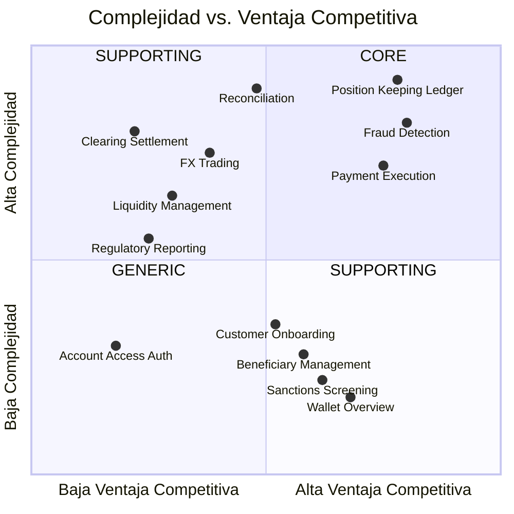

# 2.1 Core Domain Chart

> **Objetivo**: Clasificar los subdominios del negocio en Core (diferenciadores), Supporting (necesarios) y Generic (commodity).  
> **Técnica**: Domain-Driven Design (DDD) - Core Domain Chart  
> **Metodología**: WhyDD

---

## 🎯 ¿Qué es el Core Domain?

El **Core Domain** es la parte del negocio que proporciona **ventaja competitiva** y donde la empresa debe invertir la mayor parte de sus recursos de desarrollo. Los subdominios se clasifican en:

| Tipo | Descripción | Estrategia de Desarrollo |
|------|-------------|--------------------------|
| **Core** | Diferenciador competitivo, lo que hace única a FinScale | Desarrollo interno, equipos senior, inversión alta |
| **Supporting** | Necesario para el negocio pero no diferenciador | Desarrollo interno o productos listos para usar adaptado |
| **Generic** | Commodity, resuelto en la industria | Comprar solución (SaaS, Open Source) |

---

## 📊 Core Domain Chart de FinScale

---

## 🔴 Subdominios CORE (Diferenciadores)

### 1. Position Keeping (General Ledger)

**¿Por qué es Core?**
- **Diferenciador**: Ledger en tiempo real con consistencia transaccional a escala global es el corazón de FinScale. Registro inmutable de doble entrada con auditoría completa.
- **Ventaja Competitiva**: Actualización de saldos < 1 segundo vs. minutos en competidores. Actualmente 40% de la lógica reside en PL/SQL Oracle, requiere migración completa.
- **Complejidad Técnica**: Event Sourcing + CQRS + Consistencia Distribuida + Auditoría Inmutable + Cumplimiento PCI-DSS (datos financieros sensibles con trazabilidad total y encriptación en reposo/tránsito).

**Dominio**: Sistema contable - Mantenimiento de posiciones financieras (Financial Accounting)  
**Modelo de Datos**: Transacciones con doble entrada contable (ID, Cuenta Debe/Haber, Monto, Timestamp atómico)  
**Inversión**: 🔴 ALTA - Equipo dedicado de 8-10 desarrolladores senior  
**Estrategia**: REBUILD - Desarrollo interno (Propiedad Intelectual crítica)

---

### 2. Fraud Detection (Fraud Resolution)

**¿Por qué es Core?**
- **Diferenciador**: Motor de detección de fraude en tiempo real con SLA < 100ms. Actualmente 40% de las reglas residen en stored procedures PL/SQL. Detecta patrones anómalos, account takeover y comportamiento fraudulento.
- **Ventaja Competitiva**: Mayor precisión en detección (reducción de falsos positivos) permite aprobar más transacciones legítimas, incrementando revenue sin aumentar riesgo.
- **Complejidad Técnica**: Migración de lógica PL/SQL a arquitectura reactiva + Feature Engineering + Model Serving en tiempo real + Streaming Analytics + Cumplimiento GDPR (procesamiento de datos personales y de comportamiento con derecho al olvido).

**Dominio**: Gestión de riesgo y prevención de fraude (Fraud Resolution)  
**Modelo de Datos**: Velocity scoring, Geolocalización (IP vs GPS), Patrones históricos de comportamiento, Risk scoring  
**Inversión**: 🔴 ALTA - Equipo especializado ML + Data Engineers  
**Estrategia**: REBUILD - Servicio independiente con ML en tiempo real

---

### 3. Payment Execution (Payment Order)

**¿Por qué es Core?**
- **Diferenciador**: Motor de orquestación de pagos globales con validación de saldo, reserva de fondos y routing inteligente a 50+ redes bancarias internacionales.
- **Ventaja Competitiva**: Escalabilidad extrema 2K→1M TPS (aumento 500x). Reducción de latencia P99: 1.2s→200ms. Routing dinámico con fallback automático entre redes.
- **Complejidad Técnica**: Arquitectura reactiva no bloqueante + Orquestación de sagas distribuidas + Manejo de estados con Event Sourcing + Integraciones heterogéneas (SWIFT, SEPA, PIX, SPEI) + Cumplimiento PCI-DSS (datos de pago con tokenización y HSM para firmas criptográficas).

**Dominio**: Operaciones globales - Ejecución y orquestación de pagos (Payment Order Management)  
**Modelo de Datos**: Orden de pago (Monto, Divisas origen/destino, Partes: Ordenante/Beneficiario, Fecha valor, Metadata de referencia)  
**Inversión**: 🔴 ALTA - Equipo core de pagos  
**Estrategia**: REBUILD - Arquitectura reactiva desde cero

---

## 🟠 Subdominios SUPPORTING - Alta Complejidad

### 4. Reconciliation (Reconciliation)

**¿Por qué es Supporting?**
- **Necesario**: Auditoría financiera y compliance regulatorio requieren reconciliación perfecta. Proceso batch actual (00:00-06:00 UTC) bloquea base de datos por 6 horas, impidiendo operación 24/7.
- **No diferenciador**: Proceso estándar de matching de transacciones contra extractos bancarios externos.
- **Complejidad Técnica**: Alta - Volumen masivo de datos, parseo de formatos bancarios heterogéneos (MT940/CAMT.053), gestión de desviaciones críticas, alertas automáticas para auditoría financiera.

**Dominio**: Sistema contable - Reconciliación automática  
**Modelo de Datos**: Extractos bancarios (MT940/CAMT.053 de bancos corresponsales), Registros ledger interno, Reportes de desviaciones  
**Inversión**: 🟠 MEDIA  
**Estrategia**: REBUILD - Reconciliación continua (streaming) para eliminar batch window

---

### 5. FX Trading (Currency Exchange)

**¿Por qué es Supporting?**
- **Necesario**: Pagos transfronterizos requieren conversión de divisas obligatoria. Sistema debe cotizar tasa de cambio en tiempo real y bloquearla por período definido antes de ejecución.
- **No diferenciador**: Tasas de cambio son determinadas por el mercado (spot rate). El spread aplicado es práctica estándar de la industria.
- **Complejidad Técnica**: Media - Integración con proveedores de liquidez FX, mecanismo de bloqueo temporal de tasas, gestión de riesgo cambiario.

**Dominio**: Operaciones globales - Trading de divisas (Currency Exchange)  
**Modelo de Datos**: Pares de divisas (ej. USD/EUR), Spread comercial aplicado, Tasa spot del mercado, Timestamp de bloqueo de tasa  
**Inversión**: 🟠 MEDIA  
**Estrategia**: OPTIMIZE - Lógica interna + integración con brokers FX externos

---

### 6. Clearing & Settlement (Correspondent Bank Ops)

**¿Por qué es Supporting?**
- **Necesario**: Comunicación con redes bancarias externas (SWIFT, SEPA, ACH locales) para clearing y liquidación final de fondos.
- **No diferenciador**: Protocolos son estándares industriales (ISO 20022 para SEPA, ISO 8583 sobre TCP para redes de tarjetas).
- **Complejidad Técnica**: Media-Alta - Protocolos stateful legacy, conexiones TCP persistentes, procesamiento de archivos batch, manejo de ACKs y confirmaciones de red.

**Dominio**: Operaciones globales - Compensación y liquidación con bancos corresponsales  
**Modelo de Datos**: Mensajes ISO 20022 (pacs.008 para pagos, pacs.002 para confirmaciones), Archivos batch para redes legacy, ACKs de red  
**Inversión**: 🟠 MEDIA  
**Estrategia**: MODERNIZE - Wrapper/Adapter pattern sobre protocolos legacy + Event Streaming

---

### 7. Liquidity Management (Treasury)

**¿Por qué es Supporting?**
- **Necesario**: Monitoreo continuo de cuentas de FinScale en bancos corresponsales para garantizar liquidez suficiente y evitar descubiertos.
- **No diferenciador**: Proceso de tesorería estándar. Alertas de umbrales y descubiertos son práctica común.
- **Complejidad Técnica**: Media - Integración con múltiples bancos corresponsales, pronósticos de cash-flow intradía, sistema de alertas automáticas.

**Dominio**: Operaciones globales - Gestión de tesorería y liquidez  
**Modelo de Datos**: Saldos en cuentas de bancos corresponsales, Proyecciones de cash-flow intradía, Configuración de umbrales, Alertas de descubierto  
**Inversión**: 🟠 MEDIA  
**Estrategia**: OPTIMIZE - Dashboards en tiempo real con alertas proactivas

---

### 10. Regulatory Reporting (Regulatory Compliance)

**¿Por qué es Supporting?**
- **Necesario**: Generación de reportes regulatorios para bancos centrales, autoridades fiscales y entidades de supervisión financiera. Logs de transacciones enriquecidos con trazabilidad completa de fondos.
- **No diferenciador**: Formatos de reportes son definidos por reguladores (estándares por país/región).
- **Complejidad Técnica**: Media - Enriquecimiento de datos transaccionales, adaptación a formatos específicos por jurisdicción, generación de reportes de operaciones sospechosas (ROS) + Cumplimiento PCI-DSS/GDPR (gobierno de datos con trazabilidad total y data lineage para auditorías).

**Dominio**: Riesgo y cumplimiento - Reportes regulatorios  
**Modelo de Datos**: Logs de transacciones enriquecidos, Trazabilidad de origen y destino de fondos, Reportes de operaciones sospechosas, Datos de clientes (KYC)  
**Inversión**: 🟠 MEDIA  
**Estrategia**: TRANSFORM - Automatización completa con validación pre-envío

---

## 🟡 Subdominios SUPPORTING - Baja Complejidad

### 8. Customer Onboarding

**¿Por qué es Supporting?**
- **Necesario**: Proceso de registro de clientes (personas y empresas) con captura de biometría y validación de documentos legales. Integración con proveedores KYC especializados (Jumio, Onfido) mediante webhooks asincrónicos.
- **No diferenciador**: Proveedores KYC son los mismos utilizados por toda la industria fintech. La lógica propia es únicamente orquestación de llamados.
- **Complejidad Técnica**: Baja - Orquestación de proveedores externos mediante webhooks asincrónicos, gestión de estados del proceso + Cumplimiento GDPR (procesamiento de PII sensible: biometría, documentos de identidad, datos fiscales con consentimiento explícito y derecho al olvido).

**Dominio**: Adquisición y experiencia de cliente - Registro de nuevos usuarios  
**Modelo de Datos**: Documentos de identidad (fotos), Selfies biométricos, Datos fiscales (RUT/TaxID), Dirección física, Estructura accionaria (para clientes B2B)  
**Inversión**: 🟡 BAJA  
**Estrategia**: OPTIMIZE - Orquestación simple + servicios KYC SaaS

---

### 12. Beneficiary Management (Party Data)

**¿Por qué es Supporting?**
- **Necesario**: Gestión de terceros beneficiarios frecuentes para transferencias.
- **No diferenciador**: Operaciones CRUD estándar, requiere validación específica por jurisdicción mediante servicios externos.
- **Complejidad Técnica**: Baja - CRUD con validaciones asíncronas multi-formato (IBAN/SWIFT/ACH) contra servicios externos de validación.

**Dominio**: Adquisición y experiencia de cliente - Gestión de beneficiarios (Party Data)  
**Modelo de Datos**: Alias de beneficiario, IBAN/SWIFT/ACH, Nombre del banco destino, Tipo de relación, País/jurisdicción  
**Inversión**: 🟡 BAJA  
**Estrategia**: MODERNIZE - Servicio independiente con validación asíncrona contra APIs externas

---

### 9. Sanctions Screening (Watchlist Screening)

**¿Por qué es Supporting?**
- **Necesario**: Verificación obligatoria de que ordenante y beneficiario no figuren en listas negras internacionales (OFAC, Interpol, listas PEP). Requisito regulatorio crítico.
- **No diferenciador**: Listas son públicas y actualizadas por organismos internacionales. Algoritmo de matching (fuzzy search) es estándar.
- **Complejidad Técnica**: Baja - Integración con proveedor especializado, cache local de listas, matching de nombres.

**Dominio**: Riesgo y cumplimiento - Screening de sanciones y listas de vigilancia  
**Modelo de Datos**: Nombres completos, Fechas de nacimiento, Nacionalidades, Países de riesgo, Listas PEP (Personas Políticamente Expuestas)  
**Inversión**: 🟡 BAJA  
**Estrategia**: OPTIMIZE - Servicio SaaS (World-Check, ComplyAdvantage) + cache local

---

### 11. Wallet Overview (Current Account)

**¿Por qué es Supporting?**
- **Necesario**: Visualización de saldos consolidados en múltiples divisas y movimientos históricos desde event store.
- **No diferenciador**: Interfaz de consulta de cuenta corriente, estándar en la industria.
- **Complejidad Técnica**: Baja - Proyecciones CQRS multi-divisa desde event store.

**Dominio**: Adquisición y experiencia de cliente - Vista de cuenta corriente  
**Modelo de Datos**: ID Cliente, Saldos por divisa, Historial de transacciones (metadata), Estado de cuenta  
**Inversión**: 🟡 BAJA  
**Estrategia**: OPTIMIZE - CQRS con Read Models desnormalizados y optimizados para consulta

---

## 🟢 Subdominios GENERIC (Commodity - Comprar)

### 13. Account Access (Authentication)

**¿Por qué es Generic?**
- **Commodity**: Gestión de credenciales, autenticación multifactor (2FA), recuperación de claves y manejo de sesiones. OAuth2/OIDC son protocolos estándar completamente resueltos por la industria.
- **Complejidad Técnica**: Baja - Integración con proveedor IdP (Identity Provider)

**Dominio**: Adquisición y experiencia de cliente - Autenticación y acceso  
**Modelo de Datos**: Tokens OAuth2/JWT, Hashes de contraseñas, Device fingerprinting, OTPs, Historial de accesos  
**Inversión**: 🟢 BAJA  
**Estrategia**: BUY - Proveedor SaaS (Auth0, AWS Cognito) o Open Source (Keycloak)

---

## 📋 Tabla Resumen: Clasificación de Subdominios

| # | Subdominio | Área de Negocio | Tipo | Complejidad | Ventaja Competitiva | Inversión | Estrategia |
|---|------------|-----------------|------|-------------|---------------------|-----------|------------|
| 1 | Position Keeping (Ledger) | Sistema Contable | 🔴 Core | Muy Alta | Muy Alta | Alta | REBUILD |
| 2 | Fraud Detection | Riesgo y Cumplimiento | 🔴 Core | Muy Alta | Muy Alta | Alta | REBUILD |
| 3 | Payment Execution | Operaciones Globales | 🔴 Core | Alta | Alta | Alta | REBUILD |
| 4 | Reconciliation | Sistema Contable | 🟠 Supporting | Alta | Baja | Media | REBUILD |
| 5 | FX Trading | Operaciones Globales | 🟠 Supporting | Media | Baja | Media | OPTIMIZE |
| 6 | Clearing & Settlement | Operaciones Globales | 🟠 Supporting | Media-Alta | Baja | Media | MODERNIZE |
| 7 | Liquidity Management | Operaciones Globales | 🟠 Supporting | Media | Baja | Media | OPTIMIZE |
| 8 | Customer Onboarding | Adquisición Cliente | 🟡 Supporting | Baja | Baja | Baja | OPTIMIZE |
| 9 | Sanctions Screening | Riesgo y Cumplimiento | 🟡 Supporting | Baja | Baja | Baja | OPTIMIZE |
| 10 | Regulatory Reporting | Riesgo y Cumplimiento | 🟠 Supporting | Media | Baja | Media | TRANSFORM |
| 11 | Wallet Overview | Adquisición Cliente | 🟡 Supporting | Baja | Media | Baja | OPTIMIZE |
| 12 | Beneficiary Management | Adquisición Cliente | 🟡 Supporting | Baja | Media | Baja | MODERNIZE |
| 13 | Account Access (Auth) | Adquisición Cliente | 🟢 Generic | Baja | Ninguna | Baja | BUY |

---

## 🎯 Asignación de Recursos (Equipos)

### Propuesta de Distribución de Equipos

**Equipos Core (60% de recursos de ingeniería):**
- **System of Record** (10 devs): Position Keeping (Ledger) + Reconciliation
- **Risk & Compliance** (8 devs): Fraud Detection + Sanctions Screening + Regulatory Reporting
- **Payment Core** (12 devs): Payment Execution + FX Trading

**Equipos Supporting (30% de recursos):**
- **Payment Infrastructure** (6 devs): Clearing & Settlement + Liquidity Management
- **Customer Experience** (5 devs): Onboarding + Account Access + Wallet + Beneficiary Management

**Equipos Platform (10% de recursos):**
- **Platform Engineering** (4 devs): API Gateway + Event Bus + Observability + DevOps

---

## ✅ Conclusiones y Decisiones Estratégicas

1. **Foco en Core Domains (3 de 13 subdominios totales)**:
   - 60% del esfuerzo de ingeniería concentrado en: Position Keeping (Ledger), Fraud Detection, Payment Execution
   - Estos 3 subdominios proporcionan ventaja competitiva diferencial vs. competidores en el mercado
   - Requieren REBUILD completo: Arquitectura reactiva + Event Sourcing + Eliminación de 40% lógica PL/SQL

2. **Estrategia Build vs. Buy (basada en análisis de valor)**:
   - **REBUILD (4 subdominios)**: Ledger, Fraud, Payment Execution, Reconciliation - Críticos para operación 24/7
   - **MODERNIZE (2 subdominios)**: Clearing & Settlement, Beneficiary Management - Protocolos legacy + wrappers para servicios externos
   - **OPTIMIZE (5 subdominios)**: FX, Liquidity, Onboarding, Sanctions, Wallet - Mejoras incrementales sin reescritura
   - **TRANSFORM (1 subdominio)**: Regulatory Reporting - Automatización completa
   - **BUY (1 subdominio)**: Account Access (Auth) - OAuth2/OIDC commodity

3. **Distribución por Áreas de Negocio**:
   - Sistema Contable: 2 subdominios (Ledger, Reconciliation) - Ledger CORE, Reconciliation tendencia al CORE
   - Riesgo y Cumplimiento: 3 subdominios (Fraud, Sanctions, Regulatory) - Fraud CORE, otros Supporting
   - Operaciones Globales: 4 subdominios (Payment, FX, Clearing, Liquidity) - Payment CORE, otros Supporting
   - Adquisición Cliente: 4 subdominios (Onboarding, Wallet, Beneficiary, Auth) - Supporting excepto Auth (Generic)

4. **Criterios de Inversión**:
   - **Alta inversión (3)**: Core Domains que escalan 2K→1M TPS y eliminan dependencia de 40% lógica PL/SQL
   - **Media inversión (6)**: Supporting de alta complejidad (Reconciliation, FX, Clearing, Liquidity, Regulatory) - necesarios para cumplimiento y operación continua
   - **Baja inversión (4)**: Supporting de baja complejidad (Onboarding, Beneficiary, Sanctions, Wallet) y Generic (Auth)

---

**Próximo Paso**: → `2.2-Bounded-Contexts.md` para definir límites de contexto y modelo de dominio.

---

**Última actualización**: 20 de diciembre de 2025
