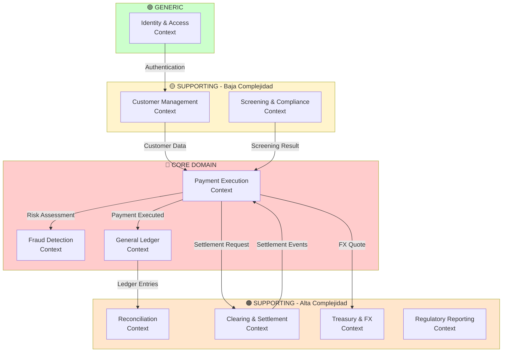

# 2.2 Bounded Contexts y Delimitación

> **Objetivo**: Definir los límites de contexto (Bounded Contexts) basados en los subdominios identificados en el Core Domain Chart.  
> **Técnica**: Domain-Driven Design - Strategic Design + Context Mapping  
> **Alineación**: 13 subdominios → 10 Bounded Contexts

---

## 🎯 Principios de Delimitación de Contextos

1. **Cada Bounded Context es autónomo**: Tiene su propio modelo de dominio, base de datos y ciclo de vida de despliegue
2. **Lenguaje Ubiquo consistente**: Términos del negocio tienen significado único dentro del contexto
3. **Alta cohesión, bajo acoplamiento**: Contextos se comunican mediante contratos explícitos (APIs, eventos)
4. **Alineación con subdominios**: Cada contexto mapea a uno o más subdominios relacionados

---

## 📊 Diagrama de Delimitación de Contextos (Vista General)

---

## 📦 Bounded Contexts Identificados (10 Contextos)

### 🔴 CORE DOMAIN (3 Contextos)

#### 1. Payment Execution Context (CORE)

**Subdominios**: Payment Execution  
**Responsabilidad**: Orquestación del pago con validación de saldo, reserva de fondos y enrutamiento a la red de salida adecuada (SWIFT, SEPA, ACH locales, PIX, SPEI) para procesar pagos en 50 países

**Compliance y Seguridad**:  
- **PCI-DSS**: Este contexto procesa datos de pago sensibles que requieren:
  - Tokenización: No almacenar números de tarjeta completos, solo tokens
  - HSM (Hardware Security Module): Módulo hardware para firmas criptográficas de órdenes
  - Encriptación: AES-256 para datos en reposo + TLS 1.3 para datos en tránsito
  - Auditoría: Logs inmutables de todos los accesos a datos sensibles

**Agregados Principales**:
- `PaymentOrder` (Aggregate Root): Monto, Divisa origen/destino, ID Ordenante, ID Beneficiario, Fecha valor, Metadata de referencia
- `PaymentInstruction`: Instrucciones de routing específicas por red
- `PaymentState`: Máquina de estados (DRAFT → VALIDATED → FX_LOCKED → SENT_TO_GATEWAY → CLEARING → SETTLED / FAILED)

**Lenguaje Ubiquo**: Payment Order, Originator, Beneficiary, Payment Status, Routing, Network Selection, Settlement, Value Date, Clearing Network

**Inversión**: 🔴 ALTA  
**Estrategia**: REBUILD - Arquitectura reactiva con Event Sourcing para manejo de estados

**Integraciones**:
- **→ Fraud Detection**: Solicita risk scoring (sync REST < 50ms)
- **→ General Ledger**: Emite eventos `PaymentExecuted` (async)
- **→ Clearing & Settlement**: Envía instrucciones de liquidación (async)
- **→ Treasury & FX**: Solicita cotización FX (sync REST)
- **← Customer Management**: Recibe datos de Customer/Beneficiary
- **← Screening & Compliance**: Recibe resultado de sanctions screening

---

#### 2. Fraud Detection Context (CORE)

**Subdominios**: Fraud Detection  
**Responsabilidad**: Detección de fraude en tiempo real con ML (SLA < 100ms)

**Compliance y Seguridad**:  
- **GDPR**: Este contexto procesa datos personales y de comportamiento que requieren:
  - Derecho al olvido: Implementar anonimización de datos históricos cuando el cliente lo solicite
  - Consentimiento explícito: Usuario debe aprobar scoring basado en ML
  - Retención limitada: Máximo 7 años para casos de fraude confirmado, luego anonimizar
  - Auditoría: Logs de accesos a datos sensibles (patrones transaccionales, geolocalización, device fingerprinting)

**Agregados Principales**:
- `RiskAssessment` (Aggregate Root): PaymentId, RiskScore (0-100), Factors, Timestamp
- `FraudRule`: Reglas de detección (velocity, geolocation, patterns)
- `FraudCase`: Casos de investigación (manual review)

**Lenguaje Ubiquo**: Risk Score, Fraud Pattern, False Positive, True Positive, Velocity Check, Account Takeover

**Inversión**: 🔴 ALTA  
**Estrategia**: REBUILD - Migración de PL/SQL a servicio independiente con ML en tiempo real

**Integraciones**:
- **← Payment Execution**: Recibe solicitud de scoring (sync REST)
- **→ General Ledger**: Consulta historial de transacciones (sync REST)

---

#### 3. General Ledger Context (CORE)

**Subdominios**: Position Keeping (Ledger)  
**Responsabilidad**: Contabilidad de doble entrada inmutable en tiempo real

**Compliance y Seguridad**:  
- **PCI-DSS**: Este contexto almacena datos financieros sensibles que requieren:
  - Encriptación: AES-256 para datos en reposo + TLS 1.3 para datos en tránsito
  - Event Sourcing: Garantiza log inmutable de todas las transacciones (auditoría completa)
  - MFA: Autenticación multifactor obligatoria para operaciones administrativas
  - Audit trail: Trazabilidad completa de todas las entradas contables

**Agregados Principales**:
- `LedgerEntry` (Aggregate Root): TransactionId, Debit Account, Credit Account, Amount, Currency, Timestamp
- `Account`: Cuentas contables con balances por divisa
- `Balance`: Saldos agregados (snapshot)

**Lenguaje Ubiquo**: Debit, Credit, Ledger Entry, Immutable Log, Double Entry, Chart of Accounts, Balance

**Inversión**: 🔴 ALTA  
**Estrategia**: REBUILD - Event Sourcing como fuente de verdad, eliminación de 40% lógica PL/SQL

**Integraciones**:
- **← Payment Execution**: Recibe eventos `PaymentExecuted`, `PaymentFailed` (async)
- **→ Reconciliation**: Publica eventos de ledger entries (async)
- **← Fraud Detection**: Consultas de historial transaccional (sync REST)

---

### 🟠 SUPPORTING - Alta Complejidad (4 Contextos)

#### 4. Reconciliation Context

**Subdominios**: Reconciliation  
**Responsabilidad**: Reconciliación continua de transacciones internas vs. extractos bancarios externos

**Agregados Principales**:
- `ReconciliationCase` (Aggregate Root): InternalEntry, ExternalEntry, Status, Variance
- `BankStatement`: Extractos bancarios parseados (MT940/CAMT.053)
- `Discrepancy`: Desviaciones detectadas

**Lenguaje Ubiquo**: Reconciliation Match, Discrepancy, Bank Statement, Variance, MT940, CAMT.053

**Inversión**: 🟠 MEDIA  
**Estrategia**: REBUILD - Streaming reconciliation para eliminar batch window de 6 horas

**Integraciones**:
- **← General Ledger**: Consume eventos de ledger entries (async streaming)
- **← Clearing & Settlement**: Consume extractos bancarios externos (async)

---

#### 5. Clearing & Settlement Context

**Subdominios**: Clearing & Settlement  
**Responsabilidad**: Comunicación con redes bancarias externas (SWIFT, SEPA, ACH locales)

**Agregados Principales**:
- `SettlementInstruction` (Aggregate Root): PaymentId, Network, Message, Status
- `ClearingMessage`: Mensajes ISO 20022 (pacs.008, pacs.002)
- `NetworkConnection`: Conexiones TCP persistentes con redes

**Lenguaje Ubiquo**: SWIFT Message, Clearing Network, Settlement, ISO 20022, ACK, NACK, Correspondent Bank

**Inversión**: 🟠 MEDIA  
**Estrategia**: MODERNIZE - Wrapper/Adapter pattern sobre protocolos legacy + Event Streaming

**Integraciones**:
- **← Payment Execution**: Recibe instrucciones de liquidación (async)
- **→ Payment Execution**: Emite eventos `SettlementConfirmed`, `SettlementFailed` (async)
- **→ Reconciliation**: Publica extractos bancarios (async)
- **↔ External Networks**: ACL para SWIFT, SEPA, PIX (conformist)

---

#### 6. Treasury & FX Context

**Subdominios**: FX Trading, Liquidity Management  
**Responsabilidad**: Gestión de liquidez y cambio de divisas

**Agregados Principales**:
- `FXRate` (Aggregate Root): CurrencyPair (USD/EUR), SpotRate, Spread, Timestamp, Lock
- `LiquidityPool`: Saldos en bancos corresponsales por divisa
- `TreasuryAccount`: Cuentas de FinScale en bancos corresponsales

**Lenguaje Ubiquo**: FX Rate, Spread, Spot Rate, Liquidity Reserve, Nostro Account, Cash Position, Threshold

**Inversión**: 🟠 MEDIA  
**Estrategia**: OPTIMIZE - Lógica interna + integración con brokers FX externos

**Integraciones**:
- **← Payment Execution**: Recibe solicitud de cotización FX (sync REST)
- **↔ External FX Brokers**: Integración con proveedores de liquidez (API REST)
- **→ Regulatory Reporting**: Publica datos de tesorería (async)

---

#### 7. Regulatory Reporting Context

**Subdominios**: Regulatory Reporting  
**Responsabilidad**: Generación de reportes regulatorios para bancos centrales y autoridades fiscales

**Compliance y Seguridad**:  
- **GDPR**: Anonimizar datos personales (PII - Personally Identifiable Information) en reportes agregados (reemplazar nombres/IDs de clientes con hashes irreversibles)
- **Cumplimiento Regulatorio**: Este contexto genera reportes para bancos centrales y autoridades fiscales que requieren:
  - Data lineage: Rastrear cada campo del reporte hasta su fuente original (trazabilidad completa de transformaciones)
  - Retención obligatoria: Almacenar reportes según jurisdicción (ej: Banco Central Europeo 7 años, SEC-USA 10 años)
  - Validación automática: Verificar integridad de datos antes de envío a reguladores
  - Logs inmutables: Registro permanente de todas las submisiones regulatorias

**Agregados Principales**:
- `RegulatoryReport` (Aggregate Root): ReportType, Jurisdiction, Period, Status, Submission
- `TransactionTrace`: Trazabilidad de origen y destino de fondos
- `SuspiciousActivityReport (SAR)`: Reportes de operaciones sospechosas

**Lenguaje Ubiquo**: Regulatory Report, SAR, Suspicious Transaction, Compliance, Jurisdiction, Central Bank

**Inversión**: 🟠 MEDIA  
**Estrategia**: TRANSFORM - Automatización completa con validación pre-envío

**Integraciones**:
- **← General Ledger**: Consume logs de transacciones enriquecidos (async)
- **← Customer Management**: Consume datos KYC (sync REST)
- **← Treasury & FX**: Consume datos de tesorería (async)

---

### 🟡 SUPPORTING - Baja Complejidad (2 Contextos)

#### 8. Customer Management Context

**Subdominios**: Customer Onboarding, Beneficiary Management, Wallet Overview  
**Responsabilidad**: Gestión del ciclo de vida del cliente y beneficiarios

**Compliance y Seguridad**:  
- **GDPR**: Este contexto procesa PII (Personally Identifiable Information) sensible que requiere:
  - Consentimiento explícito: Requerido en cada etapa del onboarding (captura biometría, documentos, datos fiscales)
  - Derecho al olvido: Anonimizar datos personales manteniendo solo metadatos agregados para auditoría
  - Minimización de datos: Almacenar solo lo estrictamente necesario para operación
  - DPA (Data Processing Agreement): Acuerdos contractuales con proveedores KYC (Jumio/Onfido) sobre protección de datos
  - Retención según jurisdicción: Cumplir periodos de almacenamiento requeridos por cada país

**Agregados Principales**:
- `Customer` (Aggregate Root): CustomerId, PersonalData, KYCStatus, OnboardingState
- `Beneficiary`: Alias, IBAN/SWIFT/ACH, BankName, Country/Jurisdiction
- `AccountView`: Vista consolidada de saldos y movimientos (CQRS Read Model)

**Lenguaje Ubiquo**: Customer, Onboarding, KYC Status, Account Holder, Beneficiary, Wallet, Account Balance

**Inversión**: 🟡 BAJA  
**Estrategia**: OPTIMIZE - Orquestación de servicios externos (KYC SaaS) + CRUD interno + CQRS Read Models

**Integraciones**:
- **↔ External KYC Providers**: Jumio, Onfido (webhooks asincrónicos)
- **→ Payment Execution**: Publica datos de Customer/Beneficiary (async)
- **← General Ledger**: Consume eventos para AccountView (async CQRS)
- **→ Identity & Access**: Vincula Customer con User Identity (sync REST)

---

#### 9. Screening & Compliance Context

**Subdominios**: Sanctions Screening  
**Responsabilidad**: Verificación de listas negras (OFAC, Interpol, PEP)

**Agregados Principales**:
- `ScreeningCase` (Aggregate Root): EntityId (Customer/Beneficiary), WatchlistMatches, Status
- `WatchlistEntry`: Nombre, DOB, Nationality, ListType (OFAC/PEP)

**Lenguaje Ubiquo**: Sanctions List, PEP, Watchlist, AML Check, Screening Hit, False Match

**Inversión**: 🟡 BAJA  
**Estrategia**: OPTIMIZE - Servicio SaaS (World-Check, ComplyAdvantage) + cache local

**Integraciones**:
- **← Customer Management**: Recibe solicitud de screening (async)
- **← Payment Execution**: Recibe solicitud de screening (async)
- **→ Payment Execution**: Publica resultado de screening (async)
- **↔ External Screening Providers**: World-Check, ComplyAdvantage (API REST + cache)

---

### 🟢 GENERIC (1 Contexto)

#### 10. Identity & Access Context

**Subdominios**: Account Access (Authentication)  
**Responsabilidad**: Gestión de credenciales, autenticación multifactor (2FA), sesiones

**Agregados Principales**:
- `UserIdentity` (Aggregate Root): UserId, Email, PasswordHash, MFASettings
- `Session`: AccessToken (JWT), RefreshToken, DeviceFingerprint
- `MFAToken`: OTPs, TOTP

**Lenguaje Ubiquo**: User, Authentication, Session, OAuth2, JWT, MFA, Device Fingerprint

**Inversión**: 🟢 BAJA  
**Estrategia**: BUY - Proveedor SaaS (Auth0, AWS Cognito) o Open Source (Keycloak)

**Integraciones**:
- **→ Customer Management**: Vincula UserId con CustomerId (sync REST)
- **→ Todos los contextos**: Validación de tokens JWT (stateless)

---

## 📋 Tabla Resumen: Subdominios → Bounded Contexts

| # | Subdominio | Bounded Context | Tipo | Estrategia |
|---|------------|-----------------|------|------------|
| 1 | Position Keeping (Ledger) | General Ledger Context | 🔴 Core | REBUILD |
| 2 | Fraud Detection | Fraud Detection Context | 🔴 Core | REBUILD |
| 3 | Payment Execution | Payment Execution Context | 🔴 Core | REBUILD |
| 4 | Reconciliation | Reconciliation Context | 🟠 Supporting | REBUILD |
| 5 | FX Trading | Treasury & FX Context | 🟠 Supporting | OPTIMIZE |
| 6 | Clearing & Settlement | Clearing & Settlement Context | 🟠 Supporting | MODERNIZE |
| 7 | Liquidity Management | Treasury & FX Context | 🟠 Supporting | OPTIMIZE |
| 8 | Customer Onboarding | Customer Management Context | 🟡 Supporting | OPTIMIZE |
| 9 | Sanctions Screening | Screening & Compliance Context | 🟡 Supporting | OPTIMIZE |
| 10 | Regulatory Reporting | Regulatory Reporting Context | 🟠 Supporting | TRANSFORM |
| 11 | Wallet Overview | Customer Management Context | 🟡 Supporting | OPTIMIZE |
| 12 | Beneficiary Management | Customer Management Context | 🟡 Supporting | MODERNIZE |
| 13 | Account Access (Auth) | Identity & Access Context | 🟢 Generic | BUY |

**Consolidación**: 13 subdominios → 10 Bounded Contexts  
**Criterio**: Subdominios con alta cohesión funcional y lenguaje ubiquo compartido se agrupan en el mismo contexto

---

## 🔗 Relaciones entre Contextos (Patrones DDD)

Ver archivo [2.3-Context-Map.md](2.3-Context-Map.md) para el mapa completo de relaciones con patrones específicos (Partnership, Customer-Supplier, ACL, OHS, etc.)

---

**Próximo Paso**: → [2.3-Context-Map.md](2.3-Context-Map.md) - Context Mapping detallado

---

**Última actualización**: 20 de diciembre de 2025
