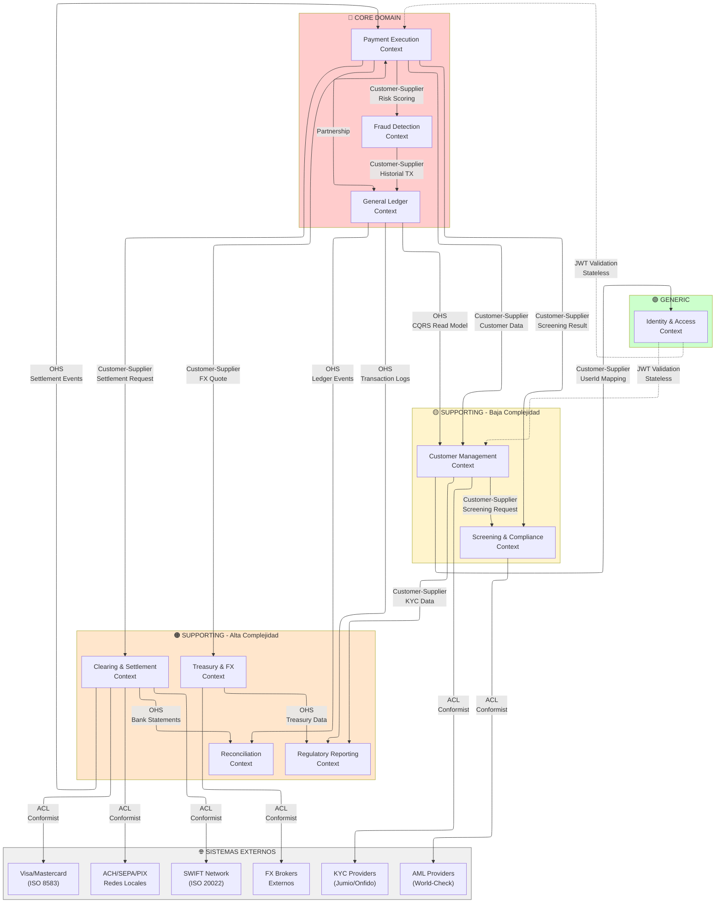

# 2.3 Context Map (Mapa de Contexto)

> **Objetivo**: Visualizar las relaciones entre Bounded Contexts y equipos.  
> **Técnica**: DDD Context Mapping Patterns

---

## 🗺️ Patrones de Relación entre Contextos

### Tipos de Relaciones (DDD)

| Patrón | Descripción | Cuándo Usar |
|--------|-------------|-------------|
| **Partnership** | Equipos colaboran estrechamente, éxito mutuo | Contextos Core interdependientes |
| **Customer-Supplier** | Upstream (proveedor) sirve a Downstream (cliente) | Dependencia unidireccional clara |
| **Conformist** | Downstream acepta modelo del Upstream sin negociación | Integración con sistema externo legacy |
| **Anti-Corruption Layer (ACL)** | Downstream se protege con capa de traducción | Integración con sistemas externos complejos |
| **Open Host Service (OHS)** | Upstream expone API pública estándar | APIs públicas o multi-consumidor |
| **Published Language** | Modelo compartido bien definido (ej. JSON Schema) | Integraciones estandarizadas |
| **Shared Kernel** | Código compartido entre contextos (usar con precaución) | Sub-equipos del mismo dominio Core |
| **Separate Ways** | Contextos completamente independientes | Sin dependencias funcionales |

---

## 📊 Context Map de FinScale Evolution

---

## 🔗 Descripción Detallada de Relaciones

### 1. Payment Execution ↔ General Ledger (Partnership)

**Relación**: Partnership (Colaboración estrecha)  
**Upstream**: Payment Execution Context  
**Downstream**: General Ledger Context  
**Justificación**: Ambos son Core Domains. Un pago sin registro contable (doble entrada) es inválido. Requiere coordinación estrecha entre equipos.

**Integración**:
- Payment Execution emite eventos de dominio:
  - `PaymentExecuted`: Cuando el pago fue enviado exitosamente a la red de clearing
  - `PaymentFailed`: Cuando el pago fue rechazado o falló
  - `PaymentSettled`: Cuando se recibe confirmación de liquidación final
- General Ledger consume eventos y crea:
  - `LedgerEntry` (doble entrada): Cuenta Debe, Cuenta Haber, Monto, Currency, Timestamp atómico
  - Actualización de `Balance` por cuenta y divisa
- **Consistencia**: Eventual (< 1s de lag aceptable). El saldo del cliente refleja el pago en menos de 1 segundo.
- **Contrato**: Event-Driven (Kafka topics + Avro schemas versionados)

**Patrón de Resiliencia**: Si Ledger falla, Payment continúa operando. Eventos quedan en cola para procesamiento posterior.

**Equipos**: 
- **Payment Core Team** (12 devs)
- **System of Record Team** (10 devs)  
- Ceremonias conjuntas: Refinement semanal, Retrospectivas compartidas

---

### 2. Payment Execution → Fraud Detection (Customer-Supplier)

**Relación**: Customer-Supplier  
**Upstream**: Fraud Detection Context (proveedor de servicio)  
**Downstream**: Payment Execution Context (cliente consumidor)

**Integración**:
- Payment Execution solicita análisis de riesgo antes de ejecutar el pago:
  - Endpoint: `POST /fraud/v1/assess`
  - Request: `{ paymentId, customerId, amount, currency, beneficiaryCountry, ipAddress, deviceFingerprint }`
  - Response: `{ riskScore: 0-100, decision: "APPROVE"|"REJECT"|"REVIEW", factors: [...] }`
- **SLA crítico**: Respuesta en < 100ms (P99)
- **Fail-Safe**: Si timeout o servicio caído, Payment aplica regla por defecto:
  - Montos < $1000: APPROVE automático
  - Montos >= $1000: REVIEW manual

**Contrato**: API REST + Circuit Breaker (Resilience4j) + Fallback

**Patrón de Resiliencia**: Circuit Breaker con 3 estados (Closed/Open/Half-Open). Timeout: 100ms.

**Equipos**:
- **Payment Core Team** (downstream)
- **Trust & Safety Team** (upstream) - 8 devs (ML Engineers + Backend)

---

### 3. Payment Execution → Clearing & Settlement (Customer-Supplier con OHS)

**Relación**: Customer-Supplier con Open Host Service  
**Upstream**: Clearing & Settlement Context (proveedor)  
**Downstream**: Payment Execution Context (cliente)

**Integración**:
- Payment Execution envía instrucción de liquidación:
  - Evento: `SettlementInstructionCreated`
  - Payload: `{ paymentId, network: "SWIFT"|"SEPA"|"PIX"|"SPEI"|"ACH", beneficiaryIBAN, amount, currency }`
- Clearing & Settlement emite eventos de respuesta:
  - `SettlementSent`: Mensaje enviado a la red externa
  - `SettlementConfirmed`: ACK recibido de la red (liquidación exitosa)
  - `SettlementFailed`: NACK recibido (error en la red)
- Payment Execution consume eventos y actualiza máquina de estados:
  - `SENT_TO_GATEWAY` → `CLEARING` → `SETTLED` / `FAILED`

**Contrato**: Event-Driven (Kafka topics) + OHS (API de consulta de estado)

**Equipos**:
- **Payment Core Team** (downstream)
- **Global Operations Team** (upstream) - 6 devs

---

### 4. Clearing & Settlement → Redes Externas (ACL + Conformist)

**Relación**: Conformist con Anti-Corruption Layer  
**Upstream**: Redes bancarias externas (sin control de FinScale)  
**Downstream**: Clearing & Settlement Context

**Sistemas Externos (por red)**:
1. **SWIFT Network**:
   - Protocolo: ISO 20022 (pacs.008 para pagos, pacs.002 para confirmaciones)
   - Transporte: Host-to-Host (H2H) con conexión TCP persistente
   - Latencia: 2-5 minutos para liquidación

2. **Visa/Mastercard**:
   - Protocolo: ISO 8583 (legacy, sockets TCP)
   - SLA: < 200ms para autorizaciones
   - Desafío: Conexiones stateful en ambiente Kubernetes efímero

3. **Redes Locales** (ACH/SEPA/PIX/SPEI):
   - Varía por país:
     - **SEPA** (Europa): ISO 20022 vía SFTP (batch)
     - **PIX** (Brasil): API REST inmediata
     - **SPEI** (México): API REST/SOAP
     - **ACH** (USA): Archivos batch vía SFTP

**Anti-Corruption Layer (ACL)**:
- Clearing implementa Adapters específicos por red:
  - `SWIFTAdapter`: Traduce `SettlementInstruction` → mensaje ISO 20022 (XML)
  - `ISO8583Adapter`: Traduce a formato binario para Visa/Mastercard
  - `PIXAdapter`: Traduce a JSON para API PIX del Banco Central de Brasil
- **Patrón**: Adapter Pattern + Protocol Translator + Wrapper sobre protocolos legacy

**Conformist**: FinScale NO controla los cambios en estas redes. Si SWIFT actualiza su esquema ISO 20022, FinScale debe adaptarse.

**Resiliencia**:
- Si SEPA cae: FinScale encola instrucciones y reintenta (exponential backoff)
- Si Visa/Mastercard rechazan conexión: Circuit Breaker + Fallback a red alternativa

**Equipos**:
- **Global Operations Team** (6 devs) - Propietarios del ACL

---

### 5. General Ledger → Reconciliation (OHS con Read Models)

**Relación**: Open Host Service (Ledger expone múltiples interfaces)  
**Upstream**: General Ledger Context (proveedor)  
**Downstream**: Reconciliation Context (consumidor)

**Integración Dual**:
1. **Streaming (tiempo real)**:
   - Ledger publica eventos de dominio: `LedgerEntryCreated`
   - Reconciliation consume vía Kafka Consumer y procesa en streaming
   - Objetivo: Eliminar batch window nocturna de 6 horas

2. **Batch (consulta histórica)**:
   - Ledger expone Read API: `GET /ledger/v1/entries?startDate=X&endDate=Y`
   - Reconciliation usa API para obtener lote histórico al recibir extractos bancarios

**Proceso de Reconciliación** (según kata):
1. A las 00:00 UTC, Reconciliation descarga extractos de bancos aliados (MT940/CAMT.053)
2. Cruza cada movimiento bancario contra Ledger interno (streaming + batch)
3. Si detecta desviación (ej. banco dice $100, ledger dice $90):
   - Crea `DiscrepancyCase` con nivel crítico
   - Alerta al equipo de operaciones manuales

**Objetivo del Nuevo Diseño**: Reconciliación continua (no bloquear BD por 6 horas)

**Equipos**:
- **System of Record Team** (upstream) - 10 devs
- **System of Record Team** (downstream) - Mismo equipo maneja ambos contextos por cohesión de dominio contable

---

### 6. Customer Management → External KYC Providers (ACL + Conformist)

**Relación**: Conformist con Anti-Corruption Layer  
**Upstream**: Proveedores KYC externos (Jumio, Onfido) - sin control de FinScale  
**Downstream**: Customer Management Context

**Proveedores Externos** (según kata):
- **Jumio**: Verificación de documentos de identidad (pasaportes, cédulas)
- **Onfido**: Verificación biométrica (selfies, liveness detection)
- **Integración**: Webhooks asíncronos

**Flujo de Onboarding** (según kata):
1. Cliente carga foto de ID y selfie biométrico en la App
2. Customer Management envía a proveedor KYC:
   - Request: `{ documentImage, selfieImage, personalData }`
3. Proveedor responde **minutos después** vía webhook:
   - `{ kycStatus: "APPROVED"|"REJECTED"|"REVIEW", confidence: 0.95, ... }`
4. Customer Management actualiza `Customer.kycStatus` y `Customer.onboardingState`

**Anti-Corruption Layer (ACL)**:
- Customer Management implementa adaptadores por proveedor:
  - `JumioAdapter`: Traduce `Customer` → modelo Jumio `Subject`
  - `OnfidoAdapter`: Traduce `Customer` → modelo Onfido `Applicant`
  - `KYCResponseNormalizer`: Normaliza respuestas heterogéneas a modelo interno único
- **Justificación**: Proteger Customer Context de cambios en APIs externas y permitir cambio de proveedor sin impacto

**Conformist**: FinScale NO controla el modelo de datos de Jumio/Onfido. Debe adaptarse a cambios.

**Equipos**:
- **Growth & Customer Experience Team** (5 devs) - Propietarios del ACL para KYC

---

### 7. Payment Execution → Treasury & FX (Customer-Supplier)

**Relación**: Customer-Supplier  
**Upstream**: Treasury & FX Context (proveedor)  
**Downstream**: Payment Execution Context (cliente)

**Integración**:
- Payment Execution solicita cotización de cambio para pagos transfronterizos:
  - Endpoint: `POST /fx/v1/quote`
  - Request: `{ sourceCurrency: "USD", targetCurrency: "EUR", amount: 1000.00 }`
  - Response: `{ fxRate: 0.92, spread: 0.005, spotRate: 0.915, lockTimestamp, lockExpiresIn: 300 }` (5 minutos)
- Cliente confirma transacción antes de expiración de bloqueo de tasa
- Treasury & FX ejecuta conversión y bloquea fondos temporalmente

**Proceso según kata** (Transferencia Internacional P2P - "El Camino Feliz"):
1. Cliente inicia transferencia (USD a EUR)
2. Sistema cotiza tasa y la **bloquea por 5 minutos**
3. Cliente confirma con biometría
4. Motor de Fraude analiza (< 100ms)
5. Ledger debita USD y acredita cuenta puente interna
6. Tesorería instruye banco partner en Europa para pagar en EUR

**Contrato**: API REST síncrona (requiere respuesta inmediata para UX)

**Equipos**:
- **Payment Core Team** (downstream)
- **Global Operations Team** (upstream) - 4 devs dedicados a FX & Treasury

---

### 8. Screening & Compliance → External AML Providers (ACL + Conformist)

**Relación**: Conformist con Anti-Corruption Layer  
**Upstream**: Proveedores AML externos (World-Check, ComplyAdvantage)  
**Downstream**: Screening & Compliance Context

**Proveedores Externos** (según kata):
- **World-Check** (Refinitiv): Listas negras globales (OFAC, Interpol, PEP)
- **ComplyAdvantage**: Screening de sanciones en tiempo real

**Integración**:
- Screening solicita verificación de ordenante y beneficiario:
  - Request: `{ fullName, dateOfBirth, nationality, country }`
  - Response: `{ matchFound: true|false, watchlistType: "OFAC"|"PEP"|"INTERPOL", confidence: 0.85 }`
- **Requisito regulatorio crítico**: Verificación obligatoria antes de ejecutar pago
- **Algoritmo**: Fuzzy search (matching de nombres con similitud)

**Anti-Corruption Layer (ACL)**:
- Screening implementa cache local de listas negras (actualización diaria)
- Normaliza respuestas de múltiples proveedores a modelo interno `ScreeningCase`
- Traduce falsos positivos: Si match con confianza < 70%, requiere revisión manual

**Contrato**: API REST + Cache Local (Redis) para reducir latencia

**Equipos**:
- **Trust & Safety Team** (3 devs) - Propietarios del Screening Context

---

### 9. Regulatory Reporting ← Multiple Contexts (OHS + Consumer)

**Relación**: Open Host Service (múltiples proveedores)  
**Upstream**: General Ledger, Customer Management, Treasury & FX  
**Downstream**: Regulatory Reporting Context

**Integración Multi-Source**:
1. **General Ledger** → Regulatory Reporting:
   - Eventos: `TransactionLogsEnriched` (con trazabilidad completa de fondos)
   - Datos: Logs de transacciones, origen/destino de fondos, timestamps

2. **Customer Management** → Regulatory Reporting:
   - API REST: `GET /customers/v1/{id}/kyc-data`
   - Datos: Información KYC, documentos fiscales (RUT/TaxID), estructura accionaria (B2B)

3. **Treasury & FX** → Regulatory Reporting:
   - Eventos: `TreasuryDataPublished`
   - Datos: Operaciones de cambio, saldos en bancos corresponsales

**Proceso según kata** (Regulatory Reporting):
- Generación de reportes para bancos centrales, autoridades fiscales, entidades de supervisión
- Formatos definidos por reguladores (estándares por país/región)
- Reportes de Operaciones Sospechosas (ROS/SAR) para compliance

**Contrato**: Event-Driven (async) + Query API (sync) según necesidad

**Equipos**:
- **Trust & Safety Team** (propietarios de Regulatory Reporting)
- Consumidores de datos de: System of Record, Customer Experience, Global Operations

---

### 10. Identity & Access → All Contexts (Stateless JWT Validation)

**Relación**: Open Host Service (proveedor stateless)  
**Upstream**: Identity & Access Context (commodity)  
**Downstream**: Todos los contextos

**Integración**:
- Identity & Access emite tokens JWT tras autenticación:
  - Login exitoso → `{ accessToken: "eyJ...", refreshToken: "...", expiresIn: 3600 }`
- Cada contexto valida tokens de forma **stateless** (sin llamar a Identity):
  - Verifican firma JWT con clave pública compartida
  - Extraen claims: `{ userId, customerId, roles: [...], permissions: [...] }`

**Autenticación según kata**:
- Gestión de credenciales, 2FA, recuperación de claves, manejo de sesiones
- OAuth2/OIDC (protocolos estándar completamente resueltos por la industria)

**Estrategia**: BUY - Proveedor SaaS (Auth0, AWS Cognito) o Open Source (Keycloak)

**Patrón**: Sin dependencia runtime entre contextos e Identity (validación local con JWT)

**Equipos**:
- **Platform Team** (2 devs) - Integración y configuración de proveedor SaaS

---

## 🎯 Estrategia de Equipos (Conway's Law Inversa)

### Alineación de Equipos con Bounded Contexts (según estructura del kata)

| Bounded Context | Equipo Kata | Bounded Contexts | Devs | Autonomía |
|-----------------|-------------|------------------|------|-----------|---------------|
| **Payment Execution** | Global Operations | Payment Execution | 12 | **Alta** - Equipo core, decisiones técnicas independientes |
| **Fraud Detection** | Trust & Safety | Fraud Detection | 8 | **Alta** - ML Engineers + Backend, stack especializado |
| **General Ledger** | System of Record | General Ledger | 10 | **Alta** - Propietarios de la verdad financiera |
| **Reconciliation** | System of Record | Reconciliation | (incluido en SoR) | **Alta** - Mismo equipo por cohesión contable |
| **Clearing & Settlement** | Global Operations | Clearing & Settlement | 6 | **Media** - Coordinación con Payment Execution |
| **Treasury & FX** | Global Operations | Treasury & FX | 4 | **Media** - Coordinación con Payment Execution |
| **Regulatory Reporting** | Trust & Safety | Regulatory Reporting | 3 | **Media** - Consume datos de múltiples contextos |
| **Customer Management** | Growth & Customer Exp. | Customer Management | 5 | **Alta** - Propietarios de ciclo de vida del cliente |
| **Screening & Compliance** | Trust & Safety | Screening & Compliance | 3 | **Media** - Integraciones con proveedores externos |
| **Identity & Access** | Platform Engineering | Identity & Access | 2 | **Baja** - SaaS configurado (Auth0/Cognito) |

**Equipos del Kata** (según documento original):
1. **Growth & Customer Experience** (Canales y Cliente) - Customer Onboarding, Account Access, Wallet Overview, Beneficiary Management
2. **Global Operations** (Tesorería y Procesamiento) - Payment Execution, FX Trading, Clearing & Settlement, Liquidity Management
3. **Trust & Safety** (Riesgo y Cumplimiento) - Fraud Detection, Sanctions Screening, Regulatory Reporting
4. **System of Record** (Contabilidad Técnica) - Position Keeping (Ledger), Reconciliation
5. **Platform Engineering** (Infraestructura) - API Gateway, Event Bus, Observability, DevOps, Identity & Access

**Principios Aplicados**:
- **Equipos pequeños** (< 12 personas): Facilita comunicación y autonomía
- **Full-stack**: Cada equipo es dueño de su contexto end-to-end (Frontend, Backend, BD, Deploy)
- **Conway's Law Inversa**: Estructura de equipos diseñada para reflejar la arquitectura deseada (Bounded Contexts independientes)
- **Autonomía técnica**: Cada equipo elige su stack dentro de lineamientos (ej. todos usan Spring Boot Reactive, pero eligen BD según necesidad)

---

## ✅ Decisiones de Diseño Estratégicas

### 1. Patrones de Integración por Tipo de Comunicación

| Patrón | Contextos | Justificación |
|--------|-----------|---------------|
| **Event-Driven (async)** | Payment → Ledger, Clearing → Payment, Ledger → Reconciliation | Resiliencia: Si consumidor cae, eventos quedan en cola. Desacoplamiento temporal. |
| **API REST síncrona** | Payment → Fraud (< 100ms), Payment → Treasury FX (UX) | Requiere respuesta inmediata para decisión de negocio (aprobar pago, mostrar tasa). |
| **Stateless JWT** | Identity → Todos | Sin dependencia runtime. Validación local con clave pública compartida. |
| **ACL (Anti-Corruption Layer)** | Clearing → SWIFT/Visa, Customer → KYC, Screening → AML | Proteger modelo interno de cambios en sistemas externos. Permitir cambio de proveedor. |

### 2. Estrategia de Consistencia de Datos

| Contexto | Tipo de Consistencia | Justificación (según kata) |
|----------|---------------------|---------------------------|
| **General Ledger** | **Fuerte** (ACID) | Saldos deben ser exactos. No se puede debitar más de lo disponible. Contabilidad de doble entrada inmutable. |
| **Payment Execution** | **Fuerte** (Event Sourcing) | Estado del pago (DRAFT → VALIDATED → SETTLED) debe ser determinista. Trazabilidad completa. |
| **Reconciliation** | **Eventual** (< 1s lag) | Aceptable que reconciliación refleje ledger con 1 segundo de retraso. No impacta operación 24/7. |
| **Customer Management (Wallet View)** | **Eventual** (CQRS) | Vista consolidada puede tener lag de 1-2 segundos. Cliente tolera pequeño delay en visualización. |

### 3. Eliminación de Dependencias Legadas (Deuda Técnica)

**Problema del Kata**: 
- 40% de lógica de negocio en PL/SQL (Store Procedures de Oracle)
- Integración por Shared Database (sistemas satélites leen/escriben directamente en CORE_SCHEMA)
- Secuencias de Oracle centralizadas para IDs globales (cuello de botella)

**Estrategia de Migración**:
1. **Strangler Fig Pattern**: Migrar gradualmente funcionalidad del monolito a microservicios
2. **Event Sourcing para IDs**: Reemplazar secuencias centralizadas con UUIDs distribuidos
3. **Database Refactoring**: Crear vistas de compatibilidad para sistemas satélites legacy mientras migran a consumir APIs/eventos
4. **ACL para Monolito**: Nuevos contextos consumen/publican datos del monolito vía ACL (no acceso directo a BD)

### 4. Resiliencia y Alta Disponibilidad (99.999%)

**Principio del Kata**: "Un fallo catastrófico en una parte del ecosistema no debe afectar el procesamiento de pagos"

**Patrones Aplicados**:
- **Circuit Breaker**: Payment → Fraud (si Fraud cae, Payment usa regla por defecto)
- **Retry con Exponential Backoff**: Clearing → Redes externas (si SEPA cae, encolar y reintentar)
- **Event Sourcing**: Payment y Ledger pueden reconstruir estado completo desde eventos (disaster recovery)
- **CQRS**: Customer Management tiene Read Models desnormalizados. Si servicio cae, clientes ven última snapshot.
- **Eliminación de Batch Window**: Reconciliación continua (streaming) reemplaza batch nocturno de 6 horas que bloqueaba BD

### 5. Gobierno de Datos y Trazabilidad (PCI-DSS, GDPR)

**Requisito del Kata**: "Cumplimiento estricto de PCI-DSS y GDPR, con trazabilidad total"

**Estrategia**:
- **Event Sourcing en Ledger y Payment**: Inmutabilidad garantiza trazabilidad completa (audit log)
- **Data Lineage**: Regulatory Reporting puede trazar origen y destino de fondos desde eventos de dominio
- **Encriptación en Tránsito y Reposo**: TLS 1.3 para comunicación, AES-256 para datos sensibles en BD
- **HSM (Hardware Security Module)**: Llaves criptográficas para firmar transacciones residen en HSM (requisito PCI-DSS)
  - Desafío: Migrar de HSM físico on-premise a Cloud HSM (AWS CloudHSM, Azure Key Vault) sin interrumpir servicio
- **GDPR (Right to be Forgotten)**: Customer Management implementa mecanismo de anonimización (no borrado de eventos, sino enmascaramiento de PII)

---

**Próximo Paso**: → [2.4-Arquitectura-Objetivo.md](2.4-Arquitectura-Objetivo.md) - Diagramas C4 Model y diseño técnico detallado

---

**Última actualización**: 22 de diciembre de 2025
