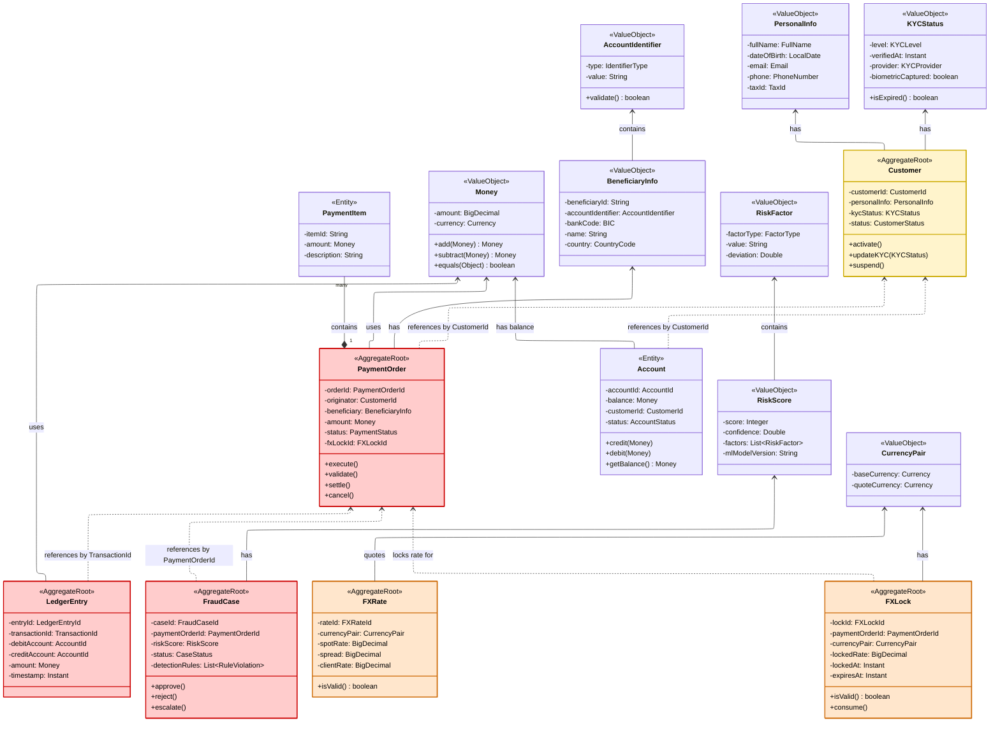
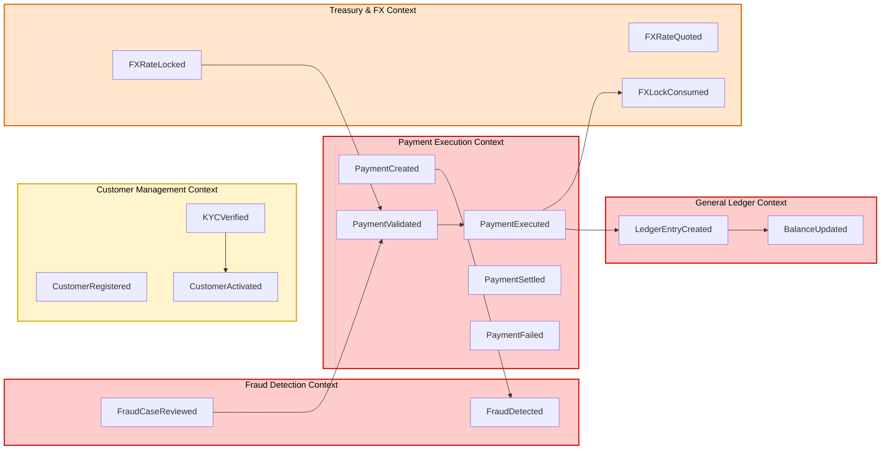

# 2.4 Modelo de Dominio Detallado

> **Objetivo**: Diseñar el modelo de dominio rico con agregados, entidades y value objects por bounded context identificado en 2.2.  
> **Técnica**: Domain-Driven Design - Tactical Patterns  
> **Alineación**: Kata FinScale Evolution - 10 Bounded Contexts

---

## 🎯 Patrones Tácticos DDD Aplicados

| Patrón | Descripción | Uso en FinScale |
|--------|-------------|-----------------|
| **Entity** | Objeto con identidad única que persiste | Customer, PaymentOrder, LedgerEntry |
| **Value Object** | Objeto inmutable definido por sus atributos | Money, Address, IBAN |
| **Aggregate** | Cluster de objetos tratados como unidad | PaymentOrder + PaymentItems |
| **Aggregate Root** | Punto de entrada al agregado | PaymentOrder (no se accede directamente a PaymentItem) |
| **Domain Event** | Hecho significativo del dominio | PaymentExecuted, FraudDetected |
| **Repository** | Abstracción de persistencia | PaymentRepository, CustomerRepository |
| **Domain Service** | Lógica que no pertenece a una entidad | FraudScoringService, FXPricingService |

---

## 📊 Modelo de Dominio: Vista General

### Agregados, Entidades y Value Objects por Bounded Context



### Vista de Eventos de Dominio



---

## 📦 Bounded Context: Payment Execution (CORE)

> **Responsabilidad**: Orquestación del pago con validación de saldo, reserva de fondos y enrutamiento a 50 países  
> **Compliance**: PCI-DSS (tokenización, HSM, AES-256, audit logs)

### Agregado: PaymentOrder

**Aggregate Root**: PaymentOrder  
**Propósito**: Representa una orden de pago con su ciclo de vida completo desde creación hasta liquidación

```
PaymentOrder (Entity - Aggregate Root)
├── orderId: PaymentOrderId (Value Object)
├── originator: CustomerId (Value Object)
├── beneficiary: BeneficiaryInfo (Value Object)
├── amount: Money (Value Object)
├── executionDate: Date
├── status: PaymentStatus (Enum: DRAFT → VALIDATED → FX_LOCKED → SENT_TO_GATEWAY → CLEARING → SETTLED / FAILED)
├── paymentItems: List<PaymentItem> (Entity)
├── routingInfo: RoutingDecision (Value Object)
├── fxLockId: FXLockId (Value Object - opcional para pagos transfronterizos)
└── auditTrail: List<StatusChange> (Value Object)

PaymentItem (Entity - parte del agregado)
├── itemId: String
├── amount: Money
├── description: String
└── metadata: Map<String, String>

Money (Value Object)
├── amount: BigDecimal
├── currency: Currency (Enum)
└── equals(), hashCode()

BeneficiaryInfo (Value Object)
├── beneficiaryId: String
├── accountIdentifier: AccountIdentifier (Value Object - soporta IBAN/SWIFT/ACH según país)
├── bankCode: BIC (Value Object)
├── name: String
├── country: CountryCode (uno de 50 países soportados)
└── address: Address (Value Object)

AccountIdentifier (Value Object)
├── type: IdentifierType (IBAN, SWIFT, ACH, PIX, SPEI)
├── value: String
└── validate(): Boolean

Address (Value Object)
├── street: String
├── city: String
├── country: CountryCode (Enum)
└── postalCode: String
```

### Invariantes del Agregado

```java
class PaymentOrder {
    // Invariante 1: El monto total debe ser positivo
    private void validateAmount() {
        if (amount.getAmount().compareTo(BigDecimal.ZERO) <= 0) {
            throw new InvalidPaymentException("Amount must be positive");
        }
    }
    
    // Invariante 2: Solo se puede ejecutar si está en estado VALIDATED
    public void execute() {
        if (status != PaymentStatus.VALIDATED) {
            throw new IllegalStateException("Can only execute validated payments");
        }
        this.status = PaymentStatus.EXECUTING;
        this.events.add(new PaymentExecuted(this.orderId));
    }
    
    // Invariante 3: No se puede modificar un pago ya ejecutado
    public void updateAmount(Money newAmount) {
        if (status == PaymentStatus.EXECUTED || status == PaymentStatus.SETTLED) {
            throw new IllegalStateException("Cannot modify executed payment");
        }
        this.amount = newAmount;
    }
}
```

### Domain Events

```
PaymentCreated
├── orderId: PaymentOrderId
├── amount: Money
├── timestamp: Instant
└── originatorId: CustomerId

PaymentValidated
├── orderId: PaymentOrderId
├── validationResult: ValidationResult
└── timestamp: Instant

PaymentExecuted
├── orderId: PaymentOrderId
├── executionTimestamp: Instant
└── routingNetwork: String

PaymentSettled
├── orderId: PaymentOrderId
├── settlementTimestamp: Instant
└── settlementReference: String

PaymentFailed
├── orderId: PaymentOrderId
├── failureReason: String
├── isRetryable: Boolean
└── timestamp: Instant
```

### Repositories

```java
interface PaymentOrderRepository {
    PaymentOrder findById(PaymentOrderId id);
    List<PaymentOrder> findByOriginator(CustomerId customerId);
    List<PaymentOrder> findByStatus(PaymentStatus status);
    void save(PaymentOrder order);
}
```

### Domain Services

```java
class PaymentRoutingService {
    RoutingDecision determineRoute(PaymentOrder order) {
        // Lógica compleja que no pertenece a PaymentOrder
        // - Evalúa país destino
        // - Selecciona red óptima (SWIFT, SEPA, PIX)
        // - Considera costo + latencia
    }
}

class PaymentValidationService {
    ValidationResult validate(PaymentOrder order) {
        // Orquesta múltiples validadores
        // - Sintaxis
        // - Saldo
        // - Límites
    }
}
```

---

## 📦 Bounded Context: General Ledger (CORE)

> **Responsabilidad**: Contabilidad de doble entrada inmutable en tiempo real (Position Keeping)  
> **Compliance**: PCI-DSS (AES-256, TLS 1.3, Event Sourcing como log inmutable, MFA para ops admin)  
> **Arquitectura**: Event Sourcing como fuente de verdad - elimina 40% lógica PL/SQL actual

### Agregado: LedgerEntry

**Aggregate Root**: LedgerEntry (Inmutable - Event Sourcing)  
**Propósito**: Registro inmutable de doble entrada contable - una vez creado, nunca se modifica

```
LedgerEntry (Entity - Aggregate Root - Immutable)
├── entryId: LedgerEntryId (Value Object)
├── transactionId: TransactionId (Value Object)
├── timestamp: Instant
├── debitAccount: AccountId (Value Object)
├── creditAccount: AccountId (Value Object)
├── amount: Money (Value Object)
├── entryType: EntryType (Enum: PAYMENT, REVERSAL, FEE)
├── metadata: TransactionMetadata (Value Object)
└── correlationId: String

AccountId (Value Object)
├── accountNumber: String
├── accountType: AccountType (Enum)
└── equals(), hashCode()

TransactionMetadata (Value Object)
├── paymentOrderId: String
├── description: String
├── tags: Set<String>
└── customFields: Map<String, String>
```

### Invariantes del Ledger

```java
class LedgerEntry {
    // Invariante fundamental: Doble entrada balanceada
    private void validateDoubleEntry() {
        if (debitAccount.equals(creditAccount)) {
            throw new InvalidLedgerEntryException(
                "Debit and credit accounts must be different"
            );
        }
        // El monto es el mismo para débito y crédito
        // Balance = 0 siempre
    }
    
    // Inmutabilidad: No hay setters, solo construcción
    private LedgerEntry(Builder builder) {
        this.entryId = builder.entryId;
        this.debitAccount = builder.debitAccount;
        this.creditAccount = builder.creditAccount;
        this.amount = builder.amount;
        // Una vez creado, NUNCA cambia
    }
}
```

### Agregado: Account (Read Model - CQRS)

```
Account (Entity - Read Model)
├── accountId: AccountId
├── customerId: CustomerId
├── balance: Money
├── currency: Currency
├── accountType: AccountType (CUSTOMER, CLEARING, NOSTRO)
├── status: AccountStatus (ACTIVE, FROZEN, CLOSED)
└── lastUpdated: Instant

// Este es un Read Model proyectado desde LedgerEntry events
// Se actualiza de forma eventual
```

### Domain Events

```
LedgerEntryCreated (Event Sourced)
├── entryId: LedgerEntryId
├── debitAccount: AccountId
├── creditAccount: AccountId
├── amount: Money
└── timestamp: Instant

BalanceUpdated (Projected Event)
├── accountId: AccountId
├── newBalance: Money
├── previousBalance: Money
└── timestamp: Instant
```

### Repositories

```java
// Event Store para escritura
interface LedgerEventStore {
    void append(LedgerEntryCreated event);
    List<LedgerEntryCreated> loadEvents(TransactionId transactionId);
}

// Read Model para consultas
interface AccountRepository {
    Account findById(AccountId id);
    Money getBalance(AccountId id);
}
```

---

## 📦 Bounded Context: Fraud Detection (CORE)

> **Responsabilidad**: Detección de fraude en tiempo real con ML (SLA < 100ms)  
> **Compliance**: GDPR (derecho al olvido mediante anonimización, consentimiento explícito para ML scoring, retención 7 años + anonimización, audit logs)  
> **Migración**: Reemplaza 40% lógica PL/SQL actual por servicio independiente con ML en tiempo real

### Agregado: FraudCase

**Aggregate Root**: FraudCase  
**Propósito**: Representa un caso de análisis de fraude con su scoring y decisión (automática o manual)

```
FraudCase (Entity - Aggregate Root)
├── caseId: FraudCaseId (Value Object)
├── paymentOrderId: PaymentOrderId
├── riskScore: RiskScore (Value Object: 0-100)
├── status: CaseStatus (PENDING, APPROVED, REJECTED, ESCALATED)
├── detectionRules: List<RuleViolation> (Value Object)
├── reviewNotes: List<ReviewNote> (Entity)
├── createdAt: Instant
├── reviewedAt: Instant
└── reviewedBy: AnalystId

RiskScore (Value Object)
├── score: Integer (0-100)
├── confidence: Double (0.0-1.0)
├── factors: List<RiskFactor>
├── threshold: ScoreThreshold
└── mlModelVersion: String

RuleViolation (Value Object)
├── ruleId: String
├── ruleName: String
├── severity: Severity (LOW, MEDIUM, HIGH, CRITICAL)
├── contribution: Integer (puntos al score)
└── evidence: Map<String, Object>

RiskFactor (Value Object)
├── factorType: FactorType (VELOCITY, GEO_MISMATCH, DEVICE_FINGERPRINT, AMOUNT_ANOMALY, ACCOUNT_TAKEOVER)
├── value: String
├── normalValue: String
└── deviation: Double
```

### Domain Services

```java
class FraudScoringService {
    RiskScore calculateScore(PaymentOrder order, CustomerBehavior behavior) {
        // ML Model Serving
        // Feature Engineering
        // Real-time scoring
    }
}

class RuleEngine {
    List<RuleViolation> evaluateRules(PaymentOrder order) {
        // Evalúa reglas estáticas
        // - Velocity (5 pagos en 1 hora)
        // - Monto inusual (3x promedio)
        // - País de riesgo
    }
}
```

### Domain Events

```
FraudDetected
├── caseId: FraudCaseId
├── paymentOrderId: PaymentOrderId
├── riskScore: RiskScore
├── autoDecision: Decision (BLOCK, ALLOW, REVIEW)
└── timestamp: Instant

FraudCaseReviewed
├── caseId: FraudCaseId
├── decision: Decision
├── reviewedBy: AnalystId
└── timestamp: Instant
```

---

## 📦 Bounded Context: Customer Management

> **Subdominios**: Customer Onboarding, Beneficiary Management, Wallet Overview  
> **Compliance**: GDPR (consentimiento explícito por etapa, derecho al olvido, minimización datos, DPA con Jumio/Onfido)  
> **Integraciones**: Jumio, Onfido (webhooks asincrónicos para KYC)

### Agregado: Customer

**Aggregate Root**: Customer  
**Propósito**: Representa un cliente (persona o empresa) con su información personal y estado de verificación KYC

```
Customer (Entity - Aggregate Root)
├── customerId: CustomerId (Value Object)
├── personalInfo: PersonalInfo (Value Object)
├── kycStatus: KYCStatus (Value Object)
├── accounts: List<AccountId> (referencia, no ownership)
├── verificationDocuments: List<Document> (Entity)
├── status: CustomerStatus (ACTIVE, SUSPENDED, CLOSED)
├── createdAt: Instant
└── lastModified: Instant

PersonalInfo (Value Object)
├── fullName: FullName (Value Object)
├── dateOfBirth: LocalDate
├── nationality: CountryCode
├── taxId: TaxId (Value Object)
├── email: Email (Value Object)
└── phone: PhoneNumber (Value Object)

FullName (Value Object)
├── firstName: String
├── middleName: String
├── lastName: String
└── displayName(): String

KYCStatus (Value Object)
├── level: KYCLevel (NONE, BASIC, ENHANCED, FULL)
├── verifiedAt: Instant
├── expiresAt: Instant
├── provider: KYCProvider (JUMIO, ONFIDO - según kata)
├── verificationId: String
└── biometricCaptured: Boolean

Document (Entity)
├── documentId: String
├── documentType: DocumentType (ID, PASSPORT, PROOF_ADDRESS)
├── fileUrl: String
├── uploadedAt: Instant
└── verificationStatus: VerificationStatus
```

### Invariantes

```java
class Customer {
    // Invariante: No se puede activar sin KYC BASIC
    public void activate() {
        if (kycStatus.getLevel() == KYCLevel.NONE) {
            throw new IllegalStateException(
                "Cannot activate customer without KYC verification"
            );
        }
        this.status = CustomerStatus.ACTIVE;
    }
    
    // Invariante: Email debe ser único (verificado por repositorio)
    public void updateEmail(Email newEmail) {
        // Repository verifica unicidad
        this.personalInfo = personalInfo.withEmail(newEmail);
        this.events.add(new CustomerEmailUpdated(customerId, newEmail));
    }
}
```

---

## 📦 Bounded Context: Treasury & FX

> **Subdominios**: FX Trading, Liquidity Management  
> **Responsabilidad**: Cotización y bloqueo de tasas de cambio para pagos transfronterizos, monitoreo de liquidez en bancos corresponsales  
> **Característica clave**: Tasa bloqueada por 5 minutos según proceso de negocio de la kata

### Agregado: FXRate

**Aggregate Root**: FXRate  
**Propósito**: Representa una cotización de divisa con spread comercial aplicado

```
FXRate (Entity - Aggregate Root)
├── rateId: FXRateId
├── currencyPair: CurrencyPair (Value Object)
├── spotRate: BigDecimal
├── spread: BigDecimal
├── clientRate: BigDecimal (spotRate + spread)
├── validFrom: Instant
├── validUntil: Instant
├── source: RateSource (REUTERS, BLOOMBERG)
└── rateType: RateType (SPOT, FORWARD)

CurrencyPair (Value Object)
├── baseCurrency: Currency
├── quoteCurrency: Currency
└── toString(): String (ej. "USD/EUR")
```

### Agregado: FXLock

```
FXLock (Entity - Aggregate Root)
├── lockId: FXLockId
├── paymentOrderId: PaymentOrderId
├── currencyPair: CurrencyPair
├── lockedRate: BigDecimal
├── amount: Money
├── lockedAt: Instant
├── expiresAt: Instant (lockedAt + 5 minutos según kata)
├── status: LockStatus (ACTIVE, EXPIRED, CONSUMED)
└── consumedAt: Instant

// Invariante crítico de negocio: Lock válido SOLO por 5 minutos
// Según proceso "Transferencia Internacional (P2P)" de la kata
public boolean isValid() {
    Duration lockDuration = Duration.between(lockedAt, Instant.now());
    return status == LockStatus.ACTIVE 
        && lockDuration.toMinutes() < 5
        && Instant.now().isBefore(expiresAt);
}
```

### Domain Services

```java
class FXPricingService {
    FXRate getRate(CurrencyPair pair) {
        // Consulta provider externo
        // Aplica spread comercial
        // Cachea con TTL de 10 segundos
    }
    
    FXLock lockRate(CurrencyPair pair, Money amount, Duration lockDuration) {
        FXRate currentRate = getRate(pair);
        return new FXLock(
            generateId(),
            currentRate.getClientRate(),
            amount,
            lockDuration
        );
    }
}
```

---

##  Relaciones entre Agregados (Across Contexts)

### Regla: Solo Referencias por ID

```java
// ❌ MAL: Agregar referencia directa al objeto
class PaymentOrder {
    private Customer customer; // NO!
}

// ✅ BIEN: Solo mantener el ID
class PaymentOrder {
    private CustomerId originatorId; // Solo el ID
    
    // Si necesitas datos del Customer, usa un Repository
    public CustomerInfo getOriginatorInfo(CustomerRepository repo) {
        return repo.findById(this.originatorId).getPersonalInfo();
    }
}
```

### Comunicación entre Agregados: Domain Events

```java
// Payment Processing emite evento
class PaymentOrder {
    public void execute() {
        this.status = PaymentStatus.EXECUTING;
        this.events.add(new PaymentExecuted(this.orderId, this.amount));
    }
}

// General Ledger escucha evento
class LedgerEventHandler {
    @EventHandler
    public void on(PaymentExecuted event) {
        LedgerEntry entry = new LedgerEntry.Builder()
            .debit(event.getOriginatorAccount())
            .credit(CLEARING_ACCOUNT)
            .amount(event.getAmount())
            .build();
        
        ledgerEventStore.append(entry);
    }
}
```

---

**Próximo Paso**: → `03-Diseño-Tecnico/3.1-C4-Model/C1-Contexto.md`

---

**Última actualización**: 22 de diciembre de 2025
