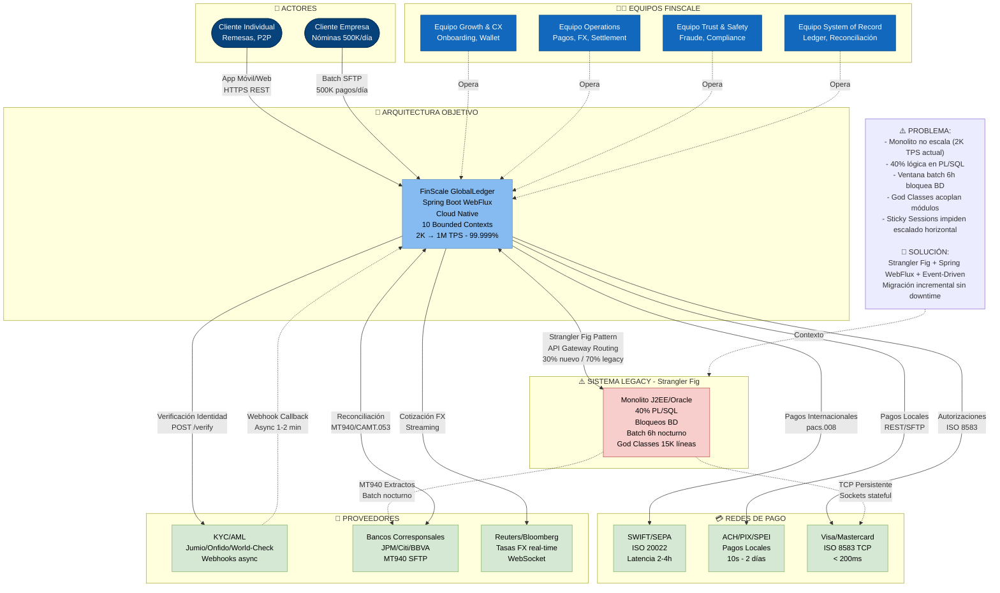

# C4 Model - Nivel 1: Diagrama de Contexto

> **Objetivo**: Vista de alto nivel mostrando el sistema FinScale y sus interacciones con actores externos.  
> **Audiencia**: Stakeholders de negocio, arquitectos, reguladores

---

## 🎯 Diagrama de Contexto del Sistema

### Descripción

El diagrama de contexto muestra FinScale GlobalLedger como un sistema único interactuando con:
- **Usuarios**: Clientes personas, clientes empresas, operadores internos
- **Sistemas Externos**: Redes bancarias, proveedores de KYC, reguladores
- **Legacy Systems**: Monolito J2EE (durante migración)

---

## 📐 Diagrama de Contexto (C4 Level 1)



---

## 📝 Descripción de Actores y Sistemas

### � Actores Externos (Clientes)

| Actor | Descripción | Volumen | Interacción Principal |
|-------|-------------|---------|----------------------|
| **Cliente Individual** | Personas físicas que realizan remesas internacionales y pagos P2P | - | App Móvil (React Native), Web (React) - HTTPS REST |
| **Cliente Empresa** | Corporativos Gig Economy (Uber, Rappi, Didi) que procesan nóminas masivas diarias | **500,000 pagos/día** (kata) | API REST, Batch SFTP (archivos planos) |

### 👨‍💼 Equipos Internos FinScale (4 Equipos Estratégicos)

> **Nota**: Organización según la kata. Cada equipo es dueño de bounded contexts específicos (ver [2.2-Bounded-Contexts.md](../../02-Diseño-Estrategico/2.2-Bounded-Contexts.md)).

| Equipo | Responsabilidad | Bounded Contexts Clave |
|--------|----------------|------------------------|
| **Growth & Customer Experience** | Adquisición de usuarios, onboarding, gestión de cuentas y beneficiarios | Customer Management, Identity & Access, Account Access |
| **Operations (Global)** | Ejecución de pagos, FX, liquidación, gestión de liquidez en 12 países | Payment Execution, Treasury & FX, Clearing & Settlement |
| **Trust & Safety** | Detección de fraude ML, screening de sanciones, reportes regulatorios | Fraud Detection, Screening & Compliance, Regulatory Reporting |
| **System of Record** | Ledger contable inmutable, reconciliación con bancos corresponsales | General Ledger, Reconciliation |

---

### 🌐 Sistemas Externos

#### 💳 Redes de Pago (Payment Networks)

> **Contexto**: FinScale opera en 12 países y debe integrarse con múltiples redes bancarias. La **Deuda Técnica** del monolito Legacy incluye sockets TCP stateful (ISO 8583) que no funcionan bien en Kubernetes.

| Sistema | Descripción | Protocolo | Latencia SLA | Criticidad | Integración Legacy vs Nueva |
|---------|-------------|-----------|--------------|------------|-----------------------------|
| **SWIFT/SEPA** | Red global de mensajería bancaria para pagos internacionales y zona euro | ISO 20022 (XML): pacs.008 (instrucción), pacs.002 (confirmación) | 2-4 horas | 🔴 Crítico | Legacy: SFTP batch. Nuevo: REST API + Event-driven |
| **ACH/PIX/SPEI** | Redes locales de compensación (USA/Brasil/México) para pagos instantáneos o batch | REST API (PIX/SPEI), Flat Files SFTP (ACH) | 10s - 2 días | 🟡 Alto | Legacy: Archivos planos. Nuevo: APIs REST + Webhooks |
| **Visa/Mastercard** | Esquemas de tarjetas para autorizaciones de compra y retiros | **ISO 8583 sobre TCP persistente** (problema: stateful en Kubernetes) | < 200ms | 🔴 Crítico | **Problema Deuda Técnica**: Sockets TCP persistentes incompatibles con pods efímeros. Solución: HSM Proxy con Netty (ver C2) |

#### 🔐 Proveedores de Servicios (Third-Party Integrations)

| Sistema | Descripción | Integración | SLA | Patrón de Integración |
|---------|-------------|-------------|-----|-----------------------|
| **Jumio/Onfido** | Proveedores de KYC biométrico (verificación de identidad con selfie + ID) | REST API + **Webhooks asíncronos** | Respuesta en 1-2 min | Event-Driven (Webhook callback) |
| **World-Check (Refinitiv)** | Sanctions screening (listas negras OFAC, Interpol, PEP) | REST API síncrona | < 500ms | Request-Reply síncrono (crítico) |
| **Reuters/Bloomberg** | Tasas de cambio FX en tiempo real | **WebSocket streaming** | < 100ms | Event Streaming (cotización continua) |
| **JP Morgan, Citi, BBVA** | Bancos corresponsales para liquidación de fondos en 12 países | SFTP (extractos MT940/CAMT.053), Open Banking APIs | Extractos diarios (batch) | File Transfer + Reconciliation Engine |
| **OFAC, Reguladores** | Entidades gubernamentales que reciben reportes de cumplimiento | SFTP, APIs gubernamentales | Batch mensual/trimestral | Batch Export (Regulatory Reporting Service) |

---

### 🏢 Sistema FinScale GlobalLedger (Arquitectura Objetivo)

> **Contexto de Migración**: Este sistema representa la **arquitectura objetivo** (Cloud Native, Spring Boot WebFlux, Event-Driven). Coexiste con el **Monolito Legacy J2EE/Oracle** durante la migración mediante el patrón **Strangler Fig** (ver [C2-Contenedores.md](C2-Contenedores.md) para detalles de API Gateway routing y CDC).

**Stack Tecnológico**: Spring Boot WebFlux (reactivo), Kafka (mensajería), PostgreSQL/TimescaleDB/Cassandra (poliglot persistence), Redis (cache/sesiones), Kong (API Gateway), Temporal.io (Saga orchestration).

**Responsabilidades principales (10 Bounded Contexts):**

1. **Gestión de Pagos (Payment Execution - CORE)**
   - Orquestación de pagos a 12 países
   - Routing inteligente (SWIFT, SEPA, PIX, ACH, SPEI)
   - Gestión de estados (Draft → Validated → FX_Locked → Sent → Clearing → Settled/Failed)
   - **Motor de Dispersión Masiva**: Procesamiento batch de 500,000 pagos simultáneos (nóminas Gig Economy)
   - Soporte multi-formato: IBAN, SWIFT, ACH, PIX, SPEI

2. **Contabilidad en Tiempo Real (General Ledger - CORE)**
   - Ledger inmutable con doble entrada (Event Sourcing)
   - Saldos en tiempo real (< 1s de lag)
   - **TimescaleDB** para time-travel queries (auditorías: "¿saldo el 15 de marzo?")
   - Compliance: PCI-DSS (AES-256, Event Sourcing, audit trail 7 años)

3. **Detección de Fraude (Fraud Detection - CORE)**
   - ML scoring en < 50ms (< 100ms SLA kata)
   - Reglas dinámicas activables en runtime (Feature Flags)
   - Análisis de comportamiento (velocidad, geolocalización, device fingerprint)
   - **Apache Cassandra** para storage de eventos de fraude (50K+ writes/s)
   - Compliance: GDPR (anonimización, consentimiento ML, retención 7 años)

4. **Gestión de FX (Treasury & FX - SUPPORTING)**
   - Cotización en tiempo real (Reuters/Bloomberg)
   - Bloqueo de tasas por 5 minutos (especificación kata)
   - Hedging automático
   - Gestión de liquidez en 12 países

5. **Cumplimiento Regulatorio (Screening & Compliance + Regulatory Reporting - SUPPORTING)**
   - Sanctions screening (World-Check: OFAC, Interpol) en < 500ms
   - Reportes automáticos a bancos centrales
   - Trazabilidad total (GDPR, data lineage)
   - Retención: 7 años (Banco Central Europeo), 10 años (SEC-USA)

6. **Gestión de Clientes (Customer Management - SUPPORTING)**
   - Onboarding con KYC biométrico (Jumio/Onfido)
   - Verificación async con webhooks
   - Compliance: GDPR (consentimiento por etapa, DPA con proveedores)

7. **Reconciliación (Reconciliation - SUPPORTING)**
   - Conciliación automática con bancos corresponsales
   - Procesamiento de extractos MT940/CAMT.053
   - Detección de discrepancias

8. **Clearing & Settlement (SUPPORTING)**
   - Comunicación con redes bancarias (ISO 20022)
   - Gestión de confirmaciones (pacs.002)
   - Estado de liquidación

9. **Identity & Access (GENERIC)**
   - OAuth2 + JWT, gestión de sesiones (Redis)
   - Device fingerprinting para detección de fraude
   - **Solución Deuda Técnica**: Migración de HttpSession (RAM) → Redis (externalización de estado para eliminar Sticky Sessions)

---

### ⚠️ Sistema Legacy (En Migración - Strangler Fig)

> **Problema Principal (Kata)**: Monolito J2EE/Oracle que NO escala y bloquea la evolución del negocio.

| Aspecto | Descripción del Problema | Impacto en Drivers |
|---------|-------------------------|-------------------|
| **40% Lógica en PL/SQL** | Store Procedures Oracle anidados (cálculo comisiones, validación saldo, bloqueos). No se puede extraer a microservicios sin reescribir | ❌ Time-to-Market: 4 meses por feature |
| **Shared Database** | Sistemas satélites (Reportes, CRM) leen/escriben directamente en CORE_SCHEMA. Cambiar schema rompe integraciones desconocidas | ❌ Modernización bloqueada |
| **Ventana Batch 6h** | Sistema se bloquea 02:00-04:00 AM para cierre contable y reconciliación (Read-Only) | ❌ Disponibilidad: Negocio exige 24/7 |
| **God Classes** | TransactionManager.java con 15K líneas importada por todos los módulos. Imposible desplegar módulos independientes | ❌ Agilidad: No se puede aplicar Strangler Fig por componentes |
| **Sticky Sessions** | HttpSession en RAM del servidor. Impide escalado horizontal. Si servidor muere, usuarios se desconectan | ❌ Escalabilidad: No puede pasar de 2K TPS a 1M TPS |
| **Sockets TCP Stateful** | ISO 8583 con Visa/Mastercard usa sockets persistentes. Incompatible con Kubernetes (pods efímeros) | ❌ Cloud Native: No puede migrar a nube sin rediseño |

**Estrategia de Migración**: Patrón **Strangler Fig** (ver [C2-Contenedores.md](C2-Contenedores.md)):
- **API Gateway (Kong)** enruta progresivamente tráfico: 30% nuevo / 70% legacy → 50/50 → 100% nuevo
- **CDC (Debezium + Oracle GoldenGate)** sincroniza datos Legacy ↔ Nuevo sin dual-writes
- **Legacy Facade (ACL)** traduce modelos entre Legacy y Bounded Contexts nuevos
- **Migración incremental por bounded context** (2 semanas vs 4 meses reescritura completa)

---

## 🔗 Flujos Principales de Integración

### Flujo 1: Pago Internacional (Cliente → SWIFT)

```
Cliente Persona (App Móvil)
    ↓ HTTPS/REST
FinScale GlobalLedger
    ↓ Validación de Fraude
    ↓ Cotización FX (Reuters)
    ↓ Débito en Ledger
    ↓ ISO 20022 (pacs.008)
SWIFT Network
    ↓ Mensaje a Banco Corresponsal
Banco Beneficiario (BBVA España)
    ↓ Confirmación (pacs.002)
FinScale GlobalLedger
    ↓ Actualiza estado → SETTLED
    ↓ Push Notification
Cliente Persona (App Móvil)
```

---

### Flujo 2: Onboarding de Cliente (KYC)

```
Cliente Persona (Registro)
    ↓ HTTPS/REST
FinScale GlobalLedger
    ↓ Captura biometría (selfie + ID)
    ↓ POST /verify (async)
Jumio (Proveedor KYC)
    ↓ Procesamiento AI (1-2 min)
    ↓ Webhook callback
FinScale GlobalLedger
    ↓ Actualiza KYC Status → VERIFIED
    ↓ Activa cuenta
    ↓ Email de bienvenida
Cliente Persona
```

---

### Flujo 3: Reconciliación con Banco Corresponsal

```
JP Morgan (Banco Corresponsal)
    ↓ SFTP diario (02:00 UTC)
    ↓ Archivo MT940 (extracto)
FinScale GlobalLedger (Reconciliation Service)
    ↓ Parsea extracto
    ↓ Compara con Ledger interno
    ↓ Identifica discrepancias
    ↓ Genera alertas (si hay diferencias)
Operador de Tesorería (Dashboard)
    ↓ Revisa excepciones
    ↓ Ajusta manualmente (si necesario)
```

---

## 🎯 Drivers de Arquitectura Soportados en el Contexto

> **Nota:** Esta tabla mapea cómo el **nivel de contexto** (sistemas externos, integraciones, boundaries) soporta los 6 drivers arquitectónicos. Para especificación completa de métricas, escenarios QAS y tácticas, ver [1.2-Drivers-Arquitectura.md](../../01-Entendimiento-Negocio/1.2-Drivers-Arquitectura.md).

| Driver (1.2) | Cómo se Soporta en el Diagrama de Contexto C1 | Bounded Contexts Clave |
|--------------|------------------------------------------------|-------------------------|
| **1. Escalabilidad Extrema (2K → 1M TPS)** | Motor de dispersión masiva (500K pagos/día batch). Spring Boot WebFlux (reactivo) permite escalamiento horizontal. Integraciones asíncronas con redes de pago (ISO 20022, ISO 8583). Multi-AZ cloud. | Payment Execution, General Ledger |
| **2. Disponibilidad 24/7 (99.999%)** | Redundancia en redes de pago (SWIFT/SEPA + locales + tarjetas). Multi-región cloud. Eliminación de ventana batch 6h mediante arquitectura event-driven. Fallback automático entre redes. | Clearing & Settlement, Treasury & FX |
| **3. Resiliencia y Aislamiento de Fallos** | Circuit breakers en todas las integraciones externas (KYC/AML, bancos corresponsales, redes de pago). Si proveedor KYC cae, onboarding continúa en modo manual. Bulkhead pattern entre bounded contexts. | Customer Management, Screening & Compliance, Fraud Detection |
| **4. Modernización Cloud Native** | Strangler Fig Pattern (BiRel entre FinScale nuevo y Legacy Monolith) para migración sin downtime. Spring Boot WebFlux + 10 Bounded Contexts independientes. Migración incremental de 40% PL/SQL a Java reactivo. | Todos los contextos (migración gradual) |
| **5. Cumplimiento Normativo (PCI-DSS, GDPR)** | **PCI-DSS:** Tokenización en integraciones con card schemes (Visa/MC). HSM para firmas criptográficas. TLS 1.3 en todas las conexiones externas. **GDPR:** DPA con proveedores KYC (Jumio/Onfido/World-Check). Anonimización PII. Derecho al olvido en Customer Management. | Payment Execution, Customer Management, Screening & Compliance, Regulatory Reporting |
| **6. Time-to-Market Acelerado** | 10 Bounded Contexts desacoplados permiten despliegues independientes. Strangler Fig permite migrar contexto por contexto (2 semanas vs 4 meses). API Gateway enruta gradualmente tráfico de legacy a nuevo sistema. | Todos los contextos |

---

## 🚨 Puntos de Riesgo Identificados

| Riesgo | Impacto | Mitigación |
|--------|---------|------------|
| **SWIFT tiene SLA de 2-4 horas** | Cliente espera mucho | Notificación proactiva de estado. Ofrecer alternativas (ej. PIX para Brasil). |
| **Proveedores KYC con timeout** | Onboarding se bloquea | Integración asíncrona con webhooks. Timeout de 30s + retry con backoff. |
| **Dependencia de un solo banco corresponsal por país** | SPOF | Contratar 2+ bancos por país. Routing automático si uno cae. |
| **Legacy Monolith aún activo durante migración** | Complejidad dual-write | Strangler Fig con API Gateway enrutando gradualmente. |

---

## ✅ Decisiones de Diseño (Contexto)

1. **API Gateway como Punto de Entrada Único**
   - Simplifica autenticación (OAuth2)
   - Enrutamiento entre legacy y nuevo sistema (durante migración)
   - Rate limiting centralizado

2. **Integraciones Asíncronas por Default**
   - Webhooks para KYC (no polling)
   - Event-driven para comunicación interna
   - Solo síncrono cuando latencia < 100ms es crítica (ej. Fraud scoring)

3. **Circuit Breaker en Todas las Integraciones Externas**
   - Si proveedor FX cae → usar última tasa cacheada + warning
   - Si SWIFT timeout → encolar mensaje y reintentar
   - Si sanctions screening falla → bloquear pago (fail-safe)

---

**Próximo Paso**: → `C2-Contenedores.md` para desglosar FinScale en microservicios basados en los 10 Bounded Contexts.

---

**Última actualización**: 23 de diciembre de 2025  
**Referencias**: [2.2-Bounded-Contexts.md](../../02-Diseño-Estrategico/2.2-Bounded-Contexts.md), [1.2-Drivers-Arquitectura.md](../../01-Entendimiento-Negocio/1.2-Drivers-Arquitectura.md)
