# C4 Model - Nivel 2: Diagrama de Contenedores

> **Objetivo**: Desglosar FinScale en aplicaciones, microservicios, bases de datos y sistemas de mensajería.  
> **Audiencia**: Arquitectos de software, tech leads, equipos de desarrollo

---

## 🎯 Arquitectura de Contenedores

### Descripción

FinScale GlobalLedger se descompone en:
- **Frontend**: Mobile App (React Native), Web Portal (React + WebSockets)
- **API Gateway**: Kong + OAuth2, Legacy Facade (Anti-Corruption Layer)
- **Core Services**: Payment, Ledger, Fraud (Spring WebFlux + R2DBC/TensorFlow)
- **Supporting Services**: Customer, FX, Clearing, Notification, Regulatory Reporting, Reconciliation
- **Integration Layer**: Saga Orchestrator (Temporal.io), CDC Adapter (Debezium), HSM Proxy (Netty)
- **Messaging**: Apache Kafka (event streaming, event store)
- **Databases**: PostgreSQL, Redis Cluster, Cassandra, TimescaleDB, AWS S3
- **Observability**: Jaeger (tracing), Prometheus/Grafana (metrics), ELK Stack (logs)
- **Legacy**: Monolito Java 8 + Oracle (en migración Strangler Fig)

---

## 📐 Diagrama de Contenedores (C4 Level 2)

```mermaid
flowchart TB
    %% ============================================
    %% ESTILOS
    %% ============================================
    classDef actor fill:#08427b,stroke:#052e56,color:#fff
    classDef frontend fill:#1168bd,stroke:#0b4884,color:#fff
    classDef gateway fill:#438dd5,stroke:#2e5f8f,color:#fff
    classDef core fill:#85bbf0,stroke:#5a8fc4,color:#000
    classDef support fill:#b3d9ff,stroke:#7aa3cc,color:#000
    classDef integration fill:#6c8ebf,stroke:#4a6280,color:#fff
    classDef data fill:#dae8fc,stroke:#9bb3d4,color:#000
    classDef external fill:#f8cecc,stroke:#b85450,color:#000
    classDef observability fill:#d5e8d4,stroke:#82b366,color:#000

    %% ============================================
    %% CAPA 1: ACTORES
    %% ============================================
    subgraph ACTORS[" "]
        Customer([👤 Cliente<br/>Usuario Final]):::actor
        Operator([👤 Operador<br/>Back Office]):::actor
        Regulator([👤 Regulador<br/>Entidad Fiscal]):::actor
    end

    %% ============================================
    %% CAPA 2: CANALES DIGITALES
    %% ============================================
    subgraph CHANNELS["📱 CANALES DIGITALES"]
        Mobile[Mobile App<br/>React Native<br/>iOS/Android]:::frontend
        Web[Web Portal<br/>React + WebSockets<br/>Cliente/Operador]:::frontend
    end

    %% ============================================
    %% CAPA 3: API GATEWAY
    %% ============================================
    subgraph EDGE["🚪 API GATEWAY LAYER"]
        APIGateway[API Gateway<br/>Kong + OAuth2<br/>Auth, Rate Limit, Circuit Breaker]:::gateway
        LegacyProxy[Legacy Facade<br/>Spring Boot<br/>Anti-Corruption Layer]:::gateway
    end

    %% ============================================
    %% CAPA 4: SERVICIOS CORE
    %% ============================================
    subgraph CORE["⭐ CORE DOMAIN SERVICES"]
        Payment[Payment Service<br/>Spring WebFlux + R2DBC<br/>Orquestación Pagos]:::core
        Ledger[Ledger Service<br/>Spring WebFlux<br/>Doble Partida Inmutable]:::core
        Fraud[Fraud Engine<br/>WebFlux + TensorFlow<br/>ML Scoring Tiempo Real]:::core
    end

    %% ============================================
    %% CAPA 5: SERVICIOS SOPORTE
    %% ============================================
    subgraph SUPPORT["🔧 SUPPORTING SERVICES"]
        CustomerSvc[Customer Service<br/>Spring Boot<br/>Onboarding, KYC]:::support
        FX[FX Service<br/>Spring WebFlux<br/>Trading Divisas]:::support
        Clearing[Clearing Service<br/>Spring Boot<br/>Gateway SWIFT/PIX]:::support
        Notification[Notification Service<br/>Spring WebFlux<br/>Push/Email/SMS]:::support
        Reporting[Regulatory Reporting<br/>Spring Batch<br/>Compliance]:::support
        Reconciliation[Reconciliation Service<br/>Spring Batch<br/>Conciliación Nocturna]:::support
    end

    %% ============================================
    %% CAPA 6: INTEGRACION
    %% ============================================
    subgraph INTEGRATION["🔌 INTEGRATION LAYER"]
        Saga[Saga Orchestrator<br/>Temporal.io<br/>Transacciones Distribuidas]:::integration
        CDC[CDC Adapter<br/>Debezium<br/>Sync Bidireccional Legacy]:::integration
        HSMProxy[HSM Proxy<br/>Netty<br/>Firma Criptográfica]:::integration
    end

    %% ============================================
    %% CAPA 7: DATOS
    %% ============================================
    subgraph DATA["💾 DATA LAYER"]
        Kafka[(Event Bus<br/>Apache Kafka<br/>Log Eventos Dominio)]:::data
        Cache[(Cache<br/>Redis Cluster<br/>Sesiones, FX Rates, Tokens)]:::data
        PaymentDB[(Payment DB<br/>PostgreSQL<br/>Estado Transaccional)]:::data
        LedgerDB[(Ledger DB<br/>PostgreSQL + TimescaleDB<br/>Append-Only Ledger)]:::data
        FraudDB[(Fraud Store<br/>Cassandra<br/>Eventos Scoring ML)]:::data
        CustomerDB[(Customer DB<br/>PostgreSQL<br/>Maestro Clientes)]:::data
        DocsStore[(Document Store<br/>AWS S3<br/>KYC Docs, Extractos)]:::data
    end

    %% ============================================
    %% CAPA 8: OBSERVABILIDAD
    %% ============================================
    subgraph OBSERVABILITY["📊 OBSERVABILITY"]
        Tracing[Distributed Tracing<br/>Jaeger<br/>Spans End-to-End]:::observability
        Metrics[Metrics<br/>Prometheus + Grafana<br/>SLIs/SLOs]:::observability
        Logs[Centralized Logs<br/>ELK Stack<br/>Logs Agregados]:::observability
    end

    %% ============================================
    %% CAPA 9: SISTEMAS EXTERNOS
    %% ============================================
    subgraph EXTERNAL["🌐 SISTEMAS EXTERNOS"]
        Legacy[LegacyCore<br/>Monolito Java 8<br/>Oracle PL/SQL]:::external
        SWIFT[SWIFT/SEPA/PIX<br/>Redes Compensación]:::external
        Visa[Visa/Mastercard<br/>ISO 8583]:::external
        KYC[KYC Providers<br/>Jumio/Onfido<br/>Webhooks]:::external
        HSM[HSM Físico<br/>Thales/nCipher<br/>On-Premise]:::external
        FCM[Firebase Cloud Messaging<br/>Push Notifications]:::external
    end

    %% ============================================
    %% RELACIONES: ACTORES → CANALES
    %% ============================================
    Customer -->|HTTPS| Mobile
    Customer -->|HTTPS| Web
    Operator -->|HTTPS| Web

    %% ============================================
    %% RELACIONES: CANALES → GATEWAY
    %% ============================================
    Mobile -->|REST API<br/>JSON/HTTPS| APIGateway
    Web -->|REST + WebSocket<br/>JSON/WSS| APIGateway

    %% ============================================
    %% RELACIONES: GATEWAY → SERVICIOS
    %% ============================================
    APIGateway -->|Routes<br/>HTTP/2| Payment
    APIGateway -->|Routes<br/>HTTP/2| CustomerSvc
    APIGateway -->|Fallback<br/>HTTP| LegacyProxy
    APIGateway -.->|Valida Tokens<br/>OAuth2| Cache

    %% ============================================
    %% RELACIONES: CORE SERVICES → KAFKA
    %% ============================================
    Payment <-->|Pub/Sub<br/>PaymentEvents| Kafka
    Ledger <-->|Pub/Sub<br/>LedgerEvents| Kafka
    Fraud <-->|Consume/Produce<br/>FraudScore| Kafka

    %% ============================================
    %% RELACIONES: SUPPORT SERVICES → KAFKA
    %% ============================================
    Notification -->|Consume<br/>StatusChanged| Kafka
    Reporting -->|Consume<br/>Audit Trail| Kafka

    %% ============================================
    %% RELACIONES: SAGA ORCHESTRATION
    %% ============================================
    Saga -.->|Coordina<br/>gRPC| Payment
    Saga -.->|Coordina<br/>gRPC| Ledger
    Saga -.->|Coordina<br/>gRPC| Clearing

    %% ============================================
    %% RELACIONES: SERVICIOS → DATABASES
    %% ============================================
    Payment -->|R/W<br/>R2DBC| PaymentDB
    Ledger -->|Append-Only<br/>JDBC| LedgerDB
    Fraud -->|Escritura Masiva<br/>CQL| FraudDB
    CustomerSvc -->|R/W<br/>JDBC| CustomerDB

    %% ============================================
    %% RELACIONES: SERVICIOS → CACHE
    %% ============================================
    Payment -.->|Cache Saldos<br/>Redis Protocol| Cache
    FX -.->|Cache Rates 5min<br/>Redis Protocol| Cache

    %% ============================================
    %% RELACIONES: SEGURIDAD HSM
    %% ============================================
    Payment -->|Firma TX<br/>TLS Mutual| HSMProxy
    HSMProxy -->|PKCS#11<br/>VPN Dedicada| HSM

    %% ============================================
    %% RELACIONES: CLEARING → REDES EXTERNAS
    %% ============================================
    Clearing -->|ISO 20022 XML<br/>SWIFT Alliance| SWIFT
    Clearing -->|ISO 8583<br/>TCP Persistente| Visa

    %% ============================================
    %% RELACIONES: CUSTOMER → KYC
    %% ============================================
    CustomerSvc -->|POST /verify<br/>Webhook| KYC
    KYC -.->|Callback<br/>Async| CustomerSvc
    CustomerSvc -->|Upload IDs<br/>S3 API| DocsStore

    %% ============================================
    %% RELACIONES: NOTIFICACIONES
    %% ============================================
    Notification -->|Envía Push<br/>FCM API| FCM

    %% ============================================
    %% RELACIONES: CDC → LEGACY
    %% ============================================
    CDC <-->|Change Data Capture<br/>Oracle GoldenGate| Legacy
    CDC -->|Publica ChangeEvents<br/>Kafka Protocol| Kafka
    LegacyProxy -->|SOAP/REST<br/>Anti-Corruption| Legacy

    %% ============================================
    %% RELACIONES: RECONCILIACION
    %% ============================================
    Reconciliation -->|Lee Movimientos<br/>SQL| LedgerDB
    Reconciliation -->|Descarga MT940<br/>S3 API| DocsStore

    %% ============================================
    %% RELACIONES: OBSERVABILIDAD
    %% ============================================
    Payment -.->|Spans<br/>OpenTelemetry| Tracing
    Fraud -.->|Métricas ML<br/>Prometheus| Metrics
    Ledger -.->|Structured Logs<br/>Fluentd| Logs

    %% ============================================
    %% RELACIONES: REPORTING
    %% ============================================
    Regulator -->|Consulta Reportes<br/>SFTP| Reporting
```



---

## 📊 Inventario de Contenedores

### Frontend Applications

| Contenedor | Tecnología | Responsabilidad |
|------------|------------|------------------|
| **Mobile App** | React Native + TypeScript | UI para clientes (pagos, saldo, historial) |
| **Web Portal** | React + TypeScript + WebSockets | Portal unificado para clientes y operadores |

**Características**:
- Autenticación: OAuth2 + biometría (Touch ID)
- Offline-first (cache local con sync)
- Push notifications (Firebase Cloud Messaging)

---

### Backend Services (Microservices)

#### 🔴 Core Domain Services

| Servicio | Tecnología | Bounded Context | Base de Datos | Criticidad |
|----------|------------|-----------------|---------------|------------|
| **Payment Service** | Spring Boot 3 + WebFlux + R2DBC | Payment Processing | PostgreSQL | 🔴 Crítico |
| **Ledger Service** | Spring Boot 3 + WebFlux | General Ledger | PostgreSQL + TimescaleDB (append-only) | 🔴 Crítico |
| **Fraud Service** | Spring Boot 3 + WebFlux + TensorFlow | Fraud Management | Cassandra + Redis (feature store) | 🔴 Crítico |

##### Payment Service

```yaml
Responsabilidades:
  - Crear y validar órdenes de pago
  - Gestionar ciclo de vida (Draft → Validated → Sent → Settled)
  - Orquestar validaciones (saldo, fraude, compliance)
  - Publicar eventos: PaymentCreated, PaymentExecuted, PaymentFailed

APIs Expuestas:
  - POST /api/v1/payments (crear pago)
  - GET /api/v1/payments/{id} (consultar estado)
  - GET /api/v1/payments?customerId=X (historial)

Eventos Consumidos:
  - FraudCheckCompleted (de Fraud Service)
  - LedgerEntryCreated (de Ledger Service)

Eventos Publicados:
  - PaymentCreated
  - PaymentExecuted
  - PaymentFailed

Métricas Clave:
  - payment_creation_rate (TPS)
  - payment_processing_latency_p99 (ms)
  - payment_failure_rate (%)
```

##### Ledger Service

```yaml
Responsabilidades:
  - Registro inmutable de doble entrada (Event Sourcing)
  - Proyección de saldos en read models
  - Garantizar consistencia transaccional
  - Append-only ledger con TimescaleDB para time-series

Patrón de Arquitectura:
  - CQRS (Command/Query Responsibility Segregation)
  - Event Sourcing (Kafka como event log)
  - TimescaleDB para queries temporales eficientes

Comandos (Write):
  - CreateLedgerEntry(debit, credit, amount, timestamp)

Queries (Read):
  - GetBalance(accountId)
  - GetTransactionHistory(accountId, dateRange)
  - GetBalanceAt(accountId, timestamp) - Time travel queries

Event Store:
  - Kafka topic: ledger-events (particionado por accountId)
  - Retention: Infinita (compliance PCI-DSS/GDPR)

Read Models:
  - PostgreSQL + TimescaleDB (saldos consolidados, hypertables)
  - Proyecciones con lag < 1s (consistencia eventual)
```

##### Fraud Service

```yaml
Responsabilidades:
  - Scoring de riesgo en tiempo real (< 50ms)
  - Evaluación de reglas de negocio (12 reglas dinámicas)
  - Entrenamiento de modelos ML (offline)
  - Almacenamiento masivo de eventos de scoring

Arquitectura ML:
  - Feature Store: Redis (velocidad transaccional, geo, device fingerprint)
  - Model Serving: TensorFlow Serving / ONNX Runtime
  - Event Storage: Cassandra (escritura masiva > 10K writes/s)
  - Retraining: Batch diario con Spark

Pipeline:
  1. PaymentCreated → Feature Engineering (extrae 50+ features)
  2. Model Inference (score 0-100, latencia < 30ms)
  3. Rule Evaluation (12 reglas: velocity, geolocation, blacklist)
  4. Decisión: APPROVED / REVIEW / BLOCKED
  5. Escritura evento en Cassandra (async, no bloquea)

Métricas:
  - fraud_scoring_latency_p99 (< 50ms)
  - false_positive_rate (< 5%)
  - fraud_detection_rate (> 95%)
  - cassandra_write_throughput (> 10K/s)
```

---

#### 🟡 Supporting Domain Services

| Servicio | Tecnología | Responsabilidad | Criticidad |
|----------|------------|-----------------|------------|
| **Customer Service** | Spring Boot (JDBC, no reactivo por KYC) | Onboarding, KYC, gestión de clientes | 🟡 Alto |
| **FX Service** | Spring Boot 3 + WebFlux | Pricing FX, bloqueo de tasas (5 min) | 🟡 Alto |
| **Clearing Service** | Spring Boot (manejo de sockets SWIFT/ISO 8583) | Integración con SWIFT, SEPA, PIX, Visa/MC | 🔴 Crítico |
| **Notification Service** | Spring Boot 3 + WebFlux | Push (FCM), Email, SMS | 🟢 Medio |
| **Regulatory Reporting** | Spring Batch | Reportes de cumplimiento para reguladores | 🟡 Alto |
| **Reconciliation Service** | Spring Batch | Reconciliación nocturna con extractos MT940 | 🟡 Alto |

##### FX Service

```yaml
Responsabilidades:
  - Obtener tasas de cambio en tiempo real
  - Bloquear tasas (5 minutos)
  - Aplicar spread comercial

Integración con Proveedores:
  - Reuters: WebSocket streaming (tasas spot)
  - Bloomberg: REST API fallback

Caching:
  - Redis TTL=10s (tasas por par de divisas)
  - Invalidación: Push desde provider

APIs:
  - GET /api/v1/fx/rates?from=USD&to=EUR
  - POST /api/v1/fx/locks (bloquear tasa)
  - GET /api/v1/fx/locks/{lockId} (verificar expiración)
```

##### Clearing Service

```yaml
Responsabilidades:
  - Adaptar modelo interno → protocolos externos
  - Gestionar conexiones stateful (SWIFT TCP)
  - Reintentos y manejo de errores

Adaptadores (Bridge Pattern):
  - SWIFT Adapter: ISO 20022 XML → TCP socket
  - SEPA Adapter: CAMT.053 XML → HTTPS
  - PIX Adapter: JSON → REST API
  - ACH Adapter: Flat File → SFTP

Resiliencia:
  - Circuit Breaker: Si SWIFT timeout → reintentar 3x
  - Fallback: Si red primaria cae → red alternativa
  - Dead Letter Queue: Mensajes fallidos → manual review
```

---

#### 🟢 Generic Domain Services

| Servicio | Tecnología | Responsabilidad | Estrategia |
|----------|------------|-----------------|------------|
| **Notification Service** | Spring Boot 3 + WebFlux | Push, Email, SMS | Event-Driven, SaaS providers |

```yaml
Notification Service:
  Responsabilidades:
    - Consumir eventos de negocio
    - Renderizar templates
    - Enviar por canal adecuado
  
  Proveedores:
    - Push: Firebase Cloud Messaging
    - Email: SendGrid
    - SMS: Twilio
  
  Eventos Consumidos:
    - PaymentExecuted → "Tu pago fue enviado"
    - PaymentFailed → "Tu pago falló: {reason}"
    - KYCVerified → "Tu cuenta fue activada"
  
  Patrón:
    - Observer Pattern
    - Template Method (renderizado)
```

---

#### 🔌 Integration Layer (Strangler Fig Migration)

| Servicio | Tecnología | Responsabilidad | Criticidad |
|----------|------------|-----------------|------------|
| **Saga Orchestrator** | Temporal.io | Transacciones distribuidas con compensación | 🔴 Crítico |
| **CDC Adapter** | Debezium + Oracle GoldenGate | Change Data Capture para sincronización Legacy ↔ Nuevo | 🟡 Alto |
| **HSM Proxy** | Netty (non-blocking I/O) | Firma criptográfica con HSM físico on-premise | 🔴 Crítico |
| **Legacy Facade** | Spring Boot (ACL) | Anti-Corruption Layer para Legacy Monolith | 🔴 Crítico |

##### Saga Orchestrator (Temporal.io)

```yaml
Responsabilidades:
  - Coordinar transacciones distribuidas multi-servicio
  - Implementar compensación automática (Saga Pattern)
  - Manejar timeouts, retries, y rollbacks
  - Garantizar consistencia eventual

Workflows Implementados:
  - ProcessPaymentSaga:
      Pasos: Payment → Fraud Check → Ledger Entry → Clearing
      Compensación: Si Clearing falla → reversar Ledger → reembolsar Payment
  
  - RefundSaga:
      Pasos: Reverse Ledger → Update Payment Status → Notify Customer
  
  - OnboardingSaga:
      Pasos: Create Customer → KYC Verification → Activate Account → Send Welcome

Tecnología:
  - Temporal.io: Workflow engine durable (state persistido en PostgreSQL)
  - Comunicación: gRPC con servicios
  
Resiliencia:
  - Retry automático con backoff exponencial
  - Timeout configurable por paso (default 30s)
  - Compensating transactions si falla cualquier paso
  - Idempotencia garantizada (mismo input → mismo resultado)

Justificación vs alternativas:
  - ❌ Saga manual (código custom): Complejo, error-prone
  - ❌ 2PC (Two-Phase Commit): No escala, no soporta fallos parciales
  - ✅ Temporal.io: Workflow as code, retry built-in, observabilidad
```

##### CDC Adapter (Debezium + Oracle GoldenGate)

```yaml
Responsabilidades:
  - Capturar cambios en Legacy Oracle Database (Change Data Capture)
  - Publicar eventos al Event Bus (Kafka) en tiempo real
  - Sincronización bidireccional Legacy ↔ Nuevo Sistema
  - Evitar dual-writes inconsistentes durante Strangler Fig

Arquitectura:
  - Debezium Connector para Oracle: Lee WAL (Write-Ahead Log)
  - Oracle GoldenGate: Captura cambios en tablas críticas
  - Kafka Connect: Publica eventos a Kafka topics

Flujo de Sincronización:
  1. Legacy ejecuta: UPDATE CUSTOMERS SET email='...' WHERE id=123
  2. GoldenGate captura cambio en WAL
  3. Debezium publica evento: CustomerUpdated {id: 123, email: '...'}
  4. Customer Service (nuevo) consume evento
  5. Customer Service actualiza su propia BD (customer_db PostgreSQL)

Tablas Sincronizadas (Legacy → Nuevo):
  - CUSTOMERS → Customer Service
  - ACCOUNTS → Ledger Service (solo lectura)
  - TRANSACTIONS → Payment Service (hasta 100% migrado)

Justificación:
  - Problema kata: "Sistemas satélites leen/escriben directo en BD Legacy"
  - Solución: CDC elimina shared database, publica eventos a Kafka
  - Durante Strangler Fig: Ambos sistemas coexisten sin dual-writes
  
Trade-offs:
  - ✅ Pro: Consistencia eventual < 5s, no requiere cambios en Legacy
  - ❌ Con: Complejidad operacional (Debezium/GoldenGate), lag eventual
```

##### HSM Proxy (Netty)

```yaml
Responsabilidades:
  - Abstraer comunicación con HSM físico on-premise
  - Firmar transacciones críticas (pagos > $10K, transferencias internacionales)
  - Manejar PKCS#11 protocol
  - Connection pooling a HSM (recurso escaso)

Arquitectura:
  - Netty: non-blocking I/O para alta concurrencia
  - TLS Mutual Authentication
  - VPN dedicada con datacenter on-premise

Flujo:
  1. Payment Service crea pago internacional > $10K
  2. Payment → HSM Proxy: POST /sign {txId, amount, hash}
  3. HSM Proxy → HSM Físico: PKCS#11 SignData
  4. HSM responde con firma digital
  5. HSM Proxy → Payment: {txId, signature}
  6. Payment incluye signature en mensaje SWIFT

Resiliencia:
  - Connection pool: 10 conexiones persistentes al HSM
  - Timeout: 100ms (fail-fast si HSM no responde)
  - Circuit breaker: Si 50% fallos en 10s → abrir circuito, rechazar pagos
  - Fallback: Pagos < $10K no requieren HSM (solo TLS cert)

Justificación:
  - Problema kata: "HSMs físicos on-premise, migración a Cloud"
  - Solución: HSM Proxy permite mantener HSM físico, abstraer para microservicios
  - Futuro: Migrar a AWS CloudHSM sin cambiar Payment Service
```

##### Legacy Facade (Anti-Corruption Layer)

```yaml
Responsabilidades:
  - Adaptar APIs del Legacy Monolith (SOAP/REST legacy) a APIs modernas
  - Traducir modelo de datos Legacy → modelo de dominio nuevo
  - Evitar que lógica legacy "contamine" nuevos servicios
  - Routing durante Strangler Fig (30% nuevo, 70% legacy)

Patrón DDD:
  - Anti-Corruption Layer (ACL)
  - Protege bounded contexts nuevos de dependencias Legacy

APIs Expuestas (para nuevos servicios):
  - GET /legacy/customers/{id} → traduce de Oracle CUSTOMERS table
  - GET /legacy/balance/{accountId} → consulta saldos en Legacy
  - POST /legacy/transactions → crea transacción en Legacy (fallback)

Adaptaciones:
  - Legacy usa codes numéricos (status: 1, 2, 3, 9)
  - Facade traduce a enums: DRAFT, VALIDATED, SENT, FAILED
  
  - Legacy usa CUSTOMER_TYPE: 'P' (Persona), 'C' (Corporativo)
  - Facade traduce a: CustomerType.INDIVIDUAL, CustomerType.BUSINESS

Uso en Strangler Fig:
  - API Gateway: Si Payment ya migrado → Payment Service, sino → Legacy Facade
  - Payment Service consulta saldos via Facade (no directo a Oracle)
  - Ledger Service sincroniza asientos via Facade

Tecnología:
  - Spring Boot (no reactivo, ya que Legacy es bloqueante)
  - Circuit Breaker (Resilience4j)
  - Cache Redis (5 min TTL para consultas frecuentes)
```

---

### Data Stores

| Base de Datos | Tecnología | Uso | Patrón | Backup |
|---------------|------------|-----|--------|--------|
| **payment_db** | PostgreSQL 14 | Estado transaccional de pagos | Database per Service | Continuous WAL → S3 |
| **ledger_db** | PostgreSQL 14 + TimescaleDB | Ledger append-only (doble partida inmutable) | Event Sourcing | Kafka retention infinita |
| **customer_db** | PostgreSQL 14 | Maestro de clientes, datos KYC | Database per Service | Daily snapshot |
| **fraud_store** | Cassandra | Eventos de scoring ML (escritura masiva) | Time-series DB | Daily snapshot |
| **cache** | Redis Cluster | Sesiones, FX rates, tokens OAuth2, feature store ML | Shared Cache | No backup (ephemeral) |
| **document_store** | AWS S3 | KYC docs (selfies, IDs), extractos bancarios MT940 | Object Storage | Multi-region replication |

---

### Messaging & Event Streaming

#### Apache Kafka

```yaml
Clusters:
  - kafka-events: Eventos de dominio (PaymentExecuted, etc.)
  - kafka-ledger: Event Store para Ledger (retention infinita)

Topics Principales:
  payment-events:
    particiones: 12 (por región geográfica)
    retention: 30 días
    consumidores: Ledger, Fraud, Notification
  
  ledger-events:
    particiones: 20 (por accountId hash)
    retention: Infinita (compliance)
    consumidores: Read Model Projectors, Reconciliation
  
  fraud-events:
    particiones: 8
    retention: 90 días
    consumidores: Analytics, ML Retraining Pipeline

Garantías:
  - At-least-once delivery
  - Order garantizado por partición
  - Compactación para read models
```

---

### Observability Stack

| Componente | Tecnología | Uso |
|------------|------------|-----|
| **Monitoring** | Prometheus + Grafana | Métricas de negocio (TPS, latencia) y técnicas (CPU, RAM) |
| **Tracing** | Jaeger + OpenTelemetry | Distributed tracing end-to-end |
| **Logging** | ELK Stack | Logs centralizados, búsqueda, alertas |

```yaml
Métricas Clave (Prometheus):
  - payment_tps (Gauge): Transacciones por segundo
  - payment_latency_p99 (Histogram): Latencia P99
  - fraud_score_distribution (Histogram): Distribución de scores
  - ledger_consistency_lag (Gauge): Lag de consistencia eventual
  - api_error_rate (Counter): Errores HTTP 5xx

Trazas (Jaeger):
  - Span raíz: POST /api/v1/payments
  - Sub-spans: Fraud Check, Ledger Entry, SWIFT Message
  - Context propagation: TraceId en headers HTTP + Kafka

Logs (ELK):
  - Formato: JSON estructurado
  - Campos: timestamp, service, traceId, level, message, context
  - Retention: 30 días (hot) + 1 año (cold en S3)
```

---

## 🔗 Patrones de Comunicación

### Síncrona (Request-Response)

```
Mobile App → API Gateway → Payment Service
  ↓ (HTTPS/REST)
  ↓ Respuesta inmediata (200 OK) con ID de pago
  ↓ Estado inicial: DRAFT
```

**Cuándo usar**: Queries (GET), comandos que requieren respuesta inmediata (< 200ms).

---

### Asíncrona (Event-Driven)

```
Payment Service → Kafka (PaymentExecuted event)
  ↓ (Pub/Sub)
  ├→ Ledger Service (crea LedgerEntry)
  ├→ Notification Service (envía Push)
  └→ Analytics Service (actualiza dashboard)
```

**Cuándo usar**: Procesos que pueden ser eventuales, comunicación entre bounded contexts.

---

## 🔍 Decisiones Arquitectónicas Clave

Esta sección documenta las decisiones técnicas críticas tomadas para la arquitectura de contenedores de FinScale GlobalLedger, justificando cada elección desde el valor de negocio y los drivers arquitectónicos.

---

### 1. Saga Orchestrator: Temporal.io

**Contexto del Problema:**
Las transacciones distribuidas multi-servicio (Payment → Fraud → Ledger → Clearing) requieren coordinación compleja con compensación automática. En un sistema con 1M TPS, una falla parcial (ej. Clearing falla después de débito en Ledger) debe revertirse automáticamente sin intervención manual.

**Decisión:** Temporal.io como motor de orquestación de Sagas

**Justificación:**
- **Durabilidad del Estado**: Workflows persisten en base de datos. Si el orquestador falla, retoma desde el último checkpoint sin perder contexto.
- **Compensación Automática**: Código declarativo define pasos y compensaciones. Temporal garantiza ejecución de rollback en orden inverso.
- **Retry Inteligente**: Backoff exponencial configurable por paso (ej. SWIFT puede tardar 4 horas, Temporal espera sin bloquear threads).
- **Observabilidad Built-in**: UI web muestra estado de cada transacción en tiempo real, crítico para operadores de FinScale.

**Alternativas Evaluadas:**
- Implementación manual con Spring State Machine: Mayor control pero requiere código custom para retry, compensación, persistencia de estado → alto riesgo de bugs en lógica crítica.
- Choreography pura (eventos sin orquestador): Más resiliente pero dificulta rastrear sagas complejas de 5+ pasos → incumple requisito de trazabilidad total (PCI-DSS).

**Trade-offs Aceptados:**
- ✅ Robustez y observabilidad
- ❌ Dependencia adicional (Temporal cluster)
- ❌ Curva de aprendizaje del equipo (mitigado con training)

**Impacto en Drivers:**
- **Time-to-Market**: Reduce de 4 meses a 6 semanas implementar nueva saga (ej. agregar país).
- **Disponibilidad 99.999%**: Temporal reinicia workflows automáticamente tras fallos.

---

### 2. Change Data Capture: Debezium + Oracle GoldenGate

**Contexto del Problema:**
Durante la migración Strangler Fig, el Legacy Monolith y los nuevos microservicios deben coexistir. Sistemas satélites (Reportes, CRM legacy) leen/escriben directamente en tablas de Oracle. Cambiar el esquema rompe integraciones desconocidas. Dual-writes manuales causan inconsistencias.

**Decisión:** CDC con Debezium connector para Oracle + GoldenGate

**Justificación:**
- **Sincronización en Tiempo Real**: Captura cambios en Write-Ahead Log de Oracle (lag < 5s) y publica eventos a Kafka. Customer Service (nuevo) se mantiene sincronizado sin modificar Legacy.
- **Zero-Downtime Migration**: Ambos sistemas operan en paralelo. Legacy sigue siendo source of truth hasta que el nuevo servicio alcanza 100% de tráfico.
- **No Requiere Cambios en Legacy**: GoldenGate lee WAL sin tocar código Java 8 ni PL/SQL (40% del código crítico).
- **Trazabilidad**: Cada cambio genera evento con timestamp, usuario, tabla → cumple GDPR data lineage.

**Impacto en Deuda Técnica:**
Resuelve problema específico de "Integración por Base de Datos Compartida": sistemas satélites migran a consumir eventos de Kafka en lugar de queries SQL directos.

**Trade-offs Aceptados:**
- ✅ Migración incremental sin riesgo
- ✅ No requiere refactor de Legacy (40% PL/SQL intocable)
- ❌ Consistencia eventual (lag 5s máximo)
- ❌ Infraestructura adicional (Debezium cluster, GoldenGate licenses)

**Impacto en Drivers:**
- **Resiliencia**: Si falla CDC, servicios nuevos siguen operando con datos en cache (degradación elegante).
- **Modernización**: Permite migrar bounded context por bounded context sin "Big Bang".

---

### 3. Fraud Storage: Apache Cassandra

**Contexto del Problema:**
Fraud Service genera 50,000+ eventos de scoring por segundo (cada PaymentCreated → scoring + 12 reglas). PostgreSQL con escritura síncrona causa contención de locks bajo carga extrema (1M TPS objetivo). Fraud scoring debe ser < 50ms end-to-end.

**Decisión:** Apache Cassandra para almacenamiento de eventos de fraude

**Justificación:**
- **Escritura Masiva Optimizada**: Cassandra está diseñado para writes (no reads). LSM-tree permite 50K+ writes/s sin degradación.
- **Escalamiento Horizontal Lineal**: Agregar nodos aumenta throughput linealmente (vs PostgreSQL vertical scaling limitado).
- **Time-Series Natural**: Partition key por timestamp permite queries eficientes de eventos recientes para retraining ML.
- **No Bloquea Payment Pipeline**: Escritura asíncrona después de scoring → si Cassandra falla, scoring sigue funcionando (eventos se pierden pero pago NO se bloquea).

**Por qué NO PostgreSQL:**
- PostgreSQL requiere VACUUM periódico → pausas de 10-30s cada hora bajo escritura masiva.
- Contención de locks en tabla de 500M+ rows (6 meses de eventos).

**Trade-offs Aceptados:**
- ✅ Throughput 10x superior a PostgreSQL
- ✅ No bloquea path crítico (Payment execution)
- ❌ Eventual consistency (no ACID completo)
- ❌ Operación más compleja (tuning de compaction)

**Impacto en Drivers:**
- **Escalabilidad 1M TPS**: Cassandra maneja escritura sin ser cuello de botella.
- **Resiliencia**: Fraud storage separado → falla no afecta Payment/Ledger.

---

### 4. Ledger Time-Series: PostgreSQL + TimescaleDB Extension

**Contexto del Problema:**
Ledger requiere queries time-travel ("¿cuál era el saldo de cuenta X el 15 de marzo?") para auditorías y disputas. Event Sourcing genera 2M+ eventos/día. Queries de agregación sobre ventanas temporales (ej. "últimos 30 días") son lentos en PostgreSQL puro.

**Decisión:** TimescaleDB extension sobre PostgreSQL

**Justificación:**
- **Hypertables**: Particiona automáticamente por timestamp sin cambios en queries SQL.
- **Compresión Columnar**: Eventos antiguos (> 90 días) se comprimen 20:1 → reduce costos de storage.
- **Time-Bucket Aggregations**: Queries como `SELECT time_bucket('1 day', timestamp), SUM(amount)` son 50x más rápidos que PostgreSQL estándar.
- **Compatibilidad PostgreSQL**: No es una BD nueva → mismo ecosistema (R2DBC, JDBC, pg_dump backups).

**Por qué NO PostgreSQL Puro:**
- Particionamiento manual en PostgreSQL requiere DDL por mes/año.
- Sin optimización para queries temporales → full table scans en auditorías.

**Por qué NO Elasticsearch:**
- Elasticsearch es eventually consistent → Ledger requiere consistencia fuerte.
- No soporta transacciones ACID.

**Trade-offs Aceptados:**
- ✅ Queries temporales 50x más rápidos
- ✅ Retención infinita con compresión (compliance)
- ❌ Extension adicional (pero 100% compatible con PostgreSQL)

**Impacto en Drivers:**
- **Cumplimiento PCI-DSS**: Audit trail con time-travel queries (requerido por reguladores).
- **Disponibilidad 24/7**: Compresión automática → sin ventanas de mantenimiento.

---

### 5. HSM Integration: Netty-based Proxy

**Contexto del Problema:**
FinScale usa HSMs físicos on-premise (Thales) para firmar transacciones > $10K (cumplimiento PCI-DSS). HSMs usan protocolo PKCS#11 sobre conexión TCP persistente. Microservicios en Kubernetes son efímeros y stateless.

**Decisión:** HSM Proxy con Netty (non-blocking I/O)

**Justificación:**
- **Connection Pooling Persistente**: HSMs limitan a 50 conexiones simultáneas. Netty mantiene pool de 10 conexiones reutilizables (vs crear/destruir por request).
- **Non-blocking I/O**: Netty maneja 10K+ requests concurrentes sin threads bloqueados (vs Spring Boot bloqueante que requiere thread pool masivo).
- **Abstracción de HSM**: Payment Service llama REST API simple → HSM Proxy maneja complejidad de PKCS#11, VPN, mutual TLS.
- **Migración Futura**: Cuando FinScale migre a AWS CloudHSM, solo se cambia implementación del Proxy (Payment Service no se toca).

**Por qué NO Spring Boot Estándar:**
- Spring Boot MVC es bloqueante → cada request bloquea un thread esperando HSM (latencia 50-100ms).
- Con 1M TPS, necesitaría thread pool de 100K threads → OOM.

**Trade-offs Aceptados:**
- ✅ Latencia < 100ms para firma
- ✅ Abstracción permite migrar a CloudHSM sin cambios en servicios
- ❌ Componente custom (Netty) → requiere expertise específico

**Impacto en Drivers:**
- **Escalabilidad 1M TPS**: Non-blocking permite manejar carga sin crear miles de threads.
- **Modernización**: Facilita migración futura a Cloud HSM.

---

### 6. API Gateway: Kong + OAuth2

**Contexto del Problema:**
Durante Strangler Fig, el API Gateway debe enrutar progresivamente (30% nuevo, 70% legacy). Sticky Sessions actuales (HttpSession en RAM) impiden escalamiento horizontal. Requiere autenticación centralizada compatible con Legacy y nuevos servicios.

**Decisión:** Kong API Gateway con OAuth2 + Redis session store

**Justificación:**
- **Routing Dinámico**: Configuración declarativa (YAML) define % de tráfico por ruta → cambiar de 30% a 50% sin deploy.
- **Externalización de Sesiones**: Redis cluster reemplaza HttpSession → si pod de Kong muere, sesión persiste.
- **Rate Limiting Centralizado**: Previene abuse (ej. 100 req/min por usuario) → protege Legacy durante migración.
- **Circuit Breaker**: Si Legacy responde > 5s, Kong abre circuito y devuelve cached response o error graceful.

**Impacto en Deuda Técnica:**
Resuelve problema específico de "Sticky Sessions": Redis session store permite escalamiento horizontal inmediato.

**Trade-offs Aceptados:**
- ✅ Strangler Fig sin downtime
- ✅ Escalamiento horizontal de frontend
- ❌ Single Point of Failure (mitigado con Kong cluster Multi-AZ)

**Impacto en Drivers:**
- **Disponibilidad 99.999%**: Circuit breaker evita cascading failures.
- **Time-to-Market**: Migración progresiva (30%→50%→100%) reduce riesgo.

---

## 🎯 Drivers de Arquitectura Soportados (Nivel Contenedor)

| Driver | Decisión Arquitectónica | Trade-off |
|--------|-------------------------|-----------|
| **Escalabilidad (1M TPS)** | Microservicios stateless + Kafka particionado | Complejidad operacional vs. throughput |
| **Disponibilidad (99.999%)** | Database per service + Multi-AZ deployment | Costo vs. resiliencia |
| **Resiliencia** | Event-Driven (desacoplamiento) + Circuit Breakers | Latencia eventual vs. acoplamiento |
| **Time-to-Market** | Bounded Contexts = Equipos autónomos | Overhead de coordinación vs. velocidad |

---

**Próximo Paso**: → `C3-Componentes.md` para desglosar Payment Service internamente.

---

**Última actualización**: 24 de diciembre de 2025  
**Referencias**: [2.2-Bounded-Contexts.md](../../02-Diseño-Estrategico/2.2-Bounded-Contexts.md), [1.2-Drivers-Arquitectura.md](../../01-Entendimiento-Negocio/1.2-Drivers-Arquitectura.md)
