# C4 Model - Nivel 3: Diagrama de Componentes

> **Objetivo**: Desglosar internamente los servicios críticos (Payment, Ledger, Fraud) mostrando arquitectura interna, patrones aplicados y soluciones a problemas del kata.  
> **Audiencia**: Desarrolladores, tech leads, arquitectos de soluciones

---

## 🎯 Alcance del Diagrama C3

Este documento desglosa la **estructura interna** de los componentes críticos de la solución propuesta para FinScale:

### Core Services (Servicios de Dominio)
1. **Payment Service**: Orquestación de pagos con Saga Pattern para transacciones distribuidas
2. **Ledger Service**: Event Sourcing + TimescaleDB para cumplimiento regulatorio y auditorías
3. **Fraud Service**: ML scoring en tiempo real + almacenamiento de alto rendimiento
4. **FX Service**: Cotización en tiempo real + bloqueo de tasas de cambio por 5 minutos
5. **Clearing Service**: Orquestación de liquidación con múltiples redes bancarias (SWIFT, SEPA, PIX)

### Integration Layer (Capa de Migración Strangler Fig)
6. **Legacy Facade (ACL)**: Anti-Corruption Layer para traducción de modelos Legacy↔Nuevo
7. **HSM Proxy**: Gestión de conexiones TCP persistentes a HSMs físicos (ISO 8583)
8. **CDC Adapter**: Sincronización bidireccional Legacy↔Nuevo sin dual-writes

### Supporting Services (Servicios de Soporte)
9. **Reconciliation Service**: Conciliación bancaria automática (elimina batch nocturno de 6h)

**Contexto**: Estos componentes permiten la migración incremental del sistema actual J2EE/Oracle hacia la arquitectura Cloud Native mediante patrón **Strangler Fig** (ver [C2-Contenedores.md](C2-Contenedores.md)).

---

## 📐 Servicio 1: Payment Service (Payment Execution)

### Arquitectura Hexagonal (Ports & Adapters)

> **Desafío de Negocio**: El sistema actual tiene una clase TransactionManager.java de 15,000 líneas que acopla múltiples responsabilidades (Pagos, Notificaciones, Clientes, Fraude), impidiendo despliegues independientes y generando un Time-to-Market de 4 meses.

**Solución Propuesta**: Arquitectura Hexagonal con separación clara de responsabilidades. Orquestación de transacciones distribuidas mediante **Temporal.io** (Payment → Fraud → Ledger → Clearing) con compensación automática, reduciendo Time-to-Market a 2 semanas por bounded context.


### Componentes Clave

#### ExecutePaymentUseCase (con Temporal.io Saga)

> **Desafío Actual**: Las transacciones distribuidas actuales (Payment → Fraud → Ledger → Clearing) no tienen compensación automática. Si la instrucción a la red bancaria falla, los fondos quedan reservados indefinidamente, requiriendo intervención manual.

**Solución Propuesta**: Workflow de Temporal.io que orquesta Saga con compensación automática, garantizando rollback transaccional completo.

```java
// Temporal Workflow Definition
@WorkflowInterface
public interface PaymentSagaWorkflow {
    @WorkflowMethod
    void executePaymentSaga(PaymentOrder payment);
}

@Component
public class PaymentSagaWorkflowImpl implements PaymentSagaWorkflow {
    
    @Override
    public void executePaymentSaga(PaymentOrder payment) {
        Saga.Options sagaOptions = new Saga.Options.Builder()
            .setParallelCompensation(false)
            .build();
        
        Saga saga = new Saga(sagaOptions);
        
        try {
            // Paso 1: Fraud Scoring (< 100ms)
            saga.addCompensation(
                () -> Workflow.executeActivity(
                    FraudActivity.class,
                    a -> a.validatePayment(payment),
                    Duration.ofMillis(100)
                ),
                () -> Workflow.executeActivity(
                    FraudActivity.class,
                    a -> a.releaseFraudCheck(payment.getId())
                )
            );
            
            // Paso 2: Ledger Reserve Funds (consistencia fuerte)
            saga.addCompensation(
                () -> Workflow.executeActivity(
                    LedgerActivity.class,
                    a -> a.reserveFunds(payment),
                    Duration.ofSeconds(5)
                ),
                () -> Workflow.executeActivity(
                    LedgerActivity.class,
                    a -> a.reverseFunds(payment.getId())
                )
            );
            
            // Paso 3: Clearing Instruction (envío a red bancaria)
            saga.addCompensation(
                () -> Workflow.executeActivity(
                    ClearingActivity.class,
                    a -> a.sendToNetwork(payment),
                    Duration.ofSeconds(30)
                ),
                () -> Workflow.executeActivity(
                    ClearingActivity.class,
                    a -> a.cancelInstruction(payment.getId())
                )
            );
            
        } catch (Exception e) {
            // Compensación automática en orden inverso (ROLLBACK)
            saga.compensate();
            throw e;
        }
    }
}
```

#### PaymentOrder Aggregate (Domain Layer)

```java
public class PaymentOrder {
    private final PaymentOrderId orderId;
    private final CustomerId originator;
    private final BeneficiaryInfo beneficiary;
    private final Money amount;
    private PaymentStatus status;
    private RiskScore fraudScore;
    private RoutingDecision routingInfo;
    
    // Invariante: Solo se puede ejecutar si está VALIDATED
    public void execute() {
        if (this.status != PaymentStatus.VALIDATED) {
            throw new IllegalStateException(
                "Cannot execute payment in status: " + this.status
            );
        }
        this.status = PaymentStatus.EXECUTING;
    }
    
    // Invariante: Fraud score debe ser < 70 para aprobar
    public void applyFraudScore(RiskScore score) {
        this.fraudScore = score;
        if (score.getValue() >= 70) {
            this.status = PaymentStatus.BLOCKED;
        } else {
            this.status = PaymentStatus.VALIDATED;
        }
    }
}
```

---

## 📐 Servicio 2: Ledger Service (General Ledger - Event Sourcing)

### Arquitectura Event Sourcing + CQRS + TimescaleDB

> **Desafío de Cumplimiento**: Los auditores y reguladores requieren responder consultas históricas como "¿cuál era el saldo de esta cuenta el 15 de marzo a las 14:00?". El sistema actual con PostgreSQL estándar no optimiza consultas temporales. PCI-DSS requiere un ledger inmutable donde no se pueda alterar el historial contable.

**Solución Propuesta**: Event Sourcing (registro inmutable de todos los cambios) + **TimescaleDB** (extensión PostgreSQL optimizada para series temporales con hypertables y compresión columnar automática).


### Componentes Clave

#### Event Store (TimescaleDB Hypertable)

```sql
-- Hypertable con particionamiento automático por tiempo
CREATE TABLE ledger_events (
    event_id UUID PRIMARY KEY,
    aggregate_id UUID NOT NULL,  -- account_id
    event_type VARCHAR(50) NOT NULL,
    event_data JSONB NOT NULL,
    event_timestamp TIMESTAMPTZ NOT NULL,
    sequence_number BIGINT NOT NULL,
    
    CONSTRAINT unique_sequence UNIQUE (aggregate_id, sequence_number)
);

-- Convertir a hypertable (TimescaleDB)
SELECT create_hypertable(
    'ledger_events', 
    'event_timestamp',
    chunk_time_interval => INTERVAL '1 day'
);

-- Compresión automática para datos antiguos (>30 días)
ALTER TABLE ledger_events SET (
    timescaledb.compress,
    timescaledb.compress_segmentby = 'aggregate_id'
);

SELECT add_compression_policy('ledger_events', INTERVAL '30 days');
```

#### Query Balance Use Case (Time-Travel)

```java
@Service
public class QueryBalanceUseCase {
    
    private final TimescaleDBRepository repository;
    
    public Mono<AccountBalance> queryBalance(
        UUID accountId, 
        Instant asOf  // "2025-03-15T14:00:00Z"
    ) {
        // Time-travel query optimizado por TimescaleDB
        String query = """
            SELECT 
                aggregate_id as account_id,
                SUM(CASE WHEN event_type = 'DEBIT' THEN -amount ELSE amount END) as balance
            FROM ledger_events
            WHERE aggregate_id = $1
              AND event_timestamp <= $2
            GROUP BY aggregate_id
            """;
        
        return repository.query(query, accountId, asOf)
            .map(row -> new AccountBalance(
                row.get("account_id", UUID.class),
                row.get("balance", BigDecimal.class),
                asOf
            ));
    }
}
```

---

## 📐 Servicio 3: Fraud Service (ML Scoring + Cassandra)

### Arquitectura ML Pipeline + High-Throughput Storage

> **Desafío de Rendimiento**: El módulo de detección de fraude genera más de 50,000 eventos por segundo (velocity checks, device fingerprinting, geolocation analysis). PostgreSQL con row-locking tradicional sufre contención de escritura. Las escrituras no deben bloquear el flujo crítico de procesamiento de pagos.

**Solución Propuesta**: **Apache Cassandra** (optimizado para escrituras masivas con LSM-tree) + TensorFlow Serving para inferencia ML. Escrituras asíncronas no bloqueantes que preservan el throughput del pipeline de pagos.


### Componentes Clave

#### Cassandra Table Schema (High-Throughput Writes)

```cql
-- Tabla optimizada para escritura masiva
CREATE TABLE fraud_events (
    user_id UUID,
    event_timestamp TIMESTAMP,
    event_id UUID,
    payment_id UUID,
    event_type TEXT,  -- 'payment_attempt', 'device_change', 'location_change'
    risk_score INT,
    device_fingerprint TEXT,
    ip_address TEXT,
    geo_location TEXT,
    metadata MAP<TEXT, TEXT>,
    
    PRIMARY KEY ((user_id), event_timestamp, event_id)
) WITH CLUSTERING ORDER BY (event_timestamp DESC)
  AND compaction = {
    'class': 'LeveledCompactionStrategy'
  }
  AND default_time_to_live = 2592000;  -- 30 días retention

-- Índice secundario para búsquedas por payment_id
CREATE INDEX ON fraud_events (payment_id);
```

#### Score Payment Use Case (< 100ms SLA)

```java
@Service
public class ScorePaymentUseCase {
    
    private final FraudRulesEngine rulesEngine;
    private final MLModelClient mlClient;
    private final CassandraFraudEventWriter eventWriter;
    
    public Mono<RiskScore> score(PaymentOrder payment) {
        return Mono.zip(
            // Paralelo: Rules engine (velocity checks en Redis)
            rulesEngine.evaluate(payment),
            
            // Paralelo: ML model inference (TensorFlow Serving)
            mlClient.predict(payment)
                .timeout(Duration.ofMillis(80))  // 80ms max
                .onErrorReturn(MLScore.DEFAULT_SAFE)  // Fallback si timeout
        )
        .map(tuple -> {
            RuleScore ruleScore = tuple.getT1();
            MLScore mlScore = tuple.getT2();
            
            // Combinar scores (30% rules, 70% ML)
            int finalScore = (int) (
                ruleScore.getValue() * 0.3 + 
                mlScore.getValue() * 0.7
            );
            
            return new RiskScore(finalScore);
        })
        .doOnNext(score -> {
            // Async write a Cassandra (no bloquea respuesta)
            FraudEvent event = FraudEvent.from(payment, score);
            eventWriter.recordEvent(event).subscribe();
        });
    }
}
```

---

## 📐 Servicio 4: Legacy Facade (Anti-Corruption Layer)

### Arquitectura de Traducción de Modelos

> **Desafío de Migración**: Durante la coexistencia de sistemas (Strangler Fig), los bounded contexts nuevos deben comunicarse con el sistema actual sin contaminar su modelo de dominio. El sistema actual tiene un modelo de datos denormalizado en Oracle con 40% de lógica en PL/SQL.

**Solución Propuesta**: **Legacy Facade** como Anti-Corruption Layer (ACL) que traduce entre el modelo legacy y los modelos de dominio de los bounded contexts nuevos. Actúa como adaptador bidireccional sin acoplar sistemas.


### Componentes Clave

#### Model Translator (Traducción Bidireccional)

```java
@Component
public class PaymentLegacyTranslator {
    
    // Nuevo → Legacy (para escrituras)
    public LegacyPaymentDTO toLegacy(PaymentOrder domainModel) {
        LegacyPaymentDTO dto = new LegacyPaymentDTO();
        
        // Denormalización: Modelo rico → flat structure
        dto.setTransactionId(domainModel.getOrderId().getValue());
        dto.setOriginatorAccountNumber(
            domainModel.getOriginator().getAccountNumber()
        );
        dto.setBeneficiaryFullName(
            domainModel.getBeneficiary().getName().getFullName()
        );
        dto.setBeneficiaryCountry(
            domainModel.getBeneficiary().getAddress().getCountryCode()
        );
        dto.setAmountInCents(
            domainModel.getAmount().getCents()  // BigDecimal → long
        );
        dto.setCurrencyCode(domainModel.getAmount().getCurrency());
        
        // Mapeo de estados (enums diferentes)
        dto.setStatus(mapStatusToLegacy(domainModel.getStatus()));
        
        return dto;
    }
    
    // Legacy → Nuevo (para lecturas)
    public PaymentOrder fromLegacy(LegacyPaymentDTO dto) {
        return PaymentOrder.builder()
            .orderId(new PaymentOrderId(dto.getTransactionId()))
            .originator(reconstructOriginator(dto))
            .beneficiary(reconstructBeneficiary(dto))
            .amount(new Money(
                BigDecimal.valueOf(dto.getAmountInCents()).divide(BigDecimal.valueOf(100)),
                dto.getCurrencyCode()
            ))
            .status(mapStatusFromLegacy(dto.getStatus()))
            .build();
    }
    
    private PaymentStatus mapStatusToLegacy(PaymentStatus newStatus) {
        return switch(newStatus) {
            case DRAFT -> "PE";  // Pending
            case VALIDATED -> "VA";
            case EXECUTING -> "IP";  // In Progress
            case SETTLED -> "CO";  // Completed
            case FAILED -> "FA";
            case BLOCKED -> "BL";
        };
    }
}
```

#### PL/SQL Procedure Proxy

```java
@Component
public class PLSQLProcedureProxy {
    
    private final JdbcTemplate jdbcTemplate;
    
    // Llamar a PL/SQL para validación de saldo (40% lógica en BD)
    public BalanceValidationResult validateBalance(
        String accountNumber, 
        BigDecimal amount
    ) {
        String plsql = """
            DECLARE
                v_result VARCHAR2(10);
                v_available_balance NUMBER;
            BEGIN
                -- Llamar a procedimiento legacy (40% lógica aquí)
                PKG_PAYMENT_VALIDATION.CHECK_BALANCE(
                    p_account_number => ?,
                    p_amount => ?,
                    p_result => v_result,
                    p_available_balance => v_available_balance
                );
                
                ? := v_result;
                ? := v_available_balance;
            END;
            """;
        
        CallableStatement cs = jdbcTemplate.getConnection()
            .prepareCall(plsql);
        
        cs.setString(1, accountNumber);
        cs.setBigDecimal(2, amount);
        cs.registerOutParameter(3, Types.VARCHAR);
        cs.registerOutParameter(4, Types.NUMERIC);
        
        cs.execute();
        
        String result = cs.getString(3);
        BigDecimal availableBalance = cs.getBigDecimal(4);
        
        return new BalanceValidationResult(
            "OK".equals(result),
            availableBalance
        );
    }
}
```

---

## 📐 Servicio 5: HSM Proxy (Non-Blocking I/O para ISO 8583)

### Arquitectura Netty para Sockets TCP Persistentes

> **Desafío Técnico**: Las integraciones con Visa/Mastercard usan ISO 8583 sobre sockets TCP persistentes. Los contenedores en Kubernetes son efímeros y stateless, incompatibles con conexiones TCP de larga duración. El sistema actual mantiene 10 conexiones permanentes al HSM físico on-premise para firmar transacciones.

**Solución Propuesta**: **HSM Proxy** con arquitectura Netty (non-blocking I/O) que mantiene un pool de conexiones persistentes al HSM físico. Los microservices stateless se comunican con el proxy vía HTTP, el proxy traduce a ISO 8583 binario.


### Componentes Clave

#### Netty Connection Pool

```java
@Component
public class HSMConnectionPool {
    
    private final GenericObjectPool<Channel> pool;
    private final EventLoopGroup eventLoopGroup;
    
    public HSMConnectionPool(HSMConfig config) {
        this.eventLoopGroup = new NioEventLoopGroup(4);  // 4 threads
        
        GenericObjectPoolConfig poolConfig = new GenericObjectPoolConfig();
        poolConfig.setMaxTotal(10);  // 10 conexiones persistentes
        poolConfig.setMaxIdle(10);
        poolConfig.setMinIdle(5);
        poolConfig.setBlockWhenExhausted(true);
        poolConfig.setMaxWaitMillis(5000);
        
        this.pool = new GenericObjectPool<>(
            new HSMChannelFactory(config, eventLoopGroup),
            poolConfig
        );
    }
    
    public Mono<SignatureResponse> signTransaction(SignRequest request) {
        return Mono.fromCallable(() -> pool.borrowObject())
            .flatMap(channel -> {
                // Enviar request ISO 8583
                ISO8583Message message = buildISO8583Message(request);
                
                return sendAndReceive(channel, message)
                    .doFinally(signalType -> pool.returnObject(channel));
            })
            .timeout(Duration.ofMillis(100));  // SLA < 100ms
    }
    
    private Mono<SignatureResponse> sendAndReceive(
        Channel channel, 
        ISO8583Message message
    ) {
        MonoSink<SignatureResponse> sink = Mono.create();
        
        // Netty handler async
        channel.pipeline().addLast(new SimpleChannelInboundHandler<ByteBuf>() {
            @Override
            protected void channelRead0(ChannelHandlerContext ctx, ByteBuf msg) {
                ISO8583Message response = ISO8583Decoder.decode(msg);
                sink.success(new SignatureResponse(
                    response.getField(39),  // Response code
                    response.getField(64)   // Signature
                ));
            }
        });
        
        channel.writeAndFlush(message);
        
        return sink.asMono();
    }
}
```

#### ISO 8583 Encoder (Binary Protocol)

```java
public class ISO8583Encoder {
    
    public ByteBuf encode(SignRequest request) {
        ISO8583Message message = new ISO8583Message();
        
        // Header
        message.setMTI("0200");  // Financial transaction request
        
        // Campos obligatorios ISO 8583
        message.setField(2, request.getCardNumber());  // PAN
        message.setField(3, "000000");  // Processing code
        message.setField(4, request.getAmount().toString());
        message.setField(7, LocalDateTime.now().format(
            DateTimeFormatter.ofPattern("MMddHHmmss")
        ));
        message.setField(11, generateSTAN());  // System Trace Audit Number
        message.setField(12, LocalTime.now().format(
            DateTimeFormatter.ofPattern("HHmmss")
        ));
        message.setField(49, request.getCurrency());
        
        // Serializar a binary
        ByteBuf buffer = Unpooled.buffer(512);
        
        // Bitmap (16 bytes)
        byte[] bitmap = calculateBitmap(message.getFields());
        buffer.writeBytes(bitmap);
        
        // Fields
        message.getFields().forEach((field, value) -> {
            writeField(buffer, field, value);
        });
        
        return buffer;
    }
}
```

---

## 📐 Servicio 6: CDC Adapter (Change Data Capture)

### Arquitectura Debezium + Oracle GoldenGate

> **Desafío de Sincronización**: Durante Strangler Fig, sistemas satélites (Reportes, CRM legacy) leen/escriben directamente en Oracle (Shared Database). Los bounded contexts nuevos y el legacy deben mantenerse sincronizados sin dual-writes que causan inconsistencias.

**Solución Propuesta**: **CDC Adapter** con Debezium + Oracle GoldenGate captura cambios del WAL (Write-Ahead Log) de Oracle y publica eventos a Kafka. Lag < 5 segundos. Sincronización unidireccional Legacy → Nuevo (lectura) y bidireccional para migración incremental.

```mermaid
flowchart LR
    subgraph LEGACY["Sistema Legacy"]
        OracleDB[(Oracle Database<br/>CORE_SCHEMA)]
        RedoLog[Redo Log / Archive Log<br/>WAL]
    end

    subgraph CDC["CDC Adapter"]
        GoldenGate[Oracle GoldenGate<br/>Log Miner]
        Debezium[Debezium Connector<br/>Kafka Connect]
        Transformer[Event Transformer<br/>Oracle → Domain Events]
    end

    subgraph STREAMING["Event Streaming"]
        Kafka{{Kafka Topics<br/>legacy.PAYMENTS<br/>legacy.CUSTOMERS}}
    end

    subgraph NEW["Bounded Contexts Nuevos"]
        Projections[Event Projections<br/>Actualizar Read Models]
        PaymentService[Payment Service]
        CustomerService[Customer Service]
    end

    OracleDB -->|Writes| RedoLog
    RedoLog -->|Stream changes| GoldenGate
    GoldenGate --> Debezium
    Debezium --> Transformer
    Transformer -->|Publish| Kafka
    
    Kafka --> Projections
    Projections --> PaymentService
    Projections --> CustomerService

    classDef legacyStyle fill:#f8cecc,stroke:#b85450,color:#000
    classDef cdcStyle fill:#ffc107,stroke:#ff9800,color:#000
    classDef streamStyle fill:#d5e8d4,stroke:#82b366,color:#000
    classDef newStyle fill:#85bbf0,stroke:#5a8fc4,color:#000

    class OracleDB,RedoLog legacyStyle
    class GoldenGate,Debezium,Transformer cdcStyle
    class Kafka streamStyle
    class Projections,PaymentService,CustomerService newStyle
```



### Componentes Clave

#### Debezium Connector Configuration

```json
{
  "name": "oracle-legacy-cdc-connector",
  "config": {
    "connector.class": "io.debezium.connector.oracle.OracleConnector",
    "database.hostname": "oracle-prod.finscale.internal",
    "database.port": "1521",
    "database.user": "debezium_user",
    "database.password": "${ORACLE_PASSWORD}",
    "database.dbname": "PROD",
    "database.server.name": "finscale-legacy",
    
    "table.include.list": "CORE_SCHEMA.PAYMENTS,CORE_SCHEMA.CUSTOMERS,CORE_SCHEMA.TRANSACTIONS",
    
    "log.mining.strategy": "online_catalog",
    "log.mining.continuous.mine": true,
    
    "database.history.kafka.bootstrap.servers": "kafka:9092",
    "database.history.kafka.topic": "schema-changes.legacy",
    
    "tombstones.on.delete": true,
    "snapshot.mode": "initial",
    
    "transforms": "route",
    "transforms.route.type": "org.apache.kafka.connect.transforms.RegexRouter",
    "transforms.route.regex": "finscale-legacy.CORE_SCHEMA.(.*)",
    "transforms.route.replacement": "legacy.$1"
  }
}
```

#### Event Transformer (Oracle → Domain Events)

```java
@Component
public class LegacyEventTransformer {
    
    @KafkaListener(topics = "legacy.PAYMENTS")
    public Mono<Void> handlePaymentChange(ConsumerRecord<String, ChangeEvent> record) {
        ChangeEvent change = record.value();
        
        return switch(change.getOperation()) {
            case INSERT, UPDATE -> {
                LegacyPaymentDTO legacyData = parsePayload(change.getAfter());
                
                // Transformar a Domain Event
                PaymentCreated domainEvent = new PaymentCreated(
                    legacyData.getTransactionId(),
                    legacyData.getAmountInCents(),
                    legacyData.getCurrencyCode(),
                    Instant.ofEpochMilli(change.getTimestamp())
                );
                
                // Publicar a topic de dominio
                yield kafkaTemplate.send("payment-events", domainEvent).then();
            }
            
            case DELETE -> {
                String paymentId = change.getBefore().get("TRANSACTION_ID");
                
                PaymentDeleted domainEvent = new PaymentDeleted(
                    paymentId,
                    Instant.now()
                );
                
                yield kafkaTemplate.send("payment-events", domainEvent).then();
            }
        };
    }
    
    private LegacyPaymentDTO parsePayload(Map<String, Object> after) {
        // Mapear columnas Oracle → DTO
        return LegacyPaymentDTO.builder()
            .transactionId((String) after.get("TRANSACTION_ID"))
            .originatorAccountNumber((String) after.get("ORIG_ACCOUNT_NUM"))
            .beneficiaryFullName((String) after.get("BENEF_FULL_NAME"))
            .amountInCents(((Number) after.get("AMOUNT_CENTS")).longValue())
            .currencyCode((String) after.get("CURRENCY_CODE"))
            .status((String) after.get("STATUS"))
            .build();
    }
}
```

---

## 📐 Servicio 8: FX Service (Foreign Exchange Trading)

### Arquitectura Event-Driven con Streaming de Tasas

> **Desafío de Negocio**: Los pagos internacionales requieren conversión de divisas (USD→MXN, EUR→BRL, etc.). El sistema actual calcula tasas de cambio manualmente o usa valores estáticos del día anterior, generando pérdidas por fluctuaciones del mercado. El negocio exige bloquear tasas spot por 5 minutos para que clientes validen la operación sin riesgo de variación.

**Solución Propuesta**: **FX Service** que consume tasas de cambio en tiempo real vía WebSocket desde Reuters/Bloomberg. Cachea tasas en Redis con TTL de 10 segundos. Permite bloquear tasas individuales por 5 minutos (garantiza precio para usuario). Calcula spread comercial dinámico según volumen de cliente.


### Componentes Clave

#### Rate Streamer (Consumo de Tasas en Tiempo Real)

```java
@Service
public class ReutersRateStreamer {
    
    private final RedisTemplate<String, FXRate> redisTemplate;
    private final KafkaTemplate<String, RateUpdated> kafkaTemplate;
    
    @PostConstruct
    public void connect() {
        WebSocketClient client = new StandardWebSocketClient();
        
        client.doHandshake(
            new WebSocketHandler() {
                @Override
                public void handleMessage(WebSocketSession session, WebSocketMessage<?> message) {
                    ReutersRateMessage rateMsg = parseMessage(message.getPayload());
                    
                    FXRate rate = FXRate.builder()
                        .currencyPair(rateMsg.getSymbol())
                        .bidRate(rateMsg.getBid())
                        .askRate(rateMsg.getAsk())
                        .timestamp(Instant.now())
                        .source("REUTERS")
                        .build();
                    
                    // Cachear con TTL 10 segundos
                    String cacheKey = "fx:rate:" + rate.getCurrencyPair();
                    redisTemplate.opsForValue().set(
                        cacheKey, 
                        rate, 
                        Duration.ofSeconds(10)
                    );
                    
                    // Publicar evento para sistemas interesados
                    RateUpdated event = new RateUpdated(
                        rate.getCurrencyPair(),
                        rate.getMidRate(),
                        rate.getTimestamp()
                    );
                    kafkaTemplate.send("fx-rates-updated", event);
                }
            },
            "wss://reuters-api.com/streaming/rates?pairs=USD/MXN,EUR/BRL,USD/ARS"
        );
    }
}
```

#### Quote Engine (Cálculo de Cotización con Spread)

```java
@RestController
@RequestMapping("/api/v1/fx")
public class FXQuoteController {
    
    private final RedisTemplate<String, FXRate> redisTemplate;
    private final SpreadCalculator spreadCalculator;
    
    @GetMapping("/rates")
    public Mono<FXQuote> getQuote(
        @RequestParam String from,
        @RequestParam String to,
        @RequestParam BigDecimal amount,
        @RequestHeader("X-Customer-Tier") String customerTier
    ) {
        String currencyPair = from + "/" + to;
        String cacheKey = "fx:rate:" + currencyPair;
        
        return Mono.fromCallable(() -> 
            redisTemplate.opsForValue().get(cacheKey)
        )
        .switchIfEmpty(
            // Fallback: llamar REST API de Bloomberg
            Mono.error(new RateNotAvailableException(currencyPair))
        )
        .map(rate -> {
            // Calcular spread según tier del cliente
            // Gold: 0.5%, Silver: 1.0%, Bronze: 1.5%
            BigDecimal spread = spreadCalculator.calculateSpread(
                customerTier,
                amount
            );
            
            BigDecimal commercialRate = rate.getMidRate()
                .multiply(BigDecimal.ONE.add(spread));
            
            return FXQuote.builder()
                .currencyPair(currencyPair)
                .amount(amount)
                .rate(commercialRate)
                .spread(spread)
                .expiresAt(Instant.now().plus(Duration.ofMinutes(5)))
                .build();
        });
    }
}
```

#### Rate Lock Manager (Bloqueo Temporal de Tasas)

```java
@Service
public class RateLockManager {
    
    private final RedisTemplate<String, RateLock> redisTemplate;
    
    @Transactional
    public Mono<RateLock> lockRate(
        String currencyPair,
        BigDecimal rate,
        String customerId
    ) {
        String lockId = UUID.randomUUID().toString();
        
        RateLock lock = RateLock.builder()
            .lockId(lockId)
            .currencyPair(currencyPair)
            .lockedRate(rate)
            .customerId(customerId)
            .lockedAt(Instant.now())
            .expiresAt(Instant.now().plus(Duration.ofMinutes(5)))
            .build();
        
        // Almacenar con TTL 5 minutos
        String lockKey = "fx:lock:" + lockId;
        redisTemplate.opsForValue().set(
            lockKey,
            lock,
            Duration.ofMinutes(5)
        );
        
        return Mono.just(lock);
    }
    
    @Transactional
    public Mono<Optional<RateLock>> getLock(String lockId) {
        String lockKey = "fx:lock:" + lockId;
        
        return Mono.fromCallable(() -> 
            Optional.ofNullable(
                redisTemplate.opsForValue().get(lockKey)
            )
        );
    }
    
    @Transactional
    public Mono<Void> releaseLock(String lockId) {
        String lockKey = "fx:lock:" + lockId;
        redisTemplate.delete(lockKey);
        return Mono.empty();
    }
}
```

**Justificación Técnica**:

| Decisión | Razón | Alternativa Descartada |
|----------|-------|------------------------|
| **WebSocket Streaming (Reuters)** | Latencia < 50ms para actualizaciones de tasas. Push model vs polling. | REST API polling cada 1s (latencia 500ms promedio, overhead innecesario) |
| **Redis Cache (TTL 10s)** | 10,000+ requests/s contra el cache vs 100 requests/s contra API externa. Reduce costo de API calls. | PostgreSQL (demasiado lento para queries de alta frecuencia) |
| **Rate Lock con TTL 5 min** | Requisito de negocio: cliente tiene 5 minutos para confirmar pago sin riesgo de cambio de tasa. | No lock (usuario sufre variaciones durante validación) |
| **Spread dinámico por tier** | Monetización: clientes Gold pagan 0.5%, Bronze 1.5%. Marginal revenue optimization. | Spread fijo 1% (pierde revenue en clientes enterprise) |

---

## 📐 Servicio 9: Clearing Service (Settlement Orchestrator)

### Arquitectura de Integración Multi-Protocolo

> **Desafío de Negocio**: Los pagos deben liquidarse en múltiples redes bancarias internacionales: SWIFT (internacional), SEPA (Europa), PIX (Brasil instantáneo), ACH (USA batch), SPEI (México). Cada red tiene protocolo diferente (ISO 20022 XML, REST JSON, SFTP batch files) y SLAs distintos (instantáneo vs batch diario). El sistema actual solo soporta SWIFT.

**Solución Propuesta**: **Clearing Service** con patrón **Bridge** para desacoplar abstracción (Urgente/Normal) de implementación (SWIFT/PIX/Local). **Adapter Factory** instancia el adaptador correcto según país destino. Reintentos automáticos con exponential backoff. Webhook receivers procesan confirmaciones asíncronas.


### Componentes Clave

#### Network Router (Selección de Red por País)

```java
@Service
public class ClearingNetworkRouter {
    
    private final Map<String, ClearingNetwork> countryNetworkMapping = Map.of(
        "US", ClearingNetwork.ACH,
        "BR", ClearingNetwork.PIX,
        "MX", ClearingNetwork.SPEI,
        "DE", ClearingNetwork.SEPA,
        "FR", ClearingNetwork.SEPA,
        "JP", ClearingNetwork.SWIFT
    );
    
    public ClearingNetwork selectNetwork(
        String destinationCountry,
        PaymentUrgency urgency,
        BigDecimal amount
    ) {
        // PIX es instantáneo y obligatorio en Brasil
        if ("BR".equals(destinationCountry)) {
            return ClearingNetwork.PIX;
        }
        
        // SEPA es preferido para Europa (sin fees interbancarios)
        if (List.of("DE", "FR", "IT", "ES").contains(destinationCountry)) {
            return ClearingNetwork.SEPA;
        }
        
        // SWIFT para internacional o montos > $10,000 USD
        if (amount.compareTo(new BigDecimal("10000")) > 0 || urgency == PaymentUrgency.URGENT) {
            return ClearingNetwork.SWIFT;
        }
        
        // Fallback: red local del país
        return countryNetworkMapping.getOrDefault(
            destinationCountry,
            ClearingNetwork.SWIFT
        );
    }
}
```

#### Adapter Factory (Bridge Pattern)

```java
@Component
public class ClearingAdapterFactory {
    
    private final SWIFTAdapter swiftAdapter;
    private final SEPAAdapter sepaAdapter;
    private final PIXAdapter pixAdapter;
    private final ACHAdapter achAdapter;
    
    public ClearingAdapter getAdapter(ClearingNetwork network) {
        return switch(network) {
            case SWIFT -> swiftAdapter;
            case SEPA -> sepaAdapter;
            case PIX -> pixAdapter;
            case ACH -> achAdapter;
            case SPEI -> throw new UnsupportedOperationException("SPEI adapter pending");
        };
    }
}

// Interface común para todos los adaptadores
public interface ClearingAdapter {
    Mono<ClearingResponse> send(PaymentInstruction instruction);
    Mono<ClearingStatus> checkStatus(String clearingReference);
    boolean supportsInstantSettlement();
}
```

#### SWIFT Adapter (ISO 20022 pacs.008)

```java
@Service
public class SWIFTAdapter implements ClearingAdapter {
    
    private final SWIFTConnectionPool connectionPool;
    private final ISO20022MessageBuilder messageBuilder;
    
    @Override
    @CircuitBreaker(name = "swift-network", fallbackMethod = "sendFallback")
    public Mono<ClearingResponse> send(PaymentInstruction instruction) {
        // Construir mensaje ISO 20022 pacs.008 (CustomerCreditTransfer)
        String pacs008Xml = messageBuilder.buildPacs008(
            instruction.getOriginatorBIC(),
            instruction.getBeneficiaryBIC(),
            instruction.getAmount(),
            instruction.getCurrency(),
            instruction.getEndToEndId()
        );
        
        return connectionPool.borrowConnection()
            .flatMap(connection -> {
                // Enviar mensaje sobre socket TCP persistente
                return connection.send(pacs008Xml)
                    .map(swiftResponse -> ClearingResponse.builder()
                        .clearingReference(swiftResponse.getTransactionReference())
                        .status(ClearingStatus.SENT)
                        .sentAt(Instant.now())
                        .estimatedSettlement(Instant.now().plus(Duration.ofHours(24)))
                        .build()
                    )
                    .doFinally(signal -> connectionPool.returnConnection(connection));
            });
    }
    
    @Override
    public boolean supportsInstantSettlement() {
        return false; // SWIFT es T+1 típicamente
    }
    
    private Mono<ClearingResponse> sendFallback(PaymentInstruction instruction, Throwable t) {
        // Fallback: intentar red alternativa o marcar para reintentos
        return Mono.error(new ClearingNetworkUnavailableException("SWIFT network down", t));
    }
}
```

#### PIX Adapter (REST API Brasil)

```java
@Service
public class PIXAdapter implements ClearingAdapter {
    
    private final WebClient pixApiClient;
    
    @Override
    public Mono<ClearingResponse> send(PaymentInstruction instruction) {
        PIXPaymentRequest request = PIXPaymentRequest.builder()
            .key(instruction.getBeneficiaryPixKey())
            .amount(instruction.getAmount())
            .description(instruction.getPaymentPurpose())
            .endToEndId(instruction.getEndToEndId())
            .build();
        
        return pixApiClient.post()
            .uri("/v2/pix")
            .bodyValue(request)
            .retrieve()
            .bodyToMono(PIXPaymentResponse.class)
            .map(response -> ClearingResponse.builder()
                .clearingReference(response.getTxId())
                .status(ClearingStatus.CONFIRMED) // PIX es instantáneo
                .sentAt(Instant.now())
                .estimatedSettlement(Instant.now()) // < 10 segundos
                .build()
            )
            .timeout(Duration.ofSeconds(15)); // PIX tiene SLA de 10s
    }
    
    @Override
    public boolean supportsInstantSettlement() {
        return true; // PIX es settlement en tiempo real
    }
}
```

#### Retry Engine (Resiliencia)

```java
@Service
public class ClearingRetryEngine {
    
    @Retryable(
        value = {ClearingNetworkException.class},
        maxAttempts = 3,
        backoff = @Backoff(delay = 5000, multiplier = 2)
    )
    public Mono<ClearingResponse> sendWithRetry(
        ClearingAdapter adapter,
        PaymentInstruction instruction
    ) {
        return adapter.send(instruction)
            .doOnError(error -> 
                log.error("Clearing failed for paymentId={}, attempt will retry",
                    instruction.getPaymentId(), error)
            );
    }
    
    @Recover
    public Mono<ClearingResponse> recoverFromFailure(
        ClearingNetworkException ex,
        ClearingAdapter adapter,
        PaymentInstruction instruction
    ) {
        // Después de 3 reintentos, enviar a Dead Letter Queue
        deadLetterQueueRepository.save(DeadLetterMessage.builder()
            .paymentId(instruction.getPaymentId())
            .network(adapter.getClass().getSimpleName())
            .errorMessage(ex.getMessage())
            .payload(instruction)
            .retriesExhausted(true)
            .createdAt(Instant.now())
            .build()
        );
        
        return Mono.error(new ClearingFailedException(
            "All retry attempts exhausted for payment " + instruction.getPaymentId()
        ));
    }
}
```

**Justificación Técnica**:

| Decisión | Razón | Alternativa Descartada |
|----------|-------|------------------------|
| **Bridge Pattern** | Desacopla urgencia (Urgent/Normal) de implementación (SWIFT/PIX). Agregar nueva red no afecta lógica de routing. | Adapter puro (acopla lógica de selección con protocolo) |
| **Adapter Factory** | Instancia adaptador correcto en runtime según país destino. Open/Closed principle. | If/else gigante en Payment Service (acoplamiento) |
| **Circuit Breaker** | Si SWIFT cae, evita cascading failures. Fallback a red alternativa o marcado para reintentos. | Sin CB: 10,000 pagos bloqueados esperando timeout de 30s |
| **Exponential Backoff** | Red puede estar temporalmente congestionada. Reintentar 5s, 10s, 20s evita saturar más la red. | Reintentos inmediatos (empeora congestión) |
| **Dead Letter Queue** | Después de 3 reintentos, intervención manual. Operador puede diagnosticar problema (BIC inválido, cuenta cerrada). | Perder payment silenciosamente (inaceptable) |
| **Webhook Async** | PIX/SEPA envían confirmación vía webhook 10s después. No podemos quedarnos bloqueados esperando. | Polling cada 1s (overhead innecesario, 86,400 requests/día) |

---

## 📐 Servicio 10: Reconciliation Service (Conciliación Bancaria)

### Arquitectura Event-Driven para Eliminar Batch Nocturno

> **Desafío Operacional**: El proceso de reconciliación actual tarda 6 horas (02:00-08:00 AM) y bloquea la base de datos en modo Read-Only. Descarga extractos MT940 de bancos corresponsales y cruza contra el Ledger interno. El negocio exige operación 24/7.

**Solución Propuesta**: **Reconciliation Service** con procesamiento incremental event-driven. Los extractos bancarios se procesan en streaming (no batch). Conciliación automática en tiempo real sin bloquear el Ledger. Discrepancias generan alertas inmediatas.


### Componentes Clave

#### MT940 Parser (Extractos Bancarios)

```java
@Component
public class MT940Parser {
    
    public Flux<BankStatement> parseFile(InputStream mt940File) {
        return Flux.create(sink -> {
            try (BufferedReader reader = new BufferedReader(
                new InputStreamReader(mt940File)
            )) {
                String line;
                BankStatement.Builder statementBuilder = null;
                
                while ((line = reader.readLine()) != null) {
                    if (line.startsWith(":20:")) {
                        // Transaction Reference Number
                        if (statementBuilder != null) {
                            sink.next(statementBuilder.build());
                        }
                        statementBuilder = BankStatement.builder()
                            .referenceNumber(line.substring(4));
                    }
                    else if (line.startsWith(":25:")) {
                        // Account number
                        statementBuilder.accountNumber(line.substring(4));
                    }
                    else if (line.startsWith(":60F:")) {
                        // Opening balance
                        statementBuilder.openingBalance(
                            parseBalance(line.substring(5))
                        );
                    }
                    else if (line.startsWith(":61:")) {
                        // Transaction entry
                        BankTransaction tx = parseTransaction(line.substring(4));
                        statementBuilder.addTransaction(tx);
                    }
                    else if (line.startsWith(":62F:")) {
                        // Closing balance
                        statementBuilder.closingBalance(
                            parseBalance(line.substring(5))
                        );
                    }
                }
                
                if (statementBuilder != null) {
                    sink.next(statementBuilder.build());
                }
                
                sink.complete();
                
            } catch (IOException e) {
                sink.error(e);
            }
        });
    }
    
    private BankTransaction parseTransaction(String line) {
        // Format: YYMMDD[MM]DD[CR|DR]amount[currency]
        // Example: 2512240124DR5000,00USD
        
        String valueDate = "20" + line.substring(0, 6);  // YYMMDD
        char debitCredit = line.charAt(6);  // D or C
        int amountEnd = line.indexOf(',', 7) + 3;
        String amountStr = line.substring(7, amountEnd).replace(",", ".");
        String currency = line.substring(amountEnd, amountEnd + 3);
        
        BigDecimal amount = new BigDecimal(amountStr);
        if (debitCredit == 'D') {
            amount = amount.negate();
        }
        
        return BankTransaction.builder()
            .valueDate(LocalDate.parse(valueDate, DateTimeFormatter.BASIC_ISO_DATE))
            .amount(new Money(amount, currency))
            .build();
    }
}
```

#### Transaction Matcher (Fuzzy Matching)

```java
@Service
public class TransactionMatcher {
    
    private final LedgerQueryService ledgerService;
    
    public Mono<MatchResult> matchTransaction(BankTransaction bankTx) {
        // Buscar en Ledger transacciones candidatas (ventana ±2 días)
        LocalDate searchStart = bankTx.getValueDate().minusDays(2);
        LocalDate searchEnd = bankTx.getValueDate().plusDays(2);
        
        return ledgerService.findByDateRange(searchStart, searchEnd)
            .filter(ledgerTx -> 
                // Filtro 1: Mismo monto (con tolerancia ±0.01)
                ledgerTx.getAmount().isCloseTo(bankTx.getAmount(), 0.01) &&
                // Filtro 2: Misma divisa
                ledgerTx.getCurrency().equals(bankTx.getCurrency())
            )
            .collectList()
            .map(candidates -> {
                if (candidates.isEmpty()) {
                    return MatchResult.unmatched(bankTx);
                }
                
                // Scoring: Mejor match por similitud de referencia
                LedgerTransaction bestMatch = candidates.stream()
                    .max(Comparator.comparingDouble(ledgerTx ->
                        calculateSimilarity(bankTx.getReference(), ledgerTx.getReference())
                    ))
                    .orElseThrow();
                
                double confidence = calculateSimilarity(
                    bankTx.getReference(), 
                    bestMatch.getReference()
                );
                
                if (confidence > 0.8) {
                    return MatchResult.matched(bankTx, bestMatch, confidence);
                } else {
                    return MatchResult.ambiguous(bankTx, candidates);
                }
            });
    }
    
    private double calculateSimilarity(String ref1, String ref2) {
        // Levenshtein distance normalizado
        int distance = LevenshteinDistance.getDefaultInstance()
            .apply(ref1, ref2);
        int maxLength = Math.max(ref1.length(), ref2.length());
        return 1.0 - ((double) distance / maxLength);
    }
}
```

---

## 🎯 Patrones y Decisiones Arquitectónicas

### Resumen de Patrones Aplicados

| Patrón | Servicio | Problema Resuelto | Beneficio |
|--------|----------|-------------------|-----------|
| **Hexagonal Architecture (Ports & Adapters)** | Payment | God Classes de 15,000 líneas acopladas | Testabilidad, intercambiabilidad de infraestructura |
| **Saga Pattern (Temporal.io)** | Payment | Transacciones distribuidas sin compensación automática | Rollback automático, observabilidad, durabilidad |
| **Event Sourcing** | Ledger | Auditorías históricas time-travel para cumplimiento | Inmutabilidad (PCI-DSS), trazabilidad completa |
| **CQRS (Command Query Separation)** | Ledger | Consultas históricas vs escrituras transaccionales | Optimización por caso de uso, escalado independiente |
| **Time-Series Optimization (TimescaleDB)** | Ledger | Queries temporales lentas en PostgreSQL estándar | 50x faster temporal queries, compresión automática |
| **High-Throughput Storage (Cassandra)** | Fraud | 50,000+ writes/s bloquean PostgreSQL | 10x throughput, writes async no bloquean payment path |
| **Anti-Corruption Layer (ACL)** | Legacy Facade | Contaminación de modelo de dominio con estructura legacy | Aislamiento, traducción bidireccional de modelos |
| **Model Translator Pattern** | Legacy Facade | Modelos incompatibles (DDD rico vs denormalizado legacy) | Mapping explícito sin acoplamiento |
| **Connection Pool Pattern** | HSM Proxy | Sockets TCP persistentes incompatibles con K8s stateless | Reutilización, latencia < 100ms |
| **Non-Blocking I/O (Netty)** | HSM Proxy | Thread blocking en operaciones de red (ISO 8583) | Event Loop, 10K concurrent requests |
| **Change Data Capture (CDC)** | CDC Adapter | Sincronización Legacy↔Nuevo sin dual-writes | Consistencia eventual (lag < 5s), zero-downtime migration |
| **Event Streaming (Kafka)** | CDC Adapter | Propagación de cambios cross-bounded-contexts | Desacoplamiento temporal, eventual consistency |
| **Fuzzy Matching** | Reconciliation | Conciliación con referencias bancarias inconsistentes | Automatic matching 95%, reduce intervención manual |
| **Incremental Processing** | Reconciliation | Batch nocturno de 6 horas bloquea base de datos | Streaming processing, operación 24/7 |
| **WebSocket Streaming** | FX Service | Latencia < 50ms para tasas de cambio en tiempo real | Push model, 10K updates/s sin polling |
| **Rate Locking (TTL)** | FX Service | Cliente necesita 5 min para validar sin cambio de tasa | Garantía de precio, reduce abandono de transacción |
| **Bridge Pattern** | Clearing Service | Múltiples redes bancarias con protocolos diferentes | Desacoplamiento abstracción/implementación |
| **Adapter Factory** | Clearing Service | Instanciar adaptador correcto en runtime | Open/Closed principle, agregar red sin cambiar código |
| **Exponential Backoff** | Clearing Service | Reintentos sin saturar red congestionada | Resiliencia, evita empeorar congestión |
| **Dead Letter Queue** | Clearing Service | Pagos fallidos requieren intervención manual | Trazabilidad, no perder transacciones |
| **Circuit Breaker** | Todos | Cascading failures entre servicios | Resiliencia, degradation graceful |
| **Domain Events** | Todos | Acoplamiento temporal entre bounded contexts | Desacoplamiento, eventual consistency |

### Alineación con Objetivos Estratégicos de FinScale

| Objetivo Estratégico | Cómo se Resuelve en C3 | Componente Clave |
|----------------------|------------------------|------------------|
| **Escalabilidad Extrema (2K→1M TPS)** | Payment Service con Temporal.io orquesta procesos asíncronos. Cassandra maneja 50K+ writes/s sin bloquear pipeline crítico. | PaymentSagaWorkflow + CassandraWriter |
| **Disponibilidad 99.999%** | Circuit Breakers en todas las integraciones. Fraud Service degrada gracefully con scoring por defecto si ML no responde. | FraudServiceClient (Circuit Breaker) |
| **Resiliencia ante Fallos** | Saga compensations automáticas revierten transacciones. Escrituras asíncronas en Cassandra no afectan flujo de pagos. | Temporal Saga + Cassandra fire-and-forget |
| **Modernización Cloud Native** | Hexagonal Architecture permite intercambiar infraestructura (PostgreSQL→Cassandra) sin modificar lógica de negocio. | Ports & Adapters pattern |
| **Cumplimiento PCI-DSS/GDPR** | Event Sourcing inmutable (no se puede alterar historial). TimescaleDB proporciona audit trail con retención 7 años. | Event Store (TimescaleDB Hypertable) |
| **Time-to-Market Acelerado** | Bounded Contexts independientes permiten despliegues autónomos sin afectar otros servicios (4 meses → 2 semanas). | Microservices + Domain Events |

---

**Fecha de Propuesta**: 24 de diciembre de 2025  
**Referencias**: [C2-Contenedores.md](C2-Contenedores.md), [C1-Contexto.md](C1-Contexto.md), [1.2-Drivers-Arquitectura.md](../../01-Entendimiento-Negocio/1.2-Drivers-Arquitectura.md)
