```mermaid
---
config:
  layout: elk
---
flowchart LR
 subgraph EKS_A["Kubernetes Node Group A"]
        PaymentA["payment-service:1.2.0<br>Spring WebFlux<br>3 replicas"]
        LedgerA["ledger-service:1.0.5<br>Spring WebFlux<br>Event Sourcing"]
        FraudA["fraud-service:2.1.0<br>TensorFlow Serving<br>ML Scoring"]
        FXA["fx-service:1.0.0<br>Reuters Stream<br>Rate Locking"]
  end
 subgraph INT_A["Integration Layer A"]
        FacadeA["legacy-facade:1.0.0<br>ACL Pattern<br>Model Translator"]
        HSMA["hsm-proxy:1.0.0<br>Netty Pool<br>ISO 8583"]
        CDCA["cdc-adapter:1.0.0<br>Debezium<br>WAL Capture"]
  end
 subgraph AZ_A["📍 Availability Zone A"]
    direction TB
        EKS_A
        INT_A
        RDS_A[("RDS Primary<br>PostgreSQL 15<br>payment_db, customer_db")]
        TimescaleA[("TimescaleDB Primary<br>Hypertables<br>ledger_events")]
        CassandraA[("Cassandra Node 1<br>fraud_scores<br>50K writes/s")]
        RedisA[("Redis Primary<br>sessions, fx_rates<br>200K ops/s")]
        KafkaA["Kafka Broker 1<br>payment-events<br>ledger-events"]
  end
 subgraph EKS_B["Kubernetes Node Group B"]
        PaymentB["payment-service:1.2.0<br>Spring WebFlux<br>3 replicas"]
        LedgerB["ledger-service:1.0.5<br>Spring WebFlux<br>Event Sourcing"]
        ClearingB["clearing-service:1.1.0<br>ISO 20022<br>SWIFT/PIX Gateway"]
        ReconB["reconciliation:1.0.0<br>MT940 Parser<br>Streaming 24/7"]
  end
 subgraph INT_B["Integration Layer B"]
        FacadeB["legacy-facade:1.0.0<br>ACL Pattern<br>Model Translator"]
        CDCB["cdc-adapter:1.0.0<br>Debezium<br>WAL Capture"]
  end
 subgraph AZ_B["📍 Availability Zone B"]
    direction TB
        EKS_B
        INT_B
        RDS_B[("RDS Standby<br>Read Replica<br>Failover &lt; 2min")]
        TimescaleB[("TimescaleDB Replica<br>Streaming Replication")]
        CassandraB[("Cassandra Node 2<br>Gossip Protocol")]
        RedisB[("Redis Replica 1<br>Async Replication")]
        KafkaB["Kafka Broker 2<br>Partitions Mirror"]
  end
 subgraph EKS_C["Kubernetes Node Group C"]
        PaymentC["payment-service:1.2.0<br>Spring WebFlux<br>3 replicas"]
        FraudC["fraud-service:2.1.0<br>TensorFlow Serving<br>ML Scoring"]
        ClearingC["clearing-service:1.1.0<br>ISO 20022<br>SEPA Gateway"]
  end
 subgraph AZ_C["📍 Availability Zone C"]
    direction TB
        EKS_C
        CassandraC[("Cassandra Node 3<br>Gossip Protocol")]
        RedisC[("Redis Replica 2<br>Async Replication")]
        KafkaC["Kafka Broker 3<br>Partitions Mirror"]
  end
 subgraph SHARED["🔧 Shared Services Multi-AZ"]
        ALB["Application Load Balancer<br>Kong API Gateway<br>OAuth2 + Rate Limit"]
        Temporal["Temporal Cluster<br>Saga Orchestrator<br>Workflow Engine"]
        Observability["Observability Stack<br>Prometheus/Grafana<br>Jaeger/ELK"]
  end
 subgraph CLOUD["☁️ AWS Region: us-east-1"]
        AZ_A
        AZ_B
        AZ_C
        SHARED
  end
 subgraph LEGACY["🏢 On-Premise Datacenter"]
    direction TB
        J2EE["Legacy J2EE Server<br>Java 8 Monolith<br>TransactionManager 15K líneas<br>🔴 Strangler Fig Migration"]
        Oracle[("Oracle Database<br>2TB CORE_SCHEMA<br>40% PL/SQL Logic<br>Shared Database")]
        HSM["HSM Físico<br>Hardware Security Module<br>Crypto Keys + PIN<br>ISO 8583 TCP"]
  end
 subgraph EXTERNAL["🌍 External Networks"]
        VISA["Visa/Mastercard<br>ISO 8583<br>Authorization"]
        SWIFT["SWIFT Network<br>pacs.008/pacs.002<br>ISO 20022"]
        PIX["PIX Network<br>Banco Central Brasil<br>REST Instantáneo"]
        SEPA["SEPA Network<br>CAMT.053<br>SFTP Batch"]
        Reuters["Reuters/Bloomberg<br>FX Rates<br>WebSocket Stream"]
  end
    J2EE --> Oracle & HSM
    ALB --> PaymentA & PaymentB & PaymentC
    PaymentA -. Saga Workflow .-> Temporal
    PaymentB -. Saga Workflow .-> Temporal
    PaymentC -. Saga Workflow .-> Temporal
    PaymentA -- produce --> KafkaA
    LedgerA -- produce --> KafkaA
    PaymentB -- produce --> KafkaB
    LedgerB -- produce --> KafkaB
    FraudC -- consume --> KafkaC
    KafkaA <-- replication --> KafkaB
    KafkaB <-- replication --> KafkaC
    PaymentA -- write --> RDS_A
    PaymentB -- read --> RDS_B
    LedgerA -- append --> TimescaleA
    LedgerB -- read --> TimescaleB
    FraudA -- async write --> CassandraA
    FraudC -- async write --> CassandraC
    PaymentA -- cache --> RedisA
    PaymentB -- cache --> RedisB
    FXA -- rate cache --> RedisA
    RDS_A -. async replication .-> RDS_B
    TimescaleA -. streaming .-> TimescaleB
    CassandraA <-. gossip .-> CassandraB
    CassandraB <-. gossip .-> CassandraC
    RedisA -. replication .-> RedisB & RedisC
    FacadeA -- HTTP Bridge --> J2EE
    FacadeB -- HTTP Bridge --> J2EE
    CDCA -- WAL Capture --> Oracle
    CDCB -- WAL Capture --> Oracle
    HSMA -- TCP Pool --> HSM
    CDCA -- change events --> KafkaA
    CDCB -- change events --> KafkaB
    INT_A <--> VPN["🔒 VPN/Direct Connect<br>1 Gbps Dedicated<br>Latency &lt; 10ms"]
    INT_B <--> VPN
    VPN <--> LEGACY
    ClearingB --> SWIFT & PIX
    ClearingC --> SEPA
    HSMA --> VISA
    FXA --> Reuters
    Observability -. scrape metrics .-> EKS_A & EKS_B & EKS_C
    Observability -. monitor .-> KafkaA & RDS_A

     PaymentA:::podStyle
     LedgerA:::podStyle
     FraudA:::podStyle
     FXA:::podStyle
     FacadeA:::integrationStyle
     HSMA:::integrationStyle
     CDCA:::integrationStyle
     RDS_A:::dbStyle
     TimescaleA:::dbStyle
     CassandraA:::dbStyle
     RedisA:::dbStyle
     KafkaA:::kafkaStyle
     PaymentB:::podStyle
     LedgerB:::podStyle
     ClearingB:::podStyle
     ReconB:::podStyle
     FacadeB:::integrationStyle
     CDCB:::integrationStyle
     RDS_B:::dbStyle
     TimescaleB:::dbStyle
     CassandraB:::dbStyle
     RedisB:::dbStyle
     KafkaB:::kafkaStyle
     PaymentC:::podStyle
     FraudC:::podStyle
     ClearingC:::podStyle
     CassandraC:::dbStyle
     RedisC:::dbStyle
     KafkaC:::kafkaStyle
     ALB:::sharedStyle
     Temporal:::sharedStyle
     Observability:::sharedStyle
     J2EE:::legacyStyle
     Oracle:::legacyStyle
     HSM:::legacyStyle
     VISA:::externalStyle
     SWIFT:::externalStyle
     PIX:::externalStyle
     SEPA:::externalStyle
     Reuters:::externalStyle
     VPN:::sharedStyle
    classDef cloudStyle fill:#e1f5fe,stroke:#01579b,stroke-width:3px,color:#000
    classDef zoneStyle fill:#fff3e0,stroke:#e65100,stroke-width:2px,color:#000
    classDef k8sStyle fill:#b3e5fc,stroke:#0277bd,color:#000
    classDef podStyle fill:#4fc3f7,stroke:#0288d1,color:#000
    classDef dbStyle fill:#ffccbc,stroke:#bf360c,color:#000
    classDef kafkaStyle fill:#d1c4e9,stroke:#4527a0,color:#000
    classDef legacyStyle fill:#ffcdd2,stroke:#c62828,stroke-width:2px,color:#000
    classDef externalStyle fill:#c8e6c9,stroke:#2e7d32,color:#000
    classDef sharedStyle fill:#f0f4c3,stroke:#827717,color:#000
    classDef integrationStyle fill:#ffecb3,stroke:#f57f17,color:#000
```

# UML - Diagrama de Despliegue (Deployment Diagram)

> **Objetivo**: Mostrar la distribución física de componentes en infraestructura Cloud Native (Kubernetes multi-AZ) con coexistencia del sistema Legacy durante migración Strangler Fig.  
> **Audiencia**: SRE, DevOps, Arquitectos de Infraestructura, CTO

---

## 🎯 Contexto del Diagrama

Este diagrama muestra la arquitectura de despliegue propuesta para **FinScale Evolution**, resolviendo los principales problemas del sistema actual:

### Problemas del Sistema Actual (Monolito J2EE)
| Problema | Impacto | Solución en Nueva Arquitectura |
|----------|---------|-------------------------------|
| **Single Point of Failure** | Un servidor cae → todo el sistema cae | Kubernetes ReplicaSet con 3+ pods por servicio distribuidos en 3 AZ |
| **Escalado Vertical Limitado** | Máximo 64 cores por servidor físico | Escalado horizontal automático (HPA) hasta 100 pods |
| **Sticky Sessions** | Usuarios pierden sesión si servidor muere | Estado externalizado en Redis Cluster (stateless pods) |
| **Batch Window 6h** | Sistema bloqueado 02:00-08:00 AM | Procesamiento streaming 24/7 (sin ventana de batch) |
| **Sockets TCP Stateful** | Incompatible con contenedores efímeros K8s | HSM Proxy dedicado con connection pooling (Netty) |
| **Shared Database** | Bloqueos constantes, imposible escalar | Database per Service + Event Streaming (Kafka) |

### Decisiones Clave de Infraestructura

1. **Multi-AZ (3 Availability Zones)**: Tolera falla completa de 1 AZ sin pérdida de servicio (99.999% uptime)
2. **Kubernetes EKS/AKS**: Orquestación de contenedores con auto-scaling y self-healing
3. **Database Specialization**: PostgreSQL (transaccional), TimescaleDB (time-series), Cassandra (high-throughput writes), Redis (cache + sessions)
4. **Kafka MSK Cluster**: Event streaming con 3 brokers (particiones distribuidas)
5. **Integration Layer Dedicado**: Nodos específicos para Legacy Facade, HSM Proxy, CDC Adapter (no compartir recursos con servicios core)
6. **On-Premise Bridge**: VPN/Direct Connect al datacenter legacy para HSM físico y Oracle

---

## 📐 Diagrama UML de Despliegue

## 📐 Diagrama UML de Despliegue



---

## 🔑 Decisiones Críticas de Despliegue

### 1. Separación de Node Groups (Integration vs Core Services)

**Decisión**: Crear **Integration Node Group** separado para Legacy Facade, HSM Proxy y CDC Adapter.

**Problema Resuelto**:
- **Aislamiento de Blast Radius**: Si el CDC Adapter consume CPU excesivo capturando WAL de Oracle, NO afecta a Payment Service
- **Taints & Tolerations**: Pods de integración tienen `taint: integration-layer`, evitando que pods core se desplieguen ahí
- **Scaling Independiente**: Integration Layer escala según load de Legacy (predecible), Core Services según TPS de negocio (variable)

```yaml
# Integration Node Group con taint
NodeGroup:
  Name: integration-layer
  Taints:
    - key: workload
      value: integration
      effect: NoSchedule
```

```yaml
# CDC Adapter con tolerancia
apiVersion: apps/v1
kind: Deployment
metadata:
  name: cdc-adapter
spec:
  template:
    spec:
      tolerations:
      - key: workload
        operator: Equal
        value: integration
        effect: NoSchedule
      nodeSelector:
        node-group: integration-layer
```

---

### 2. Database Specialization (No Shared Database)

**Decisión**: Cada servicio tiene su propia base de datos especializada según workload.

| Servicio | Database | Razón |
|----------|----------|-------|
| **Payment Service** | PostgreSQL (RDS) | Transaccional ACID, consistencia fuerte, CRUD saldo |
| **Ledger Service** | TimescaleDB (hypertables) | Time-series optimized, queries temporales 50x más rápidas, compresión automática |
| **Fraud Service** | Cassandra (3 nodos) | 50K+ writes/s async sin bloquear payment path, LSM-tree write-optimized |
| **FX Service** | Redis (TTL 10s) | Sub-millisecond latency para rates caching, 200K ops/s |
| **Reconciliation** | TimescaleDB (shared con Ledger) | Necesita time-travel queries para matching histórico |

**Problema Resuelto**:
- **Sistema Actual**: Shared Database Oracle con bloqueos constantes. Fraud writing bloquea Payment reading.
- **Nueva Arquitectura**: Fraud escribe async a Cassandra. Payment lee de PostgreSQL. Zero bloqueos cross-service.

---

### 3. Multi-AZ Pod Distribution (Anti-Affinity)

**Decisión**: `podAntiAffinity` con `topologyKey: topology.kubernetes.io/zone` obligatorio para servicios críticos.

**Configuración**:
```yaml
spec:
  affinity:
    podAntiAffinity:
      requiredDuringSchedulingIgnoredDuringExecution:
        - topologyKey: topology.kubernetes.io/zone
          labelSelector:
            matchLabels:
              app: payment-service
```

**Resultado**:
- Payment Service tiene **3 réplicas**: 1 en AZ-A, 1 en AZ-B, 1 en AZ-C
- Si **AZ-A cae completamente** (falla eléctrica, network partition):
  - ALB deja de enviar tráfico a `payment_a`
  - Tráfico se redistribuye automáticamente a `payment_b` y `payment_c`
  - **Latencia aumenta ~50ms** (cross-AZ traffic) pero servicio sigue disponible
  - **Zero downtime**

---

### 4. VPN/Direct Connect para Legacy Integration

**Decisión**: Conexión dedicada 1 Gbps entre Cloud (AWS) y On-Premise Datacenter.

**Problema Resuelto**:
- **HSM Físico**: Requiere latencia < 10ms para firmar transacciones. Internet público tiene latency ~50ms variable.
- **Oracle Database**: CDC Adapter captura WAL en tiempo real. Necesita bandwidth estable (no compartir con otros tenants).
- **Security Compliance**: PCI-DSS requiere que datos sensibles (PINs) no atraviesen Internet público.

**Arquitectura de Red**:
```
Cloud VPC (10.0.0.0/16)
    ↓
VPN Gateway / Direct Connect
    ↓ (dedicated 1 Gbps)
On-Premise Network (192.168.0.0/16)
    ├── Legacy J2EE Server (192.168.10.5)
    ├── Oracle Database (192.168.20.10)
    └── HSM Físico (192.168.30.15)
```

**Traffic Patterns**:
- **Legacy Facade → J2EE**: 500 req/s HTTP (business logic en PL/SQL)
- **CDC Adapter → Oracle**: Continuous WAL streaming (~50 MB/s)
- **HSM Proxy → HSM**: 2,000 signatures/s (ISO 8583 binary protocol)

---

### 5. Temporal Cluster para Saga Orchestration

**Decisión**: Desplegar Temporal Server como stateful service con su propia PostgreSQL database.

**Arquitectura**:
```
Temporal Cluster (3 replicas)
    ├── temporal-frontend (API Gateway para workflows)
    ├── temporal-history (Workflow execution engine)
    ├── temporal-matching (Task queue dispatching)
    └── temporal-worker (Ejecuta activities)

Temporal Database (PostgreSQL dedicated)
    ├── workflow_executions (state persistence)
    ├── event_history (audit trail inmutable)
    └── timers (scheduled tasks)
```

**Problema Resuelto**:
- **Sistema Actual**: TransactionManager.java coordinaba pagos síncronamente. Si fallaba Payment → Ledger, no había rollback automático.
- **Nueva Arquitectura**: Temporal coordina Saga con compensaciones automáticas:

```java
@WorkflowMethod
public PaymentResult processPayment(PaymentOrder order) {
    // Step 1: Fraud Check
    FraudScore score = activities.checkFraud(order);
    if (score.isRejected()) {
        return PaymentResult.rejected();
    }
    
    // Step 2: Reserve Funds (compensable)
    activities.reserveFunds(order);
    
    // Step 3: Send to Clearing (compensable)
    try {
        activities.sendToClearing(order);
    } catch (ClearingException e) {
        // Automatic compensation
        activities.releaseFunds(order);  // Rollback
        throw e;
    }
    
    // Step 4: Update Ledger
    activities.recordLedgerEntry(order);
    
    return PaymentResult.success();
}
```

**Beneficios**:
- **Durabilidad**: Si Worker muere, Temporal reintenta desde último checkpoint
- **Observabilidad**: UI web muestra estado de cada workflow en tiempo real
- **Rollback Automático**: Si Clearing falla, Temporal ejecuta `releaseFunds()` compensation

---

### 6. Cassandra 3-Node Cluster (Quorum Writes)

**Decisión**: Desplegar Cassandra con 3 nodos (1 por AZ) con `replication_factor=3` y `consistency_level=QUORUM`.

**Configuración CQL**:
```cql
CREATE KEYSPACE fraud_data WITH replication = {
  'class': 'NetworkTopologyStrategy',
  'us-east-1a': 1,
  'us-east-1b': 1,
  'us-east-1c': 1
};

CREATE TABLE fraud_scores (
    payment_id UUID PRIMARY KEY,
    score INT,
    risk_factors LIST<TEXT>,
    scored_at TIMESTAMP
) WITH compaction = {
    'class': 'LeveledCompactionStrategy'
};
```

**Write Path**:
1. Fraud Service escribe score a Cassandra (async, fire-and-forget)
2. Cassandra Coordinator recibe write en `cassandra_a`
3. Replica a `cassandra_b` y `cassandra_c` (gossip protocol)
4. Responde OK cuando **2 de 3 nodos** confirman (QUORUM)
5. **Latencia de write**: ~5ms (no bloquea payment processing)

**Problema Resuelto**:
- **Sistema Actual**: Fraud scores se escribían a Oracle. 50K writes/s saturaban disco I/O y bloqueaban transacciones de pagos.
- **Nueva Arquitectura**: Cassandra absorbe 50K writes/s sin afectar PostgreSQL transaccional.

---

### 7. TimescaleDB para Event Sourcing (Ledger)

**Decisión**: Usar TimescaleDB (extensión de PostgreSQL) con hypertables para Ledger inmutable.

**Schema**:
```sql
-- Hypertable automáticamente particiona por timestamp
CREATE TABLE ledger_events (
    event_id UUID PRIMARY KEY,
    aggregate_id UUID NOT NULL,
    event_type VARCHAR(50) NOT NULL,
    payload JSONB NOT NULL,
    occurred_at TIMESTAMPTZ NOT NULL
);

-- Convertir a hypertable (time-series optimization)
SELECT create_hypertable('ledger_events', 'occurred_at');

-- Política de compresión automática (eventos > 7 días)
SELECT add_compression_policy('ledger_events', INTERVAL '7 days');

-- Política de retención infinita (compliance PCI-DSS)
-- No se borran eventos nunca
```

**Queries Temporales Optimizadas**:
```sql
-- Time-travel: ¿Cuál era el saldo de la cuenta a las 10:00 AM ayer?
SELECT SUM(amount) as balance
FROM ledger_events
WHERE aggregate_id = 'account-12345'
  AND occurred_at <= '2025-12-23 10:00:00'
  AND event_type IN ('CREDIT', 'DEBIT');
```

**Performance**:
- **PostgreSQL estándar**: Query tarda ~8 segundos (escaneo completo de 100M eventos)
- **TimescaleDB hypertable**: Query tarda ~150ms (**50x más rápido** por particiones temporales)

**Problema Resuelto**:
- **Sistema Actual**: Auditorías históricas requerían batch jobs nocturnos (6 horas).
- **Nueva Arquitectura**: Time-travel queries en tiempo real. Regulador puede pedir audit trail instantáneo.

---

## 🚨 Estrategia de Migración Strangler Fig

### Fase 1: Coexistencia (Mes 1-3)

```
Internet Traffic
    ↓
ALB (Kong)
    ├──> 90% → Legacy J2EE (monolito)
    └──> 10% → Payment Service (nuevo)
           ↓
        Legacy Facade (ACL)
           ↓
        Oracle Database
```

- **Legacy Facade** traduce modelo nuevo → legacy
- **CDC Adapter** sincroniza cambios Legacy → Kafka → New Services
- **10% de tráfico** va a Payment Service (usuarios beta)

### Fase 2: Migración Incremental (Mes 4-9)

```
Internet Traffic
    ↓
ALB (Kong)
    ├──> 30% → Legacy J2EE
    └──> 70% → Payment Service
           ├──> Direct DB writes (PostgreSQL)
           └──> Legacy Facade (cuando necesita PL/SQL)
```

- **70% de tráfico** procesado por nueva arquitectura
- **PL/SQL crítico** todavía se ejecuta vía Legacy Facade
- **Oracle en Read-Only** para sistemas satélites

### Fase 3: Retiro del Legacy (Mes 10-12)

```
Internet Traffic
    ↓
ALB (Kong)
    └──> 100% → Payment Service
           ├──> PostgreSQL (transaccional)
           ├──> TimescaleDB (ledger)
           └──> Cassandra (fraud)

Legacy J2EE: APAGADO ✅
Oracle: Migrado a Archive (S3 Glacier)
```

---

## 📊 Métricas de Éxito del Despliegue

| Métrica | Sistema Actual | Target Nueva Arquitectura | Resultado Esperado |
|---------|----------------|---------------------------|-------------------|
| **Uptime SLA** | 99.5% (43h downtime/año) | 99.999% (5min downtime/año) | 8x mejor |
| **TPS Máximo** | 2,000 TPS | 1,000,000 TPS | 500x mejor |
| **Latencia p99** | 2,000ms | 200ms | 10x mejor |
| **Time-to-Deploy** | 6 horas (ventana nocturna) | 15 minutos (rolling update) | 24x más rápido |
| **Recovery Time** | 4 horas (restore from backup) | 2 minutos (AZ failover automático) | 120x más rápido |
| **Database Lock Contention** | 40% de queries bloqueadas | 0% (database per service) | Eliminado |

---

**Fecha de Propuesta**: 24 de diciembre de 2025  
**Referencias**: [C2-Contenedores.md](../3.1-C4-Model/C2-Contenedores.md), [C3-Componentes.md](../3.1-C4-Model/C3-Componentes.md)

---

## 🎯 Especificaciones de Infraestructura

### Amazon EKS (Kubernetes)

```yaml
Cluster:
  Name: finscale-production
  Version: 1.28
  Region: us-east-1
  
NodeGroups:
  - Name: compute-optimized
    InstanceType: c6i.2xlarge  # 8 vCPU, 16 GB RAM
    MinSize: 3
    MaxSize: 12
    DesiredCapacity: 6
    Zones: [us-east-1a, us-east-1b, us-east-1c]
    
  - Name: memory-optimized
    InstanceType: r6i.xlarge  # 4 vCPU, 32 GB RAM
    MinSize: 2
    MaxSize: 6
    DesiredCapacity: 3
    # Para Fraud Service (ML) y Ledger Service
    Taints:
      - key: workload
        value: memory-intensive
        effect: NoSchedule

Autoscaling:
  HPA:  # Horizontal Pod Autoscaler
    - Service: payment-service
      MinReplicas: 3
      MaxReplicas: 12
      TargetCPU: 70%
      TargetMemory: 80%
      
  Cluster Autoscaler:
    Enabled: true
    ScaleDownDelay: 10m
```

#### Ejemplo de Deployment

```yaml
apiVersion: apps/v1
kind: Deployment
metadata:
  name: payment-service
spec:
  replicas: 3
  strategy:
    type: RollingUpdate
    rollingUpdate:
      maxSurge: 1
      maxUnavailable: 0  # Zero-downtime
  template:
    spec:
      affinity:
        podAntiAffinity:
          requiredDuringSchedulingIgnoredDuringExecution:
            - topologyKey: topology.kubernetes.io/zone
              labelSelector:
                matchLabels:
                  app: payment-service
      containers:
      - name: payment-service
        image: ecr.amazonaws.com/finscale/payment-service:1.2.0
        resources:
          requests:
            memory: "2Gi"
            cpu: "1000m"
          limits:
            memory: "4Gi"
            cpu: "2000m"
        livenessProbe:
          httpGet:
            path: /actuator/health/liveness
            port: 8080
          initialDelaySeconds: 60
          periodSeconds: 10
        readinessProbe:
          httpGet:
            path: /actuator/health/readiness
            port: 8080
          initialDelaySeconds: 30
          periodSeconds: 5
```

---

### Amazon RDS (PostgreSQL)

```yaml
RDS Instance:
  Engine: PostgreSQL 15.3
  InstanceClass: db.r6g.2xlarge  # 8 vCPU, 64 GB RAM
  Storage: 1 TB gp3 (16,000 IOPS)
  
High Availability:
  MultiAZ: true
  PrimaryAZ: us-east-1a
  StandbyAZ: us-east-1b
  FailoverTime: < 2 minutos
  
Read Replicas:
  - Replica1:
      AZ: us-east-1b
      Purpose: Queries de lectura (CQRS)
  - Replica2:
      AZ: us-east-1c
      Purpose: Reportes / Analytics

Backup:
  AutomatedBackups: 
    RetentionPeriod: 30 días
    PreferredWindow: 03:00-04:00 UTC
  PointInTimeRecovery: Habilitado
  SnapshotManual: Semanal

Performance:
  ConnectionPooling: PgBouncer (max 1000 conexiones)
  QueryTimeout: 30s
  SharedBuffers: 16 GB
```

---

### Amazon MSK (Managed Kafka)

```yaml
Cluster:
  Name: finscale-kafka
  Version: 3.5.1
  Brokers: 3 (uno por AZ)
  
Broker Configuration:
  InstanceType: kafka.m5.xlarge  # 4 vCPU, 16 GB RAM
  Storage: 500 GB EBS (gp3)
  
Topics:
  payment-events:
    Partitions: 12
    ReplicationFactor: 3
    MinInSyncReplicas: 2
    RetentionMs: 2592000000  # 30 días
    
  ledger-events:
    Partitions: 20
    ReplicationFactor: 3
    MinInSyncReplicas: 2
    RetentionMs: -1  # Infinito (Event Sourcing)
    CompactionEnabled: true

Security:
  Encryption:
    InTransit: TLS 1.2
    AtRest: AWS KMS
  Authentication: SASL/SCRAM
  Authorization: Kafka ACLs
```

---

### Amazon ElastiCache (Redis)

```yaml
Cluster:
  Engine: Redis 7.0
  Mode: Cluster
  
NodeGroups:
  - Primary: cache1.us-east-1a
    Replicas: 
      - cache1.us-east-1b
      - cache1.us-east-1c
  
Node Configuration:
  InstanceType: cache.r6g.xlarge  # 4 vCPU, 26 GB RAM
  Shards: 3
  ReplicasPerShard: 2
  
High Availability:
  AutoFailover: Habilitado
  FailoverTime: < 60 segundos
  MultiAZ: true

Use Cases:
  - Session Storage (TTL: 30 min)
  - FX Rates Cache (TTL: 10 seg)
  - ML Feature Store (TTL: 5 min)
  - Distributed Lock (Redlock)
```

---

### Networking

```yaml
VPC:
  CIDR: 10.0.0.0/16
  
Subnets:
  Public:
    - 10.0.1.0/24 (us-east-1a) - ALB
    - 10.0.2.0/24 (us-east-1b) - ALB
    - 10.0.3.0/24 (us-east-1c) - NAT Gateway
  
  Private (App):
    - 10.0.10.0/24 (us-east-1a) - EKS Nodes
    - 10.0.11.0/24 (us-east-1b) - EKS Nodes
    - 10.0.12.0/24 (us-east-1c) - EKS Nodes
  
  Private (Data):
    - 10.0.20.0/24 (us-east-1a) - RDS, ElastiCache
    - 10.0.21.0/24 (us-east-1b) - RDS, ElastiCache
    - 10.0.22.0/24 (us-east-1c) - MSK

Security Groups:
  ALB-SG:
    Ingress: 0.0.0.0/0:443 (HTTPS)
    Egress: Private-App-Subnet:8080
    
  EKS-Node-SG:
    Ingress: ALB-SG:8080, EKS-Node-SG:ALL
    Egress: Data-SG:5432, Data-SG:6379, Data-SG:9092
    
  Data-SG:
    Ingress: EKS-Node-SG:5432/6379/9092
    Egress: NONE
```

---

## 🔥 Pruebas de Resiliencia

### Chaos Engineering (AWS FIS)

```yaml
Experiment 1: AZ Failure
  Action: TerminarInstancias en us-east-1a
  Expected: 
    - Tráfico redirigido a AZ-B y AZ-C
    - RDS failover automático < 2 min
    - Sin pérdida de datos
  Metrics:
    - Latency p99 < 500ms (incremento aceptable)
    - Error rate < 0.1%

Experiment 2: Database Connection Storm
  Action: AgomentarConexionesDB 10x
  Expected:
    - PgBouncer rechaza conexiones excesivas
    - Circuit Breaker abre
    - Degradación controlada
  Metrics:
    - Connection pool utilization < 90%
```

---

## 📊 Capacidad y Dimensionamiento

| Componente | Capacidad Actual | Pico Soportado | Headroom |
|------------|------------------|----------------|----------|
| EKS Pods | 36 pods (12 services × 3) | 72 pods | 100% |
| RDS Connections | 500 activas | 1,000 max | 100% |
| Kafka Throughput | 500K msg/s | 1M msg/s | 100% |
| Redis Ops | 200K ops/s | 500K ops/s | 150% |
| Network Bandwidth | 2 Gbps | 5 Gbps | 150% |

**Target**: Soportar **1M TPS** con 50% de headroom → Capacidad real **1.5M TPS**

---

**Próximo Paso**: → `Integracion.md` (Diagramas de secuencia)

---

**Última actualización**: 7 de diciembre de 2025
