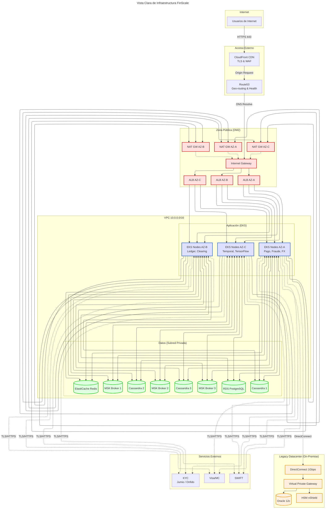
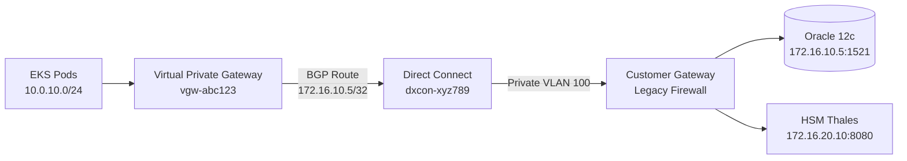

# Vista de Infraestructura de Red y Seguridad

> **Objetivo**: Documentar topología de red VPC, Security Groups, flujos de tráfico y controles de seguridad  
> **Audiencia**: DevOps, Security Engineers, Arquitectos de Infraestructura  
> **Compliance**: PCI-DSS v3.2.1, GDPR Article 32

---

## 🎯 Alcance del Diagrama

Este documento complementa [Despliegue.md](Despliegue.md) (que muestra deployment de aplicaciones) enfocándose en:
- **Topología de Red**: VPC, subnets, routing, gateways
- **Seguridad de Red**: Security Groups, NACLs, reglas de firewall
- **Conectividad Híbrida**: Direct Connect a datacenter Legacy (Oracle + HSM)
- **Segmentación de compliance**: PCI-DSS zones, DMZ, Data zones

**Driver de Arquitectura**: Compliance PCI-DSS (segregación de red), Disponibilidad 99.999% (Multi-AZ)

---

## 🌐 Topología VPC Multi-AZ

### Diagrama de Red Completo



---

## 🔐 Security Groups - Matriz de Reglas

### SG-ALB (Application Load Balancer)

**Purpose**: Exponerlayer frontal HTTP/HTTPS al público

| Direction | Protocol | Port | Source/Destination | Purpose |
|-----------|----------|------|-------------------|---------|
| **Ingress** | TCP | 443 | 0.0.0.0/0 | HTTPS from Internet (TLS 1.2+) |
| **Ingress** | TCP | 80 | 0.0.0.0/0 | HTTP (redirect to 443) |
| **Egress** | TCP | 8080 | SG-EKS-Nodes | Forward to EKS ingress controller |

**Compliance**: PCI-DSS Requirement 1.3.4 (restrict inbound traffic to necessary ports)

---

### SG-EKS-Nodes (Kubernetes Worker Nodes)

**Purpose**: Aislar pods de aplicación, permitir comunicación inter-pod y a databases

| Direction | Protocol | Port | Source/Destination | Purpose |
|-----------|----------|------|-------------------|---------|
| **Ingress** | TCP | 8080 | SG-ALB | Traffic from ALB |
| **Ingress** | TCP | 1025-65535 | SG-EKS-Nodes | Inter-pod communication (NodePort range) |
| **Ingress** | TCP | 443 | SG-EKS-Control-Plane | Kubelet API from control plane |
| **Egress** | TCP | 5432 | SG-RDS | PostgreSQL queries |
| **Egress** | TCP | 6379 | SG-Redis | Redis cache access |
| **Egress** | TCP | 9092 | SG-MSK | Kafka producers/consumers |
| **Egress** | TCP | 9042 | SG-Cassandra | Cassandra CQL queries |
| **Egress** | TCP | 443 | 0.0.0.0/0 | External APIs (SWIFT, Visa, KYC providers) |
| **Egress** | TCP | 1521 | 172.16.10.5/32 | Oracle Legacy (via Direct Connect) |
| **Egress** | TCP | 8080 | 172.16.20.10/32 | HSM (ISO 8583 over TCP) |

**Compliance**: PCI-DSS Requirement 1.2.1 (restrict connections to trusted networks)

---

### SG-RDS (PostgreSQL Databases)

**Purpose**: Proteger datos en reposo, acceso solo desde EKS

| Direction | Protocol | Port | Source/Destination | Purpose |
|-----------|----------|------|-------------------|---------|
| **Ingress** | TCP | 5432 | SG-EKS-Nodes | R2DBC connections from microservices |
| **Egress** | DENY ALL | - | - | No outbound traffic allowed |

**Encryption**: 
- At-rest: AWS KMS (AES-256)
- In-transit: TLS 1.2 mandatory (`sslmode=require`)

**Compliance**: PCI-DSS Requirement 2.2.2 (enable only necessary services)

---

### SG-MSK (Kafka Brokers)

**Purpose**: Segregar event streaming, acceso solo desde producers/consumers autorizados

| Direction | Protocol | Port | Source/Destination | Purpose |
|-----------|----------|------|-------------------|---------|
| **Ingress** | TCP | 9092 | SG-EKS-Nodes | Kafka clients (plaintext, internal) |
| **Ingress** | TCP | 9094 | SG-EKS-Nodes | Kafka clients (TLS, internal) |
| **Ingress** | TCP | 2181 | SG-EKS-Nodes | Zookeeper (deprecated in Kafka 3.x) |
| **Egress** | TCP | 9092 | SG-MSK | Inter-broker replication |

**Compliance**: PCI-DSS Requirement 4.1 (encrypt transmission of cardholder data)

---

### SG-Cassandra (Self-managed EC2)

**Purpose**: Proteger datos FX rates, acceso solo desde FX Service

| Direction | Protocol | Port | Source/Destination | Purpose |
|-----------|----------|------|-------------------|---------|
| **Ingress** | TCP | 9042 | SG-EKS-Nodes | CQL queries from FX Service |
| **Ingress** | TCP | 7000 | SG-Cassandra | Inter-node gossip protocol |
| **Ingress** | TCP | 7001 | SG-Cassandra | Inter-node TLS gossip |
| **Egress** | TCP | 7000-7001 | SG-Cassandra | Cluster replication |

**Encryption**: 
- Node-to-node: TLS 1.2 (mandatory)
- Client-to-node: TLS 1.2 (mandatory)

---

### SG-Redis (ElastiCache)

**Purpose**: Cache y session store, acceso solo desde servicios autorizados

| Direction | Protocol | Port | Source/Destination | Purpose |
|-----------|----------|------|-------------------|---------|
| **Ingress** | TCP | 6379 | SG-EKS-Nodes | Redis commands |
| **Egress** | DENY ALL | - | - | No outbound traffic |

**Encryption**: 
- At-rest: Enabled
- In-transit: TLS 1.2 (auth-token required)

**Compliance**: PCI-DSS Requirement 8.2.1 (strong authentication for session management)

---

## 🛡️ Network ACLs (NACLs)

### NACL-Public (Subnets públicas: ALB, NAT)

| Rule # | Type | Protocol | Port | Source | Action | Purpose |
|--------|------|----------|------|--------|--------|---------|
| 100 | Ingress | TCP | 443 | 0.0.0.0/0 | ALLOW | HTTPS from Internet |
| 110 | Ingress | TCP | 80 | 0.0.0.0/0 | ALLOW | HTTP (redirect) |
| 120 | Ingress | TCP | 1024-65535 | 0.0.0.0/0 | ALLOW | Return traffic (ephemeral ports) |
| * | Ingress | ALL | ALL | 0.0.0.0/0 | DENY | Deny all other inbound |
| 100 | Egress | TCP | 8080 | 10.0.10.0/24 | ALLOW | Forward to EKS |
| 110 | Egress | TCP | 443 | 0.0.0.0/0 | ALLOW | Outbound HTTPS (NAT) |
| 120 | Egress | TCP | 1024-65535 | 0.0.0.0/0 | ALLOW | Ephemeral ports |
| * | Egress | ALL | ALL | 0.0.0.0/0 | DENY | Deny all other outbound |

---

### NACL-Private-App (Subnets privadas: EKS)

| Rule # | Type | Protocol | Port | Source | Action | Purpose |
|--------|------|----------|------|--------|--------|---------|
| 100 | Ingress | TCP | 8080 | 10.0.1.0/24 | ALLOW | Traffic from ALB (AZ-A) |
| 110 | Ingress | TCP | 8080 | 10.0.2.0/24 | ALLOW | Traffic from ALB (AZ-B) |
| 120 | Ingress | TCP | 8080 | 10.0.3.0/24 | ALLOW | Traffic from ALB (AZ-C) |
| 130 | Ingress | TCP | 1024-65535 | 0.0.0.0/0 | ALLOW | Return traffic |
| * | Ingress | ALL | ALL | 0.0.0.0/0 | DENY | Deny all other |
| 100 | Egress | TCP | 5432 | 10.0.20.0/24 | ALLOW | To RDS |
| 110 | Egress | TCP | 6379 | 10.0.20.0/24 | ALLOW | To Redis |
| 120 | Egress | TCP | 9092 | 10.0.20.0/24 | ALLOW | To Kafka |
| 130 | Egress | TCP | 443 | 0.0.0.0/0 | ALLOW | External APIs |
| 140 | Egress | TCP | 1521 | 172.16.10.5/32 | ALLOW | To Oracle Legacy |
| * | Egress | ALL | ALL | 0.0.0.0/0 | DENY | Deny all other |

---

### NACL-Private-Data (Subnets privadas: Databases)

| Rule # | Type | Protocol | Port | Source | Action | Purpose |
|--------|------|----------|------|--------|--------|---------|
| 100 | Ingress | TCP | 5432 | 10.0.10.0/24 | ALLOW | From EKS (AZ-A) |
| 110 | Ingress | TCP | 5432 | 10.0.11.0/24 | ALLOW | From EKS (AZ-B) |
| 120 | Ingress | TCP | 5432 | 10.0.12.0/24 | ALLOW | From EKS (AZ-C) |
| 130 | Ingress | TCP | 9092 | 10.0.10.0/24 | ALLOW | Kafka from EKS |
| * | Ingress | ALL | ALL | 0.0.0.0/0 | DENY | Deny all other |
| 100 | Egress | TCP | 1024-65535 | 10.0.10.0/24 | ALLOW | Return to EKS |
| 110 | Egress | TCP | 9092 | 10.0.20.0/24 | ALLOW | Kafka inter-broker |
| * | Egress | ALL | ALL | 0.0.0.0/0 | DENY | Deny all other (no Internet) |

**Compliance**: PCI-DSS Requirement 1.3.6 (stateless filtering with NACLs as defense-in-depth)

---

## 🔗 Conectividad Híbrida (Legacy Datacenter)

### AWS Direct Connect Configuration

```yaml
Connection:
  Type: Dedicated Connection
  Bandwidth: 1 Gbps
  Location: Equinix DC2 (Ashburn, VA)
  VLAN: 100
  BGP ASN: 65000 (AWS) ↔ 65001 (Legacy)
  
Routing:
  AWS VPC: 10.0.0.0/16
  Legacy DC: 172.16.0.0/16
  
  Advertised Routes (AWS → Legacy):
    - 10.0.10.0/24 (EKS Subnet A)
    - 10.0.11.0/24 (EKS Subnet B)
    - 10.0.12.0/24 (EKS Subnet C)
  
  Received Routes (Legacy → AWS):
    - 172.16.10.5/32 (Oracle Database)
    - 172.16.20.10/32 (HSM Thales)
    
Encryption:
  IPsec Tunnel: AES-256-GCM
  Certificates: Mutual TLS (mTLS)
  Key Rotation: Every 90 days
  
SLA:
  Availability: 99.95%
  Latency: < 5ms (Ashburn ↔ DC)
  MTU: 1500 bytes (no jumbo frames)
```

### Virtual Private Gateway (VGW)



**Failover Strategy**:
- Primary: Direct Connect (1 Gbps dedicated)
- Secondary: VPN over Internet (500 Mbps, latency +50ms)
- Automatic failover: < 60 seconds (BGP convergence)

**Compliance**: PCI-DSS Requirement 4.1.1 (encrypt cardholder data over open networks)

---

## 🚨 Flujos de Tráfico Críticos

### Flujo 1: Payment Processing (Happy Path)

```
Usuario Mobile App
  ↓ HTTPS/TLS 1.3
CloudFront (Edge: São Paulo)
  ↓ HTTPS
Route 53 (latency-based routing)
  ↓ HTTPS
ALB (us-east-1a) [SG-ALB: allow 443 from 0.0.0.0/0]
  ↓ HTTP/8080
Kong API Gateway Pod (EKS) [SG-EKS: allow 8080 from SG-ALB]
  ↓ HTTP/8080
Payment Service Pod [SG-EKS]
  ↓ gRPC/TLS (Fraud ML)
TensorFlow Serving Pod [SG-EKS, GPU node]
  ↓ R2DBC/TLS (Ledger debit)
PostgreSQL RDS Primary [SG-RDS: allow 5432 from SG-EKS]
  ↓ Kafka Producer/TLS
MSK Kafka Broker [SG-MSK: allow 9094 from SG-EKS]
  ↓ Kafka Consumer
Clearing Service Pod [SG-EKS]
  ↓ HTTPS/TLS (SWIFT MT103)
SWIFT Network (External)
```

**Latency Budget**:
- CloudFront → ALB: 20ms (CDN cache hit)
- ALB → EKS: 5ms
- Payment Service logic: 50ms
- TensorFlow inference: 30ms
- PostgreSQL write: 10ms
- Kafka publish: 5ms
- **Total p99**: 150ms (target < 500ms)

---

### Flujo 2: CDC Synchronization (Strangler Fig Migration)

```
Oracle Legacy DB (172.16.10.5:1521)
  ↓ Oracle LogMiner (redo logs)
Debezium Connector Pod (EKS) [SG-EKS: allow 1521 to 172.16.10.5]
  ↓ Kafka Producer (legacy.FINSCALE.TRANSACTIONS)
MSK Kafka [SG-MSK]
  ↓ Kafka Consumer
CDC Adapter Service Pod [SG-EKS]
  ↓ R2DBC/TLS (transform & write)
PostgreSQL RDS [SG-RDS]
```

**Lag Target**: < 2 segundos (measured with Debezium metrics)

```promql
# Prometheus alert
debezium_metrics_milliseconds_behind_source{connector="legacy-oracle"} > 2000
```

---

### Flujo 3: HSM Cryptographic Operations (ISO 8583)

```
HSM Proxy StatefulSet Pod (EKS) [SG-EKS]
  ↓ TCP Persistent Connection (session affinity)
Direct Connect (1 Gbps)
  ↓ IPsec Encrypted Tunnel
Virtual Private Gateway
  ↓ TCP/8080
HSM Thales nShield (172.16.20.10)
  ↓ Crypto Response (PIN verification, key generation)
HSM Proxy Pod
  ↓ gRPC/TLS (return to caller)
Payment Service Pod
```

**Connection Pooling**:
- Max connections per HSM Proxy pod: 10 TCP sockets
- Connection lifetime: 1 hour (reuse to avoid handshake overhead)
- Failover: Secondary HSM (172.16.20.11) with DNS switch (30s)

**Compliance**: PCI-DSS Requirement 3.6.1 (generation of strong cryptographic keys)

---

## 🔍 Monitoreo de Red y Seguridad

### VPC Flow Logs

```yaml
Configuration:
  Destination: CloudWatch Logs
  Log Format: V5 (extended)
  Filter: ALL (accept + reject)
  Aggregation Interval: 1 minute
  
  Retention: 90 días
  
  Use Cases:
    - Detectar anomalías (port scanning)
    - Troubleshooting connectivity
    - Forensics post-incident
    - Compliance audit trail (PCI-DSS 10.2.5)

Sample Log Entry:
  version: 5
  account-id: 123456789012
  interface-id: eni-abc123def
  srcaddr: 10.0.10.45
  dstaddr: 10.0.20.10
  srcport: 52345
  dstport: 5432
  protocol: 6 (TCP)
  packets: 15
  bytes: 9600
  start: 1703174400
  end: 1703174460
  action: ACCEPT
  log-status: OK
```

### AWS GuardDuty (Threat Detection)

```yaml
Enabled Detections:
  - UnauthorizedAccess:EC2/SSHBruteForce
  - Backdoor:EC2/C&CActivity.B
  - CryptoCurrency:EC2/BitcoinTool.B
  - Recon:EC2/PortProbeUnprotectedPort
  - Trojan:EC2/DriveBySourceTraffic
  
Integration:
  EventBridge → Lambda → PagerDuty
  Severity: HIGH → Page on-call engineer
  Severity: MEDIUM → Slack alert
  Severity: LOW → Daily digest email
```

### AWS WAF (Web Application Firewall)

```yaml
Rules Applied to CloudFront:
  - AWS Managed Rules: Core Rule Set (CRS)
  - SQL Injection Protection
  - XSS Protection
  - Rate Limiting: 2000 req/5min per IP
  - Geo-blocking: Block countries not in whitelist (12 países operados)
  
Custom Rules:
  - Block known bad bot User-Agents
  - Require valid JWT token in Authorization header (API endpoints)
  - Block requests without TLS 1.2+
  
Logging:
  Destination: S3 bucket (waf-logs-finscale-prod)
  Sampling: 100% (all requests logged)
  Retention: 1 year (compliance)
```

---

## ✅ Validación de Compliance

### PCI-DSS Requirements Mapping

| Requirement | Control Implementation | Evidence |
|-------------|----------------------|----------|
| **1.2.1** Restrict connections to trusted networks | Security Groups deny-by-default | SG rules documented above |
| **1.3.4** Deny direct public access to cardholder data | RDS in private subnets, no IGW route | VPC topology diagram |
| **2.2.2** Enable only necessary services | Minimal Security Group rules | SG-RDS: only port 5432 from EKS |
| **4.1** Encrypt cardholder data over networks | TLS 1.2+ mandatory (RDS, Kafka, Redis) | SSL certificates + config files |
| **4.1.1** Encrypt over open networks (Direct Connect) | IPsec tunnel AES-256-GCM | DX VPN config |
| **8.2.1** Strong authentication mechanisms | Redis auth-token, RDS IAM auth | Secrets Manager rotation |
| **10.2.5** Use of identification mechanisms | VPC Flow Logs capture all access | CloudWatch Logs retention 90d |

### GDPR Article 32 (Security of Processing)

| Control | Implementation | Location |
|---------|----------------|----------|
| **Encryption at rest** | KMS AES-256 (RDS, EBS, S3) | [4.1-Arquitectura-Cloud.md](../04-Infraestructura-Resiliencia/4.1-Arquitectura-Cloud.md#2-amazon-rds-for-postgresql) |
| **Encryption in transit** | TLS 1.2+ all services | SG rules + application config |
| **Network segmentation** | VPC subnets + Security Groups | This document (VPC topology) |
| **Access controls** | IAM policies + RBAC (K8s) | Not in scope (IAM separate doc) |
| **Audit logging** | VPC Flow Logs + CloudTrail | CloudWatch retention 90 días |

---

## 📊 Métricas de Red

```yaml
SLIs (Service Level Indicators):
  Network Latency (p99):
    EKS → RDS: < 5ms
    EKS → MSK: < 10ms
    EKS → Oracle (DX): < 20ms
    Measurement: CloudWatch Container Insights
  
  Packet Loss:
    Target: < 0.01%
    Measurement: VPC Flow Logs analysis
  
  Direct Connect Availability:
    Target: 99.95%
    Measurement: AWS Health Dashboard
  
Dashboards:
  - Grafana: "Network Performance Dashboard"
  - CloudWatch: "VPC Flow Logs - Top Talkers"
  - GuardDuty: "Security Findings Dashboard"
```

---

**Fecha de Propuesta**: 24 de diciembre de 2025
