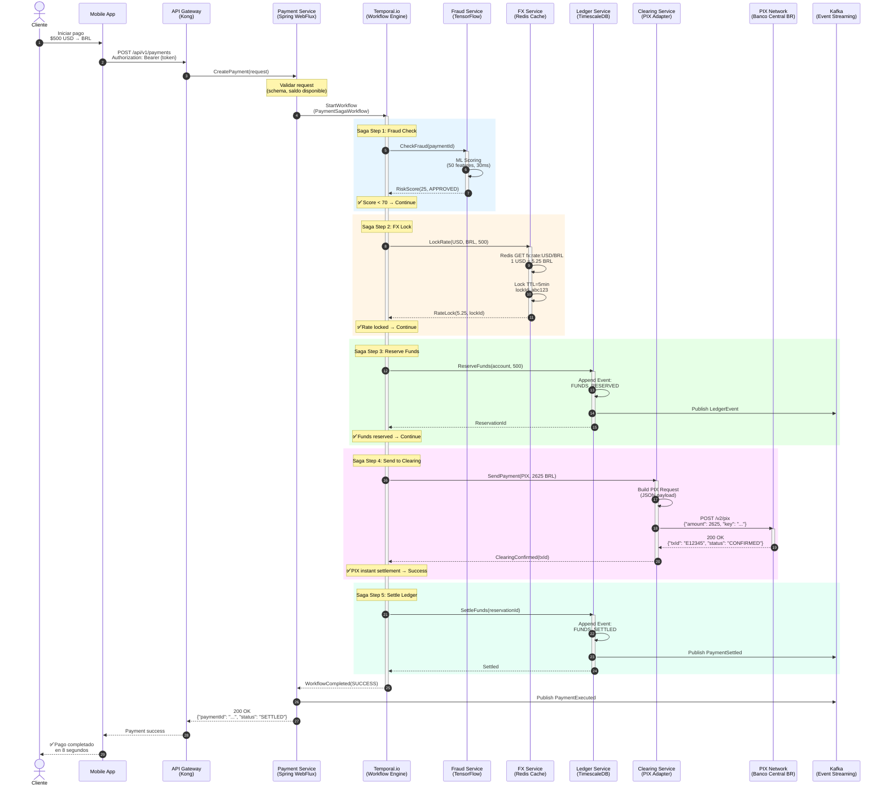
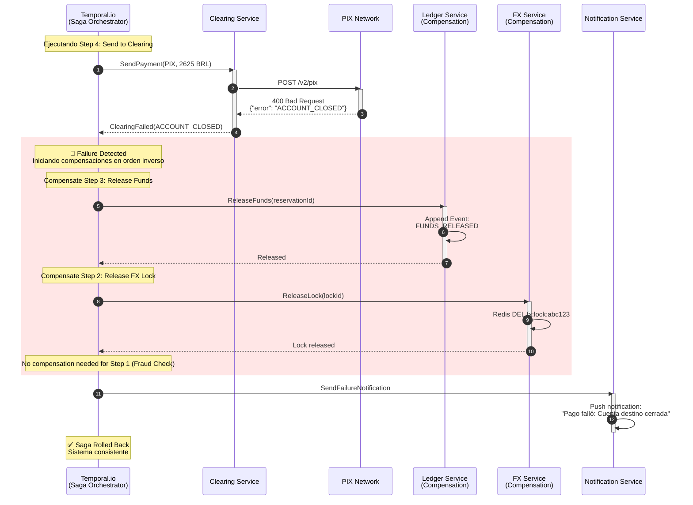
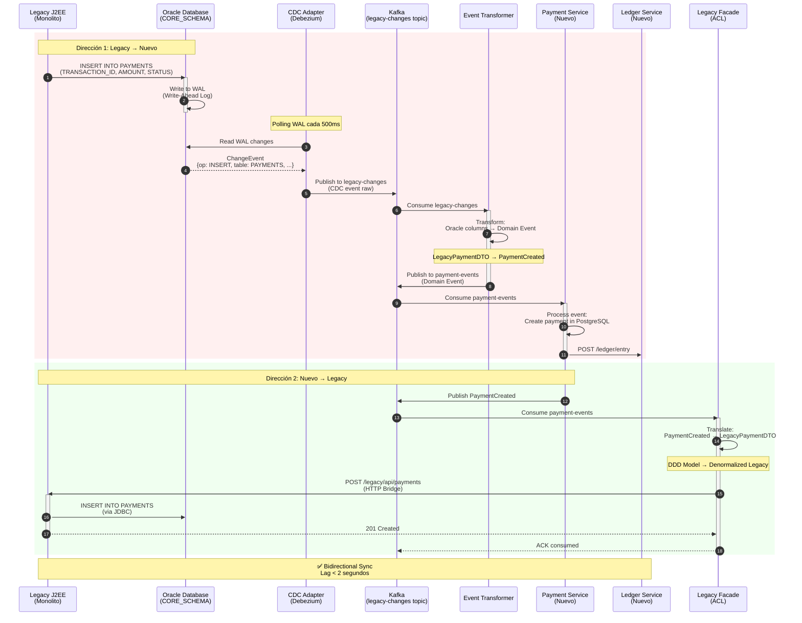
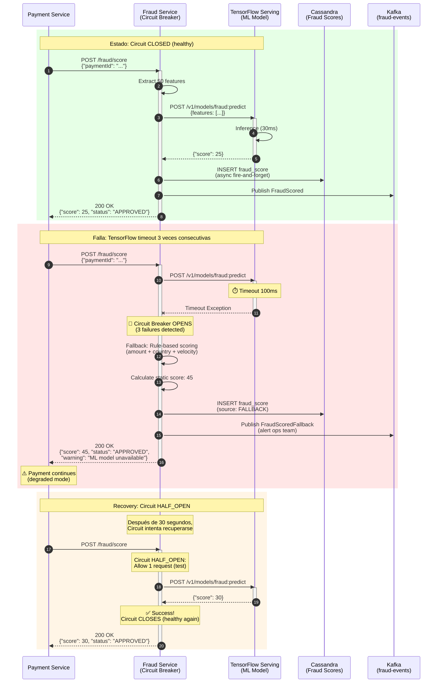
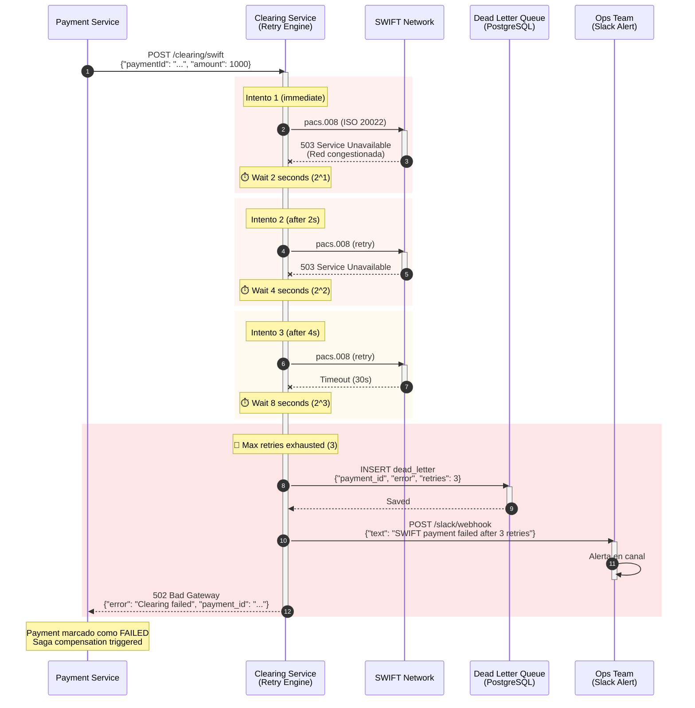
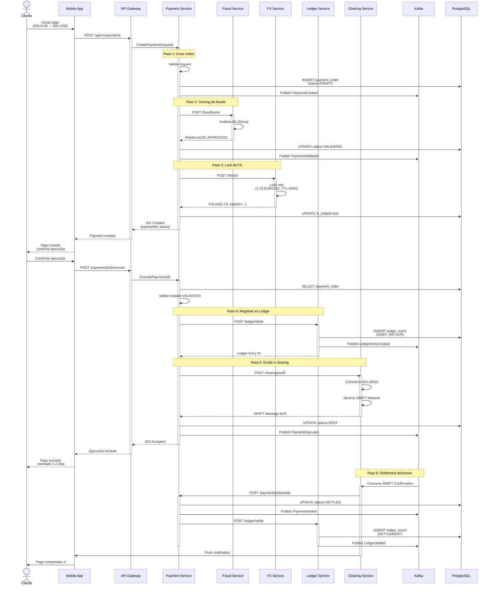
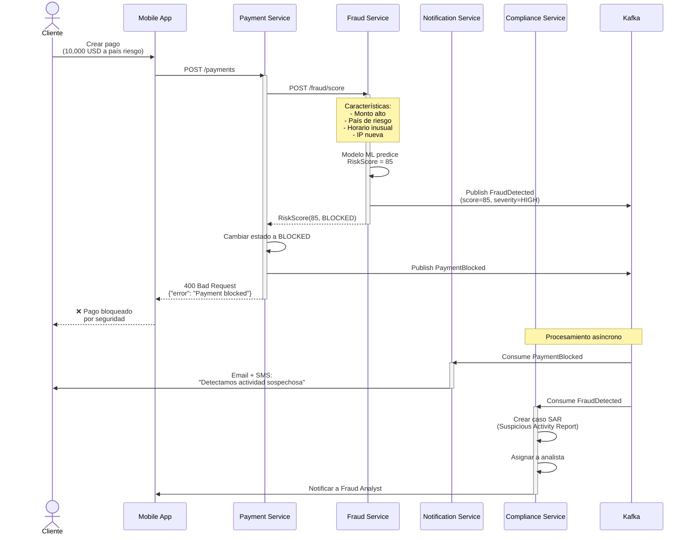
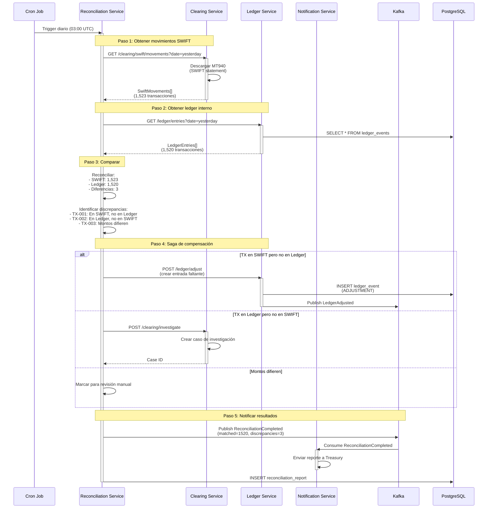

# UML - Diagramas de Integración (Sequence Diagrams)

> **Objetivo**: Documentar flujos críticos de interacción entre servicios, mostrando orquestación, compensaciones y sincronización Legacy↔Nuevo.  
> **Audiencia**: Desarrolladores, Arquitectos de Soluciones, Tech Leads

---

## 🎯 Contexto de Integración

Estos diagramas muestran cómo los servicios de FinScale Evolution interactúan para resolver procesos de negocio críticos, aplicando patrones de integración como:

- **Temporal.io Saga Pattern**: Orquestación de transacciones distribuidas con compensación automática
- **Event-Driven Architecture**: Comunicación asíncrona vía Kafka para desacoplamiento
- **Change Data Capture (CDC)**: Sincronización bidireccional Legacy↔Nuevo sin dual-writes
- **Circuit Breaker + Retry**: Resiliencia ante fallos de servicios externos

### Problemas del Sistema Actual Resueltos

| Problema Legacy | Solución en Nueva Arquitectura |
|-----------------|-------------------------------|
| **Rollback manual** tras fallos en clearing | Temporal Saga con compensaciones automáticas |
| **Dual-writes** para sincronizar Legacy | CDC Adapter captura Oracle WAL, publica a Kafka |
| **Cascading failures** cuando servicio cae | Circuit Breaker detiene llamadas a servicios fallidos |
| **Timeouts bloqueantes** en fraud check | Async scoring con default score si timeout |

---

## 📐 Flujo 1: Pago Internacional con Temporal Saga (Happy Path)

**Escenario**: Cliente envía $500 USD a beneficiario en Brasil. El pago requiere:
1. Scoring de fraude (< 100ms)
2. Cotización y bloqueo FX (USD→BRL)
3. Registro inmutable en Ledger
4. Envío a red PIX (instant settlement)

**Patrón Aplicado**: **Temporal.io Saga Pattern** con compensación automática si algún paso falla.



### Compensación Automática (Unhappy Path)

**Escenario**: PIX Network rechaza el pago (cuenta beneficiario cerrada).



**Código Temporal Workflow**:

```java
@WorkflowInterface
public interface PaymentSagaWorkflow {
    @WorkflowMethod
    PaymentResult executePayment(PaymentOrder order);
}

@ActivityInterface
public interface PaymentActivities {
    RiskScore checkFraud(String paymentId);
    RateLock lockFXRate(String from, String to, BigDecimal amount);
    void releaseFXLock(String lockId); // Compensation
    String reserveFunds(String accountId, BigDecimal amount);
    void releaseFunds(String reservationId); // Compensation
    String sendToClearing(ClearingRequest request);
    void settleFunds(String reservationId);
}

// Implementación del Workflow
public class PaymentSagaWorkflowImpl implements PaymentSagaWorkflow {
    
    private final PaymentActivities activities = Workflow.newActivityStub(
        PaymentActivities.class,
        ActivityOptions.newBuilder()
            .setStartToCloseTimeout(Duration.ofSeconds(10))
            .setRetryOptions(RetryOptions.newBuilder()
                .setMaximumAttempts(3)
                .build())
            .build()
    );
    
    @Override
    public PaymentResult executePayment(PaymentOrder order) {
        // Saga Variables
        String lockId = null;
        String reservationId = null;
        
        try {
            // Step 1: Fraud Check (no compensation needed)
            RiskScore score = activities.checkFraud(order.getPaymentId());
            if (score.getStatus() == RiskStatus.BLOCKED) {
                return PaymentResult.blocked(score);
            }
            
            // Step 2: FX Lock (compensable)
            RateLock rateLock = activities.lockFXRate(
                order.getOriginCurrency(),
                order.getDestinationCurrency(),
                order.getAmount()
            );
            lockId = rateLock.getLockId();
            
            // Step 3: Reserve Funds (compensable)
            reservationId = activities.reserveFunds(
                order.getOriginatorAccountId(),
                order.getAmount()
            );
            
            // Step 4: Send to Clearing (compensable)
            String clearingTxId = activities.sendToClearing(
                ClearingRequest.from(order, rateLock)
            );
            
            // Step 5: Settle Funds (final)
            activities.settleFunds(reservationId);
            
            return PaymentResult.success(clearingTxId);
            
        } catch (Exception e) {
            // Automatic Compensation in reverse order
            Workflow.getLogger(getClass()).error("Payment failed, compensating...", e);
            
            if (reservationId != null) {
                Saga.compensate(() -> activities.releaseFunds(reservationId));
            }
            
            if (lockId != null) {
                Saga.compensate(() -> activities.releaseFXLock(lockId));
            }
            
            return PaymentResult.failed(e.getMessage());
        }
    }
}
```

---

## 📐 Flujo 2: Sincronización Legacy↔Nuevo con CDC (Change Data Capture)

**Escenario**: Payment creado en nuevo sistema debe ser visible para sistema Legacy (reportes, CRM). Al mismo tiempo, pagos creados en Legacy deben propagarse al nuevo sistema.

**Patrón Aplicado**: **CDC Pattern** con Debezium capturando Oracle WAL, publicando a Kafka.



**Código Event Transformer**:

```java
@Service
public class LegacyEventTransformer {
    
    @KafkaListener(topics = "legacy-changes")
    public Mono<Void> handleLegacyChange(ConsumerRecord<String, ChangeEvent> record) {
        ChangeEvent change = record.value();
        
        return switch(change.getOperation()) {
            case INSERT, UPDATE -> {
                // Parse Oracle columns
                Map<String, Object> after = change.getAfter();
                
                // Transform to Domain Event
                PaymentCreated domainEvent = PaymentCreated.builder()
                    .paymentId(UUID.fromString((String) after.get("TRANSACTION_ID")))
                    .originatorAccountId((String) after.get("ORIG_ACCOUNT_NUM"))
                    .beneficiaryFullName((String) after.get("BENEF_FULL_NAME"))
                    .amountCents(((Number) after.get("AMOUNT_CENTS")).longValue())
                    .currencyCode((String) after.get("CURRENCY_CODE"))
                    .status(PaymentStatus.valueOf((String) after.get("STATUS")))
                    .occurredAt(Instant.ofEpochMilli(change.getTimestamp()))
                    .source(EventSource.LEGACY_CDC)
                    .build();
                
                // Publish to domain topic
                yield kafkaTemplate.send("payment-events", domainEvent).then();
            }
            
            case DELETE -> {
                String paymentId = (String) change.getBefore().get("TRANSACTION_ID");
                
                PaymentCancelled domainEvent = new PaymentCancelled(
                    UUID.fromString(paymentId),
                    Instant.now(),
                    EventSource.LEGACY_CDC
                );
                
                yield kafkaTemplate.send("payment-events", domainEvent).then();
            }
        };
    }
}
```

---

## 📐 Flujo 3: Detección de Fraude en Tiempo Real con Circuit Breaker

**Escenario**: Fraud Service usa modelo ML en TensorFlow Serving. Si TensorFlow cae o tarda > 100ms, usar scoring por reglas estático.

**Patrón Aplicado**: **Circuit Breaker Pattern** con fallback a reglas simples.



**Código Circuit Breaker**:

```java
@Service
public class FraudServiceClient {
    
    private final WebClient tensorflowClient;
    private final CircuitBreakerRegistry circuitBreakerRegistry;
    
    @CircuitBreaker(name = "tensorflowML", fallbackMethod = "fallbackScoring")
    @Timeout(value = 100, unit = TimeUnit.MILLISECONDS)
    public Mono<RiskScore> scorePayment(PaymentOrder payment) {
        return tensorflowClient.post()
            .uri("/v1/models/fraud:predict")
            .bodyValue(extractFeatures(payment))
            .retrieve()
            .bodyToMono(MLPrediction.class)
            .map(prediction -> new RiskScore(
                (int) (prediction.getScore() * 100),
                prediction.getScore() > 0.7 ? RiskStatus.BLOCKED : RiskStatus.APPROVED,
                ScoringSource.ML_MODEL
            ));
    }
    
    // Fallback: Scoring por reglas estáticas
    public Mono<RiskScore> fallbackScoring(PaymentOrder payment, Throwable t) {
        log.warn("TensorFlow unavailable, using rule-based scoring", t);
        
        int score = 0;
        
        // Regla 1: Monto alto
        if (payment.getAmount().getValue().compareTo(new BigDecimal("5000")) > 0) {
            score += 30;
        }
        
        // Regla 2: País de riesgo
        if (isHighRiskCountry(payment.getBeneficiary().getCountry())) {
            score += 40;
        }
        
        // Regla 3: Horario inusual (2 AM - 5 AM)
        LocalTime now = LocalTime.now();
        if (now.isAfter(LocalTime.of(2, 0)) && now.isBefore(LocalTime.of(5, 0))) {
            score += 20;
        }
        
        return Mono.just(new RiskScore(
            score,
            score >= 70 ? RiskStatus.BLOCKED : RiskStatus.APPROVED,
            ScoringSource.FALLBACK_RULES
        ));
    }
}
```

**Configuración Resilience4j**:

```yaml
resilience4j:
  circuitbreaker:
    instances:
      tensorflowML:
        registerHealthIndicator: true
        slidingWindowSize: 10
        minimumNumberOfCalls: 5
        permittedNumberOfCallsInHalfOpenState: 3
        automaticTransitionFromOpenToHalfOpenEnabled: true
        waitDurationInOpenState: 30s
        failureRateThreshold: 50
        eventConsumerBufferSize: 10
```

---

## 📐 Flujo 4: Clearing Multi-Red con Retry Exponential Backoff

**Escenario**: Clearing Service envía pago a SWIFT. Red SWIFT temporalmente congestionada. Implementar reintentos inteligentes.



**Código Retry Engine**:

```java
@Service
public class ClearingRetryEngine {
    
    private final SWIFTAdapter swiftAdapter;
    private final DeadLetterQueueRepository dlqRepository;
    
    @Retryable(
        value = {ClearingNetworkException.class, TimeoutException.class},
        maxAttempts = 3,
        backoff = @Backoff(delay = 2000, multiplier = 2, maxDelay = 10000)
    )
    public Mono<ClearingResponse> sendWithRetry(PaymentInstruction instruction) {
        return swiftAdapter.send(instruction)
            .doOnError(error -> 
                log.warn("Clearing attempt failed for paymentId={}, will retry",
                    instruction.getPaymentId(), error)
            )
            .timeout(Duration.ofSeconds(30));
    }
    
    @Recover
    public Mono<ClearingResponse> recoverFromFailure(
        Exception ex,
        PaymentInstruction instruction
    ) {
        log.error("All retry attempts exhausted for paymentId={}",
            instruction.getPaymentId(), ex);
        
        // Save to Dead Letter Queue
        DeadLetterMessage dlm = DeadLetterMessage.builder()
            .paymentId(instruction.getPaymentId())
            .serviceName("SWIFT")
            .errorMessage(ex.getMessage())
            .payload(instruction)
            .retriesExhausted(3)
            .createdAt(Instant.now())
            .build();
        
        return dlqRepository.save(dlm)
            .then(Mono.error(new ClearingFailedException(
                "Clearing failed after 3 retries: " + ex.getMessage()
            )));
    }
}
```

---

## 🎯 Resumen de Patrones de Integración Aplicados

| Patrón | Servicios | Problema Resuelto | Beneficio |
|--------|-----------|-------------------|-----------|
| **Saga Pattern (Temporal.io)** | Payment → Fraud → FX → Ledger → Clearing | Transacciones distribuidas sin 2PC | Rollback automático, observabilidad total |
| **Change Data Capture (CDC)** | Legacy Oracle ↔ Kafka ↔ New Services | Sincronización bidireccional sin dual-writes | Zero-downtime migration, lag < 2s |
| **Circuit Breaker** | Fraud Service ↔ TensorFlow | Cascading failures cuando ML cae | Degradación controlada con fallback |
| **Exponential Backoff** | Clearing ↔ SWIFT/PIX | Red externa temporalmente congestionada | Reduce carga en red, evita thundering herd |
| **Dead Letter Queue** | Clearing failed payments | Pérdida de transacciones tras fallos | Intervención manual, audit trail |
| **Event-Driven** | Todos los servicios vía Kafka | Acoplamiento temporal | Desacoplamiento, eventual consistency |
| **Request-Reply** | Payment → Fraud (sync) | Necesidad de respuesta inmediata | Latencia baja, decisión bloqueante |
| **Fire-and-Forget** | Fraud → Cassandra (async) | Writes no deben bloquear payment path | Throughput 50K writes/s |

---

## 📊 Métricas de Integración (SLAs)

| Integración | Latencia Target | Timeout | Retry Strategy | Fallback |
|-------------|----------------|---------|----------------|----------|
| **Payment → Fraud** | p95 < 50ms | 100ms | 3x exponential | Rule-based score |
| **Payment → FX** | p95 < 200ms | 5s | 2x linear | Cached rate (stale < 1min) |
| **Payment → Ledger** | p95 < 100ms | 10s | No retry | Saga compensation |
| **Clearing → SWIFT** | p95 < 5s | 30s | 3x exponential (2s, 4s, 8s) | Dead Letter Queue |
| **Clearing → PIX** | p95 < 2s | 15s | 3x exponential | Dead Letter Queue |
| **CDC Adapter → Kafka** | lag < 2s | N/A | N/A | Alert if lag > 10s |

---

**Fecha de Propuesta**: 24 de diciembre de 2025  
**Referencias**: [C3-Componentes.md](../3.1-C4-Model/C3-Componentes.md), [Despliegue.md](Despliegue.md)

```

### Especificación Técnica

| Paso | Servicio | Operación | Timeout | Retry | Efecto |
|------|----------|-----------|---------|-------|--------|
| 1 | Payment | Crear orden | 100ms | No | Idempotente (UUID) |
| 2 | Fraud | Scoring | 50ms | Sí (3x) | Circuit Breaker |
| 3 | FX | Lock rate | 200ms | Sí (2x) | TTL 5 min |
| 4 | Ledger | Registro | 100ms | No | Event Sourced |
| 5 | Clearing | SWIFT send | 5s | Sí (5x exp backoff) | Async confirmación |
| 6 | Ledger | Settlement | 100ms | No | Eventual consistency |

**Garantías**:
- **Atomicidad**: Saga Pattern (compensación si falla paso 5)
- **Idempotencia**: UUID en headers (`Idempotency-Key`)
- **Orden**: Kafka partitions por `originatorId`

---

## 🚨 Flujo 2: Detección de Fraude con Bloqueo

### Diagrama de Secuencia



### Lógica de Scoring

```java
// En Fraud Service
public class FraudScoringModel {
    
    public RiskScore score(PaymentOrder payment) {
        int score = 0;
        
        // Regla 1: Monto
        if (payment.getAmount().getValue() > 5000) {
            score += 20;
        }
        
        // Regla 2: País de destino
        if (isHighRiskCountry(payment.getBeneficiary().getCountry())) {
            score += 30;
        }
        
        // Regla 3: Velocidad (10+ pagos en 1 hora)
        long recentPayments = paymentRepository
            .countByOriginatorInLastHour(payment.getOriginatorId());
        if (recentPayments >= 10) {
            score += 25;
        }
        
        // Regla 4: Modelo ML (TensorFlow)
        double mlScore = mlModel.predict(extractFeatures(payment));
        score += (int) (mlScore * 25);
        
        return new RiskScore(
            score, 
            score >= 70 ? RiskStatus.BLOCKED : RiskStatus.APPROVED
        );
    }
}
```

---

## 🔄 Flujo 3: Reconciliación Nocturna con Saga

### Diagrama de Secuencia



### Saga Pattern

```java
@Service
public class ReconciliationSaga {
    
    public ReconciliationResult execute(LocalDate date) {
        // 1. Iniciar saga
        SagaContext context = new SagaContext();
        
        try {
            // Step 1: Obtener movimientos
            List<SwiftMovement> swiftData = clearingService.getMovements(date);
            context.recordStep("SWIFT_FETCH", swiftData);
            
            List<LedgerEntry> ledgerData = ledgerService.getEntries(date);
            context.recordStep("LEDGER_FETCH", ledgerData);
            
            // Step 2: Reconciliar
            ReconciliationReport report = reconcile(swiftData, ledgerData);
            context.recordStep("RECONCILE", report);
            
            // Step 3: Ajustar discrepancias
            for (Discrepancy disc : report.getDiscrepancies()) {
                adjustDiscrepancy(disc, context);
            }
            
            // Success
            return ReconciliationResult.success(report);
            
        } catch (Exception e) {
            // Compensación: Rollback de ajustes
            compensate(context);
            return ReconciliationResult.failure(e);
        }
    }
    
    private void compensate(SagaContext context) {
        // Revertir en orden inverso
        context.getCompletedSteps().reversed().forEach(step -> {
            switch (step.getName()) {
                case "LEDGER_ADJUST":
                    ledgerService.revertAdjustment(step.getData());
                    break;
                case "CLEARING_UPDATE":
                    clearingService.revertUpdate(step.getData());
                    break;
            }
        });
    }
}
```

---

## 🎯 Patrones de Integración Aplicados

| Patrón | Uso | Beneficio |
|--------|-----|-----------|
| **Request-Reply** | Payment → Fraud | Sincrónico, bajo latencia |
| **Fire-and-Forget** | Payment → Kafka | Desacoplamiento |
| **Saga** | Reconciliación | Consistencia distribuida |
| **Circuit Breaker** | Fraud, FX | Resiliencia ante fallos |
| **Idempotency** | Todos los POSTs | Reintentos seguros |
| **Event Sourcing** | Ledger | Auditoría completa |

---

**Próximo Paso**: → `../3.3-Patrones-Tacticas.md`

---

**Última actualización**: 7 de diciembre de 2025
