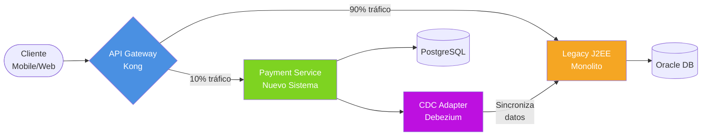
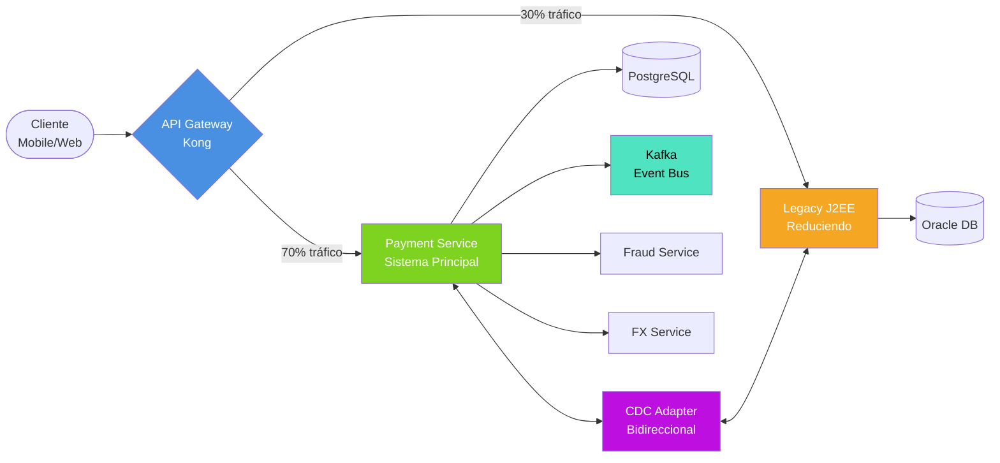
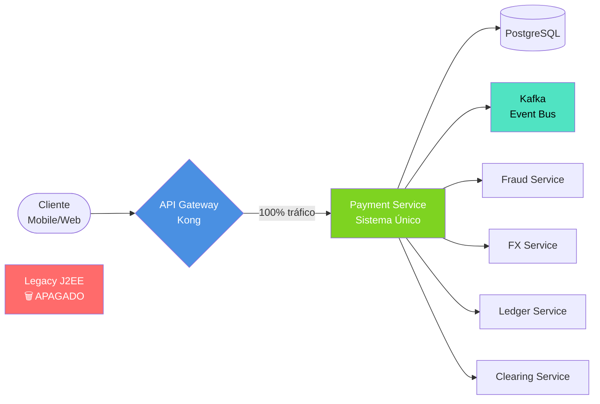
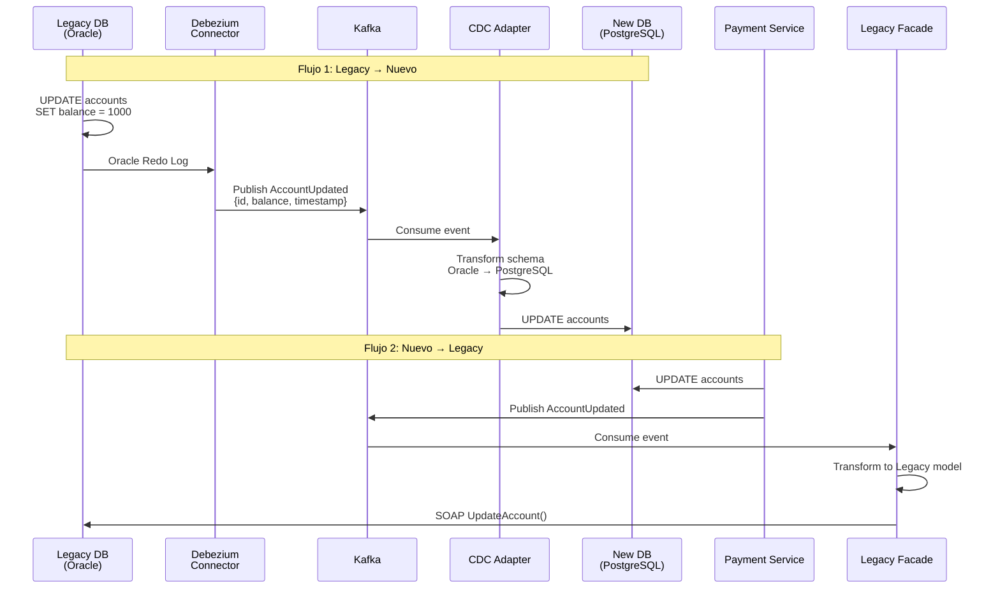
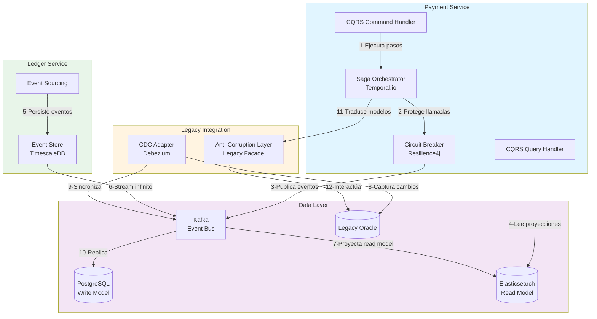

# Patrones y Tácticas de Arquitectura

> **Objetivo**: Justificar decisiones de patrones con base en drivers  
> **Metodología**: WhyDD - vincular **WHY** (driver) → **WHAT** (patrón) → **HOW** (implementación)

---

## 🎯 Estilos Arquitectónicos Seleccionados

### 1. Microservicios

**WHY** (Drivers relacionados):
- **Desafío de Negocio**: El sistema actual es un monolito J2EE con una clase TransactionManager.java de 15,000 líneas que acopla múltiples responsabilidades (Pagos, Fraude, Clientes, Notificaciones), generando un Time-to-Market de 4 meses y limitando la capacidad de innovación
- **Escalabilidad Diferenciada**: Necesidad de escalar servicios de forma independiente según demanda (Payment Service requiere 12 réplicas vs. FX Service solo 3)
- **Agilidad Organizacional**: Habilitar equipos autónomos que desplieguen sin coordinación central → reducir Time-to-Market a 2 semanas
- **Modernización sin Interrupción**: Migrar incrementalmente desde arquitectura monolítica sin detener operación 24/7

**WHAT** (Características):
- **10 servicios core**: Payment, Ledger, Fraud, FX, Clearing, Reconciliation, Legacy Facade, HSM Proxy, CDC Adapter, Temporal
- **Database per Service**: PostgreSQL (Payment, Fraud), TimescaleDB (Ledger), Cassandra (FX), Redis (Cache)
- **Comunicación híbrida**: REST sync + Kafka async + gRPC para HSM

**HOW** (Implementación):
```yaml
Governance:
  - API Gateway centralizado (Kong)
  - Service Mesh (Istio) para observabilidad
  - Contratos con OpenAPI 3.0
  
Deployment:
  - Kubernetes con Helm charts
  - CI/CD independiente por servicio
  - Feature flags para releases graduales
```

**Trade-offs**:
- ✅ Ventajas: Escalabilidad granular, resiliencia por aislamiento
- ❌ Desventajas: Complejidad operacional, consistencia eventual

---

### 2. Event-Driven Architecture (EDA)

**WHY**:
- **Resiliencia**: Desacoplamiento temporal (servicios pueden estar caídos)
- **Disponibilidad**: Procesamiento asíncrono de picos de carga
- **Compliance**: Auditoría completa vía eventos inmutables

**WHAT**:
- Apache Kafka como event bus
- Event Sourcing en Ledger Service
- CQRS en Payment y Fraud Services

**HOW**:
```java
// Publicación de eventos
@Component
public class PaymentEventPublisher {
    
    private final ReactiveKafkaProducerTemplate<String, DomainEvent> kafka;
    
    public Mono<Void> publishPaymentExecuted(PaymentOrder payment) {
        var event = new PaymentExecuted(
            payment.getId(),
            payment.getAmount(),
            payment.getBeneficiary(),
            Instant.now()
        );
        
        return kafka.send("payment-events", payment.getId(), event)
            .then();
    }
}

// Consumo con garantía de orden
@KafkaListener(topics = "payment-events", groupId = "ledger-group")
public void handlePaymentExecuted(PaymentExecuted event) {
    // Kafka garantiza orden por partición (clave = paymentId)
    ledgerService.createEntry(event);
}
```

**Trade-offs**:
- ✅ Ventajas: Alta disponibilidad, escalabilidad horizontal
- ❌ Desventajas: Eventual consistency, debugging complejo

---

## 🏗️ Patrones Tácticos Seleccionados

### Patrón 1: Strangler Fig (Migración Legacy)

**WHY** (Contexto del Sistema Legacy):
- **Disponibilidad Crítica**: Sistema monolítico J2EE + Oracle que procesa 8.5M transacciones/mes en operación continua 24/7, sin ventanas de mantenimiento disponibles
- **Mitigación de Riesgo**: Las migraciones tipo "Big Bang" tienen alta tasa de fallo según industria, poniendo en riesgo la continuidad operacional del negocio
- **Cumplimiento Regulatorio**: Marco normativo financiero prohíbe pérdida de transacciones durante procesos de modernización (PCI-DSS, GDPR)

**WHAT**:
- Patrón de Martin Fowler para migración incremental
- Nueva funcionalidad → Sistema Nuevo
- Funcionalidad Legacy → Redirigir progresivamente
- Legacy "estrangulado" hasta desconexión final

**HOW** (3 Fases):

#### Fase 1: Coexistencia (10% tráfico nuevo)



**Timeline**: Mes 1-3  
**Objetivo**: Validar CDC bidireccional sin errores  
**Rollback**: Cambiar configuración de Gateway a 0% tráfico nuevo

---

#### Fase 2: Migración Activa (70% tráfico nuevo)



**Timeline**: Mes 4-9  
**Objetivo**: Latencia p99 < 200ms, 0 discrepancias en reconciliación  
**Riesgo**: Mayor carga en CDC, monitoreo intensivo

---

#### Fase 3: Desmantelamiento (100% tráfico nuevo)



**Timeline**: Mes 10-12  
**Objetivo**: Apagar infraestructura Legacy completa  
**Validación**: 30 días de operación estable antes de desconectar Oracle

```yaml
# Configuración de API Gateway (Kong)
services:
  - name: payment-service
    url: http://payment-service:8080
    routes:
      - name: payment-route
        paths:
          - /api/v1/payments
        plugins:
          - name: traffic-split
            config:
              # Fase 1: 10% nuevo, 90% legacy
              splits:
                - weight: 10
                  upstream_url: http://payment-service:8080
                - weight: 90
                  upstream_url: http://legacy-j2ee:7001
```

**Validación Medible**:
- Fase 1 (Mes 1-3): 10% tráfico → 0 errores de sincronización CDC
- Fase 2 (Mes 4-9): 70% tráfico → Latencia p99 < 200ms
- Fase 3 (Mes 10-12): 100% tráfico → Apagar Legacy

**Trade-offs**:
- ✅ Migración sin downtime
- ✅ Rollback instantáneo (cambiar % en Gateway)
- ❌ Complejidad temporal (CDC bidireccional)
- ❌ Datos duplicados durante migración

---

### Patrón 2: Anti-Corruption Layer (ACL)

**WHY** (Problemática del Sistema Actual):
- **Deuda Técnica de Modelos**: Sistema Legacy utiliza entidades anémicas (Account.java con 200+ campos) que violan principios de cohesión, mientras que la arquitectura propuesta implementa Domain-Driven Design con bounded contexts especializados
- **Preservación de Calidad Arquitectónica**: Prevenir que patrones anti-patrón del sistema Legacy contaminen la nueva arquitectura cloud-native

**WHAT**:
- Servicio traductor: **Legacy Facade**
- Traduce entre modelo Legacy (anémico) y modelo Nuevo (DDD rich domain)
- Único punto de contacto Legacy↔Nuevo

**HOW**:

```java
// Legacy Facade como ACL
@Service
public class LegacyFacade {
    
    private final LegacySystemClient legacyClient;  // SOAP/XML
    
    // Traducir del mundo Legacy al mundo Nuevo
    public PaymentOrder fromLegacy(LegacyTransaction legacyTx) {
        return PaymentOrder.builder()
            .id(PaymentOrderId.of(legacyTx.getTxId()))
            .amount(Money.of(
                legacyTx.getAmount(),
                Currency.valueOf(legacyTx.getCurrencyCode())
            ))
            .originator(AccountId.of(legacyTx.getDebitAccount()))
            .beneficiary(AccountId.of(legacyTx.getCreditAccount()))
            .status(mapStatus(legacyTx.getStatus()))  // "P" → PENDING
            .build();
    }
    
    // Traducir del mundo Nuevo al mundo Legacy
    public LegacyTransaction toLegacy(PaymentOrder payment) {
        LegacyTransaction tx = new LegacyTransaction();
        tx.setTxId(payment.getId().getValue());
        tx.setAmount(payment.getAmount().getValue());
        tx.setCurrencyCode(payment.getAmount().getCurrency().name());
        tx.setDebitAccount(payment.getOriginator().getValue());
        tx.setCreditAccount(payment.getBeneficiary().getValue());
        tx.setStatus(mapStatusToLegacy(payment.getStatus()));  // PENDING → "P"
        tx.setCreatedDate(Date.from(payment.getCreatedAt()));  // Instant → Date
        return tx;
    }
    
    private PaymentStatus mapStatus(String legacyStatus) {
        return switch(legacyStatus) {
            case "P" -> PaymentStatus.PENDING;
            case "A" -> PaymentStatus.APPROVED;
            case "R" -> PaymentStatus.REJECTED;
            case "S" -> PaymentStatus.SETTLED;
            default -> throw new IllegalStateException("Unknown status: " + legacyStatus);
        };
    }
}
```

**Beneficios Medibles**:
- **Aislamiento**: 0% de clases Legacy importadas en servicios nuevos
- **Testabilidad**: Mock Legacy Facade → tests sin base Legacy
- **Time-to-Market**: Nuevos features no requieren entender Legacy

---

### Patrón 3: CDC (Change Data Capture)

**WHY** (Desafío de Sincronización):
- **Consistencia Durante Coexistencia**: Durante la fase de migración incremental (Strangler Fig), ambos sistemas (Legacy y Nuevo) deben mantener consistencia de datos en tiempo real para garantizar experiencia de usuario uniforme
- **Integridad Transaccional**: El patrón dual-write (escritura simultánea en 2 sistemas) introduce riesgos de inconsistencia ante fallos parciales, violando garantías ACID requeridas por el negocio

**WHAT**:
- **Debezium** captura cambios en Oracle (Legacy) → publica a Kafka
- **CDC Adapter** escucha Kafka → actualiza PostgreSQL (Nuevo)
- **Legacy Facade** publica cambios del Nuevo → Legacy recibe vía Kafka

**HOW**:



```yaml
# Debezium Connector para Oracle
apiVersion: kafka.strimzi.io/v1beta2
kind: KafkaConnector
metadata:
  name: legacy-oracle-connector
spec:
  class: io.debezium.connector.oracle.OracleConnector
  tasksMax: 3
  config:
    database.hostname: legacy-oracle.internal
    database.port: 1521
    database.user: debezium
    database.dbname: FINSCALE
    database.server.name: legacy
    table.include.list: FINSCALE.ACCOUNTS,FINSCALE.TRANSACTIONS
    database.history.kafka.bootstrap.servers: kafka:9092
    database.history.kafka.topic: schema-changes.legacy
    # Capturar usando Oracle LogMiner
    log.mining.strategy: online_catalog
    log.mining.continuous.mine: true
```

**Validación Medible**:
- **Latencia de sincronización**: < 2 segundos (p99)
- **Consistency**: 0 discrepancias detectadas en reconciliación diaria
- **Throughput**: 1000 eventos/segundo

---

### Patrón 4: CQRS (Command Query Responsibility Segregation)

**WHY**:
- **Escalabilidad**: Queries (90% del tráfico) escalan independiente de Commands
- **Performance**: Read models optimizados (Elasticsearch)

**WHAT**:
- Comandos → PostgreSQL (escritura)
- Queries → Elasticsearch (lectura)
- Sincronización vía Kafka

**HOW**:

```java
// Command Side (Payment Service)
@PostMapping("/api/v1/payments")
public Mono<PaymentResponse> createPayment(@RequestBody CreatePaymentCmd cmd) {
    return commandHandler.handle(cmd)  // Escribe en PostgreSQL
        .doOnNext(payment -> 
            eventPublisher.publish(new PaymentCreated(payment))
        );
}

// Query Side (Search Service)
@KafkaListener(topics = "payment-events")
public void updateReadModel(PaymentCreated event) {
    // Proyectar a Elasticsearch
    PaymentDocument doc = PaymentDocument.from(event);
    elasticsearchRepository.save(doc);
}

@GetMapping("/api/v1/payments/search")
public Flux<PaymentDocument> search(@RequestParam String query) {
    return elasticsearchRepository.search(query);  // Lee de Elasticsearch
}
```

**Métricas de Validación**:
- Write latency (PostgreSQL): p99 < 100ms
- Read latency (Elasticsearch): p99 < 50ms
- Eventual consistency lag: < 1 segundo

---

### Patrón 2: Event Sourcing

**WHY**:
- **Compliance**: Regulación exige auditoría completa e inmutable
- **Debugging**: Reproducir estado histórico de cualquier cuenta

**WHAT**:
- Ledger Service almacena **eventos** en lugar de estado actual
- Estado se reconstruye reproduciendo eventos

**HOW**:

```java
// Aggregate con Event Sourcing
public class Account {
    private AccountId id;
    private Money balance;
    private List<LedgerEvent> uncommittedEvents = new ArrayList<>();
    
    // Aplicar comando
    public void debit(Money amount) {
        // Validar invariante
        if (balance.isLessThan(amount)) {
            throw new InsufficientFundsException();
        }
        
        // Generar evento
        var event = new FundsDebited(id, amount, Instant.now());
        apply(event);
        uncommittedEvents.add(event);
    }
    
    // Aplicar evento (idempotente)
    private void apply(FundsDebited event) {
        this.balance = this.balance.subtract(event.getAmount());
    }
    
    // Reconstruir desde eventos
    public static Account fromHistory(List<LedgerEvent> events) {
        Account account = new Account();
        events.forEach(account::apply);
        return account;
    }
}

// Repository con Event Store
@Repository
public class EventSourcedAccountRepository {
    
    public Mono<Void> save(Account account) {
        return Flux.fromIterable(account.getUncommittedEvents())
            .flatMap(event -> kafkaTemplate.send("ledger-events", event))
            .then();
    }
    
    public Mono<Account> findById(AccountId id) {
        return kafkaTemplate
            .receive("ledger-events")  // Leer desde Kafka compactado
            .filter(record -> record.getKey().equals(id))
            .collectList()
            .map(Account::fromHistory);
    }
}
```

**Beneficios Medibles**:
- 100% de auditoría (vs. 70% con audit tables)
- Time-travel queries (reconstruir saldo a cualquier fecha)
- Debugging: Reproducir bug con eventos históricos

---

### Patrón 5: Saga Pattern con Temporal.io (Orquestación)

**WHY** (Drivers de Arquitectura):
- **Orquestación de Flujos Complejos**: Un pago internacional involucra coordinación de 5 servicios especializados (Fraud Detection, FX Locking, Ledger, Clearing Network, Notification), requiriendo gestión centralizada del flujo
- **Eliminación de Bloqueos Distribuidos**: Sistema actual utiliza XA transactions (2PC) que bloquean recursos hasta 30 segundos, creando cuellos de botella en horas pico
- **Recuperación Automática ante Fallos**: Si red de clearing (SWIFT/PIX) rechaza transacción, el sistema debe revertir débitos automáticamente sin intervención manual (actualmente es proceso manual de 6 horas)

**WHAT**:
- **Temporal.io** como orquestador durable (sobrevive a crashes)
- Workflow = estado + lógica de compensación
- Activities = llamadas a servicios externos

**HOW** (según implementación en Integracion.md):

```java
// Temporal Workflow
@WorkflowInterface
public interface PaymentWorkflow {
    @WorkflowMethod
    PaymentResult executePayment(PaymentOrder order);
}

@WorkflowImpl
public class PaymentWorkflowImpl implements PaymentWorkflow {
    
    private final FraudActivity fraudActivity = Workflow.newActivityStub(
        FraudActivity.class,
        ActivityOptions.newBuilder()
            .setStartToCloseTimeout(Duration.ofSeconds(5))
            .setRetryOptions(RetryOptions.newBuilder()
                .setMaximumAttempts(3)
                .build())
            .build()
    );
    
    @Override
    public PaymentResult executePayment(PaymentOrder order) {
        // Saga compensable
        Saga saga = new Saga(new Saga.Options.Builder()
            .setParallelCompensation(false)  // Compensar en orden inverso
            .build());
        
        try {
            // Paso 1: Validar fraude
            RiskScore riskScore = saga.addCompensation(
                () -> fraudActivity.score(order),
                () -> fraudActivity.releaseScore(order)  // Compensación
            );
            
            if (riskScore.isBlocked()) {
                throw new FraudBlockedException(riskScore);
            }
            
            // Paso 2: Lock FX rate
            FXLock fxLock = saga.addCompensation(
                () -> fxActivity.lockRate(order),
                () -> fxActivity.releaseRate(fxLock)  // Compensación
            );
            
            // Paso 3: Debitar cuenta
            LedgerEntry debit = saga.addCompensation(
                () -> ledgerActivity.debit(order),
                () -> ledgerActivity.credit(order)  // REVERSAL
            );
            
            // Paso 4: Enviar a clearing
            ClearingResult clearing = saga.addCompensation(
                () -> clearingActivity.send(order, fxLock),
                () -> clearingActivity.cancel(clearing)  // Compensación
            );
            
            return PaymentResult.success(clearing);
            
        } catch (Exception e) {
            // Temporal ejecuta compensaciones automáticamente
            saga.compensate();
            return PaymentResult.failed(e);
        }
    }
}

@Service
public class PaymentOrchestrator {
    
    public Mono<PaymentResult> executePayment(PaymentOrder payment) {
        return Mono.just(payment)
            // Paso 1: Validar fraude
            .flatMap(p -> fraudService.validate(p)
                .doOnError(e -> compensateFraud(p))
            )
            // Paso 2: Lock FX
            .flatMap(p -> fxService.lockRate(p)
                .doOnError(e -> compensateFX(p))
            )
            // Paso 3: Debitar cuenta
            .flatMap(p -> ledgerService.debit(p)
                .doOnError(e -> compensateLedger(p))
            )
            // Paso 4: Enviar a clearing
            .flatMap(p -> clearingService.send(p)
                .doOnError(e -> compensateClearing(p))
            )
            .onErrorResume(e -> {
                // Compensación global
                compensateAll(payment);
                return Mono.error(new PaymentFailedException(e));
            });
    }
    
    private void compensateLedger(PaymentOrder payment) {
        // Reversar débito
        ledgerService.credit(payment.getAmount(), "REVERSAL");
    }
}
```

**Alternativa Evaluada (y Descartada)**:
- **Choreography Saga**: Cada servicio reacciona a eventos
- **Razón del descarte**: Dificulta debugging (no hay vista centralizada del flujo)

---

### Patrón 6: Circuit Breaker

**WHY** (Limitaciones del Sistema Actual):
- **Fallos en Cascada**: Sistema Legacy configura timeouts de 60 segundos que bloquean threads durante fallos de dependencias, provocando colapso total del servicio
- **Criticidad del Negocio**: Una caída del motor de ML para detección de fraude NO debe detener completamente el procesamiento de pagos (actualmente detiene TODO el sistema)
- **Degradación Controlada**: Implementar estrategia fail-fast con fallback automático a motor de reglas básicas, permitiendo continuar operación con capacidad reducida durante incidentes

**WHAT**:
- Estados: CLOSED → OPEN → HALF_OPEN
- Configuración por servicio según SLA

**HOW**:

```java
// Configuración con Resilience4j
@Configuration
public class CircuitBreakerConfig {
    
    @Bean
    public CircuitBreaker fraudServiceCircuitBreaker() {
        return CircuitBreaker.of("fraud-service", CircuitBreakerConfig.custom()
            .failureRateThreshold(50)           // Abrir si 50% fallan
            .waitDurationInOpenState(Duration.ofSeconds(30))
            .permittedNumberOfCallsInHalfOpenState(5)
            .slidingWindowSize(10)
            .build()
        );
    }
}

// Uso con fallback
@Service
public class FraudClientWithCircuitBreaker {
    
    private final CircuitBreaker circuitBreaker;
    private final FraudServiceClient client;
    
    public Mono<RiskScore> score(PaymentOrder payment) {
        return Mono.fromCallable(() -> 
            circuitBreaker.executeSupplier(() -> client.score(payment))
        )
        .onErrorResume(CallNotPermittedException.class, e -> {
            // Circuit abierto → Fallback
            return Mono.just(RiskScore.defaultSafe());
        });
    }
}
```

**Configuración por Servicio**:

| Servicio | Failure Rate | Wait Duration | Fallback |
|----------|--------------|---------------|----------|
| Fraud | 50% | 30s | RiskScore(50, MANUAL_REVIEW) |
| FX | 60% | 60s | Cached rate (max 10 min old) |
| Clearing | 40% | 120s | Retry queue |

---

### Patrón 7: Bulkhead

**WHY** (Contención de Recursos):
- **Agotamiento de Thread Pools**: Sistema actual utiliza un pool global de 200 threads sin segregación, donde operaciones lentas de clearing internacional (30s promedio) agotan recursos afectando operaciones críticas de consulta
- **Impacto en SLA**: Operaciones rápidas de consulta (objetivo p99 < 50ms) se degradan significativamente por contención con operaciones lentas de clearing
- **Aislamiento de Fallos**: Segregar pools de threads por tipo de operación garantiza que latencias en red externa (SWIFT, timeout 30s) no afecten experiencia de usuario en operaciones locales

**HOW**:

```java
// Thread pools separados
@Configuration
public class BulkheadConfig {
    
    @Bean("fraudPool")
    public Executor fraudThreadPool() {
        return new ThreadPoolTaskExecutor() {{
            setCorePoolSize(5);
            setMaxPoolSize(10);
            setQueueCapacity(50);
            setThreadNamePrefix("fraud-");
        }};
    }
    
    @Bean("clearingPool")
    public Executor clearingThreadPool() {
        return new ThreadPoolTaskExecutor() {{
            setCorePoolSize(10);
            setMaxPoolSize(20);
            setQueueCapacity(100);
            setThreadNamePrefix("clearing-");
        }};
    }
}

// Uso
@Service
public class PaymentService {
    
    @Async("fraudPool")
    public CompletableFuture<RiskScore> callFraud(PaymentOrder payment) {
        // Ejecuta en pool dedicado
    }
    
    @Async("clearingPool")
    public CompletableFuture<Void> callClearing(PaymentOrder payment) {
        // Ejecuta en pool separado
    }
}
```

---

## 🚫 Patrones Evaluados y Descartados

### 1. Two-Phase Commit (2PC)

**WHY se evaluó**: Garantizar consistencia ACID en transacciones distribuidas

**WHY se descartó**:
- ❌ Bloquea recursos (locks distribuidos)
- ❌ No tolera fallos parciales (timeout → rollback global)
- ❌ Latencia inaceptable (>500ms para commit cross-DB)

**Alternativa elegida**: **Saga Pattern** con compensación

---

### 2. Shared Database

**WHY se evaluó**: Simplificar arquitectura (1 DB para todos los servicios)

**WHY se descartó**:
- ❌ Acoplamiento de esquema (cambio en Payment afecta a Ledger)
- ❌ No escala (contención en tablas compartidas)
- ❌ Viola principio de Bounded Context (DDD)

**Alternativa elegida**: **Database per Service** + Event-Driven integration

---

### 3. REST Polling para Eventos

**WHY se evaluó**: Alternativa a Kafka (cliente consulta GET /events cada X segundos)

**WHY se descartó**:
- ❌ Latencia alta (lag de hasta X segundos)
- ❌ Carga innecesaria (90% de polls sin datos nuevos)
- ❌ No escala (10K clientes × 1 req/s = 10K req/s)

**Alternativa elegida**: **WebSockets** (push en tiempo real) + **Kafka** (server-to-server)

---

## 📊 Matriz de Decisión de Patrones

| Quality Attribute | Contexto del Sistema Actual | Patrón Arquitectónico | Alternativa Descartada | Impacto Medible en el Negocio |
|-------------------|----------------------------|----------------------|----------------------|--------------------------------|
| **Disponibilidad Continua** | Sistema crítico 24/7 procesando 8.5M transacciones/mes sin ventanas de mantenimiento | **Strangler Fig Pattern** | Big Bang Migration | Migración incremental 10%→70%→100% en 12 meses sin interrupción de servicio |
| **Calidad de Código** | Entidad Account.java con 200+ campos que viola principios SOLID | **Anti-Corruption Layer** | Shared Domain Model | Aislamiento completo: 0% de clases Legacy en nueva arquitectura |
| **Integridad de Datos** | Reconciliación manual nocturna con ventana de 6 horas genera inconsistencias | **Change Data Capture** | Dual-Write Pattern | Sincronización en tiempo real (lag < 2s), elimina ventana de 6 horas |
| **Performance** | 90% del tráfico son consultas que compiten con escrituras por recursos | **CQRS Pattern** | Single Database Model | Read queries p99 < 50ms, Write commands p99 < 100ms |
| **Auditoría Regulatoria** | Trazabilidad limitada en sistema actual (PCI-DSS, GDPR) | **Event Sourcing** | Traditional Audit Tables | 100% trazabilidad + capacidad de reconstrucción histórica para compliance |
| **Consistencia Distribuida** | Pago internacional coordina 5 servicios sin gestión de fallos | **Saga Pattern (Temporal.io)** | Two-Phase Commit (2PC) | Compensación automática sin bloqueos (vs. 30s locks actuales) |
| **Tolerancia a Fallos** | Caída de ML Fraud detiene procesamiento completo del sistema | **Circuit Breaker Pattern** | Infinite Retry | Degradación controlada: fallback a reglas permite continuar operación |
| **Aislamiento de Recursos** | Pool global de threads: operaciones SWIFT lentas (30s) bloquean consultas | **Bulkhead Pattern** | Single Thread Pool | Thread pools segregados: clearing no afecta SLA de consultas (50ms p99) |
| **Agilidad Organizacional** | Time-to-Market actual de 4 meses por acoplamiento monolítico | **Microservices Architecture** | Modular Monolith | Despliegues independientes por equipo: reducción a 2 semanas |

---

## 🎨 Diagrama de Integración de Patrones



---

**Fecha de Propuesta**: 24 de diciembre de 2025
