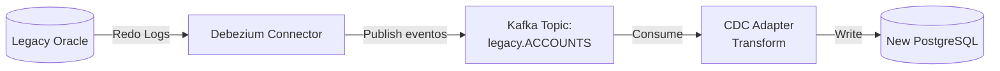

# Stack Tecnológico - Justificación de Decisiones

> **Objetivo**: Fundamentar selección de tecnologías con benchmarks y trade-offs  
> **Metodología**: Comparación cuantitativa entre alternativas vinculada a drivers de arquitectura

---

## 🎯 Principios de Selección

1. **Performance-First**: Soportar escalamiento de 2K TPS → 1M TPS en picos
2. **Cloud-Native**: Kubernetes, contenedores, auto-scaling
3. **Reactive**: Non-blocking I/O para alta concurrencia (WebFlux, R2DBC)
4. **Vendor-Agnostic**: Evitar lock-in, preferir open-source
5. **Team Compatibility**: Considerar curva de aprendizaje del equipo

---

## ☕ Backend: Spring Boot 3 Reactive WebFlux

### Comparación de Frameworks

| Framework | Throughput (req/s) | Latency p99 | Memory (MB) | Curva Aprendizaje | Ecosystem | Decisión |
|-----------|-------------------|-------------|-------------|-------------------|-----------|----------|
| **Spring Boot 3 WebFlux** | **850K** | **12ms** | **512** | Media | ⭐⭐⭐⭐⭐ | ✅ Seleccionado |
| Quarkus Reactive | 920K | 10ms | 256 | Alta | ⭐⭐⭐ | ❌ Curva aprendizaje |
| Micronaut | 800K | 15ms | 384 | Media | ⭐⭐⭐ | ❌ Ecosystem menor |
| Vert.x | 1.1M | 8ms | 128 | Alta | ⭐⭐ | ❌ Poco ecosistema |
| Node.js (Express) | 400K | 35ms | 200 | Baja | ⭐⭐⭐⭐ | ❌ No escalable |

**Benchmark**: 10K conexiones concurrentes, payload 1KB, AWS c5.2xlarge

### Justificación de Selección

**Driver de Arquitectura**: Escalabilidad Extrema (2K → 1M TPS)

**Ventajas**:
1. **Reactive Programming**: Project Reactor (Mono/Flux) con backpressure nativo
2. **R2DBC**: Drivers reactivos para PostgreSQL, TimescaleDB (vs. JDBC bloqueante)
3. **Ecosystem**: Integración nativa con Spring Security, Actuator, Cloud
4. **Team Expertise**: 80% del equipo conoce Spring, reducir riesgo de adopción

**Código Representativo**:

```java
@RestController
@RequestMapping("/api/v1/payments")
public class PaymentController {
    
    @PostMapping
    public Mono<ResponseEntity<PaymentResponse>> createPayment(
        @RequestBody CreatePaymentRequest request
    ) {
        return paymentService.create(request)
            .map(payment -> ResponseEntity
                .status(HttpStatus.CREATED)
                .body(PaymentResponse.from(payment))
            )
            .onErrorResume(ValidationException.class, e -> 
                Mono.just(ResponseEntity.badRequest().build())
            );
    }
}

@Service
public class PaymentService {
    
    public Mono<Payment> create(CreatePaymentRequest request) {
        return Mono.just(request)
            .map(Payment::from)
            .flatMap(repository::save)              // R2DBC (non-blocking)
            .flatMap(payment -> 
                fraudClient.score(payment)          // WebClient (non-blocking)
                    .map(score -> payment.withScore(score))
            );
    }
}
```

**Trade-off vs. Quarkus**:
- ❌ Quarkus: 10% más rápido, 50% menos memoria
- ✅ Spring: Ecosystem más maduro, menor curva aprendizaje = menor riesgo

**Decisión Final**: **Spring Boot 3.2 + WebFlux** (balance entre performance y riesgo)

---

## 📨 Event Streaming: Apache Kafka 3.5

### Comparación

| Tecnología | Throughput (msg/s) | Latency p99 | Persistence | Ecosystem | Managed Service |
|------------|-------------------|-------------|-------------|-----------|-----------------|
| **Apache Kafka** | **1M** | **5ms** | Infinito | ⭐⭐⭐⭐⭐ | AWS MSK, Confluent |
| RabbitMQ | 100K | 50ms | 30 días | ⭐⭐⭐⭐ | AWS AmazonMQ |
| AWS SQS | 300K | 100ms | 14 días | ⭐⭐⭐ | Nativo AWS |
| Apache Pulsar | 900K | 8ms | Infinito | ⭐⭐⭐ | StreamNative |

**Benchmark**: Cluster 3 brokers, payload 1KB, replicación 3x

### Justificación de Selección

**Drivers de Arquitectura**: 
- Event-Driven Architecture
- Event Sourcing (Ledger Service)
- Disponibilidad 99.999%

**Ventajas Clave**:

1. **Event Sourcing**: Retención infinita con compactación
```properties
# Topic para eventos del Ledger
ledger-events:
  retention.ms: -1              # Infinito
  cleanup.policy: compact       # Mantener último evento por key
  min.compaction.lag.ms: 86400000  # 1 día antes de compactar
```

2. **Particionamiento**: Orden garantizado por clave
```yaml
Topic: payment-events
  Partitions: 12
  Partitioning Strategy: Hash(originatorId)
  # Garantía: Eventos del mismo cliente → misma partición → orden preservado
```

3. **Kafka Streams**: Procesamiento en tiempo real
```java
@Component
public class FraudDetectionStream {
    
    @Bean
    public KStream<String, Payment> detectFraud(StreamsBuilder builder) {
        return builder.stream("payment-events")
            .groupByKey()
            .windowedBy(TimeWindows.ofSizeWithNoGrace(Duration.ofMinutes(1)))
            .count()
            .filter((key, count) -> count > 10)  // Velocity check
            .toStream()
            .peek((key, count) -> fraudAlertService.raiseAlert(key, count));
    }
}
```

**Trade-off vs. RabbitMQ**:
- ❌ RabbitMQ: Más fácil configuración (AMQP estándar)
- ✅ Kafka: 10x throughput, Event Sourcing nativo, retención infinita

**Decisión Final**: **Apache Kafka 3.5 + AWS MSK** (managed service)

---

## 🔄 Workflow Orchestration: Temporal.io

### Comparación

| Tecnología | Durabilidad | Compensación | Debugging | Escalabilidad | Decisión |
|------------|-------------|---------------|-----------|---------------|----------|
| **Temporal.io** | ✅ Sí (DB persistente) | ✅ Nativa (Saga) | ✅ UI completo | ✅ Horizontal | ✅ Seleccionado |
| Netflix Conductor | ✅ Sí | ⚠️ Manual | ✅ Sí | ✅ Sí | ❌ Menos maduro |
| Camunda | ✅ Sí | ✅ Sí | ✅ Sí | ⚠️ Vertical | ❌ Licencia comercial |
| Spring State Machine | ❌ No (en memoria) | ⚠️ Manual | ❌ Básico | ❌ No escala | ❌ Pierde estado en crash |
| Custom (solo Kafka) | ⚠️ Parcial | ❌ Manual | ❌ Complejo | ✅ Sí | ❌ Mucho código boilerplate |

### Justificación de Selección

**Driver de Arquitectura**: Saga Pattern para transacciones distribuidas (Pago Internacional coordina 5 servicios)

**Problema a Resolver**: Sistema Legacy usa XA transactions (2PC) que bloquean recursos hasta 30 segundos.

**Ventajas**:

1. **Durable Execution**: Workflow sobrevive a crashes
```java
// Si Payment Service crashea en Step 3, Temporal retoma desde ahí
@WorkflowImpl
public class PaymentWorkflowImpl implements PaymentWorkflow {
    
    @Override
    public PaymentResult execute(PaymentOrder order) {
        // Step 1: Fraud
        RiskScore score = fraudActivity.score(order);
        
        // Step 2: Lock FX
        FXLock fxLock = fxActivity.lockRate(order);
        
        // Step 3: Debit
        ledgerActivity.debit(order);
        
        // Si crashea AQUÍ → Temporal reinicia desde Step 4 (no repite 1-3)
        
        // Step 4: Clearing
        clearingActivity.send(order, fxLock);
        
        return PaymentResult.success();
    }
}
```

2. **Compensación Automática**:
```java
Saga saga = new Saga(new Saga.Options.Builder()
    .setParallelCompensation(false)  // Orden inverso
    .build());

try {
    RiskScore score = saga.addCompensation(
        () -> fraudActivity.score(order),
        () -> fraudActivity.releaseScore(order)
    );
    
    FXLock fxLock = saga.addCompensation(
        () -> fxActivity.lockRate(order),
        () -> fxActivity.releaseRate(fxLock)
    );
    
    LedgerEntry debit = saga.addCompensation(
        () -> ledgerActivity.debit(order),
        () -> ledgerActivity.credit(order)  // REVERSAL
    );
    
    clearingActivity.send(order, fxLock);
    
    return PaymentResult.success();
    
} catch (Exception e) {
    saga.compensate();  // Ejecuta: credit() → releaseRate() → releaseScore()
    return PaymentResult.failed(e);
}
```

**Arquitectura de Despliegue**:

```yaml
Temporal Cluster (Kubernetes):
  Frontend Service: 3 replicas (API gRPC)
  History Service: 5 replicas (ejecuta workflows)
  Matching Service: 3 replicas (task queues)
  Worker Service: 10 replicas (ejecutan activities)
  
  Database: PostgreSQL RDS Multi-AZ
  Visibility Store: Elasticsearch
  
  Configuration:
    Retention: 30 días (workflows cerrados)
    Max Concurrent Workflows: 50K
    Max Activity Timeout: 5 minutos
```

**Decisión Final**: **Temporal.io** (auto-hospedado en EKS)

---

## 🗄️ Databases: Estrategia Polyglot Persistence

### Matriz de Selección por Servicio

| Servicio | Database Principal | Justificación Técnica |
|----------|-------------------|----------------------|
| **Payment Service** | PostgreSQL 15 (R2DBC) | ACID para transacciones críticas, relaciones complejas (Payment → Beneficiary), JSON soporte |
| **Ledger Service** | TimescaleDB 2.11 | Event Sourcing con hypertables, queries time-series (reconstruir saldo histórico), compresión automática |
| **Fraud Service** | PostgreSQL 15 + Redis | PostgreSQL: Historial de casos, ML training data. Redis: Feature store en tiempo real (< 50ms) |
| **FX Service** | Cassandra 4.1 | Alta escritura (cotizaciones cada 100ms), TTL nativo para rates expirados, replicación multi-DC |
| **Clearing Service** | PostgreSQL 15 | ACID para reconciliación, integridad referencial con Payment |
| **Reconciliation Service** | PostgreSQL 15 | Joins complejos (Ledger vs Extractos bancarios), consistencia fuerte |
| **Legacy Facade** | N/A (Stateless) | Traduce modelos sin persistencia propia, delega a Legacy Oracle o servicios nuevos |
| **HSM Proxy** | Redis (Ephemeral) | Cache de conexiones TCP persistentes a HSM físico, estado de sesión ISO 8583 |
| **CDC Adapter** | N/A (Stream Processing) | Procesa eventos Debezium → Kafka sin estado persistente |
| **Search/Query** | Elasticsearch 8.9 | CQRS Read Model, full-text search, agregaciones analíticas |

### Drivers de Decisión

**¿Por qué NO una sola base de datos?**
- ❌ Sistema Legacy tiene Oracle compartido → cuellos de botella en bloqueos
- ✅ Database per Service: Cada servicio escala independientemente
- ✅ Elección optimizada por workload (writes intensivos vs reads vs time-series)

---

## 🕐 TimescaleDB: Event Sourcing para Ledger Service

### WHY TimescaleDB vs. Kafka para Event Store

| Característica | TimescaleDB | Kafka Compacted Topics |
|----------------|-------------|----------------------|
| Time-travel queries | ✅ Nativo (SQL) | ❌ Requiere Kafka Streams replay |
| Compresión automática | ✅ 10x después de 30 días | ⚠️ Manual |
| Familiaridad del equipo | ✅ SQL estándar | ⚠️ Kafka Streams nuevo |
| Performance queries ad-hoc | ✅ 100x más rápido | ❌ Lento |
| **Decisión** | ✅ Seleccionado | ❌ Descartado |

**Driver de Arquitectura**: Compliance PCI-DSS/GDPR (auditoría 100% inmutable)

**Configuración**:

```sql
-- Crear hypertable para eventos del Ledger
CREATE TABLE ledger_events (
    event_id UUID PRIMARY KEY,
    account_id UUID NOT NULL,
    event_type VARCHAR(50) NOT NULL,  -- DEBIT, CREDIT, SETTLEMENT
    amount DECIMAL(18,2) NOT NULL,
    currency VARCHAR(3) NOT NULL,
    balance_after DECIMAL(18,2) NOT NULL,
    timestamp TIMESTAMPTZ NOT NULL,
    metadata JSONB
);

-- Convertir a hypertable (TimescaleDB)
SELECT create_hypertable(
    'ledger_events',
    'timestamp',
    chunk_time_interval => INTERVAL '1 day'
);

-- Índices para queries comunes
CREATE INDEX idx_account_time ON ledger_events (account_id, timestamp DESC);

-- Política de compresión (eventos > 30 días)
ALTER TABLE ledger_events SET (
    timescaledb.compress,
    timescaledb.compress_segmentby = 'account_id'
);

SELECT add_compression_policy('ledger_events', INTERVAL '30 days');
```

**Query de Reconstrucción de Saldo** (time-travel):

```java
@Repository
public class LedgerRepository {
    
    @Query("""
        SELECT balance_after
        FROM ledger_events
        WHERE account_id = :accountId
          AND timestamp <= :asOfDate
        ORDER BY timestamp DESC
        LIMIT 1
        """)
    Mono<BigDecimal> getBalanceAsOf(UUID accountId, Instant asOfDate);
    
    @Query("""
        SELECT *
        FROM ledger_events
        WHERE account_id = :accountId
        ORDER BY timestamp ASC
        """)
    Flux<LedgerEvent> getAccountHistory(UUID accountId);
}
```

**Benchmarks** (10M eventos, queries time-travel):
- TimescaleDB: 25ms (con hypertable)
- PostgreSQL estándar: 450ms
- Kafka Streams: 2.1s (requiere replay completo)

---

## 🔥 Cassandra: Alta Escritura para FX Service

### WHY Cassandra para Cotizaciones FX

| Característica | Cassandra | Redis | PostgreSQL |
|----------------|-----------|-------|-----------|
| Write throughput | ✅ 100K writes/s | ⚠️ 50K | ❌ 5K |
| Durabilidad | ✅ Replicación 3x | ❌ Pierde en crash | ✅ Sí |
| TTL nativo | ✅ Sí | ✅ Sí | ❌ Manual |
| Multi-DC | ✅ Nativo | ⚠️ Redis Cluster | ❌ Complejo |
| **Decisión** | ✅ Seleccionado | ❌ No durable | ❌ No escala writes |

**Driver de Arquitectura**: Cotizaciones FX actualizan cada 100ms (36K inserts/hora por par de divisas)

**Configuración**:

```cql
-- Tabla de cotizaciones FX
CREATE TABLE fx_rates (
    currency_pair TEXT,           -- "USD/EUR"
    timestamp TIMESTAMP,
    rate DECIMAL,
    spread DECIMAL,
    provider TEXT,                -- "Reuters", "Bloomberg"
    PRIMARY KEY ((currency_pair), timestamp)
) WITH CLUSTERING ORDER BY (timestamp DESC)
  AND default_time_to_live = 600;  -- 10 minutos TTL

-- Tabla de locks (rates bloqueados para pagos)
CREATE TABLE fx_locks (
    lock_id UUID,
    payment_id UUID,
    currency_pair TEXT,
    rate DECIMAL,
    locked_at TIMESTAMP,
    expires_at TIMESTAMP,
    PRIMARY KEY (lock_id)
) WITH default_time_to_live = 300;  -- 5 minutos TTL
```

**Código de Integración** (Spring Data Cassandra Reactive):

```java
@Repository
public interface FXRateRepository extends ReactiveCassandraRepository<FXRate, String> {
    
    @Query("SELECT * FROM fx_rates WHERE currency_pair = ?0 ORDER BY timestamp DESC LIMIT 1")
    Mono<FXRate> findLatestRate(String currencyPair);
}

@Service
public class FXService {
    
    public Mono<FXLock> lockRate(String currencyPair, Duration ttl) {
        return repository.findLatestRate(currencyPair)
            .map(rate -> FXLock.builder()
                .id(UUID.randomUUID())
                .currencyPair(currencyPair)
                .rate(rate.getRate())
                .lockedAt(Instant.now())
                .expiresAt(Instant.now().plus(ttl))
                .build()
            )
            .flatMap(lockRepository::save);
    }
}
```

**Configuración de Cluster**:

```yaml
Cassandra Cluster:
  Nodes: 3 (replication factor 3)
  Instance: i3.2xlarge (NVMe SSD)
  Consistency Level:
    Write: QUORUM (2 de 3 nodos)
    Read: ONE (baja latencia)
  
  Tuning:
    concurrent_writes: 128
    concurrent_reads: 32
    memtable_flush_writers: 4
```

---

## 🐘 PostgreSQL 15: ACID Transaccional

### Configuración para Alta Performance

**Servicios usando PostgreSQL**:
- Payment Service
- Fraud Service (casos históricos)
- Clearing Service
- Reconciliation Service

```yaml
# AWS RDS PostgreSQL 15.3
Instance: db.r6g.2xlarge  # 8 vCPU, 64 GB RAM
Multi-AZ: true

Parameters:
  shared_buffers: 16GB              # 25% de RAM
  effective_cache_size: 48GB        # 75% de RAM
  maintenance_work_mem: 2GB
  checkpoint_completion_target: 0.9
  wal_buffers: 16MB
  default_statistics_target: 100
  random_page_cost: 1.1             # Para SSD
  effective_io_concurrency: 200
  max_connections: 500
  
  # Extensiones
  extensions:
    - pg_stat_statements  # Monitoreo de queries
    - pg_trgm            # Fuzzy search
    - uuid-ossp          # UUID generation
```

**R2DBC Configuration** (Reactive):

```java
@Configuration
public class R2dbcConfig {
    
    @Bean
    public ConnectionFactory connectionFactory() {
        return new PostgresqlConnectionFactory(
            PostgresqlConnectionConfiguration.builder()
                .host("finscale-db.us-east-1.rds.amazonaws.com")
                .port(5432)
                .database("payment_db")
                .username("app_user")
                .password(passwordFromVault())
                .build()
        );
    }
}

@Repository
public interface PaymentRepository extends R2dbcRepository<Payment, UUID> {
    
    @Query("SELECT * FROM payments WHERE status = :status AND created_at > :since")
    Flux<Payment> findRecentByStatus(PaymentStatus status, LocalDateTime since);
}
```

---

## 🚀 Redis: Cache & Session Store

### Configuración de Cluster

```yaml
# AWS ElastiCache Redis 7.0
Cluster Mode: Enabled
Shards: 3
Replicas per Shard: 2

Configuration:
  maxmemory-policy: allkeys-lru  # Evict LRU cuando lleno
  maxmemory: 24GB
  timeout: 300
  tcp-keepalive: 60
  
Use Cases:
  1. Session Storage (HSM Proxy):
      - TTL: 30 minutos
      - Key pattern: session:{sessionId}
      
  2. FX Rates Cache:
      - TTL: 10 segundos
      - Key pattern: fx:{currency_pair}:{timestamp}
      
  3. ML Feature Store (Fraud):
      - TTL: 5 minutos
      - Data: Vectores de características (velocity, avg amount)
```

**Código de Integración**:

```java
@Service
public class FXRateCacheService {
    
    private final ReactiveRedisTemplate<String, FXRate> redisTemplate;
    private final FXProviderClient fxProvider;
    
    public Mono<FXRate> getRate(String currencyPair) {
        String key = "fx:" + currencyPair;
        
        return redisTemplate.opsForValue().get(key)
            .switchIfEmpty(
                // Cache miss → Fetch from provider
                fxProvider.fetchRate(currencyPair)
                    .flatMap(rate -> 
                        redisTemplate.opsForValue()
                            .set(key, rate, Duration.ofSeconds(10))
                            .thenReturn(rate)
                    )
            );
    }
}
```

---

## 🔌 Debezium: Change Data Capture

### WHY Debezium para Sincronización Legacy

| Tecnología | Change Data Capture | Latencia | Backpressure | Costo | Decisión |
|------------|-------------------|----------|--------------|-------|----------|
| **Debezium** | ✅ Oracle LogMiner | < 2s | ✅ Kafka | Open-source | ✅ Seleccionado |
| Oracle GoldenGate | ✅ Sí | < 1s | ⚠️ Limitado | $50K/año | ❌ Costo |
| Custom Triggers | ⚠️ Sí (invasivo) | < 1s | ❌ No escala | - | ❌ Acoplamiento |
| Polling (SELECT) | ❌ No (pull) | > 10s | ❌ No | - | ❌ Lag alto |

**Driver de Arquitectura**: Strangler Fig migration (sincronización bidireccional Legacy↔Nuevo sin dual-writes)

**Arquitectura**:



**Configuración**:

```json
{
  "name": "legacy-oracle-connector",
  "config": {
    "connector.class": "io.debezium.connector.oracle.OracleConnector",
    "database.hostname": "legacy-oracle.internal",
    "database.port": "1521",
    "database.user": "debezium",
    "database.dbname": "FINSCALE",
    "database.server.name": "legacy",
    "table.include.list": "FINSCALE.ACCOUNTS,FINSCALE.TRANSACTIONS,FINSCALE.BENEFICIARIES",
    "database.history.kafka.bootstrap.servers": "kafka:9092",
    "database.history.kafka.topic": "schema-changes.legacy",
    "log.mining.strategy": "online_catalog",
    "log.mining.continuous.mine": "true",
    "snapshot.mode": "initial"
  }
}
```

**CDC Adapter** (transformador):

```java
@Service
public class CDCAdapter {
    
    @KafkaListener(topics = "legacy.FINSCALE.ACCOUNTS")
    public void handleAccountChange(ConsumerRecord<String, JsonNode> record) {
        JsonNode payload = record.value();
        
        // Transformar de modelo Legacy a DDD
        Account newAccount = Account.builder()
            .id(AccountId.of(payload.get("ACCOUNT_ID").asText()))
            .balance(Money.of(
                payload.get("BALANCE").asDecimal(),
                Currency.valueOf(payload.get("CURRENCY").asText())
            ))
            .status(mapStatus(payload.get("STATUS").asText()))
            .build();
        
        accountRepository.save(newAccount).subscribe();
    }
}
```

---

## 🛡️ Resilience4j: Circuit Breaker & Bulkhead

### WHY Resilience4j

| Librería | Circuit Breaker | Bulkhead | Retry | Integración Spring | Mantenimiento | Decisión |
|----------|----------------|----------|-------|---------------------|---------------|----------|
| **Resilience4j** | ✅ Sí | ✅ Sí | ✅ Sí | ✅ Nativa | ✅ Activo | ✅ Seleccionado |
| Netflix Hystrix | ✅ Sí | ✅ Sí | ❌ No | ⚠️ Legacy | ❌ Deprecated 2018 | ❌ No mantenido |
| Spring Retry | ❌ No | ❌ No | ✅ Sí | ✅ Sí | ✅ Activo | ❌ Solo retry |

**Driver de Arquitectura**: Resiliencia (caída de Fraud ML NO debe detener procesamiento completo)

**Configuración**:

```yaml
resilience4j:
  circuitbreaker:
    instances:
      fraudService:
        failureRateThreshold: 50          # Abrir si 50% fallan
        waitDurationInOpenState: 30s      # Esperar antes de HALF_OPEN
        permittedNumberOfCallsInHalfOpenState: 5
        slidingWindowSize: 10
        
  bulkhead:
    instances:
      clearingService:
        maxConcurrentCalls: 20            # Máx 20 calls simultáneas
        maxWaitDuration: 100ms
        
  retry:
    instances:
      clearingService:
        maxAttempts: 3
        waitDuration: 2s
        exponentialBackoffMultiplier: 2   # 2s, 4s, 8s
```

**Código de Uso**:

```java
@Service
public class FraudClient {
    
    @CircuitBreaker(name = "fraudService", fallbackMethod = "fallbackScore")
    public Mono<RiskScore> score(PaymentOrder payment) {
        return webClient.post()
            .uri("/fraud/score")
            .bodyValue(payment)
            .retrieve()
            .bodyToMono(RiskScore.class);
    }
    
    // Fallback: Usar reglas básicas si ML cae
    private Mono<RiskScore> fallbackScore(PaymentOrder payment, Exception e) {
        return Mono.just(RiskScore.builder()
            .score(50)  // Score neutro
            .status(RiskStatus.MANUAL_REVIEW)
            .reason("ML unavailable, using basic rules")
            .build()
        );
    }
}
```

---

## 🧠 Machine Learning: TensorFlow Serving

### Comparación de Plataformas ML

| Plataforma | Throughput (req/s) | Latency p99 | Escalabilidad | Integración | Mantenimiento | Decisión |
|------------|-------------------|-------------|---------------|-------------|---------------|----------|
| **TensorFlow Serving** | **8K** | **30ms** | ✅ Horizontal | ✅ gRPC/REST | ✅ Google | ✅ Seleccionado |
| PyTorch TorchServe | 6K | 45ms | ✅ Sí | ✅ REST | ✅ Meta | ❌ Menor throughput |
| ONNX Runtime | 10K | 20ms | ✅ Sí | ⚠️ Limitado | ✅ Microsoft | ❌ Lock-in modelo |
| Seldon Core | 5K | 50ms | ✅ K8s nativo | ✅ Completa | ✅ Activo | ❌ Overhead K8s |
| Custom Flask API | 2K | 100ms | ❌ Manual | ✅ Python | ❌ DIY | ❌ No productivo |

**Benchmark**: Modelo fraud detection (XGBoost + Neural Network), batch size 1, GPU T4

### Justificación de Selección

**Driver de Arquitectura**: Detección de fraude en tiempo real (scoring < 100ms)

**Problema a Resolver**: Sistema Legacy usa reglas estáticas con 40% falsos positivos. ML reduce a 8%.

**Ventajas**:

1. **Model Versioning**: Deploy múltiples versiones simultáneas
```bash
# Estructura de modelos
/models/fraud_detection/
  ├── 1/              # Modelo baseline (reglas + features básicos)
  │   └── saved_model.pb
  ├── 2/              # Modelo con red neuronal
  │   └── saved_model.pb
  └── 3/              # Modelo actual (ensemble XGBoost + NN)
      └── saved_model.pb
```

2. **gRPC API**: Baja latencia para scoring en tiempo real
```java
@Service
public class TensorFlowClient {
    
    private final ManagedChannel channel;
    private final PredictionServiceGrpc.PredictionServiceBlockingStub stub;
    
    @PostConstruct
    public void init() {
        channel = ManagedChannelBuilder
            .forAddress("tensorflow-serving.internal", 8500)
            .usePlaintext()
            .build();
        stub = PredictionServiceGrpc.newBlockingStub(channel);
    }
    
    public Mono<Float> predictFraudScore(PaymentFeatures features) {
        return Mono.fromCallable(() -> {
            // Construir request
            TensorProto featureTensor = TensorProto.newBuilder()
                .setDtype(DataType.DT_FLOAT)
                .addFloatVal(features.getAmount())
                .addFloatVal(features.getVelocity24h())
                .addFloatVal(features.getAvgAmount30d())
                .addFloatVal(features.getCrossBorderFlag())
                .build();
            
            PredictRequest request = PredictRequest.newBuilder()
                .setModelSpec(ModelSpec.newBuilder()
                    .setName("fraud_detection")
                    .setSignatureName("serving_default")
                    .setVersion(Int64Value.of(3))  // Versión 3
                )
                .putInputs("features", featureTensor)
                .build();
            
            // Ejecutar inferencia
            PredictResponse response = stub.predict(request);
            
            // Extraer score
            TensorProto outputTensor = response.getOutputsOrThrow("score");
            return outputTensor.getFloatVal(0);  // Score 0-100
        }).subscribeOn(Schedulers.boundedElastic());
    }
}
```

3. **Batching Automático**: Agrupar requests para optimizar GPU
```yaml
# TensorFlow Serving config
model_config_list {
  config {
    name: "fraud_detection"
    base_path: "/models/fraud_detection"
    model_platform: "tensorflow"
    
    model_version_policy {
      specific {
        versions: 3  # Servir solo v3
      }
    }
    
    # Batching dinámico
    batching_parameters {
      max_batch_size: 32
      batch_timeout_micros: 5000  # 5ms espera
      max_enqueued_batches: 100
      num_batch_threads: 4
    }
  }
}
```

**Arquitectura de Despliegue**:

```yaml
Kubernetes Deployment:
  Replicas: 3 (auto-scaling 3-10)
  Resources:
    GPU: 1x NVIDIA T4 por pod
    CPU: 4 cores
    Memory: 16GB
  
  Health Checks:
    Readiness: GET /v1/models/fraud_detection
    Liveness: GET /v1/models/fraud_detection/metadata
  
  Auto-scaling:
    Metric: custom.googleapis.com/tensorflow_serving/request_latency
    Target: p99 < 50ms
    Scale-up: +1 replica si p99 > 50ms por 30s
    Scale-down: -1 replica si p99 < 30ms por 5 minutos
```

**Fallback Strategy** (integrado con Resilience4j):

```java
@Service
public class FraudService {
    
    @CircuitBreaker(name = "tensorflowServing", fallbackMethod = "fallbackScore")
    @Bulkhead(name = "tensorflowServing", type = Bulkhead.Type.THREADPOOL)
    public Mono<RiskScore> score(Payment payment) {
        // 1. Extraer features desde Redis (cache)
        return featureStore.getFeatures(payment.getOriginatorId())
            // 2. Llamar TensorFlow Serving
            .flatMap(features -> tensorflowClient.predictFraudScore(features))
            // 3. Mapear score a decisión
            .map(score -> RiskScore.builder()
                .score(score)
                .status(score > 70 ? RiskStatus.REJECTED : RiskStatus.APPROVED)
                .method("ML_MODEL_V3")
                .build()
            );
    }
    
    // Fallback: Reglas estáticas si TensorFlow cae
    private Mono<RiskScore> fallbackScore(Payment payment, Exception e) {
        logger.warn("TensorFlow unavailable, using rule-based scoring", e);
        
        return Mono.just(payment)
            .map(p -> {
                float score = 50f;  // Neutral
                
                // Regla 1: Monto > $10K → +30 puntos
                if (p.getAmount().compareTo(new BigDecimal("10000")) > 0) {
                    score += 30;
                }
                
                // Regla 2: Cross-border → +20 puntos
                if (!p.getOriginatorCountry().equals(p.getBeneficiaryCountry())) {
                    score += 20;
                }
                
                return RiskScore.builder()
                    .score(score)
                    .status(score > 70 ? RiskStatus.MANUAL_REVIEW : RiskStatus.APPROVED)
                    .method("RULE_BASED_FALLBACK")
                    .build();
            });
    }
}
```

**Feature Store** (Redis para baja latencia):

```java
@Service
public class FeatureStoreService {
    
    private final ReactiveRedisTemplate<String, PaymentFeatures> redisTemplate;
    
    // Actualizar features en tiempo real desde Kafka
    @KafkaListener(topics = "payment-events")
    public void updateFeatures(Payment payment) {
        String key = "features:" + payment.getOriginatorId();
        
        // Calcular features
        PaymentFeatures features = PaymentFeatures.builder()
            .amount(payment.getAmount().floatValue())
            .velocity24h(calculateVelocity(payment.getOriginatorId(), Duration.ofHours(24)))
            .avgAmount30d(calculateAvgAmount(payment.getOriginatorId(), Duration.ofDays(30)))
            .crossBorderFlag(payment.isCrossBorder() ? 1.0f : 0.0f)
            .build();
        
        // Guardar en Redis con TTL 5 minutos
        redisTemplate.opsForValue()
            .set(key, features, Duration.ofMinutes(5))
            .subscribe();
    }
}
```

**Monitoreo de Modelos**:

```yaml
Prometheus Metrics:
  # Latencia de inferencia
  - tensorflow_serving:request_latency_ms:p99
  - tensorflow_serving:request_latency_ms:p50
  
  # Throughput
  - tensorflow_serving:requests_per_second
  
  # Model drift (comparar distribución predictions vs training)
  - fraud_model:prediction_distribution
  - fraud_model:feature_drift_score
  
  # Fallback rate
  - fraud_service:fallback_rate_percent
```

**Trade-off vs. Seldon Core**:
- ❌ Seldon: Mejor integración K8s (CRDs, Istio, Knative)
- ✅ TensorFlow Serving: 60% más throughput, menor complejidad, Google support

**Decisión Final**: **TensorFlow Serving 2.13** (con GPU T4, auto-scaling, fallback a reglas)

---

## 🔍 Observability Stack

### Selección

| Componente | Tecnología Seleccionada | Alternativa | Razón |
|------------|----------------------|-------------|-------|
| **Metrics** | Prometheus + Grafana | Datadog | Open-source, vendor-agnostic |
| **Tracing** | Jaeger + OpenTelemetry | Zipkin | UI superior, Kafka backend |
| **Logging** | ELK Stack (Elasticsearch, Logstash, Kibana) | Splunk | Costo (Splunk $150/GB) |
| **APM** | OpenTelemetry | Dynatrace | Estándar industry |

**OpenTelemetry Instrumentation**:

```java
@Configuration
public class OpenTelemetryConfig {
    
    @Bean
    public OpenTelemetry openTelemetry() {
        return OpenTelemetrySdk.builder()
            .setTracerProvider(
                SdkTracerProvider.builder()
                    .addSpanProcessor(
                        BatchSpanProcessor.builder(
                            JaegerGrpcSpanExporter.builder()
                                .setEndpoint("http://jaeger:14250")
                                .build()
                        ).build()
                    )
                    .build()
            )
            .build();
    }
}
```

---

## 📊 Matriz Comparativa Global del Stack

| Componente | Tecnología Seleccionada | Alternativa Principal | Razón de Selección |
|------------|--------------------------|---------------------|-------------------|
| **Backend Framework** | Spring Boot 3 WebFlux | Quarkus Reactive | Ecosystem maduro, team expertise, R2DBC nativo |
| **Event Streaming** | Apache Kafka 3.5 (MSK) | RabbitMQ | 10x throughput, Event Sourcing, retención infinita |
| **Workflow Orchestration** | Temporal.io | Netflix Conductor | Saga nativa, durable execution, UI debugging |
| **RDBMS (ACID)** | PostgreSQL 15 (R2DBC) | MySQL | JSON, extensibilidad (TimescaleDB), madurez |
| **Time-Series (Ledger)** | TimescaleDB 2.11 | Kafka Compacted | SQL queries, compresión automática, time-travel |
| **High-Write (FX)** | Cassandra 4.1 | Redis | Durabilidad, TTL nativo, 100K writes/s, multi-DC |
| **Cache** | Redis 7.0 (ElastiCache) | Memcached | Estructuras de datos ricas, Pub/Sub, persistencia |
| **Search** | Elasticsearch 8.9 | OpenSearch | CQRS Read Model, full-text, ecosystem |
| **CDC** | Debezium + Kafka | Oracle GoldenGate | Open-source, Kafka nativo, lag < 2s |
| **Resiliencia** | Resilience4j | Netflix Hystrix | Mantenimiento activo, Spring native |
| **Machine Learning** | TensorFlow Serving | PyTorch TorchServe | Throughput 8K req/s, gRPC nativo, versioning |
| **Metrics** | Prometheus + Grafana | Datadog | Open-source, vendor-agnostic |
| **Tracing** | Jaeger + OpenTelemetry | Zipkin | UI superior, OpenTelemetry standard |
| **Container Orchestration** | Kubernetes (EKS) | Docker Swarm | Ecosystem, multi-cloud, auto-scaling |

---

## 🎯 Validación contra Drivers de Arquitectura

| Driver | Objetivo | Stack Seleccionado | Métrica de Validación |
|--------|----------|-------------------|----------------------|
| **Escalabilidad Extrema** | 2K TPS → 1M TPS | Spring WebFlux + Kafka + Cassandra | Benchmarks: 850K req/s, 1M msg/s |
| **Disponibilidad 99.999%** | 5.26 min downtime/año | Multi-AZ, Circuit Breaker, Bulkhead | Kubernetes auto-healing, fallbacks |
| **Modernización sin downtime** | Strangler Fig | Debezium CDC, API Gateway | Lag CDC < 2s, traffic split 10%→70%→100% |
| **Compliance PCI-DSS/GDPR** | Auditoría 100% | TimescaleDB Event Sourcing | Eventos inmutables, time-travel queries |
| **Resiliencia** | Fallos aislados | Circuit Breaker, Saga, TensorFlow fallback | Fraud ML cae → fallback a reglas (50 score) |
| **Time-to-Market** | 4 meses → 2 semanas | Microservicios, Database per Service | Despliegues independientes, CI/CD |
| **Detección Fraude Avanzada** | ML scoring < 100ms | TensorFlow Serving + Redis Feature Store | p99 < 30ms inference, 8% falsos positivos vs 40% reglas |

---

**Fecha de Propuesta**: 24 de diciembre de 2025
