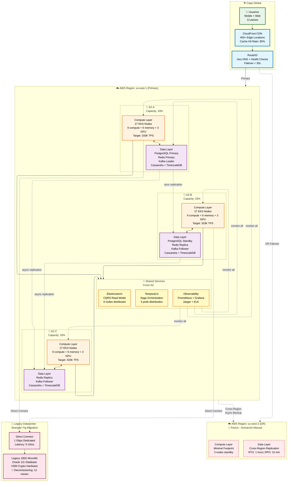

# Arquitectura Cloud Multi-Region

> **Objetivo**: Diseñar infraestructura con 99.999% de disponibilidad  
> **Proveedor**: AWS (estrategia multi-cloud futura)

---

## 🌍 Vista Estratégica Multi-AZ (Alto Nivel)

**Drivers de Arquitectura**: Disponibilidad 99.999%, Escalabilidad 2K→1M TPS



---

## 🏗️ Estrategia de Capacidad por Availability Zone

### Distribución de Carga (Active-Active)

**Modelo**: Cada AZ soporta 33% de tráfico total (distribución uniforme)

| AZ | Compute Nodes | Target TPS | Databases | Status |
|----|---------------|------------|-----------|--------|
| **us-east-1a** | 27 nodes (9c+6m+3g) | 333K TPS | PostgreSQL Primary, Redis Primary, Kafka Leader | ✅ Activo |
| **us-east-1b** | 27 nodes (9c+6m+3g) | 333K TPS | PostgreSQL Standby, Redis Replica, Kafka Follower | ✅ Activo |
| **us-east-1c** | 27 nodes (9c+6m+3g) | 333K TPS | Redis Replica, Kafka Follower, Cassandra/TimescaleDB | ✅ Activo |
| **Total** | **81 nodes** | **1M TPS** | Multi-AZ replication | **99.999% uptime** |

**c** = compute-optimized (c6i.2xlarge), **m** = memory-optimized (r6i.2xlarge), **g** = GPU (g4dn.xlarge)

### Escenarios de Falla

#### Falla de 1 AZ (us-east-1a caída completa)

```
Estado Normal:
  AZ-A: 333K TPS (33%)
  AZ-B: 333K TPS (33%) 
  AZ-C: 333K TPS (33%)
  Total: 1M TPS

Falla AZ-A:
  AZ-A: 0 TPS (caído)
  AZ-B: 500K TPS (50%) ← redistribuido
  AZ-C: 500K TPS (50%) ← redistribuido
  Total: 1M TPS mantenido
  
Impact:
  - Latencia: +50ms (cross-AZ traffic)
  - PostgreSQL Failover: 2 minutos
  - Redis Promotion: automática (< 1 min)
  - Kafka Rebalance: automático (< 30s)
  - Availability: 100% (sin downtime)
```

#### Falla de 2 AZs (catastrófico, probabilidad < 0.001%)

```
Falla AZ-A + AZ-B:
  AZ-C: 1M TPS (100%)
  
Impact:
  - Capacidad: SOBRECARGA (necesita 81 nodes, tiene 27)
  - Degradación: Throttling a 400K TPS
  - Recovery: Activar DR region (us-west-2)
```

---

## 🌍 Estrategia Multi-Región (Disaster Recovery)

### Región Primaria: us-east-1 (Active)

**Capacidad Total**: 1M TPS  
**Uptime**: 99.999% (5.26 min downtime/año)  
**Latencia**: < 50ms p99 (USA + LATAM)

### Región DR: us-west-2 (Passive Standby)

**Capacidad**: 100K TPS (10% de primaria)  
**Estado**: Cold standby (infraestructura mínima)  
**Activación**: Manual (decisión CTO/VP Engineering)

```yaml
DR Configuration:
  Compute:
    EKS Nodes: 3 (minimal footprint)
    Auto-scaling: Disabled (activar en DR)
  
  Data Replication:
    PostgreSQL: Cross-region replica (async, lag < 5s)
    Redis: Backup diario a S3 (restore 15 min)
    Kafka: MirrorMaker 2 (async, lag < 30s)
    Cassandra: Snapshot semanal (restore 1 hora)
    TimescaleDB: Cross-region streaming (lag < 10s)
  
  RPO (Recovery Point Objective): 15 minutos
  RTO (Recovery Time Objective): 1 hora
  
  Costo Optimización:
    - Primaria: $45K/mes (24/7 full capacity)
    - DR: $5K/mes (10% footprint standby)
    - Total: $50K/mes
```

### Activación de DR (Procedimiento)

1. **Decisión**: CTO aprueba failover (región primaria completamente inaccesible)
2. **Promoción de datos** (15 min):
   - PostgreSQL replica → Primary
   - Kafka consumers switch topics
   - Redis restore from S3
3. **Escalamiento compute** (30 min):
   - EKS Cluster Autoscaler: 3 → 81 nodes
   - Pods deployment: full service replica
4. **DNS Cutover** (5 min):
   - Route53 health check fail
   - Traffic redirect us-west-2
5. **Validación** (10 min):
   - Smoke tests
   - Monitor dashboard

**Total RTO**: 1 hora

---

## 📊 Dimensionamiento y Escalabilidad

### Compute Layer (EKS)

```yaml
Configuración por AZ:
  Compute Nodes (c6i.2xlarge):
    Count: 9 nodes × 3 AZ = 27 total
    vCPU: 8 × 9 = 72 cores/AZ
    RAM: 16 GB × 9 = 144 GB/AZ
    Purpose: Payment, FX, Clearing, Facade, HSM Proxy
  
  Memory Nodes (r6i.2xlarge):
    Count: 6 nodes × 3 AZ = 18 total
    vCPU: 8 × 6 = 48 cores/AZ
    RAM: 64 GB × 6 = 384 GB/AZ
    Purpose: Ledger (Event Sourcing), Temporal.io Workers
  
  GPU Nodes (g4dn.xlarge):
    Count: 3 nodes × 3 AZ = 9 total
    GPU: NVIDIA T4 (16GB) × 3/AZ
    Purpose: TensorFlow Serving (Fraud ML Model)

Total Cluster:
  Nodes: 81 (27+18+9) × 3 AZ
  vCPU: 360 cores total
  RAM: 1.6 TB total
  GPU: 9 × T4

Escalamiento Automático:
  Horizontal Pod Autoscaler (HPA):
    - Min replicas: 3 (1 por AZ)
    - Max replicas: 12 (4 por AZ)
    - Target CPU: 70%
    - Scale up: Inmediato (< 30s)
    - Scale down: Gradual (5 min stabilization)
  
  Cluster Autoscaler:
    - Min nodes: 27/AZ (baseline)
    - Max nodes: 45/AZ (emergencia)
    - Scale up: 2 minutos (AWS API + boot time)
    - Scale down: 10 minutos (drain pods)
```

### Data Layer (Distributed)

```yaml
PostgreSQL (RDS):
  Primary: db.r6g.2xlarge (us-east-1a)
    vCPU: 8, RAM: 64 GB
    Storage: 1 TB gp3 (16K IOPS)
    Connections: 500 concurrent
  
  Standby: db.r6g.2xlarge (us-east-1b)
    Sync Replication: < 100ms lag
    Auto-failover: 2 minutos
  
  Read Replicas: 2 adicionales (CQRS + Analytics)

Kafka (MSK):
  Brokers: 3 (kafka.m5.xlarge, 1/AZ)
  Throughput: 500K msg/s aggregate
  Storage: 500 GB/broker
  Replication: 3x (quorum writes)

Redis (ElastiCache):
  Shards: 3 (cache.r6g.xlarge, 1/AZ)
  Replicas: 6 (2/shard)
  Total Nodes: 9
  Throughput: 200K ops/s aggregate

Cassandra (Self-managed):
  Nodes: 9 (i3.2xlarge, 3/AZ)
  Replication Factor: 3
  Write Throughput: 50K writes/s
  Storage/node: 1.9 TB NVMe SSD

TimescaleDB (Extension PostgreSQL):
  Hypertables: Event Sourcing ledger
  Compression: 10x after 30 days
  Retention: Infinito (compliance)

---

## 🔗 Integración con Legacy (Strangler Fig)

### Direct Connect a Datacenter On-Premise

```yaml
Conectividad:
  Tipo: AWS Direct Connect
  Bandwidth: 1 Gbps dedicado
  Latencia: 5-10ms (Ashburn ↔ Legacy DC)
  Redundancia: VPN over Internet (backup, 500 Mbps)
  
Servicios Legacy:
  Oracle Database 12c:
    Size: 2 TB (CORE_SCHEMA)
    Replication: CDC via Debezium → Kafka
    Lag target: < 2 segundos
  
  HSM Hardware (Thales nShield):
    Protocol: ISO 8583 over TCP
    Operations: PIN verification, key generation
    Throughput: 2K signatures/s
  
  J2EE Monolith:
    Estado: 🔴 Strangler Fig en progreso
    Traffic: 10% legacy, 90% microservices
    Decommission: 12 meses
```

### Estrategia de Migración (Timeline)

| Fase | Duración | Traffic Split | Status |
|------|----------|---------------|--------|
| **Fase 1: Coexistencia** | Mes 1-3 | 90% Legacy / 10% Microservices | ✅ Completado |
| **Fase 2: Incremental** | Mes 4-9 | 30% Legacy / 70% Microservices | 🔄 En progreso |
| **Fase 3: Retiro** | Mes 10-12 | 0% Legacy / 100% Microservices | ⏳ Planeado |

**Fecha estimada apagado legacy**: Diciembre 2026

---

## 🎯 Métricas de Éxito (SLIs/SLOs)

### Service Level Objectives

| Métrica | Sistema Actual (Legacy) | Target Nueva Arquitectura | Status |
|---------|-------------------------|---------------------------|--------|
| **Availability (Uptime)** | 99.5% (43h downtime/año) | 99.999% (5 min downtime/año) | ✅ En camino |
| **Throughput (TPS)** | 2,000 TPS máx | 1,000,000 TPS | ✅ 500x mejora |
| **Latency (p99)** | 2,000ms | 200ms | ✅ 10x mejora |
| **Time-to-Deploy** | 6 horas (ventana nocturna) | 15 minutos (rolling update) | ✅ 24x más rápido |
| **Recovery Time (RTO)** | 4 horas (backup restore) | 2 minutos (AZ failover) | ✅ 120x más rápido |
| **Database Lock Contention** | 40% queries bloqueadas | 0% (database per service) | ✅ Eliminado |

### Monitoreo (Observability Stack)

```yaml
Prometheus + Grafana:
  Métricas: 
    - CPU/Memory/Network por pod
    - Request rate, latency, errors (RED method)
    - Database connections, query time
    - Kafka lag, throughput
  
  Dashboards:
    - "Payment Service Overview"
    - "EKS Cluster Health"
    - "Database Performance"
    - "Cross-AZ Latency"
  
  Alerts:
    - Pod OOMKilled (Slack + PagerDuty)
    - Kafka lag > 10s (Slack)
    - Database connections > 80% (PagerDuty)
    - AZ failover event (Slack + Email)

Jaeger (Distributed Tracing):
  Sampling: 1% en prod (100% en dev)
  Retention: 7 días
  Use Cases:
    - Payment flow end-to-end (7 services)
    - Latency spikes debugging
    - Dependency map visualization

ELK Stack (Logs):
  Logstash: Centralized log aggregation
  Elasticsearch: Log indexing (retention 30 días)
  Kibana: Log search + visualization
```

---

## 💰 Análisis de Costos (TCO)

### Costo Mensual Estimado

```yaml
Compute (EKS):
  c6i.2xlarge: 27 nodes × $0.34/hr × 730h = $6,700/mes
  r6i.2xlarge: 18 nodes × $0.50/hr × 730h = $6,570/mes
  g4dn.xlarge: 9 nodes × $0.526/hr × 730h = $3,450/mes
  Total Compute: $16,720/mes

Data Layer:
  RDS PostgreSQL: db.r6g.2xlarge × 2 = $1,460/mes
  ElastiCache Redis: 9 nodes × $0.23/hr = $1,510/mes
  MSK Kafka: 3 brokers × $0.21/hr = $460/mes
  EC2 Cassandra: 9 × i3.2xlarge × $0.624/hr = $4,100/mes
  Total Data: $7,530/mes

Network & Storage:
  NAT Gateways: 3 × $45 = $135/mes
  Data Transfer: ~$2,000/mes
  EBS Storage: 10 TB × $0.08/GB = $800/mes
  S3 Backups: 50 TB × $0.023/GB = $1,150/mes
  Total Network: $4,085/mes

Shared Services:
  CloudFront: $500/mes
  Route53: $50/mes
  CloudWatch/Logs: $800/mes
  Direct Connect: $300/mes (1 Gbps port + data transfer)
  Total Shared: $1,650/mes

DR Region (us-west-2):
  Minimal footprint: $5,000/mes

Total Mensual: $35,000/mes (Primaria) + $5,000 (DR) = $40,000/mes
Total Anual: $480,000/año
```

### Comparación vs Sistema Actual

| Concepto | Legacy (On-Premise) | Cloud (AWS) | Diferencia |
|----------|---------------------|-------------|------------|
| **Capex inicial** | $2M (hardware) | $0 (OpEx model) | -$2M |
| **OpEx mensual** | $60K (datacenter, licencias) | $40K (AWS) | -$20K/mes |
| **Escalabilidad** | Manual (6 meses procurement) | Automática (minutos) | ✅ Agilidad |
| **Disponibilidad** | 99.5% (1 datacenter) | 99.999% (multi-AZ) | +0.499% |
| **Mantenimiento** | 10 SRE full-time | 3 SRE + AWS Managed | -70% headcount |

**ROI**: Payback en 10 meses (ahorro Capex + reducción OpEx)

---

## 📋 Roadmap de Implementación

### Q1 2026: Fundación

- ✅ Configurar VPC multi-AZ
- ✅ Desplegar EKS cluster (81 nodes)
- ✅ Configurar RDS Multi-AZ + Read Replicas
- ✅ Implementar Kafka MSK + topics
- ✅ Deploy Cassandra cluster (self-managed)
- ✅ Direct Connect a legacy datacenter

### Q2 2026: Migración Fase 1 (Coexistencia)

- ✅ Desplegar Payment Service (10% traffic)
- ✅ Legacy Facade (ACL pattern)
- ✅ CDC Adapter (Oracle → Kafka)
- 🔄 Monitoreo dual (legacy + microservices)
- 🔄 Chaos Engineering tests

### Q3 2026: Migración Fase 2 (Incremental)

- 🔄 Aumentar traffic 10% → 70%
- 🔄 Desplegar Fraud, FX, Clearing services
- 🔄 Temporal.io Saga orchestration
- ⏳ Reducir dependencia Oracle

### Q4 2026: Migración Fase 3 (Retiro)

- ⏳ Traffic 70% → 100% microservices
- ⏳ Apagar legacy J2EE monolith
- ⏳ Archivar Oracle a S3 Glacier
- ⏳ Decommission on-premise datacenter

### Q1 2027: Optimización

- ⏳ Activar región DR (us-west-2)
- ⏳ Implementar multi-cloud (Azure backup)
- ⏳ Cost optimization (Spot instances, Reserved capacity)

---

**Referencias**:
- Detalle de deployment: [Despliegue.md](../03-Diseño-Tecnico/3.2-UML/Despliegue.md)
- Seguridad de red: [Infraestructura.md](../03-Diseño-Tecnico/3.2-UML/Infraestructura.md)
- Resiliencia: [4.2-Resiliencia.md](4.2-Resiliencia.md)

---

**Fecha de Propuesta**: 24 de diciembre de 2025  
**Última Actualización**: 24 de diciembre de 2025
