# Patrones de Resiliencia - Implementación

> **Objetivo**: Alcanzar 99.999% de disponibilidad (5.26 min downtime/año)  
> **Estrategia**: Defense in Depth con múltiples capas de protección

---

## 🛡️ Pirámide de Resiliencia

```mermaid
graph TB
    Chaos["Chaos Engineering<br/>Validación continua"]
    RateLimit["Rate Limiting<br/>Prevención de abusos"]
    CircuitBreaker["Circuit Breaker<br/>Detección de fallos"]
    Bulkhead["Bulkhead Pattern<br/>Aislamiento de recursos"]
    Retry["Retry + Timeout<br/>Recuperación básica"]
    
    Chaos --> RateLimit
    RateLimit --> CircuitBreaker
    CircuitBreaker --> Bulkhead
    Bulkhead --> Retry
```

<div align="center">



</div>

---

## 🔄 Patrón 1: Retry con Exponential Backoff

### Implementación con Resilience4j

```java
@Configuration
public class RetryConfig {
    
    @Bean
    public Retry fraudServiceRetry() {
        return Retry.of("fraud-service", RetryConfig.custom()
            .maxAttempts(3)
            .waitDuration(Duration.ofMillis(100))
            .intervalFunction(IntervalFunction.ofExponentialBackoff(
                Duration.ofMillis(100),  // Initial wait
                2.0  // Multiplier: 100ms → 200ms → 400ms
            ))
            .retryExceptions(ConnectException.class, TimeoutException.class)
            .ignoreExceptions(ValidationException.class)  // No reintentar errores de negocio
            .build()
        );
    }
}

@Service
public class FraudClient {
    
    private final Retry retry;
    private final WebClient webClient;
    
    public Mono<RiskScore> score(PaymentOrder payment) {
        return Mono.fromCallable(() -> 
            retry.executeSupplier(() -> 
                webClient.post()
                    .uri("/api/v1/fraud/score")
                    .bodyValue(FraudRequest.from(payment))
                    .retrieve()
                    .bodyToMono(RiskScore.class)
                    .block()  // Blocking dentro del retry
            )
        )
        .timeout(Duration.ofMillis(50))  // Timeout per attempt
        .retry(retry);
    }
}
```

### Configuración por Servicio

| Servicio | Max Attempts | Initial Wait | Multiplier | Total Time |
|----------|--------------|--------------|------------|------------|
| Fraud | 3 | 100ms | 2x | 700ms (100+200+400) |
| FX | 2 | 200ms | 1.5x | 500ms (200+300) |
| Clearing | 5 | 1s | 3x | 121s (1+3+9+27+81) |
| Ledger | 1 | - | - | - (No retry, Event Sourcing) |

---

## ⚡ Patrón 2: Circuit Breaker

### Implementación

```java
@Configuration
public class CircuitBreakerConfig {
    
    @Bean
    public CircuitBreaker fraudServiceCircuitBreaker() {
        return CircuitBreaker.of("fraud-service", 
            CircuitBreakerConfig.custom()
                // Abrir si 50% de las últimas 10 llamadas fallan
                .failureRateThreshold(50)
                .slidingWindowSize(10)
                .slidingWindowType(SlidingWindowType.COUNT_BASED)
                
                // En OPEN, esperar 30s antes de intentar HALF_OPEN
                .waitDurationInOpenState(Duration.ofSeconds(30))
                
                // En HALF_OPEN, permitir 5 llamadas de prueba
                .permittedNumberOfCallsInHalfOpenState(5)
                
                // Si 3+ de 5 tienen éxito → CLOSED, sino → OPEN
                .minimumNumberOfCalls(5)
                
                // Transiciones automáticas
                .automaticTransitionFromOpenToHalfOpenEnabled(true)
                
                .build()
        );
    }
}

@Service
public class FraudClientWithCircuitBreaker {
    
    private final CircuitBreaker circuitBreaker;
    
    public Mono<RiskScore> score(PaymentOrder payment) {
        return Mono.defer(() -> {
            try {
                return circuitBreaker.executeSupplier(() -> 
                    fraudService.score(payment)
                );
            } catch (CallNotPermittedException e) {
                // Circuit OPEN → Fallback inmediato
                return fallback(payment);
            }
        });
    }
    
    private Mono<RiskScore> fallback(PaymentOrder payment) {
        log.warn("Circuit OPEN for fraud-service, using fallback");
        
        // Estrategia de fallback: Rule-based scoring
        if (payment.getAmount().isGreaterThan(Money.of(5000, "USD"))) {
            // Alto monto → Manual review
            return Mono.just(new RiskScore(50, RiskStatus.MANUAL_REVIEW, "ML unavailable"));
        } else {
            // Bajo monto → Aprobar con score conservador
            return Mono.just(new RiskScore(40, RiskStatus.APPROVED, "Rule-based approval"));
        }
    }
}
```

### Integración con TensorFlow Serving (ML Fallback)

**Escenario**: TensorFlow Serving cae o supera 100ms timeout. Circuit Breaker abre y usa reglas estáticas.

```java
@Service
public class FraudServiceWithMLFallback {
    
    private final TensorFlowClient tensorflowClient;  // gRPC client to TF Serving
    private final CircuitBreaker circuitBreaker;
    
    @CircuitBreaker(name = "tensorflowServing", fallbackMethod = "fallbackToRules")
    @TimeLimiter(name = "tensorflowServing")  // 100ms timeout
    @Bulkhead(name = "tensorflowServing", type = THREADPOOL)
    public Mono<RiskScore> score(PaymentOrder payment) {
        return featureStore.getFeatures(payment.getOriginatorId())
            .flatMap(features -> tensorflowClient.predictFraudScore(features))
            .map(mlScore -> RiskScore.builder()
                .score(mlScore)
                .status(mlScore > 70 ? RiskStatus.REJECTED : RiskStatus.APPROVED)
                .method("ML_MODEL_V3")
                .confidence(0.95)
                .build()
            );
    }
    
    // Fallback automático a reglas estáticas
    private Mono<RiskScore> fallbackToRules(PaymentOrder payment, Exception e) {
        logger.warn("TensorFlow Serving unavailable: {}. Using rule-based fallback.", e.getMessage());
        metricsService.incrementCounter("fraud.fallback.activations");
        
        return Mono.just(payment)
            .map(p -> {
                float score = 50f;  // Neutral baseline
                
                // Regla 1: Monto alto (> $10K)
                if (p.getAmount().compareTo(new BigDecimal("10000")) > 0) {
                    score += 30;
                }
                
                // Regla 2: Cross-border transaction
                if (!p.getOriginatorCountry().equals(p.getBeneficiaryCountry())) {
                    score += 20;
                }
                
                // Regla 3: Horario inusual (2am - 6am)
                LocalTime time = LocalTime.now(ZoneId.of(p.getOriginatorTimezone()));
                if (time.isAfter(LocalTime.of(2, 0)) && time.isBefore(LocalTime.of(6, 0))) {
                    score += 15;
                }
                
                return RiskScore.builder()
                    .score(score)
                    .status(score > 70 ? RiskStatus.MANUAL_REVIEW : RiskStatus.APPROVED)
                    .method("RULE_BASED_FALLBACK")
                    .confidence(0.60)  // Menor confianza que ML (0.95)
                    .warning("ML model unavailable - degraded fraud detection active")
                    .build();
            });
    }
}
```

**Impacto de Degradación**:
- **ML Model**: 8% falsos positivos, 95% confidence, 30ms p99 latency
- **Rule-Based Fallback**: 18% falsos positivos, 60% confidence, 5ms latency
- **Trade-off**: Disponibilidad 99.99% vs Precisión 10% menor (acceptable)

**Prometheus Metrics**:

```yaml
# Circuit Breaker State
resilience4j_circuitbreaker_state{name="tensorflowServing"}
  # 0=CLOSED, 1=OPEN, 2=HALF_OPEN

# Fallback Activation Rate
fraud_fallback_activations_total
  # Counter de veces que ML falló y usó reglas

# Fraud Detection Method Distribution
fraud_detection_method_count{method="ML_MODEL_V3"} 15000
fraud_detection_method_count{method="RULE_BASED_FALLBACK"} 150
  # 99% ML, 1% fallback (target < 5%)
```

### Dashboard de Estado

```java
@RestController
@RequestMapping("/actuator/circuit-breakers")
public class CircuitBreakerActuator {
    
    private final CircuitBreakerRegistry registry;
    
    @GetMapping
    public Mono<Map<String, CircuitBreakerStatus>> getStatus() {
        return Flux.fromIterable(registry.getAllCircuitBreakers())
            .collectMap(
                CircuitBreaker::getName,
                cb -> new CircuitBreakerStatus(
                    cb.getState(),
                    cb.getMetrics().getFailureRate(),
                    cb.getMetrics().getNumberOfFailedCalls()
                )
            );
    }
}

// Output ejemplo:
{
  "fraud-service": {
    "state": "HALF_OPEN",
    "failureRate": 45.5,
    "failedCalls": 5
  },
  "fx-service": {
    "state": "CLOSED",
    "failureRate": 2.1,
    "failedCalls": 1
  }
}
```

---

## 🚧 Patrón 3: Bulkhead (Aislamiento de Recursos)

### Thread Pool Isolation

```java
@Configuration
public class BulkheadConfig {
    
    @Bean("fraudExecutor")
    public Executor fraudThreadPool() {
        ThreadPoolTaskExecutor executor = new ThreadPoolTaskExecutor();
        executor.setCorePoolSize(5);
        executor.setMaxPoolSize(10);
        executor.setQueueCapacity(50);
        executor.setThreadNamePrefix("fraud-");
        executor.setRejectedExecutionHandler(new ThreadPoolExecutor.CallerRunsPolicy());
        executor.initialize();
        return executor;
    }
    
    @Bean("clearingExecutor")
    public Executor clearingThreadPool() {
        ThreadPoolTaskExecutor executor = new ThreadPoolTaskExecutor();
        executor.setCorePoolSize(10);
        executor.setMaxPoolSize(20);
        executor.setQueueCapacity(100);
        executor.setThreadNamePrefix("clearing-");
        executor.initialize();
        return executor;
    }
}

@Service
public class PaymentService {
    
    @Async("fraudExecutor")
    public CompletableFuture<RiskScore> callFraud(PaymentOrder payment) {
        return CompletableFuture.completedFuture(
            fraudClient.score(payment).block()
        );
    }
    
    @Async("clearingExecutor")
    public CompletableFuture<Void> callClearing(PaymentOrder payment) {
        clearingClient.send(payment).block();
        return CompletableFuture.completedFuture(null);
    }
}
```

### Semaphore-based Bulkhead (Reactive)

```java
@Configuration
public class ReactiveBulkheadConfig {
    
    @Bean
    public Bulkhead fraudBulkhead() {
        return Bulkhead.of("fraud-service", 
            BulkheadConfig.custom()
                .maxConcurrentCalls(50)  // Máx 50 llamadas concurrentes
                .maxWaitDuration(Duration.ofMillis(100))
                .build()
        );
    }
}

@Service
public class FraudClientWithBulkhead {
    
    private final Bulkhead bulkhead;
    
    public Mono<RiskScore> score(PaymentOrder payment) {
        return Mono.fromCallable(() -> 
            bulkhead.executeSupplier(() -> 
                fraudService.score(payment)
            )
        )
        .onErrorResume(BulkheadFullException.class, e -> {
            // Rechazar request si bulkhead lleno
            return Mono.error(new ServiceUnavailableException(
                "Fraud service overloaded, try again later"
            ));
        });
    }
}
```

---

## ⏱️ Patrón 4: Timeout

### Configuración Jerárquica

```yaml
# application.yml
resilience4j:
  timelimiter:
    instances:
      fraud-service:
        timeout-duration: 50ms
        cancel-running-future: true
      
      fx-service:
        timeout-duration: 200ms
        cancel-running-future: true
      
      clearing-service:
        timeout-duration: 5s
        cancel-running-future: false  # SWIFT no cancela
```

```java
@Service
public class FraudClientWithTimeout {
    
    @TimeLimiter(name = "fraud-service")
    public Mono<RiskScore> score(PaymentOrder payment) {
        return webClient.post()
            .uri("/api/v1/fraud/score")
            .bodyValue(payment)
            .retrieve()
            .bodyToMono(RiskScore.class)
            // Timeout de red (adicional al TimeLimiter)
            .timeout(Duration.ofMillis(100));
    }
}
```

---

## 🌊 Patrón 5: Rate Limiting

### Token Bucket con Redis

```java
@Component
public class RateLimiter {
    
    private final ReactiveRedisTemplate<String, String> redis;
    
    public Mono<Boolean> allowRequest(String userId, int maxRequests, Duration window) {
        String key = "rate_limit:" + userId;
        
        return redis.opsForValue()
            .increment(key)
            .flatMap(count -> {
                if (count == 1) {
                    // Primera request → Setear TTL
                    return redis.expire(key, window)
                        .thenReturn(true);
                } else if (count <= maxRequests) {
                    return Mono.just(true);
                } else {
                    return Mono.just(false);  // Rate limit exceeded
                }
            });
    }
}

// Uso en controller
@RestController
public class PaymentController {
    
    private final RateLimiter rateLimiter;
    
    @PostMapping("/api/v1/payments")
    public Mono<ResponseEntity<PaymentResponse>> createPayment(
        @AuthenticationPrincipal User user,
        @RequestBody CreatePaymentRequest request
    ) {
        return rateLimiter.allowRequest(user.getId(), 100, Duration.ofMinutes(1))
            .flatMap(allowed -> {
                if (!allowed) {
                    return Mono.just(ResponseEntity.status(429)
                        .header("Retry-After", "60")
                        .build());
                }
                
                return paymentService.create(request)
                    .map(ResponseEntity::ok);
            });
    }
}
```

### Kong API Gateway Rate Limiting

```yaml
# Kong plugin config
plugins:
  - name: rate-limiting
    config:
      minute: 100       # 100 req/min por consumer
      hour: 5000        # 5K req/hora
      policy: redis
      redis_host: finscale-redis.cache.amazonaws.com
      redis_port: 6379
      fault_tolerant: true  # Si Redis cae, permitir requests
      hide_client_headers: false
```

---

## 🧪 Chaos Engineering

### AWS Fault Injection Simulator (FIS)

```yaml
Experiment 1: AZ Failure Simulation
  Name: az-a-failure
  Description: Simular fallo de us-east-1a
  
  Actions:
    - Name: TerminateEKSNodes
      ActionId: aws:eks:terminate-nodegroup-instances
      Parameters:
        nodeGroupArn: arn:aws:eks:us-east-1:ACCOUNT:nodegroup/finscale-prod/compute-optimized-a
        instanceTerminationPercentage: 100
      
    - Name: FailoverRDS
      ActionId: aws:rds:reboot-db-instances
      Parameters:
        dbInstanceIdentifier: finscale-payment-db
        forceFailover: true
  
  StopConditions:
    - Source: aws:cloudwatch:alarm
      Value: arn:aws:cloudwatch:us-east-1:ACCOUNT:alarm:payment-error-rate-high
  
  Expected Results:
    - Traffic shifted to AZ-B and AZ-C: ✅
    - RDS failover < 2 min: ✅
    - No data loss: ✅
    - Latency p99 < 500ms: ✅ (spike to 450ms, then normalized)
    - Error rate < 0.1%: ✅ (peaked at 0.08%)

---

Experiment 2: Database Connection Exhaustion
  Name: db-connection-storm
  Description: Simular 10x aumento de conexiones DB
  
  Actions:
    - Name: StressConnections
      ActionId: aws:fis:inject-api-throttle-error
      Parameters:
        service: rds
        operations: ["CreateDBClusterEndpoint"]
        percentage: 90
        duration: PT5M  # 5 minutos
  
  Expected Results:
    - PgBouncer rechaza conexiones excesivas: ✅
    - Circuit Breaker abre para Ledger Service: ✅
    - Degradación controlada (queries en cache): ✅
    - Recovery automático después de 5 min: ✅

---

Experiment 3: Kafka Broker Failure
  Name: kafka-broker-failure
  Description: Apagar 1 de 3 brokers Kafka
  
  Actions:
    - Name: TerminateKafkaBroker
      ActionId: aws:msk:reboot-broker-node
      Parameters:
        clusterArn: arn:aws:kafka:us-east-1:ACCOUNT:cluster/finscale-kafka-prod
        brokerIds: ["1"]
  
  Expected Results:
    - Partitions re-election < 30s: ✅
    - Producers reconnect automático: ✅
    - Consumer lag < 10s: ✅
    - Zero message loss (acks=all): ✅
```

### Continuous Chaos Testing

```yaml
# GameDay Schedule (Mensual)
Schedule:
  Frequency: Primer martes de cada mes
  Time: 10:00-12:00 UTC (low traffic window)
  
Scenarios:
  Month 1: AZ failure
  Month 2: Database failover
  Month 3: Kafka broker failure
  Month 4: Network partition (simulate cross-AZ latency)
  Month 5: Memory leak simulation (OOMKilled pods)
  Month 6: Full region disaster (failover to DR region)

Metrics Tracked:
  - MTTR (Mean Time To Recovery)
  - MTTD (Mean Time To Detection)
  - Error Budget consumption
  - Customer impact (failed transactions)
```

---

## 📊 Métricas de Resiliencia

### SLI/SLO/SLA

```yaml
Service Level Indicators (SLI):
  Availability:
    Metric: (successful_requests / total_requests) × 100
    Measurement: Últimas 30 días
  
  Latency:
    Metric: payment_processing_duration_seconds{quantile="0.99"}
    Measurement: Ventanas de 5 min
  
  Error Rate:
    Metric: (failed_requests / total_requests) × 100
    Measurement: Últimas 24 horas

Service Level Objectives (SLO):
  Availability: 99.95% (22 min downtime/mes)
  Latency p99: < 500ms
  Error Rate: < 0.1%

Service Level Agreement (SLA):
  Availability: 99.9% (43 min downtime/mes)
  Credits:
    - 99.9% - 99.0%: 10% de crédito
    - 99.0% - 95.0%: 25% de crédito
    - < 95.0%: 100% de crédito
```

### Error Budget

```python
# Cálculo mensual
slo_availability = 99.95  # %
actual_availability = 99.97  # %

error_budget = 100 - slo_availability  # 0.05%
error_budget_minutes = (30 * 24 * 60) * (error_budget / 100)  # 21.6 min

actual_errors = 100 - actual_availability  # 0.03%
actual_error_minutes = (30 * 24 * 60) * (actual_errors / 100)  # 12.96 min

remaining_budget = error_budget_minutes - actual_error_minutes  # 8.64 min
budget_consumption = (actual_error_minutes / error_budget_minutes) * 100  # 60%

# Si consumption > 100% → Freeze de features, focus en reliability
```

---

**Próximo Paso**: → `4.3-Estrategia-Migracion-Strangler.md`

---

**Última actualización**: 7 de diciembre de 2025
