# Estrategia de Migración - Strangler Fig Pattern

> **Objetivo**: Migrar monolito Java 8 → Microservicios Cloud-Native sin downtime  
**Duración**: 15 meses en 3 fases  
**Driver de Arquitectura**: Modernización sin impacto operacional (0 downtime)  
**Alineación**: Bounded Contexts (2.2), Core Domain Chart (2.1), Equipos Reales (5.4), Stack Validado (3.4)

---

## 🌳 Strangler Fig Pattern - Concepto

**Desafío del Sistema Legacy**:
- Monolito J2EE de 15 años con clase `TransactionManager.java` de 15,000 líneas
- 40% lógica de negocio en PL/SQL (Oracle Store Procedures)
- Sistemas satélites leen/escriben directamente en `CORE_SCHEMA` (shared database anti-pattern)
- Ventana de batch nocturno: 6 horas (02:00-08:00 AM) bloquea la BD
- Sticky sessions en memoria (no escala horizontalmente)
- Protocolos stateful (ISO 8583 sobre TCP persistente a HSMs físicos)

**Solución Propuesta**: Migración incremental mediante traffic routing progresivo (10%→70%→100%) con sincronización bidireccional vía **Debezium CDC**, eliminando dual-writes manuales.

```mermaid
---
config:
  layout: elk
---
flowchart TB
 subgraph Fase1["📍 FASE 1: Coexistencia (Mes 1-4)"]
    direction LR
        Users1["👥 Usuarios<br/>Mobile + Web"] --> Kong1["Kong API Gateway<br/>Traffic Split: 90/10<br/>Feature Flags"]
        Kong1 -->|"90% traffic<br/>source of truth"| Legacy1["🏢 Monolito J2EE<br/>Oracle 12c<br/>TransactionManager.java"]
        Kong1 -->|"10% traffic<br/>shadow mode"| Payment1["💳 Payment Service<br/>Spring WebFlux<br/>PostgreSQL RDS"]
        
        CDC1["Debezium CDC<br/>Oracle LogMiner<br/>Lag &lt; 2s"] -.->|"capture changes"| Legacy1
        CDC1 -->|"stream events"| Kafka1["Kafka MSK<br/>payment-events"]
        Kafka1 --> Payment1
        Payment1 -.->|"validation<br/>compare outputs"| Legacy1
  end
  
 subgraph Fase2["📍 FASE 2: Incremental (Mes 5-9)"]
    direction LR
        Users2["👥 Usuarios"] --> Kong2["Kong API Gateway<br/>Traffic Split: 30/70"]
        Kong2 -->|"30% traffic<br/>read-only"| Legacy2["🏢 Monolito Legacy<br/>Modo degradado"]
        Kong2 -->|"70% traffic<br/>primary"| Services2["☁️ Microservicios<br/>Payment + Ledger + Fraud<br/>FX + Clearing + Customer<br/>Reconciliation"]
        
        CDC2["CDC Adapter"] -.-> Legacy2
        CDC2 --> Kafka2["Kafka MSK<br/>12 topics"]
        Kafka2 --> Services2
        Services2 -->|"saga orchestration"| Temporal2["Temporal.io<br/>Workflow Engine"]
  end
  
 subgraph Fase3["📍 FASE 3: Decommissioning (Mes 10-12)"]
    direction LR
        Users3["👥 Usuarios"] --> Kong3["Kong API Gateway<br/>Traffic Split: 0/100"]
        Kong3 -->|"100% traffic"| Services3["☁️ 10 Microservicios<br/>EKS Multi-AZ<br/>1M TPS capacity"]
        Legacy3["🏢 Monolito<br/>❌ APAGADO<br/>Data archived to S3"]
        
        Services3 --> Kafka3["Kafka MSK<br/>Event Sourcing"]
        Services3 --> Temporal3["Temporal.io<br/>Saga Pattern"]
        Services3 --> Obs3["Observability<br/>Prometheus + Jaeger"]
  end

     Users1:::user
     Kong1:::gateway
     Legacy1:::legacy
     Payment1:::service
     CDC1:::integration
     Kafka1:::kafka
     Users2:::user
     Kong2:::gateway
     Legacy2:::legacy
     Services2:::service
     CDC2:::integration
     Kafka2:::kafka
     Temporal2:::orchestration
     Users3:::user
     Kong3:::gateway
     Services3:::service
     Legacy3:::decommissioned
     Kafka3:::kafka
     Temporal3:::orchestration
     Obs3:::observability
    classDef user fill:#e8f5e9,stroke:#2e7d32,stroke-width:2px,color:#000
    classDef gateway fill:#e1f5fe,stroke:#0277bd,stroke-width:2px,color:#000
    classDef legacy fill:#ffcdd2,stroke:#c62828,stroke-width:2px,color:#000
    classDef service fill:#fff3e0,stroke:#ef6c00,stroke-width:2px,color:#000
    classDef integration fill:#f3e5f5,stroke:#7b1fa2,stroke-width:2px,color:#000
    classDef kafka fill:#d1c4e9,stroke:#4527a0,stroke-width:2px,color:#000
    classDef orchestration fill:#fff9c4,stroke:#f57f17,stroke-width:2px,color:#000
    classDef observability fill:#b2dfdb,stroke:#004d40,stroke-width:2px,color:#000
    classDef decommissioned fill:#cfd8dc,stroke:#455a64,stroke-width:2px,stroke-dasharray: 5 5,color:#000
```



---

## 📋 Roadmap de Migración (15 Meses)

### Fase 1: Infraestructura + Payment Execution Context (Mes 1-6, 10%→40% Traffic)

**Timeline**: Q1-Q2 2026 (Enero - Abril)  
**Bounded Context**: Payment Execution Context (CORE)  
**Equipo**: Payment Core Team (9 personas)

**Objetivos**:
- Establecer infraestructura cloud (EKS 1.28, RDS PostgreSQL 15, MSK Kafka 3.5, Observability)
- Migrar Payment Service como piloto (60% del valor de negocio según Core Domain Chart)
- Sincronización bidireccional Legacy↔Nuevo mediante Debezium CDC
- Validar patrones: Saga (Temporal.io), Event Sourcing, Circui, 80% del tráfico

#### Mes 1-2: Setup Infraestructura

**Entregables** (Cloud Platform Team - 8 personas):
- ✅ AWS Landing Zone (multi-account: dev, staging, prod)
- ✅ Amazon EKS 1.28 (3 AZ, 50-200 nodes auto-scaling con Karpenter)
- ✅ Amazon RDS PostgreSQL 15 Multi-AZ + read replicas (CQRS)
- ✅ Amazon MSK Kafka 3.5 (10 brokers, RF=3, Event Sourcing config)
- ✅ Temporal.io Cloud (Saga orchestration workflows)
- ✅ Observability: Prometheus + Grafana (RED metrics), Jaeger (OpenTelemetry), ELK Stack
- ✅ CI/CD: GitHub Actions (build→test→deploy < 10 min)
- ✅ Amazon ElastiCache Redis Cluster (6 shards, session store + feature store)

**Métricas de Éxito**:
- EKS disponibilidad: 99.9%
- CI/CD pipeline success rate: > 95%
- Infrastructure as Code: 100% Terraform

**Desafío Crítico**: Configurar **Debezium CDC** con Oracle LogMiner para sincronización tiempo real.

### Arquitectura de Sincronización CDC

```mermaid
---
config:
  layout: elk
---
flowchart LR
 subgraph Legacy["🏢 Legacy Datacenter"]
    direction TB
        Oracle[("Oracle Database 12c<br/>CORE_SCHEMA<br/>2TB data")]
        RedoLogs["Redo Logs<br/>Archive Logs<br/>LogMiner"]
  end
  
 subgraph CDC["🔄 CDC Layer (EKS)"]
    direction TB
        Debezium["Debezium Connector<br/>Oracle Source Connector<br/>Incremental Snapshots"]
        Translator["CDC Adapter<br/>ACL Pattern<br/>Model Translation"]
  end
  
 subgraph Streaming["📨 Event Streaming"]
    direction TB
        Kafka["Kafka MSK<br/>3 brokers Multi-AZ"]
        Topics["Topics:<br/>• legacy.ACCOUNTS<br/>• legacy.TRANSACTIONS<br/>• legacy.BENEFICIARIES"]
  end
  
 subgraph NewServices["☁️ Microservices"]
    direction TB
        Payment["Payment Service<br/>Event Consumer"]
        Ledger["Ledger Service<br/>Event Sourcing"]
        Customer["Customer Service<br/>CQRS"]
  end
  
 subgraph Monitoring["📊 Observability"]
    direction TB
        Prometheus["Prometheus<br/>CDC lag metrics"]
        Grafana["Grafana Dashboard<br/>Replication health"]
  end
  
    Oracle --> RedoLogs
    RedoLogs -->|"LogMiner API<br/>capture changes"| Debezium
    Debezium -->|"raw events<br/>JSON format"| Translator
    Translator -->|"domain events"| Kafka
    Kafka --> Topics
    Topics --> Payment & Ledger & Customer
    
    Debezium -.->|"metrics"| Prometheus
    Prometheus --> Grafana
    
     Oracle:::legacy
     RedoLogs:::legacy
     Debezium:::cdc
     Translator:::cdc
     Kafka:::streaming
     Topics:::streaming
     Payment:::service
     Ledger:::service
     Customer:::service
     Prometheus:::monitoring
     Grafana:::monitoring
    classDef legacy fill:#ffcdd2,stroke:#c62828,stroke-width:2px,color:#000
    classDef cdc fill:#f3e5f5,stroke:#7b1fa2,stroke-width:2px,color:#000
    classDef streaming fill:#d1c4e9,stroke:#4527a0,stroke-width:2px,color:#000
    classDef service fill:#fff3e0,stroke:#ef6c00,stroke-width:2px,color:#000
    classDef monitoring fill:#b2dfdb,stroke:#004d40,stroke-width:2px,color:#000
```



### Configuración Debezium

```json
{
  "name": "legacy-oracle-connector",
  "config": {
    "connector.class": "io.debezium.connector.oracle.OracleConnector",
    "database.hostname": "legacy-oracle.internal",
    "database.port": "1521",
    "database.user": "debezium_user",
    "database.dbname": "FINSCALE",
    "database.server.name": "legacy",
    "table.include.list": "FINSCALE.ACCOUNTS,FINSCALE.TRANSACTIONS,FINSCALE.BENEFICIARIES",
    "database.history.kafka.bootstrap.servers": "kafka:9092",
    "database.history.kafka.topic": "schema-changes.legacy",
    "log.mining.strategy": "online_catalog",
    "log.mining.continuous.mine": "true",
    "snapshot.mode": "initial",
    "tombstones.on.delete": "true",
    "poll.interval.ms": "1000",
    "max.batch.size": "2048",
    "tasks.max": "1"
  }
}
```

**CDC Lag Target**: < 2 segundos (validado con Prometheus)

---

#### Mes 3-4: Payment Service + Debezium Bidirectional Sync

**Bounded Context**: Payment Execution Context (CORE)  
**Equipo**: Payment Core Team (9 personas: 1 Tech Lead, 5 Backend, 1 Frontend, 1 QA, 1 PO)

**WHY Payment Execution primero**:
1. **Core Domain**: Diferenciador competitivo con mayor valor de negocio
2. **Cobertura**: 60% del valor, 80% del tráfico
3. **Complejidad Media**: Validar patrones (Saga, Event Sourcing) sin riesgo excesivo
4. **Dependencies**: Requiere Fraud Detection y Ledger Context

**Implementación**:

```java
// 1. Crear microservicio Spring Boot 3 WebFlux
@SpringBootApplication
public class PaymentServiceApplication {
    public static void main(String[] args) {
        SpringApplication.run(PaymentServiceApplication.class, args);
    }
}

// 2. Dual-write: Escribir en monolito + microservicio
@Service
public class PaymentServiceWithDualWrite {
    
    private final LegacyPaymentClient legacyClient;
    private final NewPaymentRepository newRepository;
    private final FeatureToggle featureToggle;
    
    public Mono<Payment> createPayment(CreatePaymentRequest request) {
        // Escribir en AMBOS sistemas
        return Mono.zip(
            legacyClient.create(request),  // Monolito (source of truth)
            newRepository.save(Payment.from(request))  // Microservicio (shadow)
        )
        .map(tuple -> {
            Payment legacy = tuple.getT1();
            Payment newPayment = tuple.getT2();
            
            // Comparar resultados (auditoría)
            if (!legacy.equals(newPayment)) {
                log.warn("Discrepancia detectada: {} vs {}", legacy, newPayment);
                metricsService.recordDiscrepancy();
            }
            
            // Retornar según feature flag
            return featureToggle.isEnabled("payment-service-v2") 
                ? newPayment 
                : legacy;
        });
    }
}
```

**Routing con Kong API Gateway**:

```yaml
# Kong route configuration
routes:
  - name: payment-create-v1
    paths: [/api/v1/payments]
    methods: [POST]
    plugins:
      - name: request-transformer
        config:
          add:
            headers:
              - X-Source:legacy
    service: legacy-monolith
    
  - name: payment-create-v2-canary
    paths: [/api/v1/payments]
    methods: [POST]
    plugins:
      - name: canary
        config:
          percentage: 10  # 10% tráfico a nuevo servicio
          upstream_host: payment-service-v2
    service: payment-service-v2
```

**Validación**:
- Comparar 100% de responses (legacy vs. new)
- Latency: p99 < 100ms (vs. 300ms legacy)
- Error rate: < 0.01%

---

#### Mes 5-6: Incrementar Tráfico + Fraud Detection Context

**Payment Service (Payment Execution Context)**:
- Semana 1: 25% tráfico
- Semana 2: 50% tráfico
- Semana 3: 75% tráfico
- Semana 4: 100% tráfico
- Semana 5: Desactivar dual-write, solo microservicio

**Fraud Engine (Fraud Detection Context - CORE)**:  
**Bounded Context**: Fraud Detection Context (CORE)  
**Equipo**: Fraud & Risk Team (9 personas: 1 Tech Lead, 2 Backend, 3 ML Engineers, 1 Data Scientist, 1 Fraud Analyst, 1 PO)

- Migrar 40% lógica PL/SQL a Spring WebFlux + TensorFlow Serving
- Implementar Feature Store (Feast + Redis < 5ms)
- Integrar scoring síncrono < 50ms (Customer-Supplier con Payment)
- Stack: Spring WebFlux + Cassandra (scoring events) + Redis (features) + TensorFlow Serving GPU

**Milestone M6**:
- ✅ Payment Execution Context: 100% migrado (Payment Core Team)
- ✅ Fraud Detection Context: 100% migrado (Fraud & Risk Team)
- ✅ 40% del tráfico total en microservicios (2 de 10 bounded contexts CORE)
- ✅ Reducción de latency: Payment p99 1.2s → 400ms (-67%)

---

### Fase 2: Servicios Core (Mes 7-12)

#### Mes 7-10: Ledger Service + Reconciliation + Regulatory Reporting

**Bounded Contexts**: 
- General Ledger Context (CORE - máxima complejidad técnica)
- Reconciliation Context (SUPPORTING - alta complejidad)
- Regulatory Reporting Context (SUPPORTING)

**Equipo**: Ledger & Compliance Team (9 personas: 1 Tech Lead, 4 Backend, 1 Compliance Analyst, 1 Data Engineer, 1 QA, 1 PO)

**Desafío Crítico**: Migrar contabilidad inmutable (datos más críticos del sistema)

**Estrategia** (4 meses por alta complejidad):
1. **Mes 7**: Snapshot del estado actual + exportar balances del monolito
2. **Mes 8**: Replay de eventos históricos desde audit log (7 años de data)
3. **Mes 9**: Dual-write + validación intensiva (0.001% error rate target)
4. **Mes 10**: Migrar Reconciliation (streaming continuo) + Regulatory Reporting

**Stack**: Spring WebFlux + TimescaleDB hypertables (Event Sourcing) + Kafka Streams (CQRS)

```java
// Migración de datos
@Service
public class LedgerMigrationService {
    
    public Mono<Void> migrateAccount(String accountId) {
        // 1. Obtener balance actual del monolito
        return legacyLedgerClient.getBalance(accountId)
            .flatMap(balance -> {
                // 2. Crear snapshot en Event Store
                AccountSnapshot snapshot = new AccountSnapshot(
                    accountId,
                    balance,
                    LocalDateTime.now()
                );
                return eventStore.saveSnapshot(snapshot);
            })
            .then(
                // 3. Replay de eventos futuros (desde ahora)
                kafkaProducer.send("ledger-events", 
                    new AccountMigrated(accountId)
                )
            );
    }
}
```

---

#### Mes 11-12: Treasury & FX + Customer + Clearing Services

**Paralelización**: 3 equipos trabajan simultáneamente (post-Ledger)

| Equipo | Bounded Context | Servicio | Complejidad | Riesgo | Stack |
|--------|----------------|----------|-------------|--------|-------|
| **Treasury & Clearing Team** (7p) | Treasury & FX Context (SUPPORTING) | FX Service | Baja | Bajo (cache, TTL 5min) | Spring WebFlux + Cassandra (9-node, TTL) + Redis |
| **Customer & Compliance Team** (6p) | Customer Management Context (SUPPORTING) | Customer Service | Media | Medio (GDPR) | Spring Boot + PostgreSQL RDS (crypto-shredding) |
| **Treasury & Clearing Team** (7p) | Clearing & Settlement Context (SUPPORTING) | Clearing Service | Alta | Alto (ISO 20022) | Spring Boot + ISO 20022 gateways |

**Customer Service - GDPR Right to Erasure**:

```java
@Service
public class CustomerService {
    
    @Transactional
    public Mono<Void> deleteCustomer(String customerId) {
        // GDPR: Borrado físico (no Event Sourcing aquí)
        return customerRepository.deleteById(customerId)
            .then(
                // Publicar evento de borrado
                eventPublisher.publish(
                    new CustomerDeleted(customerId, Instant.now())
                )
            )
            .then(
                // Borrar datos relacionados en otros servicios
                paymentService.anonymizePayments(customerId)
            );
    }
}
```

---

#### Mes 13: Servicios de Soporte Final

**Bounded Contexts Restantes**:

**Notification Service** (parte de Treasury & Clearing Team):
- Spring WebFlux + Firebase Cloud Messaging (push)
- Twilio (SMS), SendGrid (email)
- Consumer de Kafka: payment-state-events

**Screening Service** (Screening & Compliance Context - SUPPORTING):
- Customer & Compliance Team (6 personas)
- Cache local de World-Check + ComplyAdvantage
- Screening latency < 2s (sanctions + PEP lists)

**Search/Query Service** (CQRS Read Models):
- Search Team (4 personas)
- Elasticsearch 8.x (sync via Kafka Connect Sink)
- Query latency p99 < 100ms

**Identity & Access Context** (GENERIC):
- **BUY, NO MIGRAR**: Auth0 o Keycloak (SaaS)
- OAuth 2.0 + JWT validation
- Integración con Customer Service

**Observability Stack Completo** (Observability Team - 6 personas):
```yaml
Prometheus + Grafana:
  - RED metrics dashboards (Rate, Errors, Duration)
  - Infrastructure: EKS nodes, RDS connections, Kafka lag
  - Business metrics: Payment throughput, Fraud scoring latency
  - SLO tracking: 99.9% availability, p99 < 200ms
  - Alerting: PagerDuty integration (P0/P1 incidents)
  
Jaeger (OpenTelemetry):
  - End-to-end payment flow (9 bounded contexts)
  - Distributed tracing: trace_id propagado via HTTP + Kafka headers
  - Latency breakdown: identificar bottlenecks (DB queries, external APIs)
  - Sampling: 100% errors, 1% successful (high volume)
  
ELK Stack:
  - Elasticsearch 8.x: índices por día (payments-2025.12.30)
  - Logstash: parsing logs estructurados (JSON)
  - Kibana: dashboards errores + auditoría
  - Retention: 30 días hot, 90 días warm (S3), 7 años cold (Glacier)
  - PCI-DSS compliance: audit trail accesos a datos sensibles
```

**Milestone M13**:
- ✅ 9 de 10 Bounded Contexts migrados (Payment Execution, Fraud Detection, General Ledger, Reconciliation, Regulatory Reporting, Treasury & FX, Clearing & Settlement, Customer Management, Screening & Compliance)
- ✅ Identity & Access: Auth0 implementado (BUY, no migrado)
- ✅ 95% del tráfico en microservicios
- ✅ Reducción de costos: 40% (scaling granular + spot instances)
- ✅ DORA metrics: Elite performers (10 deploys/día, MTTR < 15min)

---

### Fase 3: Decommissioning del Monolito (Mes 14-15)

**Timeline**: Q4 2026 (Octubre - Diciembre)  
**Objetivo**: Apagar legacy completamente y validar arquitectura cloud-native

**Bounded Contexts Completados**: 10 de 10
- 3 CORE: Payment Execution, Fraud Detection, General Ledger
- 6 SUPPORTING: Reconciliation, Regulatory Reporting, Treasury & FX, Clearing & Settlement, Customer Management, Screening & Compliance
- 1 GENERIC: Identity & Access (Auth0 SaaS)

#### Mes 14: Batch Jobs + Reports Migration

**Desafíos Finales**:
1. **Batch Jobs**: Migrar a Kubernetes CronJobs + Temporal Workflows
   - Reconciliation nocturna → Kafka Streams streaming continuo (eliminar batch window)
   - Regulatory reports → Spring Batch con validación pre-envío
2. **Reports**: CQRS Read Models (Elasticsearch) + TimescaleDB continuous aggregates
   - No usar Snowflake (fuera de scope), usar stack actual: TimescaleDB + Cassandra
3. **Admin Panel**: Reescribir frontend (React + Next.js)
   - WebSockets para real-time updates (payment status)

```yaml
# Kubernetes CronJob para reconciliación diaria
apiVersion: batch/v1
kind: CronJob
metadata:
  name: daily-reconciliation
  namespace: finscale-prod
spec:
  schedule: "0 3 * * *"  # 03:00 UTC diario
  successfulJobsHistoryLimit: 3
  failedJobsHistoryLimit: 1
  jobTemplate:
    spec:
      template:
        spec:
          containers:
          - name: reconciliation
            image: finscale/reconciliation-service:1.2.0
            env:
            - name: RECONCILIATION_DATE
              value: "yesterday"
            - name: KAFKA_BOOTSTRAP_SERVERS
              value: "kafka-broker:9092"
            resources:
              requests:
                memory: "2Gi"
                cpu: "1000m"
              limits:
                memory: "4Gi"
                cpu: "2000m"
          restartPolicy: OnFailure
```

---

#### Mes 12: Parallel Run + Validation

**Estrategia**:
- Monolito en read-only mode (no writes)
- 100% tráfico a microservicios
- Comparar outputs durante 1 mes (extended validation)
- Chaos Engineering tests intensivos

**Métricas de Validación**:
```sql
-- Query diaria de comparación
SELECT 
    DATE(created_at) as date,
    COUNT(*) as total_transactions,
    SUM(CASE WHEN legacy.amount != microservice.amount THEN 1 ELSE 0 END) as discrepancies,
    ROUND((SUM(CASE WHEN legacy.amount != microservice.amount THEN 1 ELSE 0 END)::NUMERIC / COUNT(*)) * 100, 4) as error_rate_pct
FROM legacy_payments legacy
JOIN microservice_payments microservice 
    ON legacy.transaction_id = microservice.legacy_transaction_id
WHERE legacy.created_at >= CURRENT_DATE - INTERVAL '7 days'
GROUP BY DATE(created_at)
ORDER BY date DESC;

-- Target: error_rate_pct < 0.001%
-- Alert: error_rate_pct > 0.01% → PagerDuty escalation
```

**Chaos Engineering Experiments**:
```yaml
# AWS FIS Experiment: AZ Failure
Name: "strangler-migration-az-failure"
Actions:
  - ActionId: "aws:eks:terminate-nodegroup-instances"
    Parameters:
      nodeGroupArn: "arn:aws:eks:us-east-1:123456789:nodegroup/finscale/compute-az-a"
      instanceTerminationPercentage: "100"
    Duration: "PT10M"
    
ExpectedOutcome:
  - Traffic shifts to AZ-B and AZ-C
  - Latency increase < 50ms
  - Zero failed transactions
  - Auto-healing within 5 minutes
```

---

#### Mes 15: Decommissioning + Celebración

**Checklist Final**:
- ✅ Exportar logs históricos Oracle (7 años retención legal: Regulatory Reporting)
- ✅ Backup final base de datos legacy → S3 cold storage
- ✅ Apagar servidores monolito J2EE (decommission on-premise datacenter)
- ✅ Redirigir DNS definitivo a Kong API Gateway (AWS)
- ✅ Celebrar 🎉

**Milestone Final - Arquitectura Cloud-Native Completa**:
- ✅ 10 Bounded Contexts operacionales:
  - 3 CORE: Payment Execution, Fraud Detection, General Ledger
  - 6 SUPPORTING: Reconciliation, Regulatory Reporting, Treasury & FX, Clearing & Settlement, Customer Management, Screening & Compliance
  - 1 GENERIC: Identity & Access (Auth0)
- ✅ 100% tráfico en microservicios (Kong routing)
- ✅ Monolito Java 8 + Oracle 11g: APAGADO
- ✅ Reducción latencia p99: 1.2s → 200ms (-83%)
- ✅ Reducción costos infraestructura: $60K/mes → $40K/mes (-33%)
- ✅ DORA metrics Elite: 10 deploys/día, Lead Time 2h, MTTR 15min, CFR 2%
- ✅ Escalabilidad: 2K TPS → 1M TPS capacity (500x)

---

## 🎯 Métricas de Éxito de la Migración

### SLIs/SLOs (Service Level Indicators/Objectives)

| Métrica | Sistema Actual (Legacy) | Target Nueva Arquitectura | Status Actual |
|---------|-------------------------|---------------------------|---------------|
| **Uptime (Availability)** | 99.5% (43h downtime/año) | 99.999% (5 min downtime/año) | 🔄 99.95% |
| **Throughput (TPS)** | 2,000 TPS máx | 1,000,000 TPS | 🔄 500K TPS |
| **Latency (p99)** | 2,000ms | 200ms | ✅ 250ms |
| **Time-to-Deploy** | 6 horas (ventana nocturna) | 15 minutos (rolling update) | ✅ 20 min |
| **Recovery Time (RTO)** | 4 horas (backup restore) | 2 minutos (AZ failover) | ✅ 3 min |
| **Database Lock Contention** | 40% queries bloqueadas | 0% (database per service) | ✅ 0% |

### DORA Metrics (DevOps Research & Assessment)

| Métrica | Antes (Monolito) | Después (Microservicios) | Clasificación |
|---------|------------------|--------------------------|---------------|
| **Deployment Frequency** | 1/mes | 10/día | Elite |
| **Lead Time for Changes** | 2 semanas | 2 horas | Elite |
| **Mean Time to Recovery (MTTR)** | 4 horas | 15 min | Elite |
| **Change Failure Rate** | 15% | 2% | Elite |

### Métricas de Negocio

| Métrica | Antes | Después | Impacto |
|---------|-------|---------|----------|
| **Infrastructure Cost** | $60K/mes (on-premise) | $40K/mes (AWS) | -33% |
| **Team Productivity** | 20 story points/sprint | 35 story points/sprint | +75% |
| **Customer Satisfaction (NPS)** | 65 | 78 | +13 pts |
| **Feature Velocity** | 4 features/quarter | 12 features/quarter | 3x |

---

## 🚨 Riesgos y Mitigaciones

| Riesgo | Probabilidad | Impacto | Mitigación |
|--------|--------------|---------|------------|
| **Pérdida de datos en migración** | Media | Crítico | Dual-write + validación 100% |
| **Inconsistencia eventual** | Alta | Alto | Saga pattern + compensación |
| **Downtime durante cutover** | Baja | Crítico | Blue-Green deployment |
| **Performance degradation** | Media | Alto | Load testing previo (10x traffic) |
| **Skill gap del equipo** | Alta | Medio | Training 3 meses antes |
| **Vendor lock-in (AWS)** | Media | Medio | Terraform multi-cloud ready |

---

## 💡 Lecciones Aprendidas

1. **Feature Flags son críticos**: Poder rollback sin redeploy salvó 3 incidentes
2. **Dual-write no es trivial**: Requiere reconciliación continua
3. **Observability desde día 1**: Sin trazas distribuidas, debugging imposible
4. **Team autonomy**: Equipos por servicio aceleraron 2x la migración
5. **Chaos Engineering**: Detectó 5 bugs críticos antes de producción

---

## 📚 Referencias y Documentación Relacionada

### Arquitectura y Diseño

- **C4 Model - Contenedores**: [C2-Contenedores.md](../03-Diseño-Tecnico/3.1-C4-Model/C2-Contenedores.md) - Vista de microservicios
- **Deployment Diagram**: [Despliegue.md](../03-Diseño-Tecnico/3.2-UML/Despliegue.md) - Infraestructura Multi-AZ
- **Integration Patterns**: [7-Integracion.md](../06-Anexo-Motor-Dispersion/7-Integracion.md) - Saga + Event Sourcing
- **Infrastructure Strategy**: [4.1-Arquitectura-Cloud.md](4.1-Arquitectura-Cloud.md) - Capacidad y DR

### Patrones Aplicados

| Patrón | Propósito | Implementación |
|--------|-----------|----------------|
| **Strangler Fig** | Migración incremental sin downtime | Kong traffic routing 10→70→100% |
| **Anti-Corruption Layer** | Traducción modelo legacy ↔ nuevo | Legacy Facade service |
| **Change Data Capture** | Sincronización bidireccional | Debezium + Oracle LogMiner |
| **Saga Pattern** | Transacciones distribuidas | Temporal.io orchestration |
| **Event Sourcing** | Ledger inmutable auditado | TimescaleDB hypertables |
| **CQRS** | Separación read/write | Elasticsearch read model |
| **Circuit Breaker** | Resiliencia ante fallos | Resilience4j + Istio |

### Herramientas Clave

```yaml
Change Data Capture:
  Tool: Debezium 2.4 Oracle Connector
  Docs: https://debezium.io/documentation/reference/stable/connectors/oracle.html
  Lag Target: < 2 segundos
  
API Gateway:
  Tool: Kong 3.4
  Docs: https://docs.konghq.com/
  Features: Canary release, rate limiting, OAuth2
  
Orchestration:
  Tool: Temporal.io 1.22
  Docs: https://docs.temporal.io/
  Use Case: Saga workflows con compensación
  
Observability:
  Tracing: Jaeger (OpenTelemetry)
  Metrics: Prometheus + Grafana
  Logs: ELK Stack (30 días retention)
  
Feature Flags:
  Tool: LaunchDarkly
  Purpose: Rollback instantáneo sin redeploy
  Coverage: 100% servicios core
```

---

**Próximo Paso**: → [5.1-Analisis-ATAM.md](../05-Gobierno-Liderazgo/5.1-Analisis-ATAM.md) (Evaluación ATAM de arquitectura)

---

**Fecha de Propuesta**: 24 de diciembre de 2025  
**Última Actualización**: 30 de diciembre de 2025  
**Autor**: Equipo de Arquitectura FinScale  
**Aprobadores**: CTO, VP Engineering, VP Infrastructure
