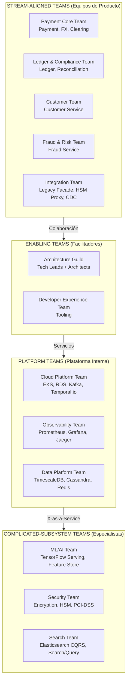
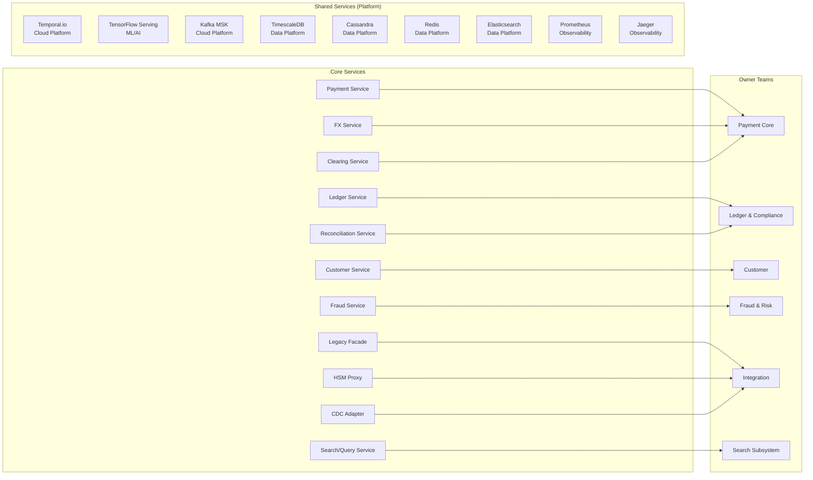
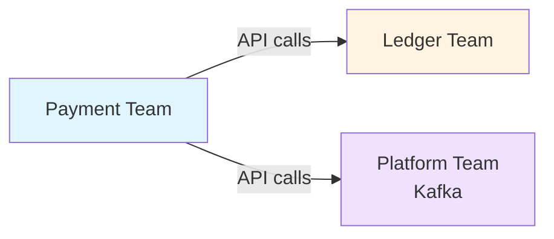
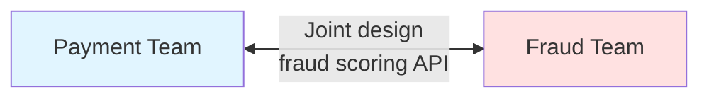
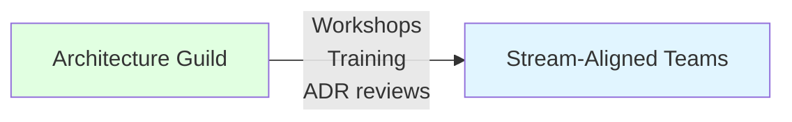
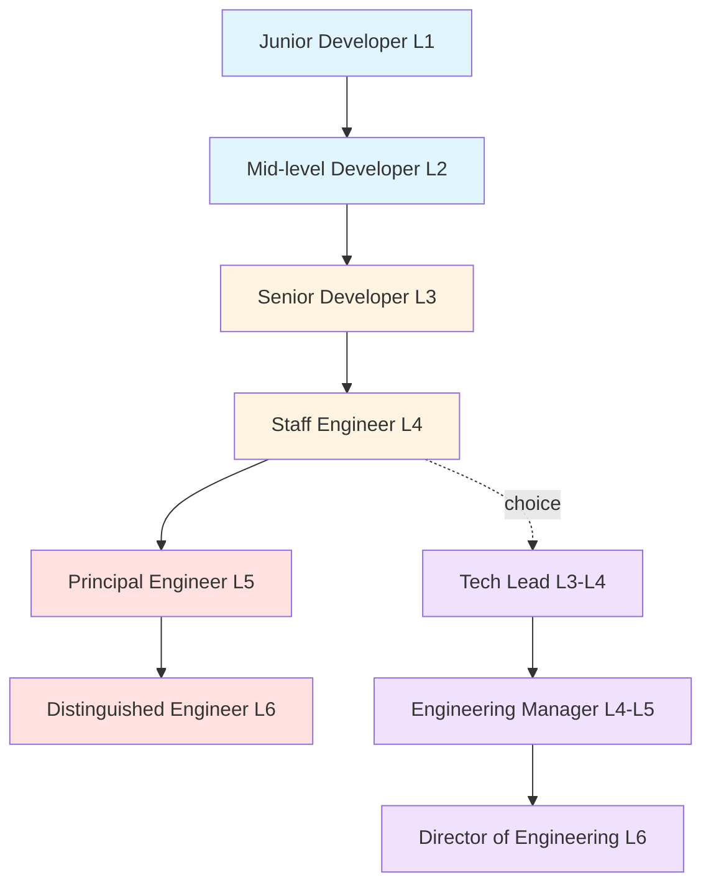

# Estrategia de Equipos - Team Topology

> **Objetivo**: Organizar equipos para maximizar autonomía y velocity  
> **Principio**: Inverse Conway Maneuver (diseñar org para arquitectura deseada)

---

## 🎯 Team Topologies (Matthew Skelton & Manuel Pais)

### Tipos de Equipos



---

## 👥 Stream-Aligned Teams (Equipos de Producto)

### Team 1: Payment Core Team

**Bounded Context**: Payment Execution Context (CORE)

**Misión**: Orquestación de pagos globales con validación, reserva de fondos y routing a 50+ redes bancarias

**Servicios Owned**:
- Payment Service (Spring WebFlux + R2DBC PostgreSQL)
- Saga Orchestrator (Temporal.io para transacciones distribuidas)

**Composición** (9 personas):
```yaml
Roles:
  - Tech Lead (1): Arquitectura reactiva + event sourcing
  - Backend Developers (5): Spring WebFlux, R2DBC, Kafka
  - Frontend Developer (1): React (admin panel)
  - QA Engineer (1): Testing + Chaos Engineering
  - Product Owner (1): Priorización de features
  
Skills requeridas:
  - Java 21, Spring Boot 3.2, WebFlux
  - Reactive Programming (Project Reactor)
  - Saga pattern (Temporal.io workflows)
  - Event Sourcing + CQRS
  - Financial domain (SWIFT, SEPA, PIX protocols)
  - PCI-DSS compliance (tokenización, HSM)
```

**OKRs (Q1 2025)**:
```yaml
Objective: Escalar a 1M TPS con latencia < 200ms
  KeyResults:
    - Latency p99: 1.2s → 200ms
    - Throughput pico: 50K TPS → 200K TPS (paso intermedio a 1M)
    - Payment success rate: 98% → 99.5%
    - Zero PCI-DSS violations
```

**Interaction Modes** (Context Map 2.3):
- Con Ledger Team: **Partnership** (joint design de eventos PaymentExecuted)
- Con Fraud Team: **Customer-Supplier** (Payment consume scoring síncrono < 50ms)
- Con Treasury Team: **Customer-Supplier** (Payment consume FX quotes síncrono)
- Con Platform Team: **X-as-a-Service** (consume EKS, RDS, Kafka, Temporal.io)

---

### Team 2: Ledger & Compliance Team

**Bounded Contexts**: 
- General Ledger Context (CORE)
- Reconciliation Context (SUPPORTING)
- Regulatory Reporting Context (SUPPORTING)

**Misión**: Contabilidad de doble entrada inmutable + reconciliación continua + reportes regulatorios

**Servicios Owned**:
- Ledger Service (Spring WebFlux + TimescaleDB Event Sourcing)
- Reconciliation Service (Spring Batch → Streaming migration)
- Regulatory Reporting Service (Spring Batch con validación pre-envío)

**Composición** (9 personas):
```yaml
Roles:
  - Tech Lead (1): Event Sourcing + TimescaleDB expert
  - Backend Developers (4): WebFlux (Ledger), Spring Batch (Reconciliation/Reporting)
  - Compliance Analyst (1): Regulatory requirements (AML/KYC)
  - Data Engineer (1): TimescaleDB hypertables, compression policies
  - QA Engineer (1): Testing + auditoría
  - Product Owner (1): Compliance roadmap

Skills:
  - Event Sourcing + CQRS pattern
  - TimescaleDB (continuous aggregates, compression)
  - Apache Kafka Streams
  - Financial regulations (AML, SAR reporting)
  - Accounting principles (double-entry ledger)
  - PCI-DSS (datos financieros sensibles)
```

**OKRs (Q1 2025)**:
```yaml
Objective: 100% auditoría compliance con reconciliación continua
  KeyResults:
    - Zero discrepancias en reconciliación diaria
    - Eliminar batch window: 6h → streaming continuo
    - Regulatory report submission: 100% on-time (0 retrasos)
    - Ledger write latency p99 < 50ms
```

**Interaction Modes** (Context Map 2.3):
- Con Payment Team: **Partnership** (eventos PaymentExecuted/PaymentFailed)
- Con Treasury Team: **Customer-Supplier** (Ledger consume extractos bancarios)
- Con Platform Team: **X-as-a-Service** (consume TimescaleDB, Kafka, S3)

---

### Team 3: Customer & Compliance Team

**Bounded Contexts**:
- Customer Management Context (SUPPORTING)
- Screening & Compliance Context (SUPPORTING)

**Misión**: Onboarding KYC + gestión de beneficiarios + screening de listas negras (OFAC/PEP)

**Servicios Owned**:
- Customer Service (Spring Boot + PostgreSQL: onboarding, KYC, beneficiarios)
- Screening Service (cache local de World-Check/ComplyAdvantage)

**Composición** (6 personas):
```yaml
Roles:
  - Tech Lead (1): GDPR + KYC expert
  - Backend Developers (2): Spring Boot, OAuth 2.0
  - Mobile Developer (1): React Native
  - Compliance Analyst (1): AML/KYC regulations
  - Product Owner (1)

Skills:
  - GDPR (crypto-shredding, right to erasure, consent management)
  - OAuth 2.0 / JWT (integración con Auth0/Keycloak)
  - KYC integrations (Jumio, Onfido webhooks)
  - Sanctions screening (World-Check, ComplyAdvantage)
  - Mobile development (iOS/Android)
```

**OKRs (Q1 2025)**:
```yaml
Objective: Onboarding automatizado con compliance 100%
  KeyResults:
    - Reducir onboarding time: 2 días → 4 horas (KYC automation)
    - Implementar biometric authentication (Face ID/Touch ID)
    - Screening latency < 2 segundos (cache World-Check)
    - Zero GDPR violation incidents
```

**Interaction Modes** (Context Map 2.3):
- Con Payment Team: **Upstream-Downstream** (Customer publica datos validados)
- Con Identity & Access (Auth0): **Conformist** (adaptarse a APIs de proveedor SaaS)
- Con External KYC Providers: **Anti-Corruption Layer** (wrapper sobre Jumio/Onfido)

---

### Team 5: Treasury & Clearing Team

**Bounded Contexts**:
- Treasury & FX Context (SUPPORTING)
- Clearing & Settlement Context (SUPPORTING)

**Misión**: Gestión de liquidez + cambio de divisas + comunicación con redes bancarias externas (SWIFT/SEPA/PIX)

**Servicios Owned**:
- FX Service (Spring WebFlux + Cassandra: FX rates con TTL 5min)
- Clearing Service (Spring Boot: ISO 20022, gateways SWIFT/SEPA/PIX/SPEI)
- Notification Service (Spring WebFlux: push/email/SMS via Firebase/Twilio)

**Composición** (7 personas):
```yaml
Roles:
  - Tech Lead (1): FX trading + network protocols expert
  - Backend Developers (3): ISO 20022, SWIFT Alliance APIs
  - Network Engineer (1): TCP persistent connections, VPN
  - QA Engineer (1): End-to-end testing con redes sandbox
  - Product Owner (1): Roadmap de nuevas redes (PIX, SPEI)

Skills:
  - ISO 20022 (pacs.008, pacs.002, camt.053)
  - SWIFT Alliance APIs
  - FX trading concepts (spot rate, spread)
  - Network protocols (TCP, TLS)
```

**OKRs (Q1 2025)**:
```yaml
Objective: Expandir cobertura de redes de pago
  KeyResults:
    - Integrar PIX (Brasil) en 8 semanas
    - Integrar SPEI (México) en 6 semanas
    - FX rate staleness < 1 segundo (p99)
    - Clearing success rate > 99.5%
```

---

### Team 6: Integration Team

**Bounded Context**: N/A (Integration Layer transversal)

**Misión**: Migración Strangler Fig del Legacy Monolito + integración HSM + CDC bidireccional

**Servicios Owned**:
- Legacy Facade (Spring Boot: Anti-Corruption Layer para monolito Java 8 + Oracle)
- HSM Proxy (Netty: firma criptográfica con Thales HSM on-premise)
- CDC Adapter (Debezium Kafka Connect: sincronización bidireccional)

**Composición** (7 personas):
```yaml
Roles:
  - Tech Lead (1): Legacy systems + Strangler Fig expert
  - Backend Developers (3): Oracle PL/SQL migration + Java Spring Boot
  - Infrastructure Engineer (1): Direct Connect AWS, VPN on-premise HSM
  - Security Engineer (1): HSM APIs (Thales, nCipher)
  - QA Engineer (1): Integration testing (Testcontainers, CDC validation)

Skills:
  - Oracle 11g (PL/SQL, triggers, stored procedures)
  - Debezium CDC (Kafka Connect source/sink connectors)
  - SOAP/XML legacy protocols
  - HSM APIs (PKCS#11, Thales payShield)
  - Anti-Corruption Layer pattern
```

**OKRs (Q1 2025)**:
```yaml
Objective: Migrar 70% del tráfico a microservicios (Strangler Fig Fase 2)
  KeyResults:
    - CDC lag p99 < 2 segundos
    - Legacy system downtime during migration: 0 segundos (zero-downtime)
    - Rollback capability < 5 minutos (feature flags + CDC rewind)
    - HSM signing latency p99 < 100ms
```

**Interaction Modes** (Context Map 2.3):
- Con Payment Team: **Customer-Supplier** (Payment depende de HSM Proxy para firmas)
- Con Ledger Team: **Customer-Supplier** (Ledger consume CDC events del monolito)
- Con Platform Team: **X-as-a-Service** (consume Debezium, Kafka Connect)
- Con Legacy Monolito: **Anti-Corruption Layer** (protege bounded contexts modernos)

---

### Team 4: Fraud & Risk Team

**Bounded Context**: Fraud Detection Context (CORE)

**Misión**: Motor ML de detección de fraude con SLA < 100ms para scoring en tiempo real

**Servicios Owned**:
- Fraud Engine (Spring WebFlux + TensorFlow Serving + Cassandra)
- Analytics Service (CQRS Read Models para dashboards)

**Composición** (9 personas):
```yaml
Roles:
  - Tech Lead (1): Real-time ML architect
  - Backend Developers (2): Spring WebFlux, gRPC
  - ML Engineers (3): Feature pipelines, model serving (TensorFlow Serving)
  - Data Scientist (1): Model design, A/B testing
  - Fraud Analyst (1): Rule tuning, false positive analysis
  - Product Owner (1)

Skills:
  - Machine Learning (TensorFlow 2.x, scikit-learn)
  - Real-time ML serving (< 50ms SLA con GPU)
  - Feature Store (Feast + Redis)
  - Cassandra (escritura masiva de scoring events)
  - Fraud patterns (velocity, geolocation, account takeover)
  - GDPR (anonimización, derecho al olvido)
```

**OKRs (Q1 2025)**:
```yaml
Objective: Reducir false positives sin aumentar fraude
  KeyResults:
    - False positives: 8% → 5%
    - Fraud detection rate: mantener > 95%
    - Model inference latency p99 < 50ms
    - Feature lookup latency (Redis) < 5ms
```

**Interaction Modes** (Context Map 2.3):
- Con Payment Team: **Upstream-Downstream** (Fraud publica risk scores síncrono)
- Con ML/AI Team: **Collaboration** (joint feature engineering)
- Con Ledger Team: **Customer-Supplier** (Fraud consulta historial transaccional)
- Con Platform Team: **X-as-a-Service** (consume Cassandra, Redis, GPU nodes)

---

## 🧠 Complicated-Subsystem Teams

### Team 6: ML/AI Team

**Misión**: Machine Learning models para Fraud Detection

**Responsabilidades**:
```yaml
Model Development:
  - Feature engineering (velocity, cross-border, unusual hours)
  - Model training (TensorFlow, XGBoost)
  - A/B testing (Modelo A vs Modelo B)
  - Explainability (SHAP values para auditoría)

Model Serving:
  - TensorFlow Serving en GPU (NVIDIA T4)
  - Latency target: < 30ms p99
  - Throughput: 8K requests/s
  - Fallback rules cuando model unavailable

Feature Store:
  - Redis (hot features, < 5ms lookup)
  - PostgreSQL (feature history)
  - Feast integration
```

**Composición** (5 personas):
```yaml
Roles:
  - ML Lead (1): Model architecture
  - ML Engineers (2): Feature pipelines, serving infrastructure
  - Data Scientist (1): Model design, validation
  - MLOps Engineer (1): Model deployment, monitoring

Skills:
  - TensorFlow 2.x
  - Kubernetes GPU scheduling
  - Model monitoring (drift detection)
  - Python + Java (for gRPC clients)
```

**OKRs (Q1 2025)**:
```yaml
Objective: Reducir false positives rate
  KeyResults:
    - False positives de 8% → 5% (sin aumentar false negatives)
    - Model inference latency p99 < 30ms
    - Zero model downtime (fallback rule activation < 100ms)
```

**Interaction Modes**:
- Con Fraud Team: **Collaboration** (joint feature design)
- Con Payment Team: **X-as-a-Service** (gRPC scoring API)
- Con Platform Team: **X-as-a-Service** (consume GPU nodes)

---

### Team 7: Security Team

**Misión**: Encryption, authentication, PCI-DSS compliance

**Responsabilidades**:
```yaml
Encryption:
  - AWS KMS key rotation
  - Field-level encryption (PII)
  - TLS certificate management
  - HSM operations (payment signing)

Authentication:
  - OAuth 2.0 server (Spring Authorization Server)
  - JWT validation
  - API key rotation
  - mTLS for service-to-service

Compliance:
  - PCI-DSS quarterly scans
  - Vulnerability assessments (Snyk, Trivy)
  - Security audits
  - Incident response
```

**Composición** (4 personas):
```yaml
Roles:
  - Security Lead (1): CISSP certified
  - Security Engineers (2): Penetration testing
  - Compliance Specialist (1): PCI-DSS, GDPR

Skills:
  - Cryptography (AES-256, RSA-2048)
  - OAuth 2.0 / OpenID Connect
  - AWS IAM, Security Groups
  - PCI-DSS requirements
```

**SLAs**:
```yaml
Services:
  - Security incident response: < 1 hora (24/7 on-call)
  - Vulnerability remediation: Critical < 24h, High < 7 days
  - Certificate renewal: 30 días antes de expiración
```

---

### Team 8: Search Team

**Misión**: CQRS Read Models y consultas de alta performance

**Servicios Owned**:
- Search/Query Service (Elasticsearch)

**Responsabilidades**:
```yaml
Elasticsearch Management:
  - Index design (sharding, replicas)
  - Query optimization (< 100ms p99)
  - Aggregations para analytics
  - Eventual consistency monitoring

Sync Pipelines:
  - Kafka Connect Elasticsearch Sink
  - Lag monitoring (< 5 segundos target)
  - Schema evolution

Search APIs:
  - Payment search (by customer, date range, amount)
  - Transaction history (pagination, filters)
  - Compliance queries (audit trail)
```

**Composición** (4 personas):
```yaml
Roles:
  - Search Lead (1): Elasticsearch expert
  - Backend Developers (2): Java + Elasticsearch queries
  - Data Engineer (1): Kafka pipelines

Skills:
  - Elasticsearch 8.x
  - Lucene query syntax
  - CQRS pattern
  - Kafka Connect
```

**OKRs (Q1 2025)**:
```yaml
Objective: Mejorar query performance
  KeyResults:
    - Query latency p99 < 100ms (actualmente 250ms)
    - Sync lag < 5 segundos (actualmente 15s)
    - Zero data loss en sync pipeline
```

---

## 🛠️ Platform Teams

### Cloud Platform Team

**Misión**: Proveer plataforma cloud-native self-service (EKS, RDS, Kafka, Temporal.io)

**Stack Tecnológico Managed** (según 3.4-Stack-Tecnologico.md):
```yaml
Compute:
  - Amazon EKS 1.28: Kubernetes cluster (3 AZ, 50-200 nodes auto-scaling)
  - EC2 Spot Instances: 70% costo vs On-Demand para workloads tolerantes
  
Databases:
  - Amazon RDS PostgreSQL 15: Databases transaccionales (Payment, Customer)
  - Amazon RDS Multi-AZ: 99.95% availability SLA
  
Messaging:
  - Amazon MSK (Managed Kafka) 3.5: Event streaming (10 brokers, RF=3)
  - Kafka Connect: Debezium CDC source/sink connectors
  
Orchestration:
  - Temporal.io Cloud: Saga orchestration (workflows durables)
  - Alternative: Self-hosted Temporal en EKS (considerar costo vs complejidad)
  
Networking:
  - AWS VPC: Subnets privadas (microservicios) + públicas (ALB)
  - AWS Direct Connect: 10 Gbps link a HSM on-premise
  - AWS Transit Gateway: VPN a legacy datacenter

Infrastructure as Code:
  - Terraform modules (EKS, RDS, MSK, Cassandra, Redis)
  - Helm charts reutilizables
  - CI/CD templates (GitHub Actions)

Developer Experience:
  - Service templates (cookiecutter)
  - Local development env (Docker Compose)
  - Documentation portal (Backstage)
```

**Composición** (8 personas):
```yaml
Roles:
  - Platform Lead (1)
  - SRE (4): Kubernetes, AWS, Temporal.io, networking
  - DevOps Engineer (2): CI/CD, automation
  - Security Engineer (1): IAM, encryption

On-call rotation: 24/7 (2 personas por semana)
```

**SLAs a Product Teams**:
```yaml
Services:
  - EKS cluster provision: < 1 hora
  - New service scaffold: < 15 min (cookiecutter)
  - CI/CD pipeline setup: < 30 min
  - Incident response: < 15 min (P0/P1)
  - RDS backup restore: < 2 horas
```

---

### Data Platform Team

**Misión**: Proveer almacenamiento especializado polyglot persistence

**Stack Tecnológico Managed** (según 3.4-Stack-Tecnologico.md):
```yaml
TimescaleDB (Ledger Service):
  - Self-hosted en RDS PostgreSQL 15 + TimescaleDB extension
  - Hypertables: chunk_time_interval = 1 day
  - Compression policies: 10x after 30 days (automated)
  - Continuous aggregates: materialización incremental
  - Backup/restore: PITR (Point-In-Time Recovery) con WAL archiving
  - Performance: 100K inserts/s (ledger entries)

Cassandra (FX Service + Fraud Service):
  - Self-hosted en EKS (StatefulSet)
  - 9-node cluster (3 per AZ, RF=3, CL=QUORUM)
  - FX rates con TTL 10 min (auto-expiration)
  - Fraud scoring events: escritura masiva 200K events/s
  - Compaction strategy: TimeWindowCompactionStrategy (TWCS)
  - Backup: Medusa (S3 snapshots diarios)

Redis Cluster (Caching + Feature Store):
  - Amazon ElastiCache Redis 7.0 (cluster mode enabled)
  - 6 shards × 2 replicas = 12 nodes
  - Eviction policy: allkeys-lru (LRU eviction)
  - Persistence: AOF (Append-Only File) every second
  - Use cases:
    * FX rate cache (5 min TTL)
    * Session store (JWT blacklist)
    * Feature Store (ML features para Fraud < 5ms)
    * Velocity counters (payment limits por beneficiario)
```

**Composición** (5 personas):
```yaml
Roles:
  - Data Platform Lead (1)
  - Cassandra DBA (1): Specialist
  - PostgreSQL DBA (1): RDS + TimescaleDB
  - Redis Engineer (1)
  - Data Engineer (1): ETL pipelines

Skills:
  - TimescaleDB hypertables
  - Cassandra CQL, nodetool
  - Redis data structures
```

**SLAs**:
```yaml
Services:
  - Database provision: < 2 horas
  - Query optimization: < 1 día turnaround
  - Backup restore: < 4 horas (RTO)
  - Data loss: < 5 min (RPO)
```

---

### Observability Team

**Misión**: Proveer visibilidad end-to-end de la plataforma (Golden Signals: Latency, Traffic, Errors, Saturation)

**Stack Tecnológico** (según C2-Contenedores.md):
```yaml
Metrics (Prometheus + Grafana):
  - Prometheus: scraping de /actuator/prometheus endpoints (Spring Boot)
  - Grafana: dashboards RED (Rate, Errors, Duration)
  - SLO tracking: 99.9% availability, p99 latency < 200ms
  - Alerting: PagerDuty integration (P0/P1 incidents)
  - Custom exporters: Kafka lag exporter, Cassandra nodetool exporter
  - Métricas clave:
    * Payment throughput (req/s)
    * Ledger write latency (ms)
    * Fraud scoring latency (ms)
    * Kafka consumer lag (messages)

Tracing (Jaeger):
  - OpenTelemetry SDK: Java agent auto-instrumentation
  - Distributed tracing: trace_id propagado via HTTP headers + Kafka headers
  - Latency breakdown: identificar bottlenecks (DB queries, external APIs)
  - Dependency graphs: service topology dinámico
  - Sampling: 100% for errors, 1% for successful requests (high volume)

Logging (ELK Stack):
  - Elasticsearch 8.x: índices por día (payments-2025.01.15)
  - Logstash: parsing de logs estructurados (JSON)
  - Kibana: dashboards de errores, auditoría
  - Retention: 30 días hot, 90 días warm (S3), 7 años cold (Glacier)
  - Queries comunes:
    * Error rate por servicio
    * Audit trail de cambios en ledger
    * PCI-DSS compliance logs (accesos a datos sensibles)
```

**Composición** (6 personas):
```yaml
Roles:
  - Observability Lead (1): SRE + monitoring expert
  - Platform Engineers (3): Prometheus, Jaeger, ELK
  - Data Engineer (1): Log ingestion pipelines
  - On-call Engineer (1): 24/7 incident response

Skills:
  - Prometheus (PromQL queries, alerting rules)
  - Grafana (dashboard design, templating)
  - OpenTelemetry (instrumentation, context propagation)
  - Elasticsearch (index management, query optimization)
  - PagerDuty (incident management)
```

**SLAs**:
```yaml
Services:
  - New service dashboard: < 1 hora
  - Alert rule creation: < 30 min
  - Incident investigation: < 15 min response
  - Metrics retention: 15 días (Prometheus), 1 año (VictoriaMetrics long-term storage)
  - Log retention: 30 días hot, 90 días warm (S3), 7 años cold (Glacier)
```
```

**Key Dashboards Provided**:
```yaml
Golden Signals Dashboard:
  - Request rate (per service)
  - Error rate (5xx responses)
  - Latency p50/p99 (per endpoint)
  - Saturation (CPU, memory, disk)

Business Metrics Dashboard:
  - Payment volume (TPS)
  - Revenue (daily/monthly)
  - Fraud detection rate
  - Customer onboarding funnel

SLO Dashboard:
  - Availability (per service tier)
  - Error budget remaining
  - Incident count
```

---

## 🧠 Enabling Teams

### Architecture Guild

**Misión**: Evolucionar arquitectura, compartir conocimiento

**Composición**:
- Tech Leads de cada Stream-Aligned Team (4)
- Enterprise Architect (1)
- Principal Engineer (1)

**Actividades**:
```yaml
Weekly Architecture Review:
  - Review de ADRs (Architecture Decision Records)
  - Evaluation de nuevas tecnologías
  - Cross-team design discussions

Monthly Tech Radar:
  - Assess: Tecnologías a evaluar (e.g., Quarkus)
  - Trial: En prueba (e.g., Apache Pulsar)
  - Adopt: Aprobadas (e.g., Spring Boot 3)
  - Hold: Deprecadas (e.g., Java 8)

Quarterly Architecture Kata:
  - Práctica de diseño de arquitectura
  - Mejora continua de skills
```

---

### Developer Experience Team

**Misión**: Reducir friction en desarrollo

**Composición** (3 personas):
```yaml
Roles:
  - DX Lead (1)
  - Frontend Tooling Engineer (1): Build optimization
  - Backend Tooling Engineer (1): Testing frameworks
```

**Iniciativas**:
```yaml
Tooling:
  - Local dev env en 5 min (Docker Compose)
  - Hot reload para Spring Boot (Spring DevTools)
  - API mocking (WireMock)

Documentation:
  - Backstage catalog (todos los servicios)
  - ADRs repository (architecture decisions)
  - Runbooks (incident response)

Metrics:
  - Build time: Target < 5 min
  - Test execution: Target < 3 min
  - Onboarding new dev: Target < 1 día productivo
```

---

## � Resumen: Equipos y Servicios

### Mapping Completo

| Team | Type | Services Owned | Headcount | Key Technologies |
|------|------|----------------|-----------|------------------|
| **Payment Core** | Stream-Aligned | Payment, FX, Clearing | 8 | Spring Boot, Kafka, SWIFT/SEPA/PIX |
| **Ledger & Compliance** | Stream-Aligned | Ledger, Reconciliation, Compliance | 7 | TimescaleDB, Kafka Streams, Flink |
| **Customer** | Stream-Aligned | Customer | 5 | Spring Boot, OAuth 2.0, React Native |
| **Fraud & Risk** | Stream-Aligned | Fraud, Analytics | 8 | TensorFlow (via ML Team), Prometheus |
| **Integration** | Stream-Aligned | Legacy Facade, HSM Proxy, CDC Adapter | 6 | Oracle PL/SQL, Debezium, SOAP |
| **ML/AI** | Complicated-Subsystem | (TensorFlow Serving, Feature Store) | 5 | TensorFlow, Kubernetes GPU, gRPC |
| **Security** | Complicated-Subsystem | (Auth, Encryption, Compliance) | 4 | AWS KMS, OAuth 2.0, PCI-DSS |
| **Search** | Complicated-Subsystem | Search/Query | 4 | Elasticsearch, Kafka Connect |
| **Cloud Platform** | Platform | (EKS, RDS, MSK, Temporal.io) | 7 | Terraform, Kubernetes, AWS |
| **Data Platform** | Platform | (TimescaleDB, Cassandra, Redis) | 5 | PostgreSQL, Cassandra, Redis |
| **Observability** | Platform | (Prometheus, Jaeger, ELK) | 4 | Prometheus, Grafana, Elasticsearch |
| **Architecture Guild** | Enabling | (ADR reviews, Tech Radar) | 6 part-time | Architecture patterns |
| **Developer Experience** | Enabling | (Tooling, Backstage) | 3 | Docker, Backstage, CI/CD |
| **TOTAL** | | **10 servicios + plataforma** | **62** | |

### Service Ownership Matrix



---

## �🔄 Interaction Modes

### X-as-a-Service



**Características**:
- Contrato claro (OpenAPI spec)
- SLA definido (99.9% availability)
- Minimal communication overhead

---

### Collaboration



**Cuándo usar**:
- Nuevos features que afectan múltiples teams
- Refactoring de interfaces compartidas
- Incident postmortems

---

### Facilitation



**Ejemplos**:
- Workshop de Event Sourcing (2 días)
- Code review sessions
- Architecture katas mensuales

---

## 📊 Métricas de Team Health

### DORA Metrics

```yaml
Deployment Frequency:
  Current: 10 deploys/día
  Target: 20 deploys/día
  
Lead Time for Changes:
  Current: 2 horas (commit → production)
  Target: 1 hora
  
Mean Time to Recovery (MTTR):
  Current: 15 minutos
  Target: 10 minutos
  
Change Failure Rate:
  Current: 5%
  Target: < 3%
```

### Team Autonomy Score

```yaml
Assessment (escala 1-5):
  - Can deploy without approval: 5 (fully autonomous)
  - Can choose tech stack: 4 (within governance)
  - Can change DB schema: 5 (own databases)
  - Can provision infrastructure: 3 (via Platform Team)
  
Average: 4.25/5 (High autonomy)
```

---

## 🎓 Career Path

### Individual Contributor (IC) Track



**Ejemplo - Staff Engineer (L4)**:
```yaml
Scope: Multiple services (Payment + FX + Clearing)
Responsibilities:
  - Architecture design para Payment domain
  - Mentorship de 3-5 developers
  - On-call rotation (1 week/month)
  - Technical debt management
  
Expected Impact:
  - Delivery: 1 major feature/quarter
  - Quality: Code review for critical changes
  - Knowledge sharing: 1 tech talk/month
```

---

## 🚀 Scaling Strategy

### Current (Year 1): 55 personas

```
Stream-Aligned Teams (6 teams):
  - Payment Core Team: 9 personas
  - Ledger & Compliance Team: 9 personas
  - Customer & Compliance Team: 6 personas
  - Fraud & Risk Team: 9 personas
  - Treasury & Clearing Team: 7 personas
  - Integration Team: 7 personas
  Subtotal: 47 personas

Platform Teams (3 teams):
  - Cloud Platform Team: 8 personas
  - Data Platform Team: 6 personas
  - Observability Team: 6 personas
  Subtotal: 20 personas

Complicated-Subsystem Teams (2 teams):
  - ML/AI Team: 5 personas
  - Security Team: 6 personas
  - Search Team: 4 personas (CQRS Read Models)
  Subtotal: 15 personas

Enabling Teams:
  - Architecture Guild: 4 personas (Tech Leads part-time)
  - Developer Experience Team: 3 personas
  Subtotal: 7 personas
────────────────────────────────────
Total = 89 personas
```

### Future (Year 3): 110 personas

**Growth Areas**:
- Split Payment Core → Payment Execution (6) + FX Trading (6)
- Split Ledger & Compliance → Ledger (6) + Compliance & Reporting (6)
- New: Analytics & BI Team (8 personas)
- Grow Platform teams: Cloud (10), Data (8), Observability (8)

**Scaling Principles**:
- Max team size: 9 personas (2-pizza teams)
- Cognitive load: 1 team = 1-3 bounded contexts
- Split teams when owning > 3 services or team size > 9

---

**Conclusión**: Organización alineada 1:1 con bounded contexts del diseño estratégico y arquitectura de microservicios, maximizando autonomía y velocity. Cada Stream-Aligned Team mapea directamente a uno o más bounded contexts relacionados, con Interaction Modes definidos según Context Map de la Fase 2.

---

**Última actualización**: 30 de diciembre de 2025
