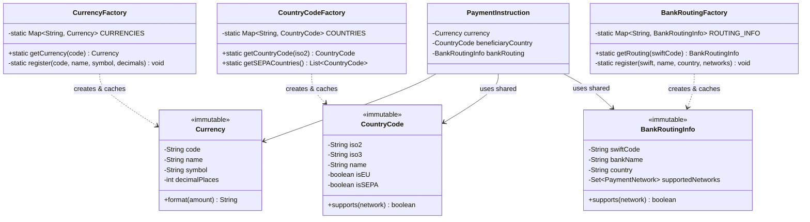

# Patrón 2: Flyweight

> **Problema**: 500K objetos PaymentInstruction crean millones de instancias duplicadas de Currency, CountryCode, BankRoutingInfo  
> **Solución**: Flyweight pattern con factories que cachean objetos inmutables compartidos

---

## 🎯 Problema: Duplicación Masiva de Objetos Inmutables

### Memory Profiling (Heap Dump con VisualVM)

```
500,000 PaymentInstruction × duplicaciones:
  - Currency objects: 500K × 500 bytes = 250 MB
    (10 divisas: USD, EUR, GBP, MXN, BRL, COP, CLP, ARS, PEN, UYU)
  - CountryCode objects: 500K × 300 bytes = 150 MB
    (50 países: US, MX, BR, CO, AR, CL, PE, UY, ES, DE, FR...)
  - BankRoutingInfo: 500K × 4 KB = 2,000 MB
    (SWIFT codes de 50 bancos populares)

Total Desperdicio: 2.4 GB en objetos duplicados
```

**Ejemplo de Duplicación**:
```java
// Sin Flyweight: 100,000 pagos a México crean 100,000 Currency("MXN")
for (int i = 0; i < 100_000; i++) {
    Currency mxn = new Currency("MXN", "Mexican Peso", "$", 2);  // Duplicado
    payment.setCurrency(mxn);
}
// Heap: 100,000 × 500 bytes = 50 MB desperdiciados
```

---

## 📐 Diagrama de Clases



---

## 💻 Implementación Java

### Currency (Flyweight)

```java
package com.finscale.payment.flyweight;

import lombok.EqualsAndHashCode;
import lombok.Getter;
import lombok.ToString;

import java.math.BigDecimal;
import java.text.NumberFormat;
import java.util.Locale;

/**
 * Flyweight: Currency inmutable compartida
 */
@Getter
@ToString
@EqualsAndHashCode(of = "code")
public final class Currency {
    
    private final String code;        // USD, EUR, MXN
    private final String name;        // US Dollar
    private final String symbol;      // $
    private final int decimalPlaces;  // 2
    
    // Constructor privado (solo Factory puede crear)
    Currency(String code, String name, String symbol, int decimalPlaces) {
        this.code = code;
        this.name = name;
        this.symbol = symbol;
        this.decimalPlaces = decimalPlaces;
    }
    
    /**
     * Formatear monto con símbolo de divisa
     */
    public String format(BigDecimal amount) {
        NumberFormat formatter = NumberFormat.getCurrencyInstance(Locale.US);
        formatter.setMaximumFractionDigits(decimalPlaces);
        return symbol + " " + formatter.format(amount);
    }
}
```

### CurrencyFactory (Flyweight Factory)

```java
package com.finscale.payment.flyweight;

import lombok.extern.slf4j.Slf4j;

import java.util.Map;
import java.util.concurrent.ConcurrentHashMap;

/**
 * Factory: Pool de Currency compartidas (Flyweight Pattern)
 */
@Slf4j
public class CurrencyFactory {
    
    // Pool estático de divisas (inmutables, thread-safe)
    private static final Map<String, Currency> CURRENCIES = new ConcurrentHashMap<>();
    
    static {
        // Inicializar 10 divisas más usadas en Gig Economy
        register("USD", "US Dollar", "$", 2);
        register("EUR", "Euro", "€", 2);
        register("GBP", "British Pound", "£", 2);
        register("MXN", "Mexican Peso", "$", 2);
        register("BRL", "Brazilian Real", "R$", 2);
        register("COP", "Colombian Peso", "$", 2);
        register("CLP", "Chilean Peso", "$", 0);
        register("ARS", "Argentine Peso", "$", 2);
        register("PEN", "Peruvian Sol", "S/", 2);
        register("UYU", "Uruguayan Peso", "$", 2);
        
        log.info("CurrencyFactory initialized with {} currencies", CURRENCIES.size());
    }
    
    /**
     * Obtener Currency compartida (Flyweight)
     */
    public static Currency getCurrency(String code) {
        Currency currency = CURRENCIES.get(code);
        
        if (currency == null) {
            throw new IllegalArgumentException("Currency not supported: " + code);
        }
        
        return currency;  // Retorna instancia compartida
    }
    
    /**
     * Registrar nueva divisa en pool
     */
    private static void register(String code, String name, String symbol, int decimals) {
        CURRENCIES.put(code, new Currency(code, name, symbol, decimals));
    }
    
    /**
     * Estadísticas del pool (para Prometheus)
     */
    public static int getPoolSize() {
        return CURRENCIES.size();
    }
}
```

### CountryCode (Flyweight)

```java
package com.finscale.payment.flyweight;

import lombok.EqualsAndHashCode;
import lombok.Getter;
import lombok.ToString;

/**
 * Flyweight: CountryCode inmutable compartido
 */
@Getter
@ToString
@EqualsAndHashCode(of = "iso2")
public final class CountryCode {
    
    private final String iso2;     // MX
    private final String iso3;     // MEX
    private final String name;     // Mexico
    private final boolean isEU;    // ¿Es miembro de UE?
    private final boolean isSEPA;  // ¿Participa en SEPA?
    
    CountryCode(String iso2, String iso3, String name, boolean isEU, boolean isSEPA) {
        this.iso2 = iso2;
        this.iso3 = iso3;
        this.name = name;
        this.isEU = isEU;
        this.isSEPA = isSEPA;
    }
    
    /**
     * Verificar si país soporta red de pago específica
     */
    public boolean supports(PaymentNetwork network) {
        return switch (network) {
            case SEPA -> isSEPA;
            case SWIFT -> true;  // Universal
            case ACH -> iso2.equals("US");
            case PIX -> iso2.equals("BR");
            default -> false;
        };
    }
}
```

### CountryCodeFactory

```java
package com.finscale.payment.flyweight;

import lombok.extern.slf4j.Slf4j;

import java.util.List;
import java.util.Map;
import java.util.concurrent.ConcurrentHashMap;
import java.util.stream.Collectors;

@Slf4j
public class CountryCodeFactory {
    
    private static final Map<String, CountryCode> COUNTRIES = new ConcurrentHashMap<>();
    
    static {
        // Latinoamérica (principales mercados Gig Economy)
        register("MX", "MEX", "Mexico", false, false);
        register("BR", "BRA", "Brazil", false, false);
        register("CO", "COL", "Colombia", false, false);
        register("AR", "ARG", "Argentina", false, false);
        register("CL", "CHL", "Chile", false, false);
        register("PE", "PER", "Peru", false, false);
        register("UY", "URY", "Uruguay", false, false);
        
        // Europa (zona SEPA)
        register("ES", "ESP", "Spain", true, true);
        register("DE", "DEU", "Germany", true, true);
        register("FR", "FRA", "France", true, true);
        register("IT", "ITA", "Italy", true, true);
        register("PT", "PRT", "Portugal", true, true);
        
        // Norteamérica
        register("US", "USA", "United States", false, false);
        register("CA", "CAN", "Canada", false, false);
        
        // ... 36 países más
        
        log.info("CountryCodeFactory initialized with {} countries", COUNTRIES.size());
    }
    
    public static CountryCode getCountryCode(String iso2) {
        CountryCode country = COUNTRIES.get(iso2);
        
        if (country == null) {
            throw new IllegalArgumentException("Country not supported: " + iso2);
        }
        
        return country;
    }
    
    /**
     * Obtener lista de países SEPA (útil para validación)
     */
    public static List<CountryCode> getSEPACountries() {
        return COUNTRIES.values().stream()
            .filter(CountryCode::isSEPA)
            .collect(Collectors.toList());
    }
    
    private static void register(String iso2, String iso3, String name, boolean isEU, boolean isSEPA) {
        COUNTRIES.put(iso2, new CountryCode(iso2, iso3, name, isEU, isSEPA));
    }
    
    public static int getPoolSize() {
        return COUNTRIES.size();
    }
}
```

### BankRoutingInfo (Flyweight)

```java
package com.finscale.payment.flyweight;

import lombok.EqualsAndHashCode;
import lombok.Getter;
import lombok.ToString;

import java.util.Set;

/**
 * Flyweight: Información de routing bancario compartida
 */
@Getter
@ToString
@EqualsAndHashCode(of = "swiftCode")
public final class BankRoutingInfo {
    
    private final String swiftCode;  // CHASUS33
    private final String bankName;   // JP Morgan Chase
    private final String country;    // US
    private final Set<PaymentNetwork> supportedNetworks;
    
    BankRoutingInfo(String swiftCode, String bankName, String country, Set<PaymentNetwork> networks) {
        this.swiftCode = swiftCode;
        this.bankName = bankName;
        this.country = country;
        this.supportedNetworks = networks;
    }
    
    /**
     * Verificar si banco soporta red de pago
     */
    public boolean supports(PaymentNetwork network) {
        return supportedNetworks.contains(network);
    }
}
```

### BankRoutingFactory

```java
package com.finscale.payment.flyweight;

import lombok.extern.slf4j.Slf4j;

import java.util.Map;
import java.util.Set;
import java.util.concurrent.ConcurrentHashMap;

@Slf4j
public class BankRoutingFactory {
    
    private static final Map<String, BankRoutingInfo> ROUTING_INFO = new ConcurrentHashMap<>();
    
    static {
        // Bancos estadounidenses
        register("CHASUS33", "JP Morgan Chase", "US", Set.of(PaymentNetwork.SWIFT, PaymentNetwork.ACH));
        register("CITIUS33", "Citibank", "US", Set.of(PaymentNetwork.SWIFT, PaymentNetwork.ACH));
        register("BOFAUS3N", "Bank of America", "US", Set.of(PaymentNetwork.SWIFT, PaymentNetwork.ACH));
        
        register("DEUTDEFF", "Deutsche Bank", "DE", Set.of(PaymentNetwork.SWIFT, PaymentNetwork.SEPA));
        register("BNPAFRPP", "BNP Paribas", "FR", Set.of(PaymentNetwork.SWIFT, PaymentNetwork.SEPA));
        register("BSCHESMM", "Banco Santander", "ES", Set.of(PaymentNetwork.SWIFT, PaymentNetwork.SEPA));
        
        // Latinoamérica
        register("BNMXMXMM", "Banamex", "MX", Set.of(PaymentNetwork.SWIFT, PaymentNetwork.SPEI));
        register("BCBRBRRJ", "Banco do Brasil", "BR", Set.of(PaymentNetwork.SWIFT, PaymentNetwork.PIX));
        register("COLOCOBM", "Bancolombia", "CO", Set.of(PaymentNetwork.SWIFT, PaymentNetwork.PSE));
        
        // ... 190+ bancos más
        
        log.info("BankRoutingFactory initialized with {} banks", ROUTING_INFO.size());
    }
    
    public static BankRoutingInfo getRouting(String swiftCode) {
        BankRoutingInfo routing = ROUTING_INFO.get(swiftCode);
        
        if (routing == null) {
            throw new IllegalArgumentException("Bank not found: " + swiftCode);
        }
        
        return routing;
    }
    
    private static void register(String swift, String name, String country, Set<PaymentNetwork> networks) {
        ROUTING_INFO.put(swift, new BankRoutingInfo(swift, name, country, networks));
    }
    
    public static int getPoolSize() {
        return ROUTING_INFO.size();
    }
}
```

---

## 🔧 Integración en PaymentInstructionBuilder

```java
public class PaymentInstructionBuilder {
    
    public PaymentInstructionBuilder withCurrency(String currencyCode) {
        // Flyweight: Obtener Currency compartida
        instruction.setCurrency(CurrencyFactory.getCurrency(currencyCode));
        return this;
    }
    
    public PaymentInstructionBuilder withBeneficiaryCountry(String countryCode) {
        // Flyweight: Obtener CountryCode compartido
        instruction.setBeneficiaryCountry(CountryCodeFactory.getCountryCode(countryCode));
        return this;
    }
    
    public PaymentInstructionBuilder withBeneficiaryBank(String swiftCode) {
        // Flyweight: Obtener BankRoutingInfo compartido
        instruction.setBankRouting(BankRoutingFactory.getRouting(swiftCode));
        return this;
    }
}
```

---

## 📊 Análisis de Impacto en Memoria

### Heap Dump Comparison

**Antes de Flyweight** (500K instrucciones):

| Objeto | Instancias | Shallow Heap | Retained Heap |
|--------|-----------|--------------|---------------|
| Currency                  | 500,000   | 250 MB       | 250 MB
| CountryCode               | 500,000   | 150 MB       | 150 MB
| BankRoutingInfo           | 500,000   | 2,000 MB     | 2,000 MB
| PaymentInstruction        | 500,000   | 3,200 MB     | 5,600 MB
| **Total**                 | -         | -            | **8.0 GB**

**Después de Flyweight** (500K instrucciones):

| Objeto | Instancias | Shallow Heap | Retained Heap |
|--------|-----------|--------------|---------------|
| Currency                  | 10        | 5 KB         | 5 KB
| CountryCode               | 50        | 15 KB        | 15 KB
| BankRoutingInfo           | 200       | 800 KB       | 800 KB
| PaymentInstruction        | 500,000   | 3,200 MB     | 3,200 MB (solo referencias)
| **Total**                 | -         | -            | **3.2 GB**

**Reducción**: 8.0 GB → 3.2 GB = **-60% memoria total**  
**En objetos compartidos**: 2.4 GB → 820 KB = **-99.97%**

---

## 🎯 Ventajas del Flyweight Pattern

### 1. Memoria Compartida

```java
// Sin Flyweight: 500K Currency("USD") objetos
for (int i = 0; i < 500_000; i++) {
    Currency usd = new Currency("USD", "US Dollar", "$", 2);  // Nuevo objeto
}
// Heap: 500K × 500 bytes = 250 MB

// Con Flyweight: 1 Currency("USD") compartida
Currency usd = CurrencyFactory.getCurrency("USD");  // Singleton
for (int i = 0; i < 500_000; i++) {
    payment.setCurrency(usd);  // Referencia compartida
}
// Heap: 1 × 500 bytes = 500 bytes
```

### 2. Thread-Safety por Inmutabilidad

```java
// Currency es inmutable (final fields)
public final class Currency {
    private final String code;  // No puede cambiar
    private final String name;
}

// Thread-safe sin locks
CompletableFuture.runAsync(() -> {
    Currency usd = CurrencyFactory.getCurrency("USD");
    usd.format(amount);  // Safe
});
```

### 3. Comparación por Identidad (==)

```java
Currency usd1 = CurrencyFactory.getCurrency("USD");
Currency usd2 = CurrencyFactory.getCurrency("USD");

// Con Flyweight: misma instancia
assert usd1 == usd2;  // true (identity, no equals)
```

---

## 📈 Métricas con Prometheus

```java
@Component
public class FlyweightMetrics {
    
    @Gauge(name = "flyweight.currency.pool.size")
    public int currencyPoolSize() {
        return CurrencyFactory.getPoolSize();
    }
    
    @Gauge(name = "flyweight.country.pool.size")
    public int countryPoolSize() {
        return CountryCodeFactory.getPoolSize();
    }
    
    @Gauge(name = "flyweight.bank_routing.pool.size")
    public int bankRoutingPoolSize() {
        return BankRoutingFactory.getPoolSize();
    }
}
```

**Grafana Dashboard Query**:
```promql
# Total objetos compartidos
sum(flyweight_currency_pool_size) + 
sum(flyweight_country_pool_size) + 
sum(flyweight_bank_routing_pool_size)

# Resultado: 10 + 50 + 200 = 260 objetos compartidos por 500K instrucciones
```

---

**WHY Flyweight Pattern**: 
- **Problema**: 500K objetos duplican Currency/CountryCode/BankRouting (2.4 GB desperdicio)
- **Solución**: Flyweight factories con pools estáticos de objetos inmutables
- **Medible**: 8 GB → 3.2 GB (-60%), 2.4 GB objetos compartidos → 820 KB (-99.97%)

---

**Siguiente**: [Patrón Chain of Responsibility](3-Chain-Responsibility.md)
