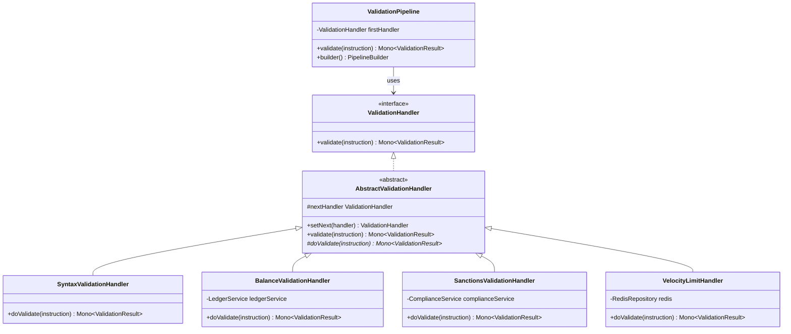

# Patrón 3: Chain of Responsibility

> **Problema**: Pipeline de validación acoplado con if-else gigantes, impossible activar/desactivar validators sin redeploy  
> **Solución**: Chain of Responsibility con handlers desacoplados

---

## 🎯 Problema: Validación Acoplada

### Legacy Code

```java
public Mono<ValidationResult> validate(PaymentInstruction instruction) {
    // 200+ líneas de if-else anidados
    
    if (instruction.getAmount().compareTo(BigDecimal.ZERO) <= 0) {
        return Mono.just(ValidationResult.error("Invalid amount"));
    }
    
    if (!isValidIBAN(instruction.getBeneficiaryIban())) {
        return Mono.just(ValidationResult.error("Invalid IBAN"));
    }
    
    // Llamada síncrona bloqueante
    boolean hasSufficientBalance = ledgerService.checkBalance(instruction);
    if (!hasSufficientBalance) {
        return Mono.just(ValidationResult.error("Insufficient balance"));
    }
    
    // Más validaciones...
    // Impossible desactivar sanctions check sin modificar código
    boolean isInSanctionsList = sanctionsService.check(instruction);
    if (isInSanctionsList) {
        return Mono.just(ValidationResult.error("Beneficiary in sanctions list"));
    }
    
    return Mono.just(ValidationResult.success());
}
```

**Problemas**:
- ❌ Acoplamiento fuerte (validaciones hardcodeadas)
- ❌ Impossible desactivar/activar validators en runtime
- ❌ Llamadas síncronas bloquean el hilo
- ❌ Difícil agregar nuevos validators

---

## 📐 Diagrama de Clases



---

## 💻 Implementación Java

### ValidationHandler (Interface)

```java
package com.finscale.payment.validation;

import com.finscale.payment.domain.PaymentInstruction;
import reactor.core.publisher.Mono;

public interface ValidationHandler {
    
    Mono<ValidationResult> validate(PaymentInstruction instruction);
    
    ValidationHandler setNext(ValidationHandler handler);
}
```

### AbstractValidationHandler (Template)

```java
package com.finscale.payment.validation;

import com.finscale.payment.domain.PaymentInstruction;
import lombok.extern.slf4j.Slf4j;
import reactor.core.publisher.Mono;

@Slf4j
public abstract class AbstractValidationHandler implements ValidationHandler {
    
    protected ValidationHandler nextHandler;
    
    @Override
    public ValidationHandler setNext(ValidationHandler handler) {
        this.nextHandler = handler;
        return handler;
    }
    
    @Override
    public Mono<ValidationResult> validate(PaymentInstruction instruction) {
        
        return doValidate(instruction)
            .flatMap(result -> {
                if (!result.isValid()) {
                    log.warn("Validation failed at {}: {}", 
                        getClass().getSimpleName(), result.getErrors());
                    return Mono.just(result);
                }
                
                // Continue to next handler
                if (nextHandler != null) {
                    return nextHandler.validate(instruction);
                }
                
                return Mono.just(ValidationResult.success());
            });
    }
    
    /**
     * Template Method: Cada handler implementa su lógica específica
     */
    protected abstract Mono<ValidationResult> doValidate(PaymentInstruction instruction);
}
```

### SyntaxValidationHandler

```java
package com.finscale.payment.validation;

import com.finscale.payment.domain.PaymentInstruction;
import com.finscale.payment.domain.PaymentNetwork;
import lombok.extern.slf4j.Slf4j;
import org.springframework.stereotype.Component;
import reactor.core.publisher.Mono;

import java.util.regex.Pattern;

@Slf4j
@Component
public class SyntaxValidationHandler extends AbstractValidationHandler {
    
    private static final Pattern IBAN_PATTERN = Pattern.compile("[A-Z]{2}\\d{2}[A-Z0-9]{1,30}");
    private static final Pattern SWIFT_PATTERN = Pattern.compile("[A-Z]{6}[A-Z0-9]{2}([A-Z0-9]{3})?");
    
    @Override
    protected Mono<ValidationResult> doValidate(PaymentInstruction instruction) {
        
        // Validar IBAN si SEPA
        if (instruction.getNetwork() == PaymentNetwork.SEPA) {
            String iban = instruction.getBeneficiaryIban();
            if (iban == null || !IBAN_PATTERN.matcher(iban).matches()) {
                return Mono.just(ValidationResult.error("Invalid IBAN format for SEPA"));
            }
        }
        
        // Validar SWIFT si cross-border
        if (!instruction.getBeneficiaryCountry().equals(instruction.getTaxCountry())) {
            String swift = instruction.getBeneficiarySwift();
            if (swift == null || !SWIFT_PATTERN.matcher(swift).matches()) {
                return Mono.just(ValidationResult.error("Invalid SWIFT code for cross-border payment"));
            }
        }
        
        // Validar Tax ID format por país
        String taxId = instruction.getBeneficiaryTaxId();
        if (taxId != null && !isValidTaxIdFormat(taxId, instruction.getBeneficiaryCountry())) {
            return Mono.just(ValidationResult.error("Invalid Tax ID format for country"));
        }
        
        log.debug("Syntax validation passed for instruction {}", instruction.getInstructionId());
        return Mono.just(ValidationResult.success());
    }
    
    private boolean isValidTaxIdFormat(String taxId, CountryCode country) {
        // Validación específica por país (RUT, RFC, CPF, etc.)
        return switch (country.getIso2()) {
            case "CL" -> taxId.matches("\\d{7,8}-[0-9Kk]");  // RUT Chile
            case "MX" -> taxId.matches("[A-Z]{4}\\d{6}[A-Z0-9]{3}");  // RFC México
            case "BR" -> taxId.matches("\\d{11}");  // CPF Brasil
            default -> true;  // Skip validation for unknown countries
        };
    }
}
```

### BalanceValidationHandler

```java
package com.finscale.payment.validation;

import com.finscale.payment.domain.PaymentInstruction;
import com.finscale.payment.service.LedgerService;
import lombok.RequiredArgsConstructor;
import lombok.extern.slf4j.Slf4j;
import org.springframework.stereotype.Component;
import reactor.core.publisher.Mono;

import java.math.BigDecimal;
import java.time.Duration;

@Slf4j
@Component
@RequiredArgsConstructor
public class BalanceValidationHandler extends AbstractValidationHandler {
    
    private final LedgerService ledgerService;
    
    @Override
    protected Mono<ValidationResult> doValidate(PaymentInstruction instruction) {
        
        return ledgerService.getBalance(instruction.getOriginatorAccount())
            .timeout(Duration.ofSeconds(2))
            .flatMap(balance -> {
                if (balance.compareTo(instruction.getAmount()) < 0) {
                    log.warn("Insufficient balance: required={}, available={}", 
                        instruction.getAmount(), balance);
                    return Mono.just(ValidationResult.error(
                        "Insufficient balance: required " + instruction.getAmount() + 
                        ", available " + balance
                    ));
                }
                
                log.debug("Balance validation passed: required={}, available={}", 
                    instruction.getAmount(), balance);
                return Mono.just(ValidationResult.success());
            })
            .onErrorResume(e -> {
                log.error("Failed to check balance", e);
                return Mono.just(ValidationResult.error("Failed to check balance: " + e.getMessage()));
            });
    }
}
```

### SanctionsValidationHandler

```java
package com.finscale.payment.validation;

import com.finscale.payment.domain.PaymentInstruction;
import com.finscale.payment.service.ComplianceService;
import lombok.RequiredArgsConstructor;
import lombok.extern.slf4j.Slf4j;
import org.springframework.stereotype.Component;
import reactor.core.publisher.Mono;

import java.time.Duration;

@Slf4j
@Component
@RequiredArgsConstructor
public class SanctionsValidationHandler extends AbstractValidationHandler {
    
    private final ComplianceService complianceService;
    
    @Override
    protected Mono<ValidationResult> doValidate(PaymentInstruction instruction) {
        
        return complianceService.checkSanctions(
                instruction.getBeneficiaryName(),
                instruction.getBeneficiaryCountry()
            )
            .timeout(Duration.ofMillis(200))
            .flatMap(isInList -> {
                if (isInList) {
                    log.warn("Beneficiary {} is in sanctions list", instruction.getBeneficiaryName());
                    return Mono.just(ValidationResult.error("Beneficiary in sanctions list"));
                }
                
                log.debug("Sanctions check passed for {}", instruction.getBeneficiaryName());
                return Mono.just(ValidationResult.success());
            })
            .onErrorResume(e -> {
                // Fail-open: Si ComplianceService está caído, permitir pago
                log.error("Sanctions check failed, allowing payment", e);
                return Mono.just(ValidationResult.success());
            });
    }
}
```

### VelocityLimitHandler

```java
package com.finscale.payment.validation;

import com.finscale.payment.domain.PaymentInstruction;
import lombok.RequiredArgsConstructor;
import lombok.extern.slf4j.Slf4j;
import org.springframework.data.redis.core.ReactiveRedisTemplate;
import org.springframework.stereotype.Component;
import reactor.core.publisher.Mono;

import java.time.Duration;

@Slf4j
@Component
@RequiredArgsConstructor
public class VelocityLimitHandler extends AbstractValidationHandler {
    
    private final ReactiveRedisTemplate<String, Integer> redisTemplate;
    private static final int MAX_PAYMENTS_PER_DAY = 5;
    
    @Override
    protected Mono<ValidationResult> doValidate(PaymentInstruction instruction) {
        
        String key = "velocity:" + instruction.getOriginatorId() + ":" + 
                     instruction.getBeneficiaryId();
        
        return redisTemplate.opsForValue().get(key)
            .defaultIfEmpty(0)
            .flatMap(count -> {
                if (count >= MAX_PAYMENTS_PER_DAY) {
                    log.warn("Velocity limit exceeded: {} payments in 24h", count);
                    return Mono.just(ValidationResult.error(
                        "Velocity limit exceeded: max " + MAX_PAYMENTS_PER_DAY + " payments per day"
                    ));
                }
                
                // Increment counter (TTL 24h)
                return redisTemplate.opsForValue()
                    .increment(key)
                    .flatMap(newCount -> 
                        redisTemplate.expire(key, Duration.ofHours(24))
                            .thenReturn(ValidationResult.success())
                    );
            })
            .onErrorResume(e -> {
                log.error("Velocity check failed", e);
                return Mono.just(ValidationResult.error("Failed to check velocity: " + e.getMessage()));
            });
    }
}
```

---

## 🔗 ValidationPipeline (Builder)

```java
package com.finscale.payment.validation;

import lombok.extern.slf4j.Slf4j;
import org.springframework.stereotype.Component;

import java.util.ArrayList;
import java.util.List;

@Slf4j
@Component
public class ValidationPipeline {
    
    private ValidationHandler firstHandler;
    
    public Mono<ValidationResult> validate(PaymentInstruction instruction) {
        if (firstHandler == null) {
            throw new IllegalStateException("Pipeline not configured");
        }
        
        return firstHandler.validate(instruction);
    }
    
    public static PipelineBuilder builder() {
        return new PipelineBuilder();
    }
    
    public static class PipelineBuilder {
        private final List<ValidationHandler> handlers = new ArrayList<>();
        
        public PipelineBuilder addHandler(ValidationHandler handler) {
            handlers.add(handler);
            return this;
        }
        
        public PipelineBuilder addHandler(ValidationHandler handler, boolean enabled) {
            if (enabled) {
                handlers.add(handler);
            }
            return this;
        }
        
        public ValidationPipeline build() {
            if (handlers.isEmpty()) {
                throw new IllegalStateException("Pipeline requires at least one handler");
            }
            
            // Chain handlers
            for (int i = 0; i < handlers.size() - 1; i++) {
                handlers.get(i).setNext(handlers.get(i + 1));
            }
            
            ValidationPipeline pipeline = new ValidationPipeline();
            pipeline.firstHandler = handlers.get(0);
            
            log.info("Validation pipeline configured with {} handlers", handlers.size());
            return pipeline;
        }
    }
}
```

---

## ⚙️ Configuración en Spring

```java
@Configuration
public class ValidationConfig {
    
    @Bean
    public ValidationPipeline validationPipeline(
        SyntaxValidationHandler syntaxHandler,
        BalanceValidationHandler balanceHandler,
        SanctionsValidationHandler sanctionsHandler,
        VelocityLimitHandler velocityHandler,
        @Value("${validation.sanctions.enabled:true}") boolean sanctionsEnabled,
        @Value("${validation.velocity.enabled:true}") boolean velocityEnabled
    ) {
        return ValidationPipeline.builder()
            .addHandler(syntaxHandler)  // Siempre activo
            .addHandler(balanceHandler)  // Siempre activo
            .addHandler(sanctionsHandler, sanctionsEnabled)  // Configurable
            .addHandler(velocityHandler, velocityEnabled)    // Configurable
            .build();
    }
}
```

**application.yml**:
```yaml
validation:
  sanctions:
    enabled: true  # Desactivar en ambientes de prueba
  velocity:
    enabled: true  # Desactivar para pagos masivos de nómina
```

---

## 🎯 Ventajas del Chain of Responsibility

### 1. Desacoplamiento

```
SyntaxHandler → BalanceHandler → SanctionsHandler → VelocityHandler

Cada handler no conoce a los demás
```

### 2. Extensibilidad

```java
// Agregar nuevo validator sin modificar existentes
public class FraudScoreHandler extends AbstractValidationHandler {
    @Override
    protected Mono<ValidationResult> doValidate(PaymentInstruction instruction) {
        // Check fraud score
    }
}
```

### 3. Configuración Dinámica

```yaml
# Desactivar sanctions check sin redeploy
validation:
  sanctions:
    enabled: false
```

### 4. Reactive y Non-Blocking

```java
// Todas las validaciones son Mono<ValidationResult>
// No bloquean el hilo
return ledgerService.getBalance(account)  // Reactive call
    .flatMap(balance -> ...)
```

---

**WHY Chain of Responsibility**: 
- **Problema**: 200+ líneas if-else, impossible desactivar validators sin código, llamadas bloqueantes
- **Solución**: Handlers desacoplados con configuración dinámica y ejecución reactiva
- **Medible**: Validators activables en runtime (property file), latencia < 200ms por pipeline completo

---

**Siguiente**: [State Pattern](4-State.md)
