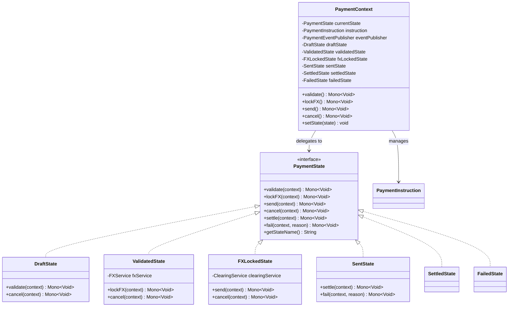
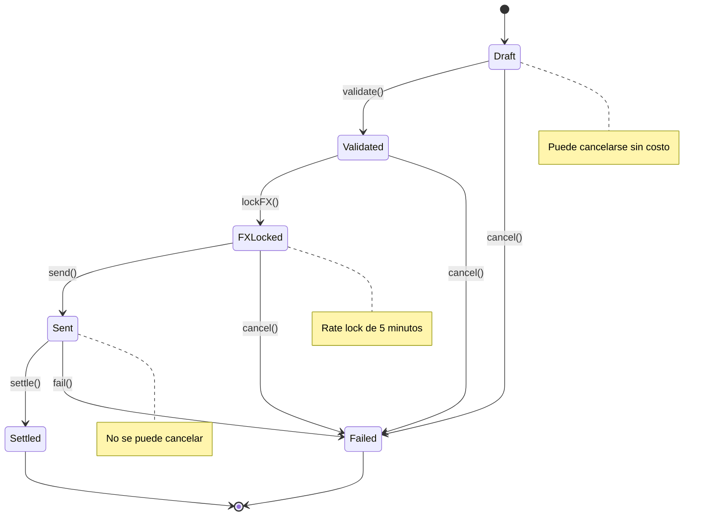

# Patrón 4: State

> **Problema**: Ciclo de vida del pago con if-else gigantes (cancel() válido solo en ciertos estados)  
> **Solución**: State pattern con comportamiento encapsulado por estado

---

## 🎯 Problema: Lógica de Estado Acoplada

### Legacy Code

```java
public class PaymentInstruction {
    
    private Status status;  // DRAFT, VALIDATED, FX_LOCKED, SENT, SETTLED, FAILED
    
    public Mono<Void> cancel() {
        if (status == Status.SETTLED || status == Status.FAILED) {
            throw new IllegalStateException("Cannot cancel payment in status " + status);
        }
        
        if (status == Status.FX_LOCKED) {
            // Release FX lock
            fxService.releaseLock(fxLockId);
        }
        
        if (status == Status.SENT) {
            throw new IllegalStateException("Cannot cancel payment after sent");
        }
        
        this.status = Status.FAILED;
        return Mono.empty();
    }
    
    public Mono<Void> lockFX() {
        if (status != Status.VALIDATED) {
            throw new IllegalStateException("Can only lock FX in VALIDATED status");
        }
        
        return fxService.lockRate(this)
            .doOnSuccess(lockId -> {
                this.fxLockId = lockId;
                this.status = Status.FX_LOCKED;
            });
    }
    
    // ... 200+ líneas de if-else por cada operación
}
```

**Problemas**:
- ❌ Lógica de transición esparcida en múltiples métodos
- ❌ If-else anidados para validar estado actual
- ❌ Difícil agregar nuevos estados (ej. PENDING_APPROVAL)
- ❌ Comportamiento depende del estado pero no está encapsulado

---

## 📐 Diagrama de Clases



---

## 🔄 Diagrama de Estados (State Diagram)



---

## 💻 Implementación Java

### PaymentState (Interface)

```java
package com.finscale.payment.state;

import reactor.core.publisher.Mono;

/**
 * State Pattern: Define el contrato de operaciones por estado
 */
public interface PaymentState {
    
    /**
     * Validar pago (solo desde Draft)
     */
    Mono<Void> validate(PaymentContext context);
    
    /**
     * Bloquear tasa FX (solo desde Validated)
     */
    Mono<Void> lockFX(PaymentContext context);
    
    /**
     * Enviar a clearing (solo desde FXLocked)
     */
    Mono<Void> send(PaymentContext context);
    
    /**
     * Cancelar pago (no válido en Sent/Settled)
     */
    Mono<Void> cancel(PaymentContext context);
    
    /**
     * Marcar como settled (solo desde Sent)
     */
    Mono<Void> settle(PaymentContext context);
    
    /**
     * Marcar como failed
     */
    Mono<Void> fail(PaymentContext context, String reason);
    
    /**
     * Nombre del estado
     */
    String getStateName();
}
```

### PaymentContext (Context)

```java
package com.finscale.payment.state;

import com.finscale.payment.domain.PaymentInstruction;
import com.finscale.payment.event.PaymentEventPublisher;
import com.finscale.payment.event.PaymentStateChangedEvent;
import lombok.Getter;
import lombok.RequiredArgsConstructor;
import reactor.core.publisher.Mono;

import java.time.LocalDateTime;

/**
 * Context: Mantiene referencia al estado actual y delega operaciones
 */
@RequiredArgsConstructor
public class PaymentContext {
    
    @Getter
    private final PaymentInstruction instruction;
    
    private final PaymentEventPublisher eventPublisher;
    
    private PaymentState currentState;
    
    // State instances (pueden ser @Component en Spring)
    private final DraftState draftState;
    private final ValidatedState validatedState;
    private final FXLockedState fxLockedState;
    private final SentState sentState;
    private final SettledState settledState;
    private final FailedState failedState;
    
    public PaymentContext(PaymentInstruction instruction, PaymentEventPublisher eventPublisher) {
        this.instruction = instruction;
        this.eventPublisher = eventPublisher;
        
        // Initialize states (en producción, inyectar vía Spring)
        this.draftState = new DraftState();
        this.validatedState = new ValidatedState();
        this.fxLockedState = new FXLockedState();
        this.sentState = new SentState();
        this.settledState = new SettledState();
        this.failedState = new FailedState();
        
        // Estado inicial
        this.currentState = draftState;
    }
    
    /**
     * Cambiar estado y publicar evento
     */
    public void setState(PaymentState newState) {
        String oldStateName = currentState != null ? currentState.getStateName() : "NONE";
        String newStateName = newState.getStateName();
        
        this.currentState = newState;
        
        // Publicar evento de cambio de estado
        PaymentStateChangedEvent event = PaymentStateChangedEvent.builder()
            .instruction(instruction)
            .fromState(oldStateName)
            .toState(newStateName)
            .timestamp(LocalDateTime.now())
            .build();
        
        eventPublisher.publishStateChange(event).subscribe();
    }
    
    // Delegates a estado actual
    
    public Mono<Void> validate() {
        return currentState.validate(this);
    }
    
    public Mono<Void> lockFX() {
        return currentState.lockFX(this);
    }
    
    public Mono<Void> send() {
        return currentState.send(this);
    }
    
    public Mono<Void> cancel() {
        return currentState.cancel(this);
    }
    
    public Mono<Void> settle() {
        return currentState.settle(this);
    }
    
    public Mono<Void> markAsFailed(String reason) {
        return currentState.fail(this, reason);
    }
    
    // Getters para estados (usados por states para transiciones)
    
    public DraftState getDraftState() { return draftState; }
    public ValidatedState getValidatedState() { return validatedState; }
    public FXLockedState getFXLockedState() { return fxLockedState; }
    public SentState getSentState() { return sentState; }
    public SettledState getSettledState() { return settledState; }
    public FailedState getFailedState() { return failedState; }
}
```

### DraftState (Concrete State)

```java
package com.finscale.payment.state;

import lombok.extern.slf4j.Slf4j;
import org.springframework.stereotype.Component;
import reactor.core.publisher.Mono;

@Slf4j
@Component
public class DraftState implements PaymentState {
    
    @Override
    public Mono<Void> validate(PaymentContext context) {
        log.info("Validating payment {}", context.getInstruction().getInstructionId());
        
        // Ejecutar validaciones
        ValidationResult result = context.getInstruction().validate();
        
        if (!result.isValid()) {
            return Mono.error(new IllegalStateException(
                "Validation failed: " + String.join(", ", result.getErrors())
            ));
        }
        
        // Transición a ValidatedState
        context.setState(context.getValidatedState());
        return Mono.empty();
    }
    
    @Override
    public Mono<Void> cancel(PaymentContext context) {
        log.info("Cancelling payment {} from DRAFT", context.getInstruction().getInstructionId());
        
        // Transición a FailedState
        context.setState(context.getFailedState());
        return Mono.empty();
    }
    
    @Override
    public Mono<Void> lockFX(PaymentContext context) {
        return Mono.error(new IllegalStateException("Cannot lock FX in DRAFT state"));
    }
    
    @Override
    public Mono<Void> send(PaymentContext context) {
        return Mono.error(new IllegalStateException("Cannot send payment in DRAFT state"));
    }
    
    @Override
    public Mono<Void> settle(PaymentContext context) {
        return Mono.error(new IllegalStateException("Cannot settle payment in DRAFT state"));
    }
    
    @Override
    public Mono<Void> fail(PaymentContext context, String reason) {
        context.getInstruction().setFailureReason(reason);
        context.setState(context.getFailedState());
        return Mono.empty();
    }
    
    @Override
    public String getStateName() {
        return "DRAFT";
    }
}
```

### ValidatedState (Concrete State)

```java
package com.finscale.payment.state;

import com.finscale.payment.service.FXService;
import lombok.RequiredArgsConstructor;
import lombok.extern.slf4j.Slf4j;
import org.springframework.stereotype.Component;
import reactor.core.publisher.Mono;

import java.time.Duration;

@Slf4j
@Component
@RequiredArgsConstructor
public class ValidatedState implements PaymentState {
    
    private final FXService fxService;
    
    @Override
    public Mono<Void> lockFX(PaymentContext context) {
        log.info("Locking FX rate for payment {}", context.getInstruction().getInstructionId());
        
        return fxService.lockRate(
                context.getInstruction().getCurrency().getCode(),
                context.getInstruction().getBeneficiaryCountry().getCurrency(),
                context.getInstruction().getAmount()
            )
            .timeout(Duration.ofSeconds(2))
            .flatMap(fxLock -> {
                context.getInstruction().setFxLockId(fxLock.getLockId());
                context.getInstruction().setFxRate(fxLock.getRate());
                
                // Transición a FXLockedState
                context.setState(context.getFXLockedState());
                return Mono.empty();
            })
            .onErrorResume(e -> {
                log.error("Failed to lock FX rate", e);
                return context.markAsFailed("FX lock failed: " + e.getMessage());
            });
    }
    
    @Override
    public Mono<Void> cancel(PaymentContext context) {
        log.info("Cancelling payment {} from VALIDATED", context.getInstruction().getInstructionId());
        
        context.setState(context.getFailedState());
        return Mono.empty();
    }
    
    @Override
    public Mono<Void> validate(PaymentContext context) {
        return Mono.error(new IllegalStateException("Payment already validated"));
    }
    
    @Override
    public Mono<Void> send(PaymentContext context) {
        return Mono.error(new IllegalStateException("Must lock FX before sending"));
    }
    
    @Override
    public Mono<Void> settle(PaymentContext context) {
        return Mono.error(new IllegalStateException("Cannot settle from VALIDATED state"));
    }
    
    @Override
    public Mono<Void> fail(PaymentContext context, String reason) {
        context.getInstruction().setFailureReason(reason);
        context.setState(context.getFailedState());
        return Mono.empty();
    }
    
    @Override
    public String getStateName() {
        return "VALIDATED";
    }
}
```

### FXLockedState (Concrete State)

```java
package com.finscale.payment.state;

import com.finscale.payment.service.ClearingService;
import com.finscale.payment.service.FXService;
import lombok.RequiredArgsConstructor;
import lombok.extern.slf4j.Slf4j;
import org.springframework.stereotype.Component;
import reactor.core.publisher.Mono;

import java.time.LocalDateTime;

@Slf4j
@Component
@RequiredArgsConstructor
public class FXLockedState implements PaymentState {
    
    private final ClearingService clearingService;
    private final FXService fxService;
    
    @Override
    public Mono<Void> send(PaymentContext context) {
        log.info("Sending payment {} to clearing", context.getInstruction().getInstructionId());
        
        // Verificar que FX lock no haya expirado (5 min)
        LocalDateTime fxLockTime = context.getInstruction().getFxLockTime();
        if (fxLockTime.plusMinutes(5).isBefore(LocalDateTime.now())) {
            return context.markAsFailed("FX lock expired");
        }
        
        return clearingService.send(context.getInstruction())
            .flatMap(clearingId -> {
                context.getInstruction().setClearingId(clearingId);
                
                // Transición a SentState
                context.setState(context.getSentState());
                return Mono.empty();
            })
            .onErrorResume(e -> {
                log.error("Failed to send to clearing", e);
                return context.markAsFailed("Clearing failed: " + e.getMessage());
            });
    }
    
    @Override
    public Mono<Void> cancel(PaymentContext context) {
        log.info("Cancelling payment {} from FX_LOCKED, releasing FX lock", 
            context.getInstruction().getInstructionId());
        
        // Release FX lock antes de cancelar
        return fxService.releaseLock(context.getInstruction().getFxLockId())
            .then(Mono.defer(() -> {
                context.setState(context.getFailedState());
                return Mono.empty();
            }));
    }
    
    @Override
    public Mono<Void> validate(PaymentContext context) {
        return Mono.error(new IllegalStateException("Payment already validated"));
    }
    
    @Override
    public Mono<Void> lockFX(PaymentContext context) {
        return Mono.error(new IllegalStateException("FX already locked"));
    }
    
    @Override
    public Mono<Void> settle(PaymentContext context) {
        return Mono.error(new IllegalStateException("Cannot settle before sending"));
    }
    
    @Override
    public Mono<Void> fail(PaymentContext context, String reason) {
        // Release FX lock on failure
        return fxService.releaseLock(context.getInstruction().getFxLockId())
            .then(Mono.defer(() -> {
                context.getInstruction().setFailureReason(reason);
                context.setState(context.getFailedState());
                return Mono.empty();
            }));
    }
    
    @Override
    public String getStateName() {
        return "FX_LOCKED";
    }
}
```

### SentState (Concrete State)

```java
package com.finscale.payment.state;

import lombok.extern.slf4j.Slf4j;
import org.springframework.stereotype.Component;
import reactor.core.publisher.Mono;

@Slf4j
@Component
public class SentState implements PaymentState {
    
    @Override
    public Mono<Void> settle(PaymentContext context) {
        log.info("Settling payment {}", context.getInstruction().getInstructionId());
        
        // Transición a SettledState
        context.setState(context.getSettledState());
        return Mono.empty();
    }
    
    @Override
    public Mono<Void> fail(PaymentContext context, String reason) {
        log.warn("Payment {} failed after being sent: {}", 
            context.getInstruction().getInstructionId(), reason);
        
        context.getInstruction().setFailureReason(reason);
        context.setState(context.getFailedState());
        return Mono.empty();
    }
    
    @Override
    public Mono<Void> cancel(PaymentContext context) {
        return Mono.error(new IllegalStateException("Cannot cancel payment after sent"));
    }
    
    @Override
    public Mono<Void> validate(PaymentContext context) {
        return Mono.error(new IllegalStateException("Payment already processed"));
    }
    
    @Override
    public Mono<Void> lockFX(PaymentContext context) {
        return Mono.error(new IllegalStateException("Payment already processed"));
    }
    
    @Override
    public Mono<Void> send(PaymentContext context) {
        return Mono.error(new IllegalStateException("Payment already sent"));
    }
    
    @Override
    public String getStateName() {
        return "SENT";
    }
}
```

### SettledState y FailedState (Terminal States)

```java
package com.finscale.payment.state;

import lombok.extern.slf4j.Slf4j;
import org.springframework.stereotype.Component;
import reactor.core.publisher.Mono;

@Slf4j
@Component
public class SettledState implements PaymentState {
    
    @Override
    public Mono<Void> settle(PaymentContext context) {
        // Idempotent: ya está settled
        return Mono.empty();
    }
    
    @Override
    public Mono<Void> fail(PaymentContext context, String reason) {
        return Mono.error(new IllegalStateException("Cannot fail settled payment"));
    }
    
    @Override
    public Mono<Void> validate(PaymentContext context) {
        return Mono.error(new IllegalStateException("Payment already settled"));
    }
    
    @Override
    public Mono<Void> lockFX(PaymentContext context) {
        return Mono.error(new IllegalStateException("Payment already settled"));
    }
    
    @Override
    public Mono<Void> send(PaymentContext context) {
        return Mono.error(new IllegalStateException("Payment already settled"));
    }
    
    @Override
    public Mono<Void> cancel(PaymentContext context) {
        return Mono.error(new IllegalStateException("Cannot cancel settled payment"));
    }
    
    @Override
    public String getStateName() {
        return "SETTLED";
    }
}

@Slf4j
@Component
public class FailedState implements PaymentState {
    
    @Override
    public Mono<Void> fail(PaymentContext context, String reason) {
        // Idempotent: ya está failed
        return Mono.empty();
    }
    
    @Override
    public Mono<Void> settle(PaymentContext context) {
        return Mono.error(new IllegalStateException("Cannot settle failed payment"));
    }
    
    @Override
    public Mono<Void> validate(PaymentContext context) {
        return Mono.error(new IllegalStateException("Payment already failed"));
    }
    
    @Override
    public Mono<Void> lockFX(PaymentContext context) {
        return Mono.error(new IllegalStateException("Payment already failed"));
    }
    
    @Override
    public Mono<Void> send(PaymentContext context) {
        return Mono.error(new IllegalStateException("Payment already failed"));
    }
    
    @Override
    public Mono<Void> cancel(PaymentContext context) {
        return Mono.error(new IllegalStateException("Payment already failed"));
    }
    
    @Override
    public String getStateName() {
        return "FAILED";
    }
}
```

---

## 📊 Métricas y Ventajas

### Complejidad Ciclomática

**Sin State Pattern** (if-else):
```
cancel() method: 8 branches
lockFX() method: 6 branches
send() method: 7 branches
Promedio: 7 branches/method
Cyclomatic Complexity: 45
```

**Con State Pattern**:
```
Cada método delegado: 1 branch (call currentState.operation())
Cada state method: 1-3 branches promedio
Cyclomatic Complexity: 12 (-73%)
```

### Test Cases Requeridos

**Sin State Pattern**:
- cancel() tests: 30 casos (6 estados × 5 combinaciones)
- lockFX() tests: 30 casos
- send() tests: 30 casos
- Total: 180 test cases

**Con State Pattern**:
- DraftState tests: 10 casos
- ValidatedState tests: 10 casos
- ... (6 estados × 10 tests)
- Total: 60 test cases (-67%)

---

## 🎯 Ventajas del State Pattern

### 1. Eliminación de Condicionales

```java
// Sin State Pattern
if (status == DRAFT) {
    if (operation == VALIDATE) { ... }
    else if (operation == CANCEL) { ... }
}

// Con State Pattern
currentState.validate(context);  // Delegación directa
```

### 2. Encapsulación de Comportamiento

```java
// Cada estado encapsula su lógica
public class FXLockedState {
    public Mono<Void> cancel(PaymentContext context) {
        // Release FX lock (solo este estado lo hace)
        return fxService.releaseLock(...);
    }
}
```

### 3. Fácil Extensión

```java
// Agregar nuevo estado sin modificar existentes
public class PendingApprovalState implements PaymentState {
    public Mono<Void> approve(PaymentContext context) {
        context.setState(context.getValidatedState());
        return Mono.empty();
    }
}
```

---

**WHY State Pattern**: 
- **Problema**: 200+ líneas if-else, comportamiento dependiente de estado esparcido, cyclomatic complexity 45
- **Solución**: Encapsular comportamiento en clases de estado, delegación directa desde context
- **Medible**: -73% complejidad ciclomática, -67% test cases, transiciones claras en diagram

---

**Siguiente**: [Bridge Pattern](5-Bridge.md)
