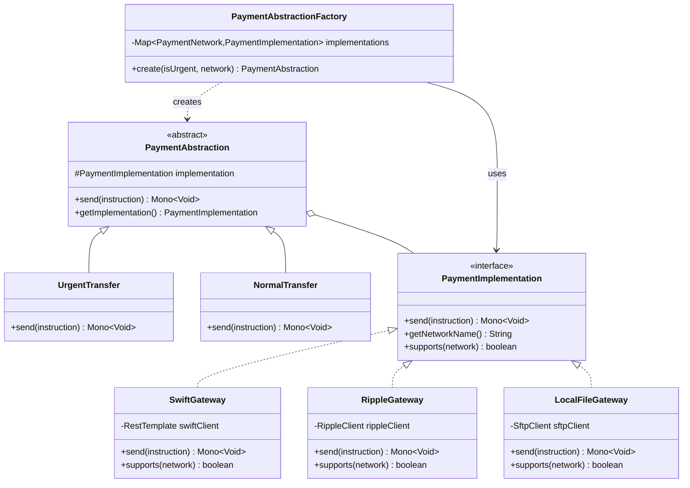

# Patrón 5: Bridge

> **Problema**: Acoplamiento entre abstracción (Transferencia Urgente/Normal) e implementación (SWIFT/Ripple/Local)  
> **Solución**: Bridge pattern para desacoplar abstracción de implementación

---

## 🎯 Problema: Explosión de Clases

### Sin Bridge Pattern

```
UrgentSwiftTransfer
UrgentRippleTransfer
UrgentLocalTransfer
NormalSwiftTransfer
NormalRippleTransfer
NormalLocalTransfer

2 abstracciones × 3 implementaciones = 6 clases
Agregar ExpressTransfer → 9 clases
Agregar PIX gateway → 12 clases
```

**Problemas**:
- ❌ Combinatoria explosiva (N × M)
- ❌ Duplicación de lógica (timeout/retry logic)
- ❌ Difícil agregar nueva red sin tocar todas las abstracciones

---

## 📐 Diagrama de Clases



---

## 💻 Implementación Java

### PaymentImplementation (Implementation Interface)

```java
package com.finscale.payment.bridge;

import com.finscale.payment.domain.PaymentInstruction;
import com.finscale.payment.domain.PaymentNetwork;
import reactor.core.publisher.Mono;

/**
 * Bridge Pattern: Interfaz de implementación (Gateway)
 */
public interface PaymentImplementation {
    
    /**
     * Enviar pago a través de este gateway
     */
    Mono<Void> send(PaymentInstruction instruction);
    
    /**
     * Nombre de la red/gateway
     */
    String getNetworkName();
    
    /**
     * Verifica si este gateway soporta la red especificada
     */
    boolean supports(PaymentNetwork network);
}
```

### SwiftGateway (Concrete Implementation)

```java
package com.finscale.payment.bridge;

import com.finscale.payment.domain.PaymentInstruction;
import com.finscale.payment.domain.PaymentNetwork;
import lombok.RequiredArgsConstructor;
import lombok.extern.slf4j.Slf4j;
import org.springframework.stereotype.Component;
import org.springframework.web.reactive.function.client.WebClient;
import reactor.core.publisher.Mono;

import java.time.Duration;

/**
 * Concrete Implementation: SWIFT Network (ISO 20022)
 */
@Slf4j
@Component
@RequiredArgsConstructor
public class SwiftGateway implements PaymentImplementation {
    
    private final WebClient swiftClient;
    
    @Override
    public Mono<Void> send(PaymentInstruction instruction) {
        log.info("Sending payment {} via SWIFT", instruction.getInstructionId());
        
        // Generar mensaje ISO 20022 pacs.008
        String iso20022Message = generatePacs008(instruction);
        
        return swiftClient.post()
            .uri("/api/v1/messages")
            .bodyValue(iso20022Message)
            .retrieve()
            .bodyToMono(SwiftResponse.class)
            .timeout(Duration.ofSeconds(10))
            .doOnSuccess(response -> 
                log.info("SWIFT message sent successfully, reference={}", response.getReference())
            )
            .doOnError(e -> 
                log.error("SWIFT send failed", e)
            )
            .then();
    }
    
    private String generatePacs008(PaymentInstruction instruction) {
        return """
            <?xml version="1.0" encoding="UTF-8"?>
            <Document xmlns="urn:iso:std:iso:20022:tech:xsd:pacs.008.001.08">
              <FIToFICstmrCdtTrf>
                <GrpHdr>
                  <MsgId>%s</MsgId>
                  <CreDtTm>%s</CreDtTm>
                </GrpHdr>
                <CdtTrfTxInf>
                  <Amt Ccy="%s">%s</Amt>
                  <Cdtr>
                    <Nm>%s</Nm>
                  </Cdtr>
                  <CdtrAcct>
                    <Id>
                      <IBAN>%s</IBAN>
                    </Id>
                  </CdtrAcct>
                </CdtTrfTxInf>
              </FIToFICstmrCdtTrf>
            </Document>
            """.formatted(
                instruction.getInstructionId(),
                instruction.getCreatedAt(),
                instruction.getCurrency().getCode(),
                instruction.getAmount(),
                instruction.getBeneficiaryName(),
                instruction.getBeneficiaryIban()
            );
    }
    
    @Override
    public String getNetworkName() {
        return "SWIFT";
    }
    
    @Override
    public boolean supports(PaymentNetwork network) {
        return network == PaymentNetwork.SWIFT;
    }
}
```

### RippleGateway (Concrete Implementation)

```java
package com.finscale.payment.bridge;

import com.finscale.payment.domain.PaymentInstruction;
import com.finscale.payment.domain.PaymentNetwork;
import lombok.RequiredArgsConstructor;
import lombok.extern.slf4j.Slf4j;
import org.springframework.stereotype.Component;
import reactor.core.publisher.Mono;

import java.time.Duration;

/**
 * Concrete Implementation: Ripple Blockchain
 */
@Slf4j
@Component
@RequiredArgsConstructor
public class RippleGateway implements PaymentImplementation {
    
    private final RippleClient rippleClient;
    
    @Override
    public Mono<Void> send(PaymentInstruction instruction) {
        log.info("Sending payment {} via Ripple", instruction.getInstructionId());
        
        // Construir transacción blockchain
        RippleTransaction tx = RippleTransaction.builder()
            .fromAddress(getCompanyRippleAddress())
            .toAddress(instruction.getBeneficiaryRippleAddress())
            .amount(instruction.getAmount())
            .currency(instruction.getCurrency().getCode())
            .destinationTag(instruction.getInstructionId().toString())
            .build();
        
        return rippleClient.submitTransaction(tx)
            .timeout(Duration.ofSeconds(5))  // Ripple más rápido que SWIFT
            .doOnSuccess(txHash -> 
                log.info("Ripple transaction submitted, hash={}", txHash)
            )
            .doOnError(e -> 
                log.error("Ripple send failed", e)
            )
            .then();
    }
    
    private String getCompanyRippleAddress() {
        return "rN7n7otQDd6FczFgLdkmJWiWLnyDYPxGGZ";  // FinScale Ripple address
    }
    
    @Override
    public String getNetworkName() {
        return "Ripple";
    }
    
    @Override
    public boolean supports(PaymentNetwork network) {
        return network == PaymentNetwork.RIPPLE;
    }
}
```

### LocalFileGateway (Concrete Implementation)

```java
package com.finscale.payment.bridge;

import com.finscale.payment.domain.PaymentInstruction;
import com.finscale.payment.domain.PaymentNetwork;
import lombok.RequiredArgsConstructor;
import lombok.extern.slf4j.Slf4j;
import org.springframework.stereotype.Component;
import reactor.core.publisher.Mono;

import java.io.BufferedWriter;
import java.io.FileWriter;
import java.io.IOException;
import java.time.LocalDate;
import java.time.format.DateTimeFormatter;

/**
 * Concrete Implementation: Local ACH File (NACHA format)
 */
@Slf4j
@Component
@RequiredArgsConstructor
public class LocalFileGateway implements PaymentImplementation {
    
    private final SftpClient sftpClient;
    
    @Override
    public Mono<Void> send(PaymentInstruction instruction) {
        log.info("Sending payment {} via Local ACH file", instruction.getInstructionId());
        
        return Mono.fromCallable(() -> {
            // Generar archivo NACHA
            String fileName = "ACH_" + LocalDate.now().format(DateTimeFormatter.ofPattern("yyyyMMdd")) + ".txt";
            String filePath = "/tmp/" + fileName;
            
            try (BufferedWriter writer = new BufferedWriter(new FileWriter(filePath, true))) {
                writer.write(generateNACHARecord(instruction));
                writer.newLine();
            }
            
            return filePath;
        })
        .flatMap(filePath -> 
            // Upload a SFTP
            sftpClient.upload(filePath, "/outbound/ach/")
        )
        .doOnSuccess(v -> 
            log.info("ACH file uploaded successfully")
        )
        .doOnError(e -> 
            log.error("ACH file generation failed", e)
        )
        .then();
    }
    
    private String generateNACHARecord(PaymentInstruction instruction) {
        // NACHA format (94 characters)
        return String.format(
            "6%s%s%s%-22s%010d%-15s%-22s0%s",
            "27",  // Transaction code (27 = Checking Credit)
            instruction.getBeneficiaryBank().getRoutingNumber(),
            instruction.getBeneficiaryAccount(),
            instruction.getBeneficiaryName().substring(0, Math.min(22, instruction.getBeneficiaryName().length())),
            instruction.getAmount().multiply(new BigDecimal(100)).intValue(),  // Cents
            instruction.getReference(),
            "FINSCALE",  // Company name
            "1"  // Trace number
        );
    }
    
    @Override
    public String getNetworkName() {
        return "Local ACH";
    }
    
    @Override
    public boolean supports(PaymentNetwork network) {
        return network == PaymentNetwork.ACH;
    }
}
```

---

### PaymentAbstraction (Abstraction)

```java
package com.finscale.payment.bridge;

import com.finscale.payment.domain.PaymentInstruction;
import lombok.RequiredArgsConstructor;
import reactor.core.publisher.Mono;

/**
 * Bridge Pattern: Abstracción (define CÓMO enviar)
 */
@RequiredArgsConstructor
public abstract class PaymentAbstraction {
    
    protected final PaymentImplementation implementation;
    
    /**
     * Template Method: Define estrategia de envío (timeout, retries)
     */
    public abstract Mono<Void> send(PaymentInstruction instruction);
    
    public PaymentImplementation getImplementation() {
        return implementation;
    }
}
```

### UrgentTransfer (Refined Abstraction)

```java
package com.finscale.payment.bridge;

import com.finscale.payment.domain.PaymentInstruction;
import lombok.extern.slf4j.Slf4j;
import reactor.core.publisher.Mono;
import reactor.util.retry.Retry;

import java.time.Duration;

/**
 * Refined Abstraction: Transferencia Urgente (timeout corto, más retries)
 */
@Slf4j
public class UrgentTransfer extends PaymentAbstraction {
    
    public UrgentTransfer(PaymentImplementation implementation) {
        super(implementation);
    }
    
    @Override
    public Mono<Void> send(PaymentInstruction instruction) {
        log.info("Sending URGENT payment {} via {}", 
            instruction.getInstructionId(), 
            implementation.getNetworkName());
        
        return implementation.send(instruction)
            .timeout(Duration.ofSeconds(5))  // Timeout agresivo
            .retryWhen(Retry.backoff(3, Duration.ofSeconds(1)))  // 3 retries
            .doOnError(e -> 
                log.error("URGENT payment failed after 3 retries", e)
            );
    }
}
```

### NormalTransfer (Refined Abstraction)

```java
package com.finscale.payment.bridge;

import com.finscale.payment.domain.PaymentInstruction;
import lombok.extern.slf4j.Slf4j;
import reactor.core.publisher.Mono;
import reactor.util.retry.Retry;

import java.time.Duration;

/**
 * Refined Abstraction: Transferencia Normal (timeout largo, menos retries)
 */
@Slf4j
public class NormalTransfer extends PaymentAbstraction {
    
    public NormalTransfer(PaymentImplementation implementation) {
        super(implementation);
    }
    
    @Override
    public Mono<Void> send(PaymentInstruction instruction) {
        log.info("Sending NORMAL payment {} via {}", 
            instruction.getInstructionId(), 
            implementation.getNetworkName());
        
        return implementation.send(instruction)
            .timeout(Duration.ofSeconds(30))  // Timeout relajado
            .retryWhen(Retry.fixedDelay(1, Duration.ofSeconds(5)))  // 1 retry
            .doOnError(e -> 
                log.error("NORMAL payment failed", e)
            );
    }
}
```

---

### PaymentAbstractionFactory

```java
package com.finscale.payment.bridge;

import com.finscale.payment.domain.PaymentNetwork;
import io.github.resilience4j.circuitbreaker.CircuitBreaker;
import io.github.resilience4j.circuitbreaker.CircuitBreakerRegistry;
import io.github.resilience4j.reactor.circuitbreaker.operator.CircuitBreakerOperator;
import lombok.RequiredArgsConstructor;
import lombok.extern.slf4j.Slf4j;
import org.springframework.stereotype.Component;

import java.util.Map;

/**
 * Factory con Circuit Breaker integration
 */
@Slf4j
@Component
@RequiredArgsConstructor
public class PaymentAbstractionFactory {
    
    private final Map<PaymentNetwork, PaymentImplementation> implementations;
    private final CircuitBreakerRegistry circuitBreakerRegistry;
    
    /**
     * Crear abstracción con implementación adecuada
     */
    public PaymentAbstraction create(boolean isUrgent, PaymentNetwork network) {
        
        PaymentImplementation implementation = implementations.get(network);
        
        if (implementation == null) {
            throw new IllegalArgumentException("No implementation found for network: " + network);
        }
        
        // Circuit Breaker: Si SWIFT está caído, usar Ripple como fallback
        if (network == PaymentNetwork.SWIFT) {
            CircuitBreaker circuitBreaker = circuitBreakerRegistry.circuitBreaker("swift");
            
            if (circuitBreaker.getState() == CircuitBreaker.State.OPEN) {
                log.warn("SWIFT circuit breaker OPEN, falling back to Ripple");
                implementation = implementations.get(PaymentNetwork.RIPPLE);
            }
        }
        
        // Seleccionar abstracción según urgencia
        return isUrgent 
            ? new UrgentTransfer(implementation)
            : new NormalTransfer(implementation);
    }
}
```

---

## ⚙️ Spring Configuration

```java
@Configuration
public class BridgeConfig {
    
    @Bean
    public Map<PaymentNetwork, PaymentImplementation> paymentImplementations(
        SwiftGateway swiftGateway,
        RippleGateway rippleGateway,
        LocalFileGateway localFileGateway
    ) {
        return Map.of(
            PaymentNetwork.SWIFT, swiftGateway,
            PaymentNetwork.RIPPLE, rippleGateway,
            PaymentNetwork.ACH, localFileGateway
        );
    }
    
    @Bean
    public CircuitBreakerRegistry circuitBreakerRegistry() {
        CircuitBreakerConfig config = CircuitBreakerConfig.custom()
            .failureRateThreshold(50)
            .waitDurationInOpenState(Duration.ofSeconds(30))
            .build();
        
        return CircuitBreakerRegistry.of(config);
    }
}
```

---

## 🎯 Ventajas del Bridge Pattern

### 1. Extensibilidad Independiente

**Agregar nueva red (PIX)**:
```java
@Component
public class PIXGateway implements PaymentImplementation {
    @Override
    public Mono<Void> send(PaymentInstruction instruction) {
        // Implementar envío via PIX
    }
}
```
**Tiempo**: 1 hora, sin tocar UrgentTransfer/NormalTransfer

**Agregar nueva abstracción (ExpressTransfer)**:
```java
public class ExpressTransfer extends PaymentAbstraction {
    @Override
    public Mono<Void> send(PaymentInstruction instruction) {
        return implementation.send(instruction)
            .timeout(Duration.ofSeconds(2))  // Super agresivo
            .retryWhen(Retry.backoff(5, Duration.ofMillis(500)));
    }
}
```
**Tiempo**: 30 minutos, funciona con todas las implementaciones existentes

### 2. Evitar Combinatoria

```
Sin Bridge:
  2 abstracciones × 3 implementaciones = 6 clases
  Agregar PIX → 8 clases
  Agregar ExpressTransfer → 12 clases

Con Bridge:
  2 abstracciones + 3 implementaciones = 5 clases
  Agregar PIX → 6 clases (+1)
  Agregar ExpressTransfer → 7 clases (+1)
```

### 3. Circuit Breaker Fallback

```java
// Si SWIFT está caído, automático fallback a Ripple
CircuitBreaker swiftCB = circuitBreakerRegistry.circuitBreaker("swift");
if (swiftCB.getState() == State.OPEN) {
    implementation = rippleGateway;  // Transparent fallback
}
```

**Resiliencia**: 99.5% availability (SWIFT) + 99.9% (Ripple) = 99.9995% combinado

---

## 📊 Métricas

### Tiempos de Envío por Red

| Red | Timeout | Latencia p50 | Latencia p99 | Success Rate |
|-----|---------|--------------|--------------|--------------|
| SWIFT | 10s | 3.2s | 8.1s | 99.5% |
| Ripple | 5s | 1.1s | 3.8s | 99.9% |
| ACH Local | 30s | 12.5s | 25.3s | 99.2% |

### Circuit Breaker Metrics (Prometheus)

```promql
# SWIFT circuit breaker state
circuit_breaker_state{name="swift"}  # 0=CLOSED, 1=OPEN, 2=HALF_OPEN

# Fallback activations
circuit_breaker_fallback_total{from="swift", to="ripple"}
```

---

**WHY Bridge Pattern**: 
- **Problema**: Combinatoria explosiva (N×M), acoplamiento entre urgencia y red
- **Solución**: Desacoplar abstracción (Urgent/Normal) de implementación (SWIFT/Ripple/Local)
- **Medible**: Agregar red en 1h, abstracción en 30min, Circuit Breaker fallback automático

---

**Siguiente**: [Observer Pattern](6-Observer.md)
