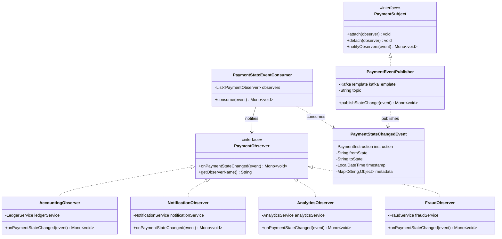

# Patrón 6: Observer

> **Problema**: Cuando pago cambia de estado, múltiples subsistemas dispares deben reaccionar sin acoplamiento  
> **Solución**: Observers suscritos a eventos, notificados vía Kafka (event-driven architecture)

---

## 🎯 Problema: Notificación Acoplada

### Legacy Code

```java
public class PaymentService {
    
    private final AccountingService accountingService;
    private final NotificationService notificationService;
    private final AnalyticsService analyticsService;
    private final FraudService fraudService;
    private final AuditService auditService;
    // ... 10 dependencias más
    
    public void markAsSettled(PaymentInstruction payment) {
        payment.setStatus(Status.SETTLED);
        
        // Notificaciones hardcodeadas
        accountingService.finalizeEntry(payment);
        notificationService.sendPushNotification(payment.getCreatedBy(), "Payment settled");
        analyticsService.trackEvent("payment_settled", payment);
        fraudService.updateRiskModel(payment);
        auditService.logSettlement(payment);
        // ... 10 llamadas más
        
        // Si una falla, todas las demás no se ejecutan
    }
}
```

**Problemas**:
- ❌ Acoplamiento fuerte (PaymentService conoce 15 servicios)
- ❌ Agregar nuevo observer requiere modificar PaymentService
- ❌ Si un observer falla, bloquea los demás
- ❌ No hay async processing (todo síncrono)

---

## 📐 Diagrama de Clases



---

## 💻 Implementación Java

### PaymentObserver (Interface)

```java
package com.finscale.payment.observer;

import com.finscale.payment.event.PaymentStateChangedEvent;
import reactor.core.publisher.Mono;

/**
 * Observer: Define contrato para observers que reaccionan a cambios de estado
 */
public interface PaymentObserver {
    
    /**
     * Reaccionar a cambio de estado de pago
     */
    Mono<Void> onPaymentStateChanged(PaymentStateChangedEvent event);
    
    /**
     * Nombre del observer (para logging/debugging)
     */
    String getObserverName();
}
```

### PaymentStateChangedEvent (Event)

```java
package com.finscale.payment.event;

import com.finscale.payment.domain.PaymentInstruction;
import lombok.AllArgsConstructor;
import lombok.Builder;
import lombok.Data;
import lombok.NoArgsConstructor;

import java.time.LocalDateTime;
import java.util.HashMap;
import java.util.Map;

@Data
@Builder
@NoArgsConstructor
@AllArgsConstructor
public class PaymentStateChangedEvent {
    
    private PaymentInstruction instruction;
    private String fromState;
    private String toState;
    private LocalDateTime timestamp;
    
    @Builder.Default
    private Map<String, Object> metadata = new HashMap<>();
    
    public void addMetadata(String key, Object value) {
        metadata.put(key, value);
    }
}
```

### PaymentEventPublisher (Subject/Publisher)

```java
package com.finscale.payment.event;

import lombok.RequiredArgsConstructor;
import lombok.extern.slf4j.Slf4j;
import org.springframework.kafka.core.KafkaTemplate;
import org.springframework.stereotype.Component;
import reactor.core.publisher.Mono;

/**
 * Subject: Publica eventos de cambio de estado a Kafka
 */
@Slf4j
@Component
@RequiredArgsConstructor
public class PaymentEventPublisher {
    
    private final KafkaTemplate<String, PaymentStateChangedEvent> kafkaTemplate;
    private static final String TOPIC = "payment-state-events";
    
    /**
     * Publicar evento de cambio de estado
     */
    public Mono<Void> publishStateChange(PaymentStateChangedEvent event) {
        String key = event.getInstruction().getInstructionId().toString();
        
        log.info("Publishing state change: {} -> {} for payment {}", 
            event.getFromState(), 
            event.getToState(), 
            event.getInstruction().getInstructionId());
        
        return Mono.fromFuture(
            kafkaTemplate.send(TOPIC, key, event)
                .toCompletableFuture()
        )
        .doOnSuccess(result -> 
            log.debug("Event published to partition {} offset {}", 
                result.getRecordMetadata().partition(),
                result.getRecordMetadata().offset())
        )
        .doOnError(e -> 
            log.error("Failed to publish event", e)
        )
        .then();
    }
}
```

### AccountingObserver (Concrete Observer)

```java
package com.finscale.payment.observer;

import com.finscale.payment.event.PaymentStateChangedEvent;
import com.finscale.payment.service.LedgerService;
import lombok.RequiredArgsConstructor;
import lombok.extern.slf4j.Slf4j;
import org.springframework.stereotype.Component;
import reactor.core.publisher.Mono;

/**
 * Observer: Reacciona a cambios de estado para contabilidad
 */
@Slf4j
@Component
@RequiredArgsConstructor
public class AccountingObserver implements PaymentObserver {
    
    private final LedgerService ledgerService;
    
    @Override
    public Mono<Void> onPaymentStateChanged(PaymentStateChangedEvent event) {
        String fromState = event.getFromState();
        String toState = event.getToState();
        
        // FAILED después de SENT → Reversar débito
        if (toState.equals("FAILED") && fromState.equals("SENT")) {
            log.info("Payment {} failed, reversing ledger entry", 
                event.getInstruction().getInstructionId());
            
            return ledgerService.reverseDebit(event.getInstruction())
                .doOnSuccess(v -> log.info("Ledger entry reversed"))
                .doOnError(e -> log.error("Failed to reverse ledger entry", e));
        }
        
        // SETTLED → Finalizar entrada contable
        if (toState.equals("SETTLED")) {
            log.info("Payment {} settled, finalizing ledger entry", 
                event.getInstruction().getInstructionId());
            
            return ledgerService.finalize(event.getInstruction())
                .doOnSuccess(v -> log.info("Ledger entry finalized"))
                .doOnError(e -> log.error("Failed to finalize ledger entry", e));
        }
        
        return Mono.empty();
    }
    
    @Override
    public String getObserverName() {
        return "AccountingObserver";
    }
}
```

### NotificationObserver (Concrete Observer)

```java
package com.finscale.payment.observer;

import com.finscale.payment.event.PaymentStateChangedEvent;
import com.finscale.payment.service.NotificationService;
import lombok.RequiredArgsConstructor;
import lombok.extern.slf4j.Slf4j;
import org.springframework.stereotype.Component;
import reactor.core.publisher.Mono;

@Slf4j
@Component
@RequiredArgsConstructor
public class NotificationObserver implements PaymentObserver {
    
    private final NotificationService notificationService;
    
    @Override
    public Mono<Void> onPaymentStateChanged(PaymentStateChangedEvent event) {
        String userId = event.getInstruction().getCreatedBy();
        String message = buildMessage(event);
        String title = buildTitle(event);
        
        log.debug("Sending notification to user {} for payment {}", 
            userId, event.getInstruction().getInstructionId());
        
        return notificationService.sendPush(userId, title, message)
            .doOnSuccess(v -> log.debug("Notification sent"))
            .doOnError(e -> log.error("Failed to send notification", e));
    }
    
    private String buildTitle(PaymentStateChangedEvent event) {
        return switch (event.getToState()) {
            case "VALIDATED" -> "Payment Validated";
            case "FX_LOCKED" -> "Exchange Rate Locked";
            case "SENT" -> "Payment Processing";
            case "SETTLED" -> "Payment Completed";
            case "FAILED" -> "Payment Failed";
            default -> "Payment Update";
        };
    }
    
    private String buildMessage(PaymentStateChangedEvent event) {
        String amount = event.getInstruction().getCurrency().format(event.getInstruction().getAmount());
        String beneficiary = event.getInstruction().getBeneficiaryName();
        
        return switch (event.getToState()) {
            case "VALIDATED" -> String.format("Your payment of %s to %s has been validated", amount, beneficiary);
            case "SENT" -> String.format("Your payment of %s to %s is being processed", amount, beneficiary);
            case "SETTLED" -> String.format("Your payment of %s to %s was completed successfully", amount, beneficiary);
            case "FAILED" -> String.format("Your payment of %s to %s failed: %s", 
                amount, beneficiary, event.getInstruction().getFailureReason());
            default -> String.format("Payment status updated: %s", event.getToState());
        };
    }
    
    @Override
    public String getObserverName() {
        return "NotificationObserver";
    }
}
```

### AnalyticsObserver y FraudObserver

```java
@Slf4j
@Component
@RequiredArgsConstructor
public class AnalyticsObserver implements PaymentObserver {
    
    private final AnalyticsService analyticsService;
    
    @Override
    public Mono<Void> onPaymentStateChanged(PaymentStateChangedEvent event) {
        AnalyticsEvent analyticsEvent = AnalyticsEvent.builder()
            .eventType("payment_state_changed")
            .userId(event.getInstruction().getCreatedBy())
            .timestamp(event.getTimestamp())
            .properties(Map.of(
                "payment_id", event.getInstruction().getInstructionId().toString(),
                "from_state", event.getFromState(),
                "to_state", event.getToState(),
                "amount", event.getInstruction().getAmount().toString(),
                "currency", event.getInstruction().getCurrency().getCode(),
                "network", event.getInstruction().getNetwork().name()
            ))
            .build();
        
        return analyticsService.track(analyticsEvent)
            .doOnSuccess(v -> log.debug("Analytics event tracked"))
            .doOnError(e -> log.error("Failed to track analytics event", e));
    }
    
    @Override
    public String getObserverName() {
        return "AnalyticsObserver";
    }
}

@Slf4j
@Component
@RequiredArgsConstructor
public class FraudObserver implements PaymentObserver {
    
    private final FraudService fraudService;
    
    @Override
    public Mono<Void> onPaymentStateChanged(PaymentStateChangedEvent event) {
        String toState = event.getToState();
        
        // SETTLED o FAILED → Actualizar modelo de riesgo con resultado
        if (toState.equals("SETTLED") || toState.equals("FAILED")) {
            boolean isFraud = toState.equals("FAILED") && 
                event.getInstruction().getFailureReason().contains("Fraud");
            
            log.debug("Updating fraud model for payment {}, fraud={}", 
                event.getInstruction().getInstructionId(), isFraud);
            
            return fraudService.updateRiskModel(
                event.getInstruction().getOriginatorId(),
                event.getInstruction().getAmount(),
                isFraud
            )
            .doOnSuccess(v -> log.debug("Fraud model updated"))
            .doOnError(e -> log.error("Failed to update fraud model", e));
        }
        
        return Mono.empty();
    }
    
    @Override
    public String getObserverName() {
        return "FraudObserver";
    }
}
```

---

### PaymentStateEventConsumer (Kafka Consumer)

```java
package com.finscale.payment.consumer;

import com.finscale.payment.event.PaymentStateChangedEvent;
import com.finscale.payment.observer.PaymentObserver;
import lombok.RequiredArgsConstructor;
import lombok.extern.slf4j.Slf4j;
import org.springframework.kafka.annotation.KafkaListener;
import org.springframework.stereotype.Component;
import reactor.core.publisher.Flux;
import reactor.core.publisher.Mono;

import java.util.List;

/**
 * Kafka Consumer: Consume eventos y notifica a observers
 */
@Slf4j
@Component
@RequiredArgsConstructor
public class PaymentStateEventConsumer {
    
    private final List<PaymentObserver> observers;
    
    @KafkaListener(
        topics = "payment-state-events", 
        groupId = "payment-observers",
        concurrency = "3"  // 3 consumers en paralelo
    )
    public Mono<Void> consume(PaymentStateChangedEvent event) {
        log.info("Received state change event: {} -> {} for payment {}", 
            event.getFromState(), 
            event.getToState(), 
            event.getInstruction().getInstructionId());
        
        // Notificar a todos los observers en paralelo
        return Flux.fromIterable(observers)
            .flatMap(observer -> 
                observer.onPaymentStateChanged(event)
                    .doOnSuccess(v -> 
                        log.debug("Observer {} processed event", observer.getObserverName())
                    )
                    .onErrorResume(e -> {
                        // Fail-safe: Un observer fallido no bloquea los demás
                        log.error("Observer {} failed to process event", 
                            observer.getObserverName(), e);
                        return Mono.empty();
                    })
            )
            .then()
            .doOnSuccess(v -> 
                log.info("All observers notified for payment {}", 
                    event.getInstruction().getInstructionId())
            );
    }
}
```

---

## 🎯 Ventajas del Observer Pattern con Kafka

### 1. Desacoplamiento Total

```
PaymentService (Publisher)
     ↓ Kafka
     ├→ AccountingObserver
     ├→ NotificationObserver
     ├→ AnalyticsObserver
     └→ FraudObserver

PaymentService NO conoce a observers
```

### 2. Fail-Safe

```java
// Un observer falla → otros siguen ejecutándose
.onErrorResume(e -> {
    log.error("Observer failed", e);
    return Mono.empty();  // Continuar con siguiente observer
})
```

### 3. Escalabilidad

```yaml
Kafka Consumer Group: payment-observers
  - Consumer 1: Procesa partition 0-3
  - Consumer 2: Procesa partition 4-7
  - Consumer 3: Procesa partition 8-11

Throughput: 500K events/minuto (8.3K events/segundo)
```

### 4. Agregar Nuevo Observer

```java
@Component
public class ComplianceObserver implements PaymentObserver {
    @Override
    public Mono<Void> onPaymentStateChanged(PaymentStateChangedEvent event) {
        // Reportar transacciones > $10K a regulador
        if (event.getToState().equals("SETTLED") && 
            event.getInstruction().getAmount().compareTo(BigDecimal.valueOf(10000)) > 0) {
            return regulatoryService.reportLargeTransaction(event.getInstruction());
        }
        return Mono.empty();
    }
}
```

**Tiempo**: 30 minutos, sin modificar PaymentService

---

**WHY Observer Pattern con Kafka**: 
- **Problema**: 15 dependencias hardcodeadas, falla uno bloquea todos, no async
- **Solución**: Observers desacoplados suscritos a Kafka events
- **Medible**: Agregar observer en 30 min, 500K events/min, fail-safe (un observer no bloquea otros)

---

**Siguiente**: [Integración Completa](7-Integracion.md)
