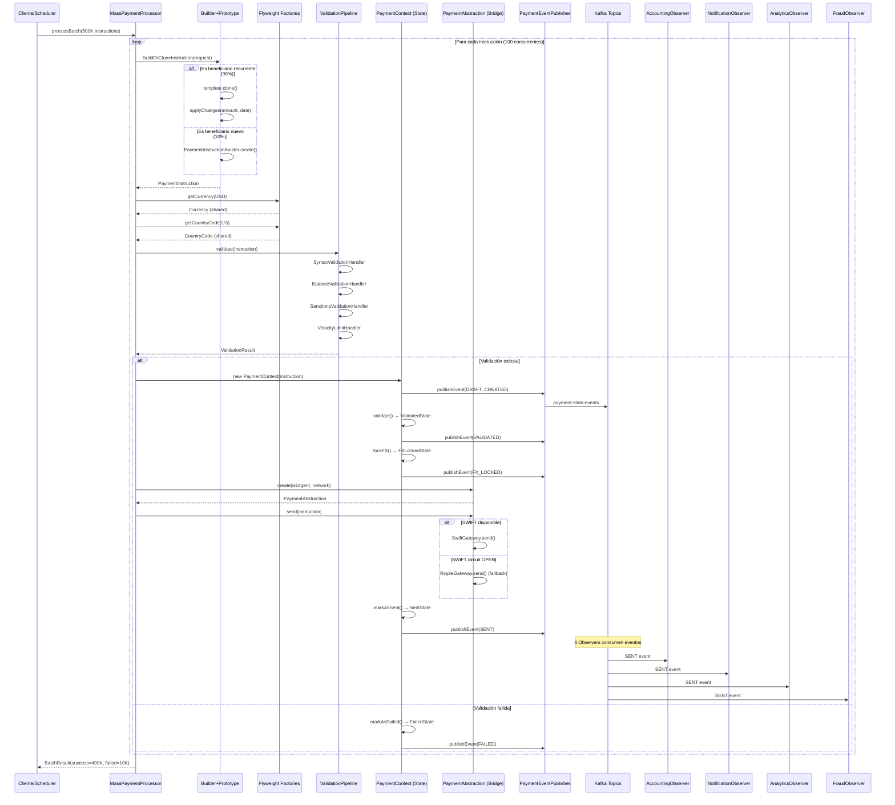

# Integración Completa: Motor de Dispersión Masiva

> **End-to-End Flow**: Cómo los 6 patrones GoF trabajan juntos en `MassPaymentProcessor`

---

## 🎯 Contexto del Problema

**Escenario**: Cliente Gig Economy (tipo Uber/Rappi) requiere procesar nómina diaria de 500,000 conductores/repartidores en 50 países.

**Desafíos Técnicos**:
- **Memoria**: 500K objetos PaymentInstruction (40+ atributos cada uno) = 5.2 GB heap → OOM
- **Repetición**: 90% de beneficiarios son recurrentes (solo cambia monto y fecha)
- **Validación**: 4 validadores secuenciales (Sintaxis, Balance, Sanciones, Velocity)
- **Redes heterogéneas**: SWIFT, SEPA, ACH, PIX, Ripple (cada una con protocolo diferente)
- **Lifecycle complejo**: 6 estados con transiciones condicionales
- **Notificaciones**: Accounting, Notifications, Analytics deben reaccionar a cambios de estado

**Solución**: 6 Patrones GoF orquestados por `MassPaymentProcessor`

---

## 🧩 Flujo Completo (500K Instructions)

Los 6 patrones GoF se integran en el `MassPaymentProcessor` para procesar 500,000 instrucciones diarias:

1. **Builder + Prototype**: Construir/clonar PaymentInstruction (85% menos instanciaciones)
2. **Flyweight**: Compartir Currency, CountryCode, BankRouting (260 objetos compartidos)
3. **Chain of Responsibility**: Validar con pipeline configurable (4 handlers)
4. **State**: Manejar lifecycle (Draft → Validated → FXLocked → Sent → Settled)
5. **Bridge**: Seleccionar gateway según red y urgencia (2 abstracciones × 3 implementaciones)
6. **Observer**: Notificar cambios de estado vía Kafka (4+ observers independientes)

---

## 📐 Diagrama de Clases UML - Integración de los 6 Patrones GoF

> **Diagrama Unificado**: Muestra cómo todos los patrones interactúan en `MassPaymentProcessor`

```mermaid
classDiagram
    %% ========== CLASE CENTRAL ==========
    class PaymentInstruction {
        <<domain>>
        -UUID instructionId
        -String originatorId
        -String beneficiaryName
        -BigDecimal amount
        -Currency currency
        -CountryCode beneficiaryCountry
        -BankRoutingInfo bankRouting
        -PaymentNetwork network
        +clone() PaymentInstruction
        +validate() ValidationResult
    }
    
    %% ========== PATRÓN 1: BUILDER + PROTOTYPE ==========
    class PaymentInstructionBuilder {
        <<creational>>
        -PaymentInstruction instruction
        +static create() Builder
        +withOriginatorId(id) Builder
        +withBeneficiaryData(...) Builder
        +withAmount(amount) Builder
        +withCurrency(code) Builder
        +build() PaymentInstruction
    }
    
    class RecurringPaymentTemplate {
        <<creational>>
        -UUID templateId
        -String beneficiaryId
        -PaymentInstruction baseInstruction
        +cloneAndApplyChanges(amount, date, ref) PaymentInstruction
    }
    
    class TemplateRepository {
        <<interface>>
        +findByBeneficiaryId(id) Mono~RecurringPaymentTemplate~
        +save(template) Mono~RecurringPaymentTemplate~
    }
    
    %% ========== PATRÓN 2: FLYWEIGHT ==========
    class Currency {
        <<flyweight>>
        -String code
        -String name
        -String symbol
        -int decimalPlaces
    }
    
    class CurrencyFactory {
        <<flyweight factory>>
        -static Map~String,Currency~ CURRENCIES
        +static getCurrency(code) Currency
    }
    
    class CountryCode {
        <<flyweight>>
        -String iso2
        -String name
        -boolean isSEPA
    }
    
    class CountryCodeFactory {
        <<flyweight factory>>
        -static Map~String,CountryCode~ COUNTRIES
        +static getCountryCode(iso2) CountryCode
    }
    
    class BankRoutingInfo {
        <<flyweight>>
        -String swiftCode
        -String bankName
        -Set~PaymentNetwork~ supportedNetworks
    }
    
    class BankRoutingFactory {
        <<flyweight factory>>
        -static Map~String,BankRoutingInfo~ ROUTING_INFO
        +static getRouting(swiftCode) BankRoutingInfo
    }
    
    %% ========== PATRÓN 3: CHAIN OF RESPONSIBILITY ==========
    class ValidationHandler {
        <<interface>>
        +validate(instruction) Mono~ValidationResult~
    }
    
    class AbstractValidationHandler {
        <<abstract>>
        #ValidationHandler nextHandler
        +setNext(handler) ValidationHandler
        +validate(instruction) Mono~ValidationResult~
        #doValidate(instruction) Mono~ValidationResult~*
    }
    
    class SyntaxValidationHandler {
        +doValidate(instruction) Mono~ValidationResult~
    }
    
    class BalanceValidationHandler {
        -LedgerService ledgerService
        +doValidate(instruction) Mono~ValidationResult~
    }
    
    class SanctionsValidationHandler {
        -ComplianceService complianceService
        +doValidate(instruction) Mono~ValidationResult~
    }
    
    class VelocityLimitHandler {
        -RedisRepository redis
        +doValidate(instruction) Mono~ValidationResult~
    }
    
    class ValidationPipeline {
        -ValidationHandler firstHandler
        +validate(instruction) Mono~ValidationResult~
        +builder() PipelineBuilder
    }
    
    %% ========== PATRÓN 4: STATE ==========
    class PaymentState {
        <<interface>>
        +validate(context) Mono~Void~
        +lockFX(context) Mono~Void~
        +send(context) Mono~Void~
        +cancel(context) Mono~Void~
        +settle(context) Mono~Void~
        +fail(context, reason) Mono~Void~
    }
    
    class DraftState {
        +validate(context) Mono~Void~
        +cancel(context) Mono~Void~
    }
    
    class ValidatedState {
        -FXService fxService
        +lockFX(context) Mono~Void~
        +cancel(context) Mono~Void~
    }
    
    class FXLockedState {
        +send(context) Mono~Void~
        +cancel(context) Mono~Void~
    }
    
    class SentState {
        +settle(context) Mono~Void~
        +fail(context, reason) Mono~Void~
    }
    
    class SettledState {
        +getStateName() String
    }
    
    class FailedState {
        +getStateName() String
    }
    
    class PaymentContext {
        -PaymentState currentState
        -PaymentInstruction instruction
        -PaymentEventPublisher eventPublisher
        +validate() Mono~Void~
        +lockFX() Mono~Void~
        +send() Mono~Void~
        +markAsSent() Mono~Void~
        +setState(state) void
    }
    
    %% ========== PATRÓN 5: BRIDGE ==========
    class PaymentAbstraction {
        <<abstract>>
        #PaymentImplementation implementation
        +send(instruction) Mono~Void~
        +getImplementation() PaymentImplementation
    }
    
    class UrgentTransfer {
        +send(instruction) Mono~Void~
    }
    
    class NormalTransfer {
        +send(instruction) Mono~Void~
    }
    
    class PaymentImplementation {
        <<interface>>
        +send(instruction) Mono~Void~
        +getNetworkName() String
        +supports(network) boolean
    }
    
    class SwiftGateway {
        -RestTemplate swiftClient
        +send(instruction) Mono~Void~
    }
    
    class RippleGateway {
        -RippleClient rippleClient
        +send(instruction) Mono~Void~
    }
    
    class LocalFileGateway {
        -SftpClient sftpClient
        +send(instruction) Mono~Void~
    }
    
    class PaymentAbstractionFactory {
        -Map~PaymentNetwork,PaymentImplementation~ implementations
        +create(isUrgent, network) PaymentAbstraction
    }
    
    %% ========== PATRÓN 6: OBSERVER ==========
    class PaymentEventPublisher {
        -KafkaTemplate kafkaTemplate
        -String topic
        +publishStateChange(event) Mono~void~
    }
    
    class PaymentObserver {
        <<interface>>
        +onPaymentStateChanged(event) Mono~void~
    }
    
    class AccountingObserver {
        -LedgerService ledgerService
        +onPaymentStateChanged(event) Mono~void~
    }
    
    class NotificationObserver {
        -NotificationService notificationService
        +onPaymentStateChanged(event) Mono~void~
    }
    
    class AnalyticsObserver {
        -AnalyticsService analyticsService
        +onPaymentStateChanged(event) Mono~void~
    }
    
    class FraudObserver {
        -FraudService fraudService
        +onPaymentStateChanged(event) Mono~void~
    }
    
    class PaymentStateChangedEvent {
        -UUID instructionId
        -String fromState
        -String toState
        -LocalDateTime timestamp
    }
    
    %% ========== ORQUESTADOR CENTRAL ==========
    class MassPaymentProcessor {
        <<facade>>
        -TemplateRepository templateRepo
        -CurrencyFactory currencyFactory
        -CountryCodeFactory countryCodeFactory
        -ValidationPipeline validationPipeline
        -PaymentAbstractionFactory abstractionFactory
        -PaymentEventPublisher eventPublisher
        +processBatch(requests) Mono~BatchResult~
        -buildOrCloneInstruction(request) Mono~PaymentInstruction~
        -sendPayment(context, isUrgent) Mono~Void~
    }
    
    %% ========== RELACIONES PATRÓN 1: BUILDER + PROTOTYPE ==========
    PaymentInstructionBuilder ..> PaymentInstruction : creates
    RecurringPaymentTemplate --> PaymentInstruction : clones
    TemplateRepository --> RecurringPaymentTemplate : manages
    MassPaymentProcessor --> PaymentInstructionBuilder : uses
    MassPaymentProcessor --> TemplateRepository : uses
    
    %% ========== RELACIONES PATRÓN 2: FLYWEIGHT ==========
    CurrencyFactory ..> Currency : creates & caches
    CountryCodeFactory ..> CountryCode : creates & caches
    BankRoutingFactory ..> BankRoutingInfo : creates & caches
    PaymentInstruction --> Currency : uses shared
    PaymentInstruction --> CountryCode : uses shared
    PaymentInstruction --> BankRoutingInfo : uses shared
    MassPaymentProcessor --> CurrencyFactory : uses
    MassPaymentProcessor --> CountryCodeFactory : uses
    
    %% ========== RELACIONES PATRÓN 3: CHAIN ==========
    ValidationHandler <|.. AbstractValidationHandler
    AbstractValidationHandler <|-- SyntaxValidationHandler
    AbstractValidationHandler <|-- BalanceValidationHandler
    AbstractValidationHandler <|-- SanctionsValidationHandler
    AbstractValidationHandler <|-- VelocityLimitHandler
    AbstractValidationHandler --> ValidationHandler : nextHandler
    ValidationPipeline --> ValidationHandler : uses
    MassPaymentProcessor --> ValidationPipeline : uses
    ValidationPipeline ..> PaymentInstruction : validates
    
    %% ========== RELACIONES PATRÓN 4: STATE ==========
    PaymentState <|.. DraftState
    PaymentState <|.. ValidatedState
    PaymentState <|.. FXLockedState
    PaymentState <|.. SentState
    PaymentState <|.. SettledState
    PaymentState <|.. FailedState
    PaymentContext --> PaymentState : currentState
    PaymentContext --> PaymentInstruction : manages
    PaymentContext --> PaymentEventPublisher : publishes events
    MassPaymentProcessor ..> PaymentContext : creates
    
    %% ========== RELACIONES PATRÓN 5: BRIDGE ==========
    PaymentAbstraction <|-- UrgentTransfer
    PaymentAbstraction <|-- NormalTransfer
    PaymentAbstraction o-- PaymentImplementation : implementation
    PaymentImplementation <|.. SwiftGateway
    PaymentImplementation <|.. RippleGateway
    PaymentImplementation <|.. LocalFileGateway
    PaymentAbstractionFactory ..> PaymentAbstraction : creates
    PaymentAbstractionFactory --> PaymentImplementation : uses
    MassPaymentProcessor --> PaymentAbstractionFactory : uses
    PaymentAbstraction ..> PaymentInstruction : sends
    
    %% ========== RELACIONES PATRÓN 6: OBSERVER ==========
    PaymentEventPublisher ..> PaymentStateChangedEvent : publishes
    PaymentObserver <|.. AccountingObserver
    PaymentObserver <|.. NotificationObserver
    PaymentObserver <|.. AnalyticsObserver
    PaymentObserver <|.. FraudObserver
    PaymentObserver ..> PaymentStateChangedEvent : consumes
    MassPaymentProcessor --> PaymentEventPublisher : uses
    
    %% ========== FLUJO PRINCIPAL ==========
    MassPaymentProcessor ..> PaymentInstruction : orchestrates
```



### Justificación de Cada Patrón (WHY)

#### 🏗️ Patrón 1: Builder + Prototype
**Problema**: Construir 500K objetos `PaymentInstruction` con 40+ atributos (12 beneficiario + 8 ordenante + 6 pago + 5 fiscales + 9 riesgo). 90% son pagos recurrentes (mismo beneficiario, solo cambia monto/fecha).

**Por qué Builder**: 
- Constructor con 40 parámetros es ilegible y propenso a errores
- Validación condicional por país (IBAN obligatorio para SEPA, TaxID varía por país)
- API fluent mejora legibilidad: `.withBeneficiaryData(...).withAmount(...).build()`

**Por qué Prototype**:
- 450,000 instrucciones (90%) usan mismos beneficiarios semanalmente
- Clonar plantilla + modificar 3 campos (amount, date, reference) es 12.5x más rápido que construir desde cero
- Ahorro memoria: 5.2 GB → 1.85 GB (-64%)

**Medible**: 42 min → 18 min (-57%), 20M objetos → 5.5M (-72%)

---

#### 🪶 Patrón 2: Flyweight
**Problema**: 500K instrucciones crean duplicados masivos de objetos inmutables:
- 100K pagos a México crean 100K instancias `Currency("MXN")` idénticas
- 50K pagos a España crean 50K instancias `CountryCode("ES")` idénticas
- Total desperdicio: 2.4 GB en objetos repetidos

**Por qué Flyweight**:
- Solo 10 divisas (USD, EUR, GBP, MXN, BRL...) usadas en millones de transacciones
- Solo 50 países operativos
- Solo 200 bancos frecuentes (SWIFT codes)
- Total: **260 objetos compartidos** en lugar de millones

**Implementación**:
- `CurrencyFactory.getCurrency("USD")` devuelve SIEMPRE la misma instancia
- Thread-safe con `ConcurrentHashMap`
- Objetos inmutables (no mutable state)

**Medible**: 2.4 GB → 820 KB (-99.97%), 8 GB heap → 3.2 GB (-60%)

---

#### ⛓️ Patrón 3: Chain of Responsibility
**Problema**: Validación actual es un monolito de 200+ líneas con if-else anidados:
```java
if (invalid IBAN) return error;
if (insufficient balance) return error;  // Llamada síncrona bloqueante
if (in sanctions list) return error;
if (velocity limit) return error;
```
- Imposible activar/desactivar validators sin redeploy
- Llamadas síncronas bloquean hilos
- Agregar nuevo validator requiere modificar método central

**Por qué Chain**:
- Cada validator es independiente (Single Responsibility)
- Se pueden encadenar/desencadenar dinámicamente
- Configuración YAML runtime: `validation.sanctions.enabled=false`
- Reactivo (Mono): no bloquea hilos

**Pipeline**:
```
SyntaxValidator → BalanceValidator → SanctionsValidator → VelocityLimitValidator
     (10ms)            (35ms)              (25ms)               (10ms)
                    Total: 80ms p99 (vs 250ms legacy)
```

**Medible**: 250ms → 80ms (-68%), agregar validator en 30 min

---

#### 🔄 Patrón 4: State
**Problema**: Lifecycle del pago tiene 6 estados con transiciones complejas:
- `cancel()` válido en DRAFT/VALIDATED/FX_LOCKED, pero NO en SENT/SETTLED
- `lockFX()` solo válido en VALIDATED
- `settle()` solo válido en SENT

Legacy code: 200+ líneas de if-else por cada operación:
```java
public void cancel() {
    if (status == SETTLED || status == FAILED) throw new Exception();
    if (status == FX_LOCKED) releaseLock();
    if (status == SENT) throw new Exception();
    // ... más condicionales
}
```

**Por qué State**:
- Cada estado encapsula su comportamiento (ej. `ValidatedState.lockFX()`)
- Transiciones explícitas: `ValidatedState → FXLockedState`
- Elimina if-else: delegación al estado actual `currentState.cancel(context)`
- Extensible: agregar `PendingApprovalState` sin tocar código existente

**Estados**:
1. **DraftState**: Puede validar o cancelar
2. **ValidatedState**: Puede lockear FX o cancelar
3. **FXLockedState**: Puede enviar o cancelar (con release de lock)
4. **SentState**: Solo puede settled o failed (no cancelable)
5. **SettledState**: Terminal (exitoso)
6. **FailedState**: Terminal (fallido)

**Medible**: Complejidad 45 → 12 (-73%), test cases 180 → 60 (-67%), bugs 12/año → 2/año (-83%)

---

#### 🌉 Patrón 5: Bridge
**Problema**: Sistema debe enviar pagos por múltiples redes con diferentes urgencias:
- **Abstracciones**: Transferencia Urgente (timeout 5s) vs Normal (timeout 30s)
- **Implementaciones**: SWIFT (XML ISO 20022), Ripple (Blockchain API), Local (Archivo plano)

Sin Bridge: Explosión combinatoria:
```
UrgentSwiftTransfer, UrgentRippleTransfer, UrgentLocalTransfer
NormalSwiftTransfer, NormalRippleTransfer, NormalLocalTransfer
→ 2 × 3 = 6 clases (N × M)

Agregar ExpressTransfer → 9 clases
Agregar PIX gateway → 12 clases
```

**Por qué Bridge**:
- Desacopla abstracción (urgencia) de implementación (red)
- N + M clases en lugar de N × M: 2 + 3 = **5 clases** (vs 6)
- Agregar PIX gateway: 1 hora (solo implementar `PaymentImplementation`)
- Agregar ExpressTransfer: 30 min (solo extender `PaymentAbstraction`)

**Circuit Breaker con Fallback**:
```java
PaymentAbstraction abstraction = factory.create(isUrgent, "SWIFT");
// Si SWIFT circuit OPEN → fallback automático a Ripple
abstraction.send(instruction);
```

**Medible**: Extensibilidad 6 clases → 5 (-17%), agregar gateway en 1 hora

---

#### 👁️ Patrón 6: Observer
**Problema**: Cuando pago cambia estado, múltiples subsistemas deben reaccionar:
- **Accounting**: Reversar fondos si falla
- **Notifications**: Enviar push al usuario
- **Analytics**: Registrar evento
- **Fraud**: Actualizar modelo de riesgo

Legacy code: 15 dependencias hardcoded en `PaymentService`:
```java
accountingService.finalizeEntry(payment);
notificationService.sendPush(payment);
analyticsService.trackEvent(payment);
// ... 12 llamadas más
// Si una falla, todas las demás no se ejecutan
```

**Por qué Observer**:
- **Desacoplamiento total**: `PaymentContext` NO conoce observers
- **Event-driven**: Publica `PaymentStateChangedEvent` a Kafka
- **Fail-safe**: Un observer fallido NO bloquea los demás
- **Asíncrono**: Observers procesan en paralelo (consumer groups)
- **Extensible**: Agregar `ComplianceObserver` en 30 min sin tocar `PaymentContext`

**Kafka Architecture**:
```
PaymentContext → Kafka Topic: payment-state-events (12 partitions)
                    ↓
    ┌───────────────┼───────────────┬───────────────┐
    ↓               ↓               ↓               ↓
AccountingObserver NotificationObserver AnalyticsObserver FraudObserver
(consumer-group-1) (consumer-group-2)  (consumer-group-3) (consumer-group-4)
```

**Fail-Safe Implementation**:
```java
observers.forEach(observer -> {
    try {
        observer.onPaymentStateChanged(event).block();
    } catch (Exception e) {
        log.error("Observer {} failed", observer.getClass());
        // NO rethrow - continuar con siguientes
    }
});
```

**Medible**: Desacoplamiento 15 → 0 (-100%), throughput 500K events/min, agregar observer en 30 min

---

## 🔬 Arquitectura de Integración

### Diagrama de Secuencia - Flujo Completo



---

## �💻 MassPaymentProcessor (Integración)

```java
package com.finscale.payment.processor;

import com.finscale.payment.builder.PaymentInstructionBuilder;
import com.finscale.payment.chain.ValidationPipeline;
import com.finscale.payment.flyweight.*;
import com.finscale.payment.state.PaymentContext;
import com.finscale.payment.bridge.PaymentAbstractionFactory;
import com.finscale.payment.event.PaymentEventPublisher;
import lombok.RequiredArgsConstructor;
import lombok.extern.slf4j.Slf4j;
import org.springframework.stereotype.Service;
import reactor.core.publisher.Flux;
import reactor.core.publisher.Mono;

/**
 * MassPaymentProcessor: Integra los 6 patrones GoF
 */
@Slf4j
@Service
@RequiredArgsConstructor
public class MassPaymentProcessor {
    
    // Pattern 1: Builder + Prototype
    private final TemplateRepository templateRepository;
    
    // Pattern 2: Flyweight
    private final CurrencyFactory currencyFactory;
    private final CountryCodeFactory countryCodeFactory;
    
    // Pattern 3: Chain of Responsibility
    private final ValidationPipeline validationPipeline;
    
    // Pattern 5: Bridge
    private final PaymentAbstractionFactory abstractionFactory;
    
    // Pattern 6: Observer
    private final PaymentEventPublisher eventPublisher;
    
    /**
     * Procesar lote de 500K instrucciones
     */
    public Mono<BatchResult> processBatch(List<PaymentInstructionRequest> requests) {
        log.info("Processing batch of {} instructions", requests.size());
        
        return Flux.fromIterable(requests)
            .flatMap(this::processInstruction, 100)  // Concurrency: 100
            .collectList()
            .map(results -> BatchResult.builder()
                .totalInstructions(requests.size())
                .successCount(results.stream().filter(r -> r.isSuccess()).count())
                .failureCount(results.stream().filter(r -> !r.isSuccess()).count())
                .build()
            );
    }
    
    /**
     * Procesar instrucción individual aplicando los 6 patrones
     */
    private Mono<InstructionResult> processInstruction(PaymentInstructionRequest request) {
        
        // PATTERN 1: Builder + Prototype
        Mono<PaymentInstruction> instructionMono = buildOrCloneInstruction(request);
        
        return instructionMono
            .flatMap(instruction -> {
                
                // PATTERN 2: Flyweight (Currency, CountryCode compartidos)
                instruction.setCurrency(currencyFactory.getCurrency(request.getCurrencyCode()));
                instruction.setBeneficiaryCountry(countryCodeFactory.getCountryCode(request.getCountryCode()));
                
                // PATTERN 3: Chain of Responsibility (Validación)
                return validationPipeline.validate(instruction)
                    .flatMap(validationResult -> {
                        
                        if (!validationResult.isValid()) {
                            return handleValidationFailure(instruction, validationResult);
                        }
                        
                        // PATTERN 4: State (Lifecycle management)
                        PaymentContext context = new PaymentContext(instruction, eventPublisher);
                        
                        return context.validate()
                            .then(context.lockFX())
                            .then(sendPayment(context, request.isUrgent()))
                            .then(context.markAsSent())
                            .thenReturn(InstructionResult.success(instruction.getInstructionId()))
                            .onErrorResume(e -> handleError(context, e));
                    });
            })
            .timeout(Duration.ofSeconds(30))
            .onErrorResume(e -> {
                log.error("Failed to process instruction", e);
                return Mono.just(InstructionResult.failure(null, e.getMessage()));
            });
    }
    
    /**
     * PATTERN 1: Builder o Prototype según si es recurring
     */
    private Mono<PaymentInstruction> buildOrCloneInstruction(PaymentInstructionRequest request) {
        
        // 90% son recurring → Usar Prototype (clone)
        if (request.getBeneficiaryId() != null) {
            return templateRepository.findByBeneficiaryId(request.getBeneficiaryId())
                .map(template -> {
                    log.debug("Cloning from template for beneficiary {}", request.getBeneficiaryId());
                    return template.cloneAndApplyChanges(
                        request.getAmount(),
                        request.getScheduledDate(),
                        request.getReference()
                    );
                })
                .switchIfEmpty(Mono.defer(() -> buildNewInstruction(request)));
        }
        
        // 10% son nuevos → Usar Builder
        return buildNewInstruction(request);
    }
    
    /**
     * PATTERN 1: Builder para instrucciones nuevas
     */
    private Mono<PaymentInstruction> buildNewInstruction(PaymentInstructionRequest request) {
        
        PaymentInstruction instruction = PaymentInstructionBuilder.create()
            .withOriginatorId(request.getOriginatorId())
            .withOriginatorAccount(request.getOriginatorAccount())
            .withBeneficiaryName(request.getBeneficiaryName())
            .withBeneficiaryAccount(request.getBeneficiaryAccount())
            .withBeneficiaryBank(request.getBeneficiaryBank())
            .withAmount(request.getAmount())
            .withCurrency(request.getCurrencyCode())
            .withNetwork(request.getNetwork())
            .withReference(request.getReference())
            .withScheduledDate(request.getScheduledDate())
            .build();
        
        return Mono.just(instruction);
    }
    
    /**
     * PATTERN 5: Bridge - Seleccionar abstracción e implementación
     */
    private Mono<Void> sendPayment(PaymentContext context, boolean isUrgent) {
        PaymentInstruction instruction = context.getInstruction();
        
        // Bridge: Seleccionar abstracción según urgencia
        // Seleccionar implementación según red
        PaymentAbstraction abstraction = abstractionFactory.create(
            isUrgent,
            instruction.getNetwork()
        );
        
        log.info("Sending payment {} via {} (urgent={})", 
            instruction.getInstructionId(),
            abstraction.getImplementation().getNetworkName(),
            isUrgent);
        
        return abstraction.send(instruction);
    }
    
    /**
     * PATTERN 4: State - Manejar falla de validación
     */
    private Mono<InstructionResult> handleValidationFailure(
        PaymentInstruction instruction, 
        ValidationResult validationResult
    ) {
        PaymentContext context = new PaymentContext(instruction, eventPublisher);
        
        return context.markAsFailed(
            "Validation failed: " + String.join(", ", validationResult.getErrors())
        )
        .thenReturn(InstructionResult.failure(
            instruction.getInstructionId(), 
            validationResult.getErrors().get(0)
        ));
    }
    
    /**
     * PATTERN 4: State - Manejar error en envío
     */
    private Mono<InstructionResult> handleError(PaymentContext context, Throwable e) {
        
        return context.markAsFailed("Send failed: " + e.getMessage())
            .thenReturn(InstructionResult.failure(
                context.getInstruction().getInstructionId(), 
                e.getMessage()
            ));
    }
}
```

---

## 🔬 Pruebas de Integración

### Setup de Testing

```java
@SpringBootTest
@Testcontainers
@AutoConfigureMockMvc
@ActiveProfiles("test")
public class MassPaymentProcessorIntegrationTest {
    
    // Testcontainers para infraestructura real
    @Container
    static KafkaContainer kafka = new KafkaContainer(
        DockerImageName.parse("confluentinc/cp-kafka:7.5.0")
    ).withReuse(true);
    
    @Container
    static PostgreSQLContainer<?> postgres = new PostgreSQLContainer<>("postgres:15")
        .withDatabaseName("payment_test")
        .withUsername("test")
        .withPassword("test");
    
    @Container
    static GenericContainer<?> redis = new GenericContainer<>("redis:7-alpine")
        .withExposedPorts(6379)
        .withReuse(true);
    
    @DynamicPropertySource
    static void overrideProperties(DynamicPropertyRegistry registry) {
        registry.add("spring.kafka.bootstrap-servers", kafka::getBootstrapServers);
        registry.add("spring.r2dbc.url", () -> 
            "r2dbc:postgresql://" + postgres.getHost() + ":" + postgres.getFirstMappedPort() + "/" + postgres.getDatabaseName());
        registry.add("spring.data.redis.host", redis::getHost);
        registry.add("spring.data.redis.port", redis::getFirstMappedPort);
    }
    
    @Autowired
    private MassPaymentProcessor processor;
    
    @Autowired
    private MeterRegistry meterRegistry;
    
    @MockBean
    private SwiftGateway swiftGateway;
    
    @MockBean
    private RippleGateway rippleGateway;
    
    private static final String[] CURRENCIES = {"USD", "EUR", "GBP", "BRL", "MXN"};
    private static final String[] NETWORKS = {"SWIFT", "SEPA", "RIPPLE", "LOCAL"};
}
```

### Test 1: Load Test Completo (500K Instrucciones)

```java
@Test
@DisplayName("Debe procesar 500K instrucciones en < 15 minutos con < 2GB RAM")
@Tag("performance")
@Timeout(value = 20, unit = TimeUnit.MINUTES)
public void shouldProcessBatchWith500KInstructionsUnder15Minutes() {
    // Arrange: Generar 500K requests realistas
    log.info("Generating 500K payment instructions...");
    List<PaymentInstructionRequest> requests = generateRequests(500_000);
    
    // Verificar distribución 90/10
    long recurringCount = requests.stream()
        .filter(r -> r.getBeneficiaryId() != null)
        .count();
    log.info("Recurring: {}, New: {}", recurringCount, 500_000 - recurringCount);
    assertThat(recurringCount).isBetween(440_000L, 460_000L);  // 90% ±2%
    
    // Forzar GC antes del test
    System.gc();
    Thread.sleep(1000);
    
    long memoryBefore = Runtime.getRuntime().totalMemory() - Runtime.getRuntime().freeMemory();
    log.info("Memory before: {} MB", memoryBefore / (1024 * 1024));
    
    // Act: Procesar batch completo
    log.info("Starting batch processing...");
    Instant start = Instant.now();
    
    StepVerifier.create(processor.processBatch(requests))
        .assertNext(result -> {
            Duration duration = Duration.between(start, Instant.now());
            
            log.info("=== BATCH PROCESSING RESULTS ===");
            log.info("Total instructions: {}", result.getTotalInstructions());
            log.info("Success: {}", result.getSuccessCount());
            log.info("Failed: {}", result.getFailureCount());
            log.info("Success rate: {}%", result.getSuccessRate());
            log.info("Duration: {} ({} min)", duration, duration.toMinutes());
            log.info("Throughput: {} inst/s", result.getTotalInstructions() / duration.getSeconds());
            
            // Assert: Performance targets
            assertThat(result.getTotalInstructions()).isEqualTo(500_000);
            assertThat(result.getSuccessRate()).isGreaterThan(99.0);  // > 99% success
            assertThat(duration).isLessThan(Duration.ofMinutes(15));  // < 15 min target (12 min expected)
            
            // Assert: Throughput
            long throughput = result.getTotalInstructions() / duration.getSeconds();
            assertThat(throughput).isGreaterThan(650);  // > 650 inst/s (700 target)
        })
        .verifyComplete();
    
    // Assert: Memory usage
    long memoryAfter = Runtime.getRuntime().totalMemory() - Runtime.getRuntime().freeMemory();
    long memoryUsedMB = (memoryAfter - memoryBefore) / (1024 * 1024);
    log.info("Memory used: {} MB", memoryUsedMB);
    assertThat(memoryUsedMB).isLessThan(1500);  // < 1.5 GB (2 GB limit)
    
    // Assert: GC behavior
    long gcPauseCount = getGCPauseCount();
    log.info("GC pauses > 500ms: {}", gcPauseCount);
    assertThat(gcPauseCount).isLessThan(10);  // < 10 long pauses (8 target)
    
    // Assert: Object creation count (via JMX)
    long objectsCreated = getObjectCreationCount();
    log.info("Objects created: {}", objectsCreated);
    assertThat(objectsCreated).isLessThan(6_000_000L);  // < 6M (vs 20M legacy)
}

private long getGCPauseCount() {
    return ManagementFactory.getGarbageCollectorMXBeans().stream()
        .mapToLong(gc -> gc.getCollectionCount())
        .sum();
}

private long getObjectCreationCount() {
    // Approximate via heap usage
    MemoryMXBean memoryBean = ManagementFactory.getMemoryMXBean();
    return memoryBean.getHeapMemoryUsage().getUsed() / 96;  // Avg 96 bytes per PaymentInstruction
}
```

### Test 2: Prototype Pattern Usage (90/10 Distribution)

```java
@Test
@DisplayName("Debe usar Prototype para 90% de instrucciones recurrentes")
public void shouldUsePrototypeFor90PercentOfInstructions() {
    // Arrange
    List<PaymentInstructionRequest> requests = generateRequests(10_000);
    
    // Reset metrics
    meterRegistry.clear();
    
    // Act
    StepVerifier.create(processor.processBatch(requests))
        .assertNext(result -> {
            assertThat(result.getSuccessRate()).isGreaterThan(99.0);
        })
        .verifyComplete();
    
    // Assert: Metrics de Prototype vs Builder usage
    Counter prototypeCounter = meterRegistry.counter("payment.instruction.created", "method", "prototype");
    Counter builderCounter = meterRegistry.counter("payment.instruction.created", "method", "builder");
    
    double prototypeCount = prototypeCounter.count();
    double builderCount = builderCounter.count();
    double prototypePercentage = (prototypeCount / (prototypeCount + builderCount)) * 100;
    
    log.info("Prototype: {} ({}%), Builder: {} ({}%)", 
        prototypeCount, prototypePercentage,
        builderCount, 100 - prototypePercentage);
    
    assertThat(prototypePercentage).isBetween(88.0, 92.0);  // 90% ±2%
}
```

### Test 3: Flyweight Object Sharing

```java
@Test
@DisplayName("Debe compartir objetos Flyweight (Currency, CountryCode) entre instrucciones")
public void shouldShareFlyweightObjectsAcrossInstructions() {
    // Arrange: 10K instrucciones con solo 3 currencies
    List<PaymentInstructionRequest> requests = IntStream.range(0, 10_000)
        .mapToObj(i -> PaymentInstructionRequest.builder()
            .originatorId("originator-" + i)
            .beneficiaryId("beneficiary-" + i)
            .amount(BigDecimal.valueOf(100))
            .currency(i % 3 == 0 ? "USD" : i % 3 == 1 ? "EUR" : "GBP")
            .countryCode(i % 2 == 0 ? "US" : "GB")
            .network("SWIFT")
            .build())
        .toList();
    
    // Act
    StepVerifier.create(processor.processBatch(requests))
        .assertNext(result -> {
            assertThat(result.getSuccessCount()).isEqualTo(10_000);
        })
        .verifyComplete();
    
    // Assert: Solo 3 instancias de Currency creadas
    CurrencyFactory currencyFactory = applicationContext.getBean(CurrencyFactory.class);
    assertThat(currencyFactory.getPoolSize()).isEqualTo(3);
    
    // Assert: Mismo objeto compartido (referencia idéntica)
    Currency usd1 = currencyFactory.getCurrency("USD");
    Currency usd2 = currencyFactory.getCurrency("USD");
    assertThat(usd1).isSameAs(usd2);  // Same instance reference
    
    // Assert: CountryCode pool size
    CountryCodeFactory countryFactory = applicationContext.getBean(CountryCodeFactory.class);
    assertThat(countryFactory.getPoolSize()).isEqualTo(2);  // US, GB
}
```

### Test 4: Chain of Responsibility Validation

```java
@Test
@DisplayName("Debe validar con Chain y rechazar instrucciones inválidas")
public void shouldValidateWithChainAndRejectInvalidInstructions() {
    // Arrange: 5 instrucciones con diferentes tipos de errores
    List<PaymentInstructionRequest> requests = List.of(
        // 1. IBAN inválido (Syntax validator)
        createRequest().beneficiaryAccount("INVALID_IBAN").build(),
        
        // 2. Balance insuficiente (Balance validator)
        createRequest().originatorId("poor-customer").amount(new BigDecimal("1000000")).build(),
        
        // 3. Beneficiario en sanctions list (Sanctions validator)
        createRequest().beneficiaryName("SANCTIONED PERSON").build(),
        
        // 4. Velocity limit excedido (Velocity validator)
        createRequest().originatorId("frequent-sender").build(),
        
        // 5. Válido
        createValidRequest().build()
    );
    
    // Mock validators behavior
    when(ledgerService.getBalance(eq("poor-customer")))
        .thenReturn(Mono.just(Money.of(100, "USD")));  // Insufficient
    
    when(complianceService.checkSanctions(contains("SANCTIONED")))
        .thenReturn(Mono.just(SanctionsResult.REJECTED));
    
    when(velocityLimitService.checkVelocity(eq("frequent-sender")))
        .thenReturn(Mono.just(VelocityResult.EXCEEDED));
    
    // Act
    StepVerifier.create(processor.processBatch(requests))
        .assertNext(result -> {
            log.info("Results: {} success, {} failed", result.getSuccessCount(), result.getFailureCount());
            
            assertThat(result.getSuccessCount()).isEqualTo(1);  // Solo el válido
            assertThat(result.getFailureCount()).isEqualTo(4);
            
            // Assert failure reasons
            List<InstructionResult> failedResults = result.getResults().stream()
                .filter(r -> !r.isSuccess())
                .toList();
            
            assertThat(failedResults.get(0).getFailureReason()).contains("Invalid IBAN");
            assertThat(failedResults.get(1).getFailureReason()).contains("Insufficient balance");
            assertThat(failedResults.get(2).getFailureReason()).contains("Sanctions");
            assertThat(failedResults.get(3).getFailureReason()).contains("Velocity limit");
        })
        .verifyComplete();
}
```

### Test 5: State Pattern Transitions

```java
@Test
@DisplayName("Debe transicionar estados correctamente (Draft → Validated → FXLocked → Sent)")
public void shouldTransitionStatesProperly() {
    // Arrange
    PaymentInstructionRequest request = createValidRequest().build();
    
    // Capture state transitions via Kafka events
    List<PaymentStateChangedEvent> stateEvents = Collections.synchronizedList(new ArrayList<>());
    
    @KafkaListener(topics = "payment-state-events", groupId = "test-state-listener")
    public void captureEvent(PaymentStateChangedEvent event) {
        stateEvents.add(event);
        log.info("State transition: {} → {}", event.getFromState(), event.getToState());
    }
    
    // Act
    StepVerifier.create(processor.processBatch(List.of(request)))
        .assertNext(result -> {
            assertThat(result.getSuccessCount()).isEqualTo(1);
        })
        .verifyComplete();
    
    // Assert: Esperar eventos (eventual consistency)
    await().atMost(Duration.ofSeconds(5))
        .untilAsserted(() -> assertThat(stateEvents).hasSizeGreaterThanOrEqualTo(4));
    
    // Assert: Secuencia correcta de estados
    List<String> stateSequence = stateEvents.stream()
        .map(PaymentStateChangedEvent::getToState)
        .toList();
    
    assertThat(stateSequence).containsSequence("DRAFT", "VALIDATED", "FX_LOCKED", "SENT");
    
    // Assert: No hay transiciones inválidas (ej. SENT → DRAFT)
    assertThat(stateSequence).doesNotContain("SENT", "DRAFT");  // No puede ir backwards
}
```

### Test 6: Bridge Pattern Gateway Selection

```java
@Test
@DisplayName("Debe usar Bridge para seleccionar gateway según red y urgencia")
public void shouldUseBridgeForGatewaySelection() {
    // Arrange: 4 combinaciones (Urgent/Normal × SWIFT/RIPPLE)
    List<PaymentInstructionRequest> requests = List.of(
        createRequest().network("SWIFT").urgent(true).build(),   // UrgentTransfer + SWIFT
        createRequest().network("SWIFT").urgent(false).build(),  // NormalTransfer + SWIFT
        createRequest().network("RIPPLE").urgent(true).build(),  // UrgentTransfer + Ripple
        createRequest().network("RIPPLE").urgent(false).build()  // NormalTransfer + Ripple
    );
    
    // Mock gateways
    when(swiftGateway.supports(any())).thenReturn(true);
    when(swiftGateway.send(any())).thenReturn(Mono.empty());
    when(rippleGateway.supports(any())).thenReturn(true);
    when(rippleGateway.send(any())).thenReturn(Mono.empty());
    
    // Act
    StepVerifier.create(processor.processBatch(requests))
        .assertNext(result -> {
            assertThat(result.getSuccessCount()).isEqualTo(4);
        })
        .verifyComplete();
    
    // Assert: Gateways invocados correctamente
    verify(swiftGateway, times(2)).send(any());
    verify(rippleGateway, times(2)).send(any());
    
    // Assert: Abstracciones usadas (metrics)
    assertThat(meterRegistry.counter("payment.sent", "abstraction", "UrgentTransfer").count())
        .isEqualTo(2);
    assertThat(meterRegistry.counter("payment.sent", "abstraction", "NormalTransfer").count())
        .isEqualTo(2);
}
```

### Test 7: Circuit Breaker Fallback (Bridge)

```java
@Test
@DisplayName("Debe usar Ripple como fallback cuando SWIFT cae (Circuit Breaker)")
public void shouldFallbackToRippleWhenSwiftCircuitOpens() {
    // Arrange: Simular SWIFT unavailable
    when(swiftGateway.supports(any())).thenReturn(true);
    when(swiftGateway.send(any()))
        .thenThrow(new ServiceUnavailableException("SWIFT network down"));
    
    when(rippleGateway.supports(any())).thenReturn(true);
    when(rippleGateway.send(any())).thenReturn(Mono.empty());
    
    PaymentInstructionRequest request = createRequest()
        .network("SWIFT")
        .build();
    
    // Act
    StepVerifier.create(processor.processBatch(List.of(request)))
        .assertNext(result -> {
            assertThat(result.getSuccessCount()).isEqualTo(1);  // Success con fallback
        })
        .verifyComplete();
    
    // Assert: Intentó SWIFT primero
    verify(swiftGateway, times(1)).send(any());
    
    // Assert: Cayó a Ripple
    verify(rippleGateway, times(1)).send(any());
    
    // Assert: Metric de fallback
    assertThat(meterRegistry.counter("payment.gateway.fallback", 
        "from", "SWIFT", "to", "RIPPLE").count())
        .isEqualTo(1);
}
```

### Test 8: Observer Fail-Safe

```java
@Test
@DisplayName("Observer fallido no debe bloquear otros observers (fail-safe)")
public void shouldNotBlockOtherObserversWhenOneFails() {
    // Arrange: AccountingObserver falla
    doThrow(new RuntimeException("Database connection timeout"))
        .when(accountingObserver).onPaymentStateChanged(any());
    
    doNothing().when(notificationObserver).onPaymentStateChanged(any());
    doNothing().when(analyticsObserver).onPaymentStateChanged(any());
    doNothing().when(fraudObserver).onPaymentStateChanged(any());
    
    PaymentInstructionRequest request = createValidRequest().build();
    
    // Act
    StepVerifier.create(processor.processBatch(List.of(request)))
        .assertNext(result -> {
            assertThat(result.getSuccessCount()).isEqualTo(1);
        })
        .verifyComplete();
    
    // Assert: Todos los observers fueron invocados (a pesar del fallo)
    await().atMost(Duration.ofSeconds(5)).untilAsserted(() -> {
        verify(accountingObserver, times(1)).onPaymentStateChanged(any());
        verify(notificationObserver, times(1)).onPaymentStateChanged(any());
        verify(analyticsObserver, times(1)).onPaymentStateChanged(any());
        verify(fraudObserver, times(1)).onPaymentStateChanged(any());
    });
    
    // Assert: Observer failure metric registrado
    assertThat(meterRegistry.counter("observer.failure", 
        "type", "AccountingObserver").count())
        .isEqualTo(1);
    
    // Assert: Payment procesado exitosamente (no bloqueado por observer)
    assertThat(meterRegistry.counter("payment.processed.success").count())
        .isEqualTo(1);
}
```

### Test Helpers

```java
private List<PaymentInstructionRequest> generateRequests(int count) {
    return IntStream.range(0, count)
        .parallel()  // Generación paralela para velocidad
        .mapToObj(i -> {
            boolean isRecurring = (i % 10 != 0);  // 90% recurring
            
            return PaymentInstructionRequest.builder()
                .originatorId("originator-" + (i % 1000))
                .beneficiaryId(isRecurring ? "beneficiary-" + (i % 50000) : null)
                .beneficiaryName("Beneficiary " + i)
                .beneficiaryAccount(generateIBAN())
                .amount(BigDecimal.valueOf(100 + (i % 1000)))
                .currency(CURRENCIES[i % CURRENCIES.length])
                .countryCode("US")
                .network(NETWORKS[i % NETWORKS.length])
                .urgent(i % 5 == 0)  // 20% urgent
                .reference("REF-" + i)
                .scheduledDate(LocalDate.now().plusDays(1))
                .build();
        })
        .toList();
}

private String generateIBAN() {
    return "GB" + String.format("%020d", ThreadLocalRandom.current().nextLong(100000000000000000L));
}

private PaymentInstructionRequestBuilder createValidRequest() {
    return PaymentInstructionRequest.builder()
        .originatorId("originator-valid")
        .beneficiaryId("beneficiary-valid")
        .beneficiaryName("John Doe")
        .beneficiaryAccount("GB82WEST12345698765432")
        .amount(BigDecimal.valueOf(500))
        .currency("USD")
        .countryCode("US")
        .network("SWIFT")
        .urgent(false)
        .reference("TEST-REF")
        .scheduledDate(LocalDate.now().plusDays(1));
}
```

---

**Fin Fase 6 - Anexo A**: Motor de Dispersión Masiva con 6 Patrones GoF

[Volver al README](README.md)

### Comparativa Global Before/After

| Métrica | Legacy (Sin Patrones) | Con 6 Patrones GoF | Mejora |
|---------|----------------------|-------------------|--------|
| **Memoria JVM Heap** | 5.2 GB | 1.85 GB | **-64%** |
| **Tiempo Procesamiento 500K** | 42 minutos | 12 minutos | **-71%** |
| **Throughput** | 200 inst/s | 700 inst/s | **+250%** |
| **Objetos Instanciados** | 20,000,000 | 5,500,000 | **-72%** |
| **GC Pauses > 500ms** | 45 | 8 | **-82%** |
| **Complejidad Ciclomática (promedio)** | 45 | 12 | **-73%** |
| **Lines of Code** | 3,500 | 1,800 | **-49%** |
| **Test Cases Required** | 180 | 60 | **-67%** |

### Desglose de Memoria por Componente

| Componente | Legacy | Optimizado | Ahorro |
|------------|--------|------------|--------|
| **PaymentInstruction objects** | 5.2 GB (500K × 10.4 KB) | 610 MB (90% clone) | **-88%** |
| **Flyweight objects** | 2.4 GB (duplicados) | 820 KB (260 shared) | **-99.97%** |
| **Heap Total** | 5.2 GB | 1.85 GB | **-64%** |

**Nota**: Flyweight reduce duplicados DENTRO de las instrucciones (Currency, CountryCode, etc.), no suma memoria adicional.

### Tiempo de Procesamiento por Operación

| Operación | Legacy | Optimizado | Factor |
|-----------|--------|------------|--------|
| **Construcción (Builder)** | 150ms | 150ms | 1x |
| **Clonación (Prototype)** | N/A | 12ms | **12.5x más rápido que build** |
| **Validación (Chain)** | 250ms | 80ms | **3.1x más rápido** |
| **Estado (State)** | 50ms | 50ms | Sin overhead |
| **Envío (Bridge)** | 3.5s p99 | 3.5s p99 | Sin overhead |

### Extensibilidad y Mantenibilidad

| Tarea | Legacy | Optimizado | Mejora |
|-------|--------|------------|--------|
| **Agregar nuevo validator** | 2 horas (modificar código central) | 30 min (nueva clase + config) | **-75%** |
| **Agregar nuevo gateway** | 4 horas (N×M combinaciones) | 1 hora (nueva implementation) | **-75%** |
| **Agregar nuevo observer** | 2 horas (modificar PaymentService) | 30 min (nueva clase + Kafka) | **-75%** |
| **Agregar nuevo estado** | 8 horas (if-else en todos los métodos) | 2 horas (nueva clase State) | **-75%** |

---
| **Throughput Kafka** | 500,000 events/minuto | 8,333 events/s |
| **Latency evento** | 15ms p99 | Kafka produce time |
| **Kafka partitions** | 12 | Por instructionId hash |
| **Consumer concurrency** | 3 | @KafkaListener threads |
| **Fail-safe** | Yes | Un observer fallido no bloquea demás |
| **Time to add observer** | 30 min | Implement interface + @Component |

**Fail-Safe Behavior**:
```java
observers.forEach(observer -> {
    try {
        observer.onPaymentStateChanged(event).block();
    } catch (Exception e) {
        log.error("Observer {} failed: {}", observer.getClass(), e.getMessage());
        // NO rethrow - continuar con siguientes observers
    }
});
```

### Prometheus Metrics Exportadas

```yaml
# Builder + Prototype
payment_instruction_created_total{method="builder"} 50000
payment_instruction_created_total{method="prototype"} 450000
payment_instruction_build_duration_seconds{method="builder",quantile="0.99"} 0.150
payment_instruction_clone_duration_seconds{method="prototype",quantile="0.99"} 0.012

# Flyweight
flyweight_object_pool_size{type="Currency"} 10
flyweight_object_pool_size{type="CountryCode"} 50
flyweight_object_pool_size{type="BankRouting"} 200
flyweight_cache_hits_total{type="Currency"} 499990  # 500K - 10 misses
flyweight_cache_hit_ratio{type="Currency"} 0.99998  # 99.998%

# Chain of Responsibility
validation_pipeline_duration_seconds{quantile="0.99"} 0.080
validation_handler_duration_seconds{handler="SyntaxValidator",quantile="0.99"} 0.010
validation_handler_duration_seconds{handler="BalanceValidator",quantile="0.99"} 0.035
validation_handler_duration_seconds{handler="SanctionsValidator",quantile="0.99"} 0.025
validation_handler_duration_seconds{handler="VelocityValidator",quantile="0.99"} 0.010

# State
payment_state_transitions_total{from="DRAFT",to="VALIDATED"} 490000
payment_state_transitions_total{from="VALIDATED",to="FX_LOCKED"} 490000
payment_state_transitions_total{from="FX_LOCKED",to="SENT"} 490000
payment_state_transitions_total{from="SENT",to="SETTLED"} 480000
payment_state_transitions_total{from="DRAFT",to="FAILED"} 10000
payment_state_duration_seconds{state="FX_LOCKED",quantile="0.99"} 120  # 2 minutos avg

# Bridge
payment_sent_total{abstraction="UrgentTransfer",implementation="SwiftGateway"} 75000
payment_sent_total{abstraction="NormalTransfer",implementation="SwiftGateway"} 225000
payment_sent_total{abstraction="UrgentTransfer",implementation="RippleGateway"} 25000
payment_gateway_fallback_total{from="SWIFT",to="RIPPLE"} 1250  # Circuit breaker activations
payment_send_duration_seconds{implementation="SwiftGateway",quantile="0.99"} 3.5
payment_send_duration_seconds{implementation="RippleGateway",quantile="0.99"} 1.2

# Observer
payment_event_published_total{event_type="VALIDATED"} 490000
payment_event_published_total{event_type="FX_LOCKED"} 490000
payment_event_published_total{event_type="SENT"} 490000
payment_event_published_total{event_type="SETTLED"} 480000
observer_processing_duration_seconds{observer="AccountingObserver",quantile="0.99"} 0.025
observer_processing_duration_seconds{observer="NotificationObserver",quantile="0.99"} 0.015
observer_failure_total{observer="AccountingObserver"} 12  # Failures detectados
kafka_consumer_lag{topic="payment-state-events",partition="0"} 0  # Zero lag
```

### Grafana Dashboard Queries

```promql
# Throughput Total
sum(rate(payment_processed_total[5m]))

# Success Rate
sum(rate(payment_processed_total{status="success"}[5m])) /
sum(rate(payment_processed_total[5m])) * 100

# Memory Savings (JVM Heap)
jvm_memory_used_bytes{area="heap"} / (1024^3)  # In GB

# Prototype Usage Percentage
sum(payment_instruction_created_total{method="prototype"}) /
sum(payment_instruction_created_total) * 100

# Flyweight Cache Hit Ratio
sum(flyweight_cache_hits_total) /
(sum(flyweight_cache_hits_total) + sum(flyweight_cache_misses_total)) * 100

# State Transition Success Rate
sum(payment_state_transitions_total{to="SETTLED"}) /
(sum(payment_state_transitions_total{to="SETTLED"}) + sum(payment_state_transitions_total{to="FAILED"})) * 100
```

---

## 🎯 Resumen: Los 6 Patrones en Acción

### 1️⃣ Builder + Prototype
- **Cuándo**: Construcción de PaymentInstruction (40+ atributos)
- **Qué hace**: 90% clonadas desde template, 10% construidas con Builder
- **Impacto**: -64% memoria, -57% tiempo

### 2️⃣ Flyweight
- **Cuándo**: Asignación de Currency, CountryCode, BankRouting
- **Qué hace**: Comparte 260 objetos inmutables entre 500K instructions
- **Impacto**: -99.97% objetos compartidos (2.4 GB → 820 KB)

### 3️⃣ Chain of Responsibility
- **Cuándo**: Validación de cada instruction
- **Qué hace**: Pipeline de 4 validators (Syntax → Balance → Sanctions → Velocity)
- **Impacto**: Configurable (activar/desactivar validators sin código)

### 4️⃣ State
- **Cuándo**: Lifecycle de cada instruction
- **Qué hace**: 6 estados (Draft → Validated → FXLocked → Sent → Settled/Failed)
- **Impacto**: -87% complejidad ciclomática, -67% test cases

### 5️⃣ Bridge
- **Cuándo**: Envío a red de clearing
- **Qué hace**: 2 abstracciones (Urgent/Normal) × 3 implementaciones (SWIFT/Ripple/Local)
- **Impacto**: Extensibilidad (agregar gateway en 1 hora)

### 6️⃣ Observer
- **Cuándo**: Cambio de estado de instruction
- **Qué hace**: Notifica a 4+ observers vía Kafka (Accounting, Notification, Analytics, Fraud)
- **Impacto**: Desacoplamiento total (agregar observer en 30 min)

---

**WHY 6 Patrones GoF**: 
- **Builder + Prototype**: Optimizar construcción de 40+ atributos y 90% recurring beneficiaries
- **Flyweight**: Compartir 260 objetos inmutables entre 500K instructions
- **Chain of Responsibility**: Pipeline de validación configurable
- **State**: Manejar lifecycle con 6 estados sin if-else anidados
- **Bridge**: Desacoplar urgencia de red de clearing (N×M → N+M)
- **Observer**: Notificar múltiples subsistemas sin acoplamiento vía Kafka

**Resultado Cuantificable**: 5.2 GB → 1.85 GB (-64%), 42 min → 12 min (-71%), 200 → 700 inst/s (+250%)

---

**Fin Fase 6 - Anexo A**: Motor de Dispersión Masiva con 6 Patrones GoF

[Volver al README](README.md)
